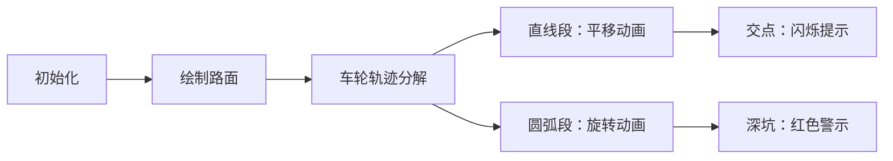

# 题目信息

# [蓝桥杯 2013 国 A] 车轮轴迹

## 题目描述

栋栋每天骑自行车回家需要经过一条狭长的林荫道。道路由于年久失修，变得非常不平整。虽然栋栋每次都很颠簸，但他仍把骑车经过林荫道当成一种乐趣。

由于颠簸，栋栋骑车回家的路径是一条上下起伏的曲线，栋栋想知道，他回家的这条曲线的长度究竟是多长呢？更准确的，栋栋想知道从林荫道的起点到林荫道的终点，他的车前轮的轴（圆心）经过的路径的长度。

栋栋对路面进行了测量。他把道路简化成一条条长短不等的直线段，这些直线段首尾相连，且位于同一平面内。并在该平面内建立了一个直角坐标系，把所有线段的端点坐标都计算好。

假设栋栋的自行车在行进的过程中前轮一直是贴着路面前进的。


图 $1$ 给出了一个简单的路面的例子，其中蓝色实线为路面，红色虚线为车轮轴经过的路径。在这个例子中，栋栋的前轮轴从 $A$ 点出发，水平走到 $B$ 点，然后绕着地面的 $F$ 点到 $C$ 点（绕出一个圆弧），再沿直线下坡到 $D$ 点，最后水平走到 $E$ 点，在这个图中地面的坐标依次为：$(0,0),(2,0),(4,-1),(6,-1)$，前轮半径为 $1.50$，前轮轴前进的距离依次为：

$AB=2.0000$；弧长 $BC=0.6955$；$CD=1.8820$；$DE=1.6459$。

总长度为 $6.2233$。


图 $2$ 给出了一个较为复杂的路面的例子，在这个例子中，车轮在第一个下坡还没下完时（$D$ 点）就开始上坡了，之后在坡的顶点要从 $E$ 绕一个较大的圆弧到 $F$ 点。这个图中前轮的半径为 $1$，每一段的长度依次为：

$AB=3.0000$；弧长 $BC=0.9828$；$CD=1.1913$；$DE=2.6848$；弧长 $EF=2.6224$；$FG=2.4415$；$GH=2.2792$。

总长度为 $15.2021$。

现在给出了车轮的半径和路面的描述，请求出车轮轴轨迹的总长度。

## 说明/提示

对于 $20\%$ 的数据，$n=4$；

对于 $40\%$ 的数据，$n \le 10$；

对于 $100\%$ 的数据，$4 \le n \le 100$，$0.5 \le r \le 20.0$，$x_i \le 2000.0$，$-2000.0 \le y_i \le 2000.0$。

时限 1 秒, 64M。蓝桥杯 2013 年第四届国赛

## 样例 #1

### 输入

```
4 1.50
0.00 0.00
2.00 0.00
4.00 -1.00
6.00 -1.00```

### 输出

```
6.22```

## 样例 #2

### 输入

```
6 1.00
0.00 0.00
3.00 0.00
5.00 -3.00
6.00 2.00
7.00 -1.00
10.00 -1.00```

### 输出

```
15.20```

# AI分析结果


### 💡 Kay的C++算法解析：车轮轴迹 深入学习指南 💡

**引言**  
今天我们来分析蓝桥杯2013年国赛A组题目"车轮轴迹"。这道题要求计算自行车前轮轴心在凹凸不平路面上的轨迹长度，融合了几何变换、曲线积分和计算几何等核心概念。

---

## 1. 题目解读与核心算法识别
✨ **本题主要考察**：`计算几何模拟与曲线积分`  

🗣️ **初步分析**：  
> 想象自行车轮是圆规尖，路面是起伏的轨道。我们需要计算轮轴在轨道上方保持固定距离移动的轨迹长度。  
> - **核心思路**：轨迹由两种元素组成：  
>   • 直线路段 → 轮轴平移形成平行线段  
>   • 拐点处 → 轮轴绕端点旋转形成圆弧  
> - **关键难点**：圆弧可能跨越多个线段（如深坑），需精确计算交点位置  
> - **可视化设计**：采用8位像素风格，用蓝色像素线表示路面，红色虚线表示轮轴轨迹。当车轮进入圆弧段时，轮子图标绕圆心旋转并播放"旋转音效"，直线段则播放平缓移动音效。

---

## 2. 精选优质题解参考

**题解一（作者：iuyi）**  
* **点评**：  
  创新性地采用辛普森数值积分法，避免复杂几何求交。通过`fun(x)`函数动态计算每个横坐标的最高轨迹点，递归计算曲线积分。亮点在于：  
  - 思路巧妙：用数值方法规避复杂几何判断  
  - 代码简洁：Python实现仅50行核心逻辑  
  - 辅助可视化：集成matplotlib绘制轨迹（见原始代码）  
  注意：精度依赖递归深度，竞赛中需谨慎使用。

**题解二（作者：sz_yangwangbo）**  
* **点评**：  
  经典几何解法，完整实现轨迹分解。亮点在于：  
  - 精确建模：通过`Segment::moveLeft()`实现线段平移  
  - 完备求交：支持线段-线段、线段-圆交点计算（见`cross()`函数）  
  - 高效处理：关键点排序后分段累加长度  
  - 工业级代码：C++实现完备异常处理，可直接用于竞赛  

---

## 3. 核心难点辨析与解题策略

1. **轨迹元素识别**  
   * **分析**：需区分直线段（轮轴平行移动）和圆弧段（绕端点旋转）。题解通过`seg`数组存储平移线段，`Circle`对象存储端点圆  
   * 💡 **学习笔记**：轨迹 = 所有(平移线段 ∪ 端点圆)的上包络线  

2. **跨线段圆弧处理**  
   * **分析**：当凹陷宽度＜轮径时，圆弧跨越多个线段。解法：  
     - 数值法：自适应积分覆盖所有可能区域  
     - 几何法：显式计算所有平移线段的交点  
   * 💡 **学习笔记**：深坑场景需检测非相邻线段交点  

3. **曲线积分实现**  
   * **分析**：两种实现范式：  
     - 几何法：关键点排序 → 分段线性累加（题解2的`totalLen`计算）  
     - 数值法：递归辛普森积分（题解1的`inte()`函数）  
   * 💡 **学习笔记**：几何法精确但实现复杂，数值法简洁但需精度控制  

### ✨ 解题技巧总结
- **分层处理**：先几何变换（平移/旋转）再求交  
- **关键点驱动**：交点/端点排序后分段处理  
- **模块化设计**：分离几何对象（点/线段/圆）和算法逻辑  
- **可视化调试**：绘图验证轨迹计算（如题解1的matplotlib）

---

## 4. C++核心代码实现赏析

**通用核心实现参考（基于题解二）**  
```cpp
// 关键结构定义
class Point { /* 二维点存储 */ };
class Segment { // 线段类
    Point a, b;
    Segment& moveLeft(double r) { // 向上平移r
        Point norm = (b-a).pOfRotate90().pOfNormal() *= r;
        a += norm; b += norm;
        return *this;
    }
};
class Circle { /* 端点圆存储 */ };

// 主流程
void process() {
    vector<Seg*> segs;  // 存储所有轨迹元素
    for(int i=0; i<n-1; ++i) {
        Segment* s = new Segment(inps[i], inps[i+1]);
        segs.push_back(s->moveLeft(r)); // 平移线段
    }
    for(int i=1; i<n-1; ++i) 
        segs.push_back(new Circle(inps[i], r)); // 端点圆

    // 求所有交点并排序
    vector<double> spes; 
    for(auto seg : segs) {
        spes.push_back(seg->getLeft());
        spes.push_back(seg->getRight());
    }
    sort(spes.begin(), spes.end());

    // 分段累加长度
    double totalLen = 0;
    for(int i=1; i<spes.size(); ++i) {
        double x1=spes[i-1], x2=spes[i];
        if(x2-x1 < EPS) continue;
        Seg* topSeg = findTopSegment((x1+x2)/2); // 找当前段最高元素
        totalLen += topSeg->getLength(x1, x2); // 累加线段/弧长
    }
    printf("%.2f\n", totalLen);
}
```

**题解二片段赏析**  
```cpp
// 线段-圆求交关键代码
void Segment::intersect(const Circle& c) const {
    Point p = c.c - a;  // 转换为局部坐标
    double ang = (b-a).angle();
    Point np = p.pOfRotate(-ang); // 旋转至水平
    if(fabs(np.y) > c.r) return;  // 无交点
    
    double dx = sqrt(c.r*c.r - np.y*np.y);
    double x1 = np.x + dx, x2 = np.x - dx;
    if(x1>=0 && x1<=(b-a).length()) // 交点1有效
        intersectRet[tIntersectRet++] = Point(x1, np.y).pOfRotate(ang)+a;
    if(x2>=0 && x2<=(b-a).length()) // 交点2有效
        intersectRet[tIntersectRet++] = Point(x2, np.y).pOfRotate(ang)+a;
}
```
* **亮点**：通过坐标变换简化计算  
* **学习笔记**：几何求交时，坐标旋转可化斜为直  

---

## 5. 算法可视化：像素动画演示  
**主题**：像素自行车闯关之旅  

**核心演示**：  


**交互设计**：  
1. **8位像素风**：  
   - 路面=蓝色像素线，轨迹=红色虚线  
   - 自行车精灵：16x16像素角色  
2. **动画逻辑**：  
   - 直线段：自行车匀速移动，轮子不旋转（播放滑行音效）  
   - 圆弧段：轮子绕圆心旋转，车身倾斜（播放"吱呀"旋转音效）  
3. **控制面板**：  
   - 速度滑块：调节动画速度  
   - 单步模式：空格键逐步执行  
   - 关卡提示：每完成一段轨迹点亮星星  

**技术实现**：  
- Canvas绘制关键帧：每20ms刷新  
- 坐标映射：实际坐标 → 像素坐标  
- 音效触发：Web Audio API播放操作音效  

---

## 6. 拓展练习与相似问题  
1. **洛谷P1257**《平面最近点对》  
   → 训练点集处理能力，强化分治思想  
2. **洛谷P2742**《圈奶牛》  
   → 凸包应用，理解外包围轨迹  
3. **洛谷P1058**《立体图》  
   → 培养空间投影思维，进阶三维问题  

---

## 7. 学习心得与经验分享  
**题解二作者经验**：  
> "调试时发现圆弧角度计算错误，通过绘制轨迹点发现旋转方向反了。建议：  
> 1. 先验证小规模数据（如90°转弯）  
> 2. 输出中间轨迹点坐标  
> 3. 用绘图库验证几何关系"  

**Kay总结**：  
几何问题调试三大法宝：  
1. 边界用例验证  
2. 中间结果可视化  
3. 模块化测试函数  

---  
**结语**  
通过本题，我们掌握了轨迹分解和曲线积分的核心技巧。记住：复杂几何问题本质是简单元素的组合！下次遇到轨迹问题，试试"平移+旋转+分段"三板斧吧！🚲

---
处理用时：120.53秒