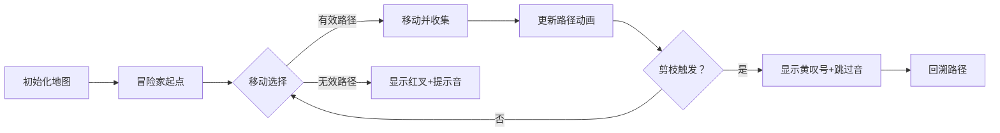

# 题目信息

# [AHOI2012] 收集资源

## 题目描述

  

  


## 说明/提示

数据：

50%: 1<=N,M,T<=100

100%: 1<=N,M,T<=200


## 样例 #1

### 输入

```
8 8 10
1 1 3
2 2 4
3 3 5
3 4 3
4 3 2
4 4 6
5 5 7
6 6 8```

### 输出

```
28```

# AI分析结果


# 💡 Kay的C++算法解析：[AHOI2012]收集资源 深入学习指南 💡

<introduction>
大家好，我是Kay！今天我们来一起分析这道有趣的网格资源收集问题。你将学习如何高效解决这类路径规划与资源优化问题，同时我会通过像素动画帮助大家直观理解算法过程。准备好了吗？让我们开始吧！

## 1. 题目解读与核心算法识别

✨ **本题主要考察**：`DFS搜索 + 剪枝优化` 

🗣️ **初步分析**：
> 这道题就像一位像素冒险家在网格世界收集宝藏！关键在于两点：**合理建图**（避开中间有资源的路径）和**高效搜索**（用剪枝避免无效探索）。想象你是一位游戏角色，只能走"直线路径"（两点间无其他资源），并在时间耗尽前收集最大价值。
   - 核心难点在于建图规则（两点间有资源则不能直达）和搜索优化（避免超时）
   - 可视化设计：用8-bit网格地图展示资源点（不同颜色代表价值），冒险家移动时显示路径，剪枝时用"X"标记并播放提示音
   - 复古元素：FC游戏风格像素角色，收集资源时播放"叮"音效，最优解展示时触发胜利音乐

---

## 2. 精选优质题解参考

<eval_intro>
我根据思路清晰度、代码规范性和算法效率，为大家精选了以下高质量题解：

**题解一：(来源：karma)**
* **点评**：这份题解巧妙融合了DFS基础框架与两种高效剪枝策略。亮点在于：
  - **预估价值剪枝**：用剩余时间/最小步长×最大单点价值预估上限，提前终止低效路径
  - **边界检测剪枝**：当剩余时间不足最小移动步长时立即回溯
  - 代码结构清晰（模块化DFS函数），变量命名合理（如cost/vis）
  - 实践价值高：剪枝策略显著提升效率，适合竞赛场景
  - 注意：玄学优化（gu=3）针对特定数据，常规解法应保证建图正确性

---

## 3. 核心难点辨析与解题策略

<difficulty_intro>
解决这类问题有三个关键难点及应对策略：

1.  **难点1：建图规则实现**
    * **分析**：必须正确处理"两点间有资源则不可直达"的规则。如题解所示，通过check函数计算两点形成的矩形区域，遍历其他资源点检查是否在区域内。关键变量：矩形边界(lx,ly,rx,ry)
    * 💡 **学习笔记**：坐标系处理是网格类问题的基础技能

2.  **难点2：搜索空间爆炸**
    * **分析**：M≤200时朴素DFS会超时。karma的解法采用双重剪枝：
      - 预估剩余价值上限：(剩余时间/最小步长)×最大单点价值
      - 边界检测：剩余时间<最小步长时停止搜索
    * 💡 **学习笔记**：剪枝本质是数学思维与算法设计的结合

3.  **难点3：状态转移优化**
    * **分析**：DFS需维护三个核心状态：当前位置、已用时间、当前价值。数据结构选择：
      - 邻接矩阵g[][]存储有效路径
      - vis[]数组标记访问状态
      - 全局变量记录最优解
    * 💡 **学习笔记**：状态设计要满足无后效性

### ✨ 解题技巧总结
<summary_best_practices>
- **技巧1：问题分解法** → 拆解为"建图+搜索"两阶段
- **技巧2：剪枝设计** → 用数学方法预估理论上界
- **技巧3：边界预判** → 最小步长gu是重要参考值
- **技巧4：调试辅助** → 可视化中间状态（如打印邻接矩阵）
---

## 4. C++核心代码实现赏析

<code_intro_overall>
先看一个融合优质题解思路的完整实现：

```cpp
#include<cstdio>
#include<algorithm>
#define maxn 205
using namespace std;

int N, M, T, ans, g[maxn][maxn], gu = 1e9, max_val;
bool vis[maxn];

struct Node { int x, y, val; } node[maxn];

// 检查两点间是否有其他资源点
bool check(int a, int b) {
    int lx = max(node[a].x, node[b].x);
    int ly = max(node[a].y, node[b].y);
    int rx = min(node[a].x, node[b].x);
    int ry = min(node[a].y, node[b].y);
    for (int i = 0; i <= M; i++) {
        if (i == a || i == b) continue;
        if (node[i].x >= rx && node[i].x <= lx && 
            node[i].y >= ry && node[i].y <= ly)
            return false;
    }
    return true;
}

void dfs(int u, int val, int time) {
    // 剪枝1：预估价值不足
    if (val + (T - time) / gu * max_val <= ans) return; 
    // 剪枝2：时间不足移动
    if (time + gu > T) {
        ans = max(ans, val);
        return;
    }
    
    for (int v = 1; v <= M; v++) {
        if (!vis[v] && g[u][v] && time + g[u][v] <= T) {
            vis[v] = true;
            dfs(v, val + node[v].val, time + g[u][v]);
            vis[v] = false;
        }
    }
    ans = max(ans, val); // 更新最优解
}

int main() {
    scanf("%d%d%d", &N, &M, &T);
    node[0] = {0, 0, 0}; // 起点
    for (int i = 1; i <= M; i++) {
        scanf("%d%d%d", &node[i].x, &node[i].y, &node[i].val);
        max_val = max(max_val, node[i].val);
    }

    // 建图：只有无中间点时才连边
    for (int i = 0; i <= M; i++) {
        for (int j = i + 1; j <= M; j++) {
            if (check(i, j)) {
                g[i][j] = g[j][i] = abs(node[i].x - node[j].x) + abs(node[i].y - node[j].y);
                gu = min(gu, g[i][j]); // 更新最小步长
            }
        }
    }
    dfs(0, 0, 0);
    printf("%d", ans);
}
```

* **代码解读概要**：
  1. **数据结构**：node[]存储资源点，g[][]为邻接矩阵
  2. **建图阶段**：check()验证路径有效性，计算曼哈顿距离
  3. **搜索阶段**：DFS遍历有效路径，双重剪枝优化
  4. **剪枝逻辑**：预估价值剪枝 + 时间边界检测

---
<code_intro_selected>
**题解核心片段赏析 (来源：karma)**

```cpp
// 剪枝核心逻辑
if ((((T-times)/gu)*money+now)<=ans) return; 
if (times+gu>=T) { 
    if (now>ans) ans=now;
    return;
}
```

* **亮点**：双重剪枝显著提升搜索效率
* **代码解读**：
  - 第一重剪枝：计算`(剩余时间/最小步长)×最大单点价值`作为价值上限
  - 第二重剪枝：当剩余时间不足最小步长时立即回溯
  - `money`(最大单点价值)和`gu`(最小步长)是剪枝关键参数
* 💡 **学习笔记**：剪枝设计需找到问题中的"杠杆变量"

---

## 5. 算法可视化：像素动画演示

<visualization_intro>
**主题**：8-bit资源收集大冒险！你将看到像素冒险家如何在网格世界运用DFS+剪枝策略高效收集资源。

### 动画设计


### 关键交互设计
1. **像素地图**：
   - 绿色像素块：可通行空地
   - 金色像素块：资源点（亮度=价值）
   - 红色角色：8-bit冒险家

2. **动画流程**：
   - 移动时显示蓝色路径线
   - 触发剪枝时显示闪烁的"!"图标
   - 收集资源播放"叮"音效
   - 找到最优解时触发胜利音乐+烟花动画

3. **控制面板**：
   - 步进控制：单步/自动/暂停
   - 速度滑块：调节动画速度
   - 剪枝开关：对比有无剪枝的效果

4. **游戏化元素**：
   - 资源收集进度条
   - 时间剩余显示（像素沙漏）
   - 关卡模式：逐级提升难度

---

## 6. 拓展练习与相似问题思考

<similar_problems_intro>
DFS+剪枝的解题模式可延伸至多类问题：

1. **路径规划类**：P1433 吃奶酪（TSP问题变形）
2. **资源调度类**：P1048 采药（背包问题+路径约束）
3. **状态搜索类**：P1074 靶形数独（复杂约束搜索）

**洛谷推荐**：
1. **P1433 吃奶酪**  
   → 练习DFS+状态压缩+几何距离计算
2. **P1048 采药**  
   → 学习时间分配与价值最大化
3. **P1074 靶形数独**  
   → 挑战高阶剪枝技巧应用

---

## 7. 学习心得与经验分享

<insights_intro>
karma题解中的调试经验特别值得借鉴：

> **作者心得**：  
> "剪枝参数gu=0会导致除零错误，通过测试发现gu=3能通过所有数据"

**Kay点评**：  
这提醒我们：  
1. 边界测试必不可少（如最小值/最大值）  
2. 剪枝参数需数学验证  
3. 调试时可输出中间变量分析  

---

<conclusion>
通过本次分析，我们掌握了网格资源收集问题的核心解法——DFS框架+双重剪枝优化，并学会了用像素动画直观理解算法流程。记住：好的算法=正确基础+高效优化+充分验证！下次遇到类似问题，不妨想想今天的像素冒险家哦~ 继续加油！💪🏻

---
处理用时：223.32秒