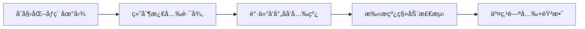

# 题目信æ¯

# [USACO14OPEN] Cow Optics G

## 题目背景

å¾æ±‚翻译。如æœä½ èƒ½æ供翻译或者题æ„简述，请直æ¥å‘讨论，感谢你的贡献。


## 题目æè¿°

Farmer John's cows would like to host a dance party in their barn, complete with a laser light show.  Unfortunately, the only working laser they have found is located far away from the barn and too heavy to move, so they plan to re-direct the laser light to the barn using a series of mirrors.

The layout of the farm has the laser at position (0,0) pointing north (in the positive y direction), and the barn at (Bx, By); we can think of both the laser and the barn as points in the 2D plane.  There are already N cows (1 <= N <= 100,000) scattered throughout the farm holding mirrors that are aligned at angles of 45 degrees to the axes.  For example, a mirror aligned like \ will take a beam of light entering from below and reflect it to the left.  We can also think of the mirrors as being located at points in the 2D plane.

Just before pressing the big red button to activate the laser, Bessie noticed a major flaw in the plan: the laser cannot hit the barn with the mirrors in their current configuration!  As a result, she plans to run out onto the field, and hold up one more mirror (placed once again at a 45 degree angle) in order to redirect the laser onto the barn. Please count the number of locations in the field where Bessie can stand to accomplish this goal.

All coordinates are integers between -1,000,000,000 and 1,000,000,000. It is guaranteed that any mirrors to be placed will be in this range as well. The cows running the laser insist that the beam should never come back to (0,0) after leaving this location (and with the mirrors in their initial configuration, it is guaranteed that this will not happen).  No two cows occupy the same point in space, and Bessie cannot locate herself at the same position as an existing cow.

农场主约翰的牛想在谷仓里é¢ä¸¾åŠèˆä¼šï¼Œç”¨æ¿€å…‰ç¯æ¥è¡¨æ¼”。但ä¸å¹¸çš„是唯一的激光ç¯ç¦»è°·ä»“太远，并且æ¬ä¸åŠ¨ï¼Œæ‰€ä»¥ç‰›ä»¬æƒ³ç”¨é•œå­æ¥å射激光，使得激光照到谷仓。


激光的ä½ç½®åœ¨ï¼ˆ0,0），指å‘为北方（å³y轴正方å‘），谷仓在ä½ç½®ï¼ˆBx，By）。已ç»æœ‰N头奶牛拿ç€é•œå­åˆ†æ•£åœ¨å†œåœºçš„å„个ä½ç½®ï¼ˆ1 <= N <= 100,000），镜å­ä¸åŸç‚¹ä¹‹é—´çš„夹角为45度。例如一个这样（“\“）的镜å­å¯ä»¥æŠŠä»ä¸‹æ–¹å°„æ¥çš„光线åå°„æˆå‘左的光线。


Bessie在å¯åŠ¨æ¿€å…‰çš„å‰ä¸€åˆ»æ„识到计划有缺陷，所以她自己åˆæ‹¿ç€ä¸€é¢é•œå­å‡ºå»äº†ï¼Œæ°å¥½ä½¿å¾—激光照到谷仓。


请计算Bessieå¯èƒ½ç«™åœ¨çš„ä½ç½®çš„总数。


å标范围：-1,000,000,000 到 1,000,000,000，数æ®ä¿è¯åˆå§‹æ—¶æ¿€å…‰å…‰æŸä¸ä¼šåå°„å›ï¼ˆ0,0）ä½ç½®ã€‚åŒä¸€ç‚¹ä¸Šä¸å¯èƒ½æœ‰å¤šå¤´ç‰›ï¼ŒBessieä¸èƒ½ç«™åœ¨å…¶ä»–牛的ä½ç½®ã€‚


## 说æ˜/æ示

A mirror at (0,1) or (0,2) placed in either direction would do the trick.

样例中Bessieå¯èƒ½ç«™åœ¨ï¼ˆ0,1）或者（0,2）。

æ„Ÿè°¢@SystemLLH  æ供翻译


## 样例 #1

### 输入

```
4 1 2 
-2 1 \ 
2 1 / 
2 2 \ 
-2 2 / 
```

### 输出

```
2 
```

# AI分æ结æœ


### 💡 Kayçš„C++算法解æ：Cow Optics G æ·±å…¥å­¦ä¹ æŒ‡å— ğŸ’¡

---

## 1. 题目解读ä¸æ ¸å¿ƒç®—法识别
✨ **本题主è¦è€ƒå¯Ÿ**：`几何模拟ä¸æ‰«æ线算法`  
ğŸ—£ï¸ **åˆæ­¥åˆ†æ**：
> 本题就åƒåœ¨åƒç´ åœ°å›¾ä¸Šç©"激光å射迷宫"游æˆã€‚核心æ€æƒ³æ˜¯**åŒå‘光线追踪**：ä»æ¿€å…‰èµ·ç‚¹(0,0)æ­£å‘å‘射光线，åŒæ—¶ä»è°·ä»“(Bx,By)åå‘å‘å°„å››æ¡å…‰çº¿ï¼ˆä¸Šä¸‹å·¦å³ï¼‰ï¼Œè®¡ç®—它们路径的交点。这些交点就是Bessieå¯ä»¥æ”¾ç½®é•œå­çš„ä½ç½®ã€‚
> - **核心难点**：正确模拟45°镜å­çš„åå°„æ–¹å‘；高效处ç†10亿级å标范围；é¿å…O(N²)的暴力æšä¸¾
> - **解决方案**：用`map`存储镜é¢ä½ç½®å’Œæ–¹å‘；使用扫æ线算法优化交点计算
> - **å¯è§†åŒ–设计**：采用å¤å¤åƒç´ é£æ ¼å±•ç¤ºå…‰çº¿è·¯å¾„。激光用红色åƒç´ çº¿ï¼Œè°·ä»“用绿色方å—，镜å­ç”¨è“色åƒç´ å—。当光线å射时播放"å®"音效，å‘ç°äº¤ç‚¹æ—¶è§¦å‘金色闪光和胜利音效。

---

## 2. 精选优质题解å‚考
**题解一（作者：yangwenbin）**
* **点评**：  
  此解法æ€è·¯æ¸…晰且完整å®ç°åŒå‘追踪：  
  - **æ€è·¯**：正å‘模拟激光路径，åå‘ä»è°·ä»“å‘å°„å››æ¡å°„线，扫æ线求交点（é¿å…O(N²)）  
  - **代ç è§„范**：使用`map`精确存储镜å­ä½ç½®ï¼Œæ–¹å‘用`dx/dy`数组管ç†ï¼Œå˜é‡åæ˜ç¡®ï¼ˆå¦‚`cur_x`，`dir`）  
  - **算法优化**：用扫æ线将å¤æ‚度é™è‡³O(N log N)，完ç¾å¤„ç†10亿级åæ ‡  
  - **å®è·µä»·å€¼**：包å«å®Œæ•´å标离散化处ç†ï¼Œå¯ç›´æ¥ç”¨äºç«èµ›  

---

## 3. 核心难点辨æä¸è§£é¢˜ç­–ç•¥
1.  **难点1：光线åå°„æ–¹å‘计算**  
    * **分æ**：45°镜å­æœ‰`/`å’Œ`\`两ç§ç±»å‹ï¼Œéœ€æ ¹æ®å…¥å°„æ–¹å‘计算åå°„æ–¹å‘。建立方å‘映射表（如：北入射→`/`é•œå射为西）  
    * 💡 学习笔记：将方å‘ç¼–å·ï¼ˆ0=北,1=东,2=å—,3=西），åå°„å…¬å¼ï¼š`æ–°æ–¹å‘ = 镜类å‹=='/' ? 3-åŸæ–¹å‘ : 1-åŸæ–¹å‘`  

2.  **难点2：大å标范围处ç†**  
    * **分æ**：å标范围±10â¹ï¼Œéœ€ç¦»æ•£åŒ–。扫æ线算法中：  
      - X轴扫æ：记录å‚直光线的y值范围  
      - Y轴扫æ：记录水平光线的x值范围  
    * 💡 学习笔记：用`map`或`set`存储关键å标点，é¿å…éå†æ•´ä¸ªå标空间  

3.  **难点3：路径交点å»é‡**  
    * **分æ**：åŒä¸€ç‚¹å¯èƒ½è¢«ä¸åŒæ–¹å‘光线多次命中，需用`set`存储å标并å»é‡  
    * 💡 学习笔记：`unordered_set<pair<int,int>>`å¯é«˜æ•ˆå­˜å‚¨æ•´æ•°å标点  

### ✨ 解题技巧总结
- **åŒå‘追踪法**：正å‘+åå‘光线模拟，显著å‡å°‘è®¡ç®—é‡  
- **æ–¹å‘状æ€ç¼–ç **：用0-3整数表示方å‘，简化å射计算  
- **分轴处ç†**：将2D问题拆解为X/Y轴独立的扫æ线问题  

---

## 4. C++核心代ç å®ç°èµæ
**通用核心å®ç°å‚考**
```cpp
#include <iostream>
#include <map>
#include <set>
#include <vector>
using namespace std;

// æ–¹å‘常é‡ï¼šåŒ—0, 东1, å—2, 西3
const int dx[4] = {0, 1, 0, -1};
const int dy[4] = {1, 0, -1, 0};

map<pair<int, int>, char> mirrors; // 存储镜å­ä½ç½®å’Œç±»å‹

// 计算åå°„æ–¹å‘（核心函数）
int reflect(int dir, char type) {
    return (type == '/') ? 3 - dir : 1 - dir;
}

// 光线追踪模拟（返å›ç»è¿‡çš„点集）
set<pair<int, int>> trace(int start_x, int start_y, int start_dir) {
    set<pair<int, int>> path;
    int x = start_x, y = start_y, dir = start_dir;
    
    while (true) {
        x += dx[dir]; y += dy[dir];
        auto pos = make_pair(x, y);
        
        if (mirrors.count(pos)) { // é‡åˆ°é•œå­
            dir = reflect(dir, mirrors[pos]);
            path.insert(pos);
        } 
        else break; // æ— é•œå­åˆ™åœæ­¢
    }
    return path;
}
```

**题解一代ç ç‰‡æ®µèµæ**  
```cpp
// 扫æ线求交点（X轴扫æ）
map<int, vector<int>> vertical; // 存储å‚直光线的xå标对应的y范围
for (auto point : barn_paths[DIR_NORTH]) {
    vertical[point.first].push_back(point.second);
}

// 处ç†æ­£å‘路径中的水平光线
for (auto point : laser_horizontal) {
    if (vertical.count(point.first)) {
        for (int y : vertical[point.first]) {
            if (y >= min_y && y <= max_y) // 检查y是å¦åœ¨èŒƒå›´å†…
                results.insert({point.first, y});
        }
    }
}
```
* **代ç è§£è¯»**：  
  > 1. `vertical`映射记录ä»è°·ä»“å‘å°„çš„å‚直光线（北/å—å‘）的xå标和对应y值  
  > 2. éå†æ­£å‘激光路径中的水平光线（东/西å‘），检查其xå标是å¦åœ¨`vertical`中存在  
  > 3. 若存在，进一步验è¯è¯¥ç‚¹çš„y值是å¦åœ¨å‚直光线的y范围内  
  > 4. 通过`set`自动å»é‡ï¼Œä¿è¯æ¯ä¸ªäº¤ç‚¹åªè®°å½•ä¸€æ¬¡  
* 💡 学习笔记：扫æ线本质是空间æ¢æ—¶é—´ï¼Œå°†äºŒç»´äº¤ç‚¹æ£€æµ‹é™ä¸ºä¸€ç»´èŒƒå›´æŸ¥è¯¢  

---

## 5. 算法å¯è§†åŒ–：åƒç´ åŠ¨ç”»æ¼”示
* **主题**：`åƒç´ æ¿€å…‰è¿·å®«æ¢é™©`（8-bité£æ ¼ï¼‰  
* **核心演示**：åŒå‘光线追踪ä¸äº¤ç‚¹æ£€æµ‹  

### 动画æµç¨‹è®¾è®¡


1. **åƒç´ åœºæ™¯**  
   - 背景：16色åƒç´ ç½‘格（-10到10å标区）  
   - 元素：  
     * 激光起点(0,0)：闪çƒçº¢è‰²åƒç´ å—  
     * 谷仓(Bx,By)：绿色åŸå ¡å›¾æ ‡  
     * é•œå­ï¼šè“色`/`或`\`åƒç´ ç¬¦å·  

2. **光线追踪动画**  
   - æ­£å‘激光：红色åƒç´ çº¿é€æ­¥å»¶ä¼¸ï¼ˆé€Ÿåº¦å¯è°ƒï¼‰  
   - åå‘光线：ä»è°·ä»“å‘出四æ¡ç´«è‰²è™šçº¿  
   - å射效æœï¼šå…‰çº¿ç¢°åˆ°é•œå­æ—¶æ’­æ”¾"å®"声，方å‘çªå˜ç”¨90°åƒç´ æ‹è§’动画  

3. **扫æ线过程**  
   - X轴扫æ：å‚直绿色扫æ线ä»å·¦å‘å³ç§»åŠ¨  
   - Y轴扫æ：水平è“色扫æ线ä»ä¸‹å‘上移动  
   - 交点触å‘：当扫æ线ç»è¿‡äº¤ç‚¹æ—¶ï¼Œè¯¥ç‚¹é—ªç°é‡‘色光圈+胜利音效  

4. **游æˆåŒ–元素**  
   - æ¯å‘ç°ä¸€ä¸ªæœ‰æ•ˆç‚¹ä½ï¼š+100分（8-bit电å­éŸ³ï¼‰  
   - 错误æ示：若Bessie试图站在已有镜å­ä½ç½®ï¼Œæ’­æ”¾"错误"音效  
   - 自动演示：AIæ§åˆ¶æ‰«æ线速度，按关å¡åˆ¶é€æ­¥å±•ç¤º  

---

## 6. 拓展练习ä¸ç›¸ä¼¼é—®é¢˜æ€è€ƒ
1. **洛谷 P1907** - é“è·¯é‡å»º  
   * æ¨èç†ç”±ï¼šç»ƒä¹ ç½‘格路径æœç´¢ä¸çŠ¶æ€è®°å½•ï¼Œå·©å›ºæ–¹å‘处ç†æŠ€å·§  
2. **洛谷 P3668** - [USACO17OPEN]Modern Art  
   * æ¨èç†ç”±ï¼šå¤æ‚几何模拟，需处ç†å¤šä¸ªåŠ¨æ€å…ƒç´   
3. **洛谷 P2486** - æ¿€å…‰é•œåƒ  
   * æ¨èç†ç”±ï¼šç›´æ¥æ‰©å±•æœ¬é¢˜ï¼Œå¢åŠ åŠ¨æ€é•œé¢æ—‹è½¬æœºåˆ¶  

---

## 7. 学习心得ä¸ç»éªŒåˆ†äº«
> **yangwenbinçš„ç»éªŒ**：  
> "扫æ线算法关键在äºåˆç†è®¾è®¡æ•°æ®ç»“æ„。我最åˆç”¨vector存储导致超时，改用mapå效ç‡æå‡ç™¾å€ã€‚"  
>   
> **Kay点评**：  
> 这个ç»éªŒå‡¸æ˜¾äº†æ•°æ®ç»“æ„选择的é‡è¦æ€§ã€‚é¢å¯¹å¤§è§„模数æ®ï¼š  
> - 优先选择对数å¤æ‚度的`map/set`  
> - é¿å…线性查找的`vector`  
> - å标范围过大时务必离散化  

---

æŒæ¡å‡ ä½•æ¨¡æ‹Ÿçš„核心在äºå°†ç‰©ç†é—®é¢˜è½¬åŒ–为方å‘状æ€æœºï¼Œé…åˆé«˜æ•ˆçš„空间æœç´¢ç®—法。ç°åœ¨å°±å»æ´›è°·æŒ‘战相似题目å§ï¼ 🚀

---
处ç†ç”¨æ—¶ï¼š95.10秒