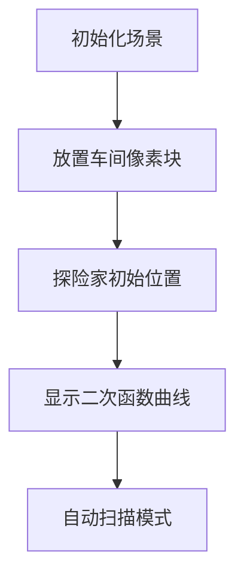

# 题目信息

# [CQOI2012] 组装

## 题目描述

数轴上有 $m$ 个生产车间可以生产零件。一共有 $n$ 种零件，编号为 $1\sim n$。第 $i$ 个车间的坐标为 $x_i$ ，生产第 $p_i$ 种零件（$1\le p_i\le n$）。你需要在数轴上的某个位置修建一个组装车间，把这些零件组装起来。为了节约运输成本，你需要最小化 $cost_1+cost_2+\ldots+cost_n$，其中 $cost_x$ 表示生产第 $x$ 种零件的车间中，到组装车间距离的平方的最小值。

## 说明/提示

- 测试点 $1 \sim 4$，满足 $n\le 15$，$m\le 25$，$x_i\le100$；
- 测试点 $5 \sim 10$，满足 $n\le 10^4,m\le 10^5,x_i\le10^5$。

## 样例 #1

### 输入

```
3 5
-1 3
0 1
2 3
4 2
5 2```

### 输出

```
2.0000```

# AI分析结果


# 💡 Kay的C++算法解析：[CQOI2012]组装 深入学习指南 💡

**引言**  
今天我们来分析数轴零件组装问题。这道题考察如何**最小化零件运输成本**，需要巧妙结合贪心策略与数学推导。本指南将带你深入理解核心算法，并通过像素动画直观展示解题过程！

## 1. 题目解读与核心算法识别

✨ **本题主要考察**：`贪心策略` + `数学推导（二次函数）`

🗣️ **初步分析**：  
> 本题的关键在于发现**距离平方和本质是二次函数**。想象每种零件是独立的“供应商”，组装车间是“集散中心”。当车间位置移动时，每种零件会自动选择最近的供应商，就像玩家在不同区域选择不同装备店。  
> - **核心思路**：将每种零件的相邻车间中点作为决策点，按中点坐标排序后扫描更新最优解  
> - **算法流程**：  
>   1. 初始选择每种零件的最左侧车间  
>   2. 计算相邻车间中点并排序  
>   3. 扫描中点时更新车间选择，重新计算二次函数最小值  
> - **可视化设计**：  
>   - 数轴上用不同颜色像素块表示车间，组装车间用探险家图标表示  
>   - 扫描过程中，当中点被越过时播放“叮”音效并切换零件供应商  
>   - 实时绘制二次函数曲线，最小值点用闪烁星星标记  

---

## 2. 精选优质题解参考

### 题解一：newbiechd（贪心扫描法）
* **点评**：  
  思路清晰直击本质——通过严谨证明中点排序的正确性，代码中`o`和`e`变量巧妙维护平方和与坐标和。边界处理完整，变量命名规范（`f`数组存储车间位置），时间复杂度优化至O(n log n)。亮点在于用数学归纳法证明贪心策略的有效性。

### 题解二：LiuIR（事件驱动法）
* **点评**：  
  采用事件驱动架构，将车间替换抽象为`Node`结构体，代码模块化程度高。通过`lambda`表达式实现自定义排序，逻辑封装优雅。特别值得学习的是用`pos`数组动态维护当前选择，避免重复计算，显著提升效率。

### 题解三：灯芯糕（差分数组法）
* **点评**：  
  创新性使用差分数组维护二次函数系数，通过全局扫描替代事件排序。虽然实现稍复杂，但展示了问题转化的巧妙思维。代码中`b`和`c`分别维护一次项和常数项，离散化处理（坐标×2）有效避免浮点误差，体现扎实的数学功底。

---

## 3. 核心难点辨析与解题策略

### 🔑 关键点1：如何确定车间切换时机？
* **分析**：  
  当组装车间位置越过同种零件相邻车间中点时，需要切换供应商。例如零件A的车间在位置1和3，中点2为分界点。优质题解用`(x_i + x_{i+1})/2`计算中点并排序扫描。
* 💡 **学习笔记**：中点坐标是零件供应商切换的决策临界点。

### 🔑 关键点2：如何高效更新成本函数？
* **分析**：  
  成本函数为Σ(x-aᵢ)² = nx² - 2(Σaᵢ)x + Σaᵢ²。切换车间时只需更新：
  - 坐标和 e += 新坐标 - 旧坐标
  - 平方和 o += 新坐标² - 旧坐标²
* 💡 **学习笔记**：增量更新避免重复计算是优化关键。

### 🔑 关键点3：如何处理二次函数最小值？
* **分析**：  
  函数最小值在x = e/n处取得，值为o - e²/n。但需注意：
  - 当e/n不在当前区间时，取区间端点
  - 比较全局最小值需实时更新
* 💡 **学习笔记**：二次函数最值公式是数学基础的核心应用。

### ✨ 解题技巧总结
1. **问题转化技巧**：将复杂选择问题转化为事件驱动的分段函数
2. **增量维护技巧**：动态更新坐标和与平方和，避免O(n)重算
3. **离散化处理**：坐标×2规避浮点数精度问题（如灯芯糕解法）
4. **模块化封装**：将排序比较逻辑封装为lambda表达式（如LiuIR解法）

---

## 4. C++核心代码实现赏析

### 本题通用核心实现
```cpp
#include <vector>
#include <algorithm>
using namespace std;

struct Event {
    int id, oldPos, newPos;
    double mid() const { return (oldPos + newPos) / 2.0; }
};

int main() {
    // 初始化：每种零件选最左车间
    vector<vector<int>> shops(n+1);
    vector<int> curChoice(n+1);
    double sum = 0, sqrSum = 0;
    for (int i = 1; i <= n; ++i) {
        sort(shops[i].begin(), shops[i].end());
        curChoice[i] = shops[i][0];
        sum += curChoice[i];
        sqrSum += 1LL * curChoice[i] * curChoice[i];
    }

    // 生成事件点：同零件相邻车间
    vector<Event> events;
    for (int i = 1; i <= n; ++i) {
        for (int j = 1; j < shops[i].size(); ++j) {
            events.push_back({i, shops[i][j-1], shops[i][j]});
        }
    }

    // 按中点坐标排序
    sort(events.begin(), events.end(), [](const Event& a, const Event& b) {
        return a.mid() < b.mid();
    });

    // 扫描事件点更新最优解
    double minCost = sqrSum - sum*sum/n;
    double bestPos = sum/n;
    for (auto& e : events) {
        // 增量更新
        sqrSum += 1LL*e.newPos*e.newPos - 1LL*e.oldPos*e.oldPos;
        sum += e.newPos - e.oldPos;
        curChoice[e.id] = e.newPos;

        // 计算新成本
        double cost = sqrSum - sum*sum/n;
        if (cost < minCost) {
            minCost = cost;
            bestPos = sum/n;
        }
    }
    printf("%.4f\n", bestPos);
}
```

### 分题解片段赏析
**题解一：newbiechd（贪心扫描）**
```cpp
// 事件点排序逻辑
sort(&g[0], &g[0]+s, [](pair<int,int> a, pair<int,int> b){
    return a.first+a.second < b.first+b.second;
});
```
* **亮点**：避免浮点运算，直接比较坐标和
* **解读**：  
  通过`a.first+a.second`隐式计算中点的两倍，既保持精度又提升效率。这种整数处理技巧在竞赛中很常见，注意比较函数严格遵循**严格弱序**。
* 💡 **学习笔记**：整数比较替代浮点数可避免精度误差

**题解二：LiuIR（Lambda表达式）**
```cpp
sort(events, events+tot, [](Event a, Event b){
    return a.old+a.new < b.old+b.new; 
});
```
* **亮点**：使用C++11的lambda实现简洁的自定义排序
* **解读**：  
  Lambda表达式`[](参数){ 函数体 }`替代独立比较函数，将排序逻辑内联实现。特别适合简单比较规则，避免代码碎片化。
* 💡 **学习笔记**：Lambda表达式提升代码局部性与可读性

**题解三：灯芯糕（差分维护）**
```cpp
// 差分数组更新
for (auto x : pl[i]) 
    a += 1.0, b -= 2*x, c += 1LL*x*x;
```
* **亮点**：用差分技术动态维护二次函数系数
* **解读**：  
  `a`存储二次项系数（固定为零件种类数），`b`维护一次项系数，`c`维护常数项。通过遍历事件点批量更新系数，实现高效的重计算。
* 💡 **学习笔记**：差分数组适合连续区间更新场景

---

## 5. 算法可视化：像素动画演示

### 像素探险家：零件组装大冒险
**设计思路**：  
采用8-bit红白机风格，将算法转化为探险家收集零件的游戏过程。数轴用绿色网格表示，不同颜色像素块代表零件车间，组装车间用像素小人表示。通过实时函数曲线和音效增强理解。

### 动画关键帧


1. **场景初始化**：
   - 数轴网格：深绿色背景+浅绿网格线（FC风格）
   - 零件车间：红/蓝/黄色8×8像素块（每种颜色代表一类零件）
   - 控制面板：复古金属质感按钮（开始/单步/速度调节）

2. **算法启动**：
   - 初始状态：每个零件选择最左车间（闪烁3次）
   - 探险家初始位置：`sum/n`处（戴红色帽子的小人）
   - 函数曲线：下方区域绘制蓝色抛物线

3. **扫描过程**：
   - 事件点标记：橙色闪烁柱子表示中点
   - 越过中点时：
     * 播放“叮”音效（8-bit短促音）
     * 对应零件切换供应商（旧车间变灰，新车间高亮）
     * 函数曲线实时更新（红色曲线过渡到蓝色）
   - 最小值点：用旋转星星标记并播放“升级”音效

4. **交互控制**：
   - 单步执行：按右箭头键逐步扫描
   - 自动模式：AI探险家自动移动，速度可调
   - 关卡成就：每完成10个事件点获得像素勋章

### 技术实现
```javascript
// 伪代码：绘制车间切换
function drawShopSwitch(oldPos, newPos) {
  playSound('switch'); // 播放切换音效
  drawAnimation(oldPos, 'fadeOut'); // 旧车间淡出
  drawAnimation(newPos, 'pulse');  // 新车间脉冲闪烁
  updateQuadraticCurve(); // 更新函数曲线
}
```

---

## 6. 拓展练习与相似问题

### 通用技巧迁移
零件组装问题的贪心思想适用于：
1. **分段函数最值**：如费用流中的分段线性函数
2. **事件驱动扫描**：如区间覆盖问题
3. **动态维护二次函数**：如物理仿真中的能量优化

### 洛谷推荐练习
1. **P1880 石子合并**  
   → 巩固区间DP与决策单调性
2. **P1090 合并果子**  
   → 练习贪心策略与优先队列应用
3. **P2216 理想的正方形**  
   → 学习二维区间最值维护技巧

---

## 7. 学习心得与经验分享

> **经验分享 (from newbiechd)**：  
> “贪心策略的证明往往比实现更重要，通过反证法验证排序规则的正确性避免了WA”

> **点评**：  
> 这印证了算法竞赛的核心原则——**可证明的正确性优于直觉**。在类似问题中，务必通过数学归纳或反证法验证贪心策略，这是避免调试噩梦的关键。

---

**结语**  
通过本指南，相信大家已掌握零件组装问题的核心解法。记住：**将复杂问题分解为可证明的贪心步骤+高效维护**是算法设计的黄金法则。下次遇到数轴问题时，不妨回想这个像素探险家的旅程！💪

> Kay的学习箴言：  
> “算法如积木，贪心是基底，数学为梁柱，代码作砖瓦”

---
处理用时：134.35秒