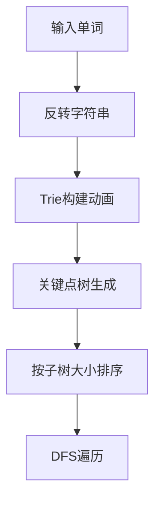

# 题目信息

# [SCOI2016] 背单词

## 题目描述

Lweb 面对如山的英语单词，陷入了深深的沉思：我怎么样才能快点学完，然后去玩三国杀呢？这时候睿智的凤老师从远处飘来，他送给了 Lweb 一本计划册和一大缸泡椒，他的计划册是长这样的：

| 序号    | 单词 |
| ------- | ---- |
| $1$     |      |
| $2$     |      |
| $\dots$ |      |
| $n-1$    |      |
| $n$     |      |

然后凤老师告诉 Lweb ，我知道你要学习的单词总共有 $n$ 个，现在我们从上往下完成计划表，对于一个序号为 $x$ 的单词（序号 $1,\dots ,x-1$ 都已经被填入）：

1. 如果存在一个单词是它的后缀，并且当前没有被填入表内，那他需要吃 $n \times n$ 颗泡椒才能学会；
2. 当它的所有后缀都被填入表内的情况下，如果在 $1,\dots,x-1$ 的位置上的单词都不是它的后缀，那么你吃 $x$ 颗泡椒就能记住它；
3. 当它的所有后缀都被填入表内的情况下，如果 $1,\dots,x-1$ 的位置上存在是它后缀的单词，所有是它后缀的单词中，序号最大为 $y$，那么你只要吃 $x-y$ 颗泡椒就能把它记住。

Lweb 是一个吃到辣辣的东西会暴走的奇怪小朋友，所以请你帮助 Lweb ，寻找一种最优的填写单词方案，使得他记住这 $n$ 个单词的情况下，吃最少的泡椒。

形式化题意：

你需要为 $n$ 个字符串排列一个顺序，每个字符串都会产生一定代价。

对于一个字符串 $s$，其所在位置为 $x$：

1. 如果存在至少一个其他字符串是 $s$ 后缀，且这个字符串的位置在 $s$ 后面， $s$ 将产生 $n \times n$ 的代价。

2. 如果不存在其他字符串是 $s$ 的后缀，则 $s$ 产生 $x$ 的代价。

3. 如果所有是 $s$ 后缀的字符串的位置都在 $s$ 的前面，若这些字符串的位置的最大值为 $y$ ， 则 $s$ 产生 $x-y$ 的代价。

为 $n$ 个字符串排列一个顺序，使总代价最小。

## 说明/提示

$1\le n\le100000$，所有字符的长度总和 $1\le \sum|S| \le510000$。

## 样例 #1

### 输入

```
2
a
ba```

### 输出

```
2```

# AI分析结果


### 💡 Kay的C++算法解析：[SCOI2016]背单词 深入学习指南 💡

#### 1. 题目解读与核心算法识别
✨ **本题主要考察**：`字典树(Trie) + 贪心算法 + 树形DFS`  
🗣️ **初步分析**：
> 本题的核心在于**将后缀问题转化为前缀问题**。通过反转字符串构建Trie树，建立"关键点树"（仅保留单词结尾节点），再通过贪心DFS最小化代价。  
> - **核心难点**：避免后缀在后的高额代价（n²），需保证每个单词的所有后缀在其之前填入。
> - **算法流程**：  
>   1. 反转字符串 → 建Trie树 → 建关键点树（用并查集或last数组合并非关键节点）  
>   2. 计算子树大小 → 按子树大小升序DFS遍历  
>   3. 代价计算：`ans += 当前DFS序号 - 父节点DFS序号`  
> - **可视化设计**：  
>   采用8-bit像素风格，左侧展示Trie树构建（字符块拼合），右侧展示关键点树生长。DFS遍历时：  
>   - 高亮当前节点（闪烁）和父节点（常亮）  
>   - 显示`x-y`飘字动画 + "叮"音效  
>   - 底部队列实时更新单词位置（类似俄罗斯方块下落）

---

### 2. 精选优质题解参考
**题解一（Infiltrator）**  
* **亮点**：  
  - 并查集建树逻辑严谨，完整证明DFS序的最优性  
  - 代码规范（`fa[]`数组处理非关键点）  
  - 复杂度优化：$O(L \log n)$（L为总长）  

**题解二（yuzhechuan）**  
* **亮点**：  
  - `last[]`数组替代并查集，建树更简洁  
  - 图解清晰（Trie → 关键点树 → 子树排序）  
  - 代码可读性强（`vector`存储子树）  

**题解三（communist）**  
* **亮点**：  
  - 并查集实现完整代码（适合初学者参考）  
  - 强调子树大小排序的数学证明（$WQS$二分思想）  

> 💡 **Kay总结**：优先学习yuzhechuan的图解+代码实现，再深入Infiltrator的数学证明。

---

### 3. 核心难点辨析与解题策略
1. **关键点：建树时处理非关键节点**  
   * **分析**：Trie中非单词结尾节点需合并（虚化）。并查集或`last`数组均可实现，后者更易理解。  
   * 💡 **学习笔记**：非关键节点不影响最终代价，但影响树结构构建。

2. **关键点：子树排序的贪心策略**  
   * **分析**：按子树大小升序遍历，使兄弟节点间的距离代价最小化。数学证明：$Cost=\sum siz[brother]$，小子树优先减少后续增量。  
   * 💡 **学习笔记**：贪心策略本质是"接水问题"（短任务优先）。

3. **关键点：代价计算与DFS序**  
   * **分析**：`ans += cnt - dfn[fa]`中：  
     - `cnt`：全局DFS计数器  
     - `dfn[fa]`：父节点进入时间  
   * 💡 **学习笔记**：DFS序保证了父节点先于子节点，距离差即插入位置的偏移量。

✨ **解题技巧总结**：
- **技巧1（问题转化）**：后缀 → 前缀 → Trie树  
- **技巧2（虚化节点）**：并查集/`last`数组处理非关键路径  
- **技巧3（贪心排序）**：子树大小升序 = 全局代价最小  
- **技巧4（边界处理）**：虚根0统一处理无后缀单词  

---

### 4. C++核心代码实现赏析
**通用核心实现（综合自优质题解）**  
```cpp
#include <iostream>
#include <vector>
#include <algorithm>
#include <cstring>
using namespace std;
const int N = 6e5 + 10;

int n, cnt = 1, trie[N][26], fa[N], siz[N];
bool isEnd[N]; // 单词结尾标记
vector<int> tree[N]; // 关键点树
long long ans = 0;

void insert(char s[]) {
    int u = 0, len = strlen(s);
    for (int i = len-1; i >= 0; i--) { // 反转字符串处理
        int c = s[i] - 'a';
        if (!trie[u][c]) trie[u][c] = cnt++;
        u = trie[u][c];
    }
    isEnd[u] = true;
}

void buildTree(int u, int last) {
    if (isEnd[u] && u != last) {
        tree[last].push_back(u);
        last = u;
    }
    for (int c = 0; c < 26; c++) {
        if (trie[u][c]) 
            buildTree(trie[u][c], last);
    }
}

void calcSize(int u) {
    siz[u] = 1;
    for (int v : tree[u]) {
        calcSize(v);
        siz[u] += siz[v];
    }
    sort(tree[u].begin(), tree[u].end(), [](int x, int y) {
        return siz[x] < siz[y]; // 子树大小升序排序
    });
}

void dfs(int u, int parentDfn) {
    int myDfn = cnt++; // 当前节点DFS序号
    ans += myDfn - parentDfn; // 核心代价计算
    for (int v : tree[u]) 
        dfs(v, myDfn);
}

int main() {
    scanf("%d", &n);
    for (int i = 0; i < n; i++) {
        char s[N];
        scanf("%s", s);
        insert(s);
    }
    buildTree(0, 0);
    calcSize(0);
    cnt = 0;
    dfs(0, 0);
    printf("%lld\n", ans);
    return 0;
}
```
**代码解读概要**：
1. `insert()`: 反转字符串 → 插入Trie
2. `buildTree()`: DFS遍历Trie → 构建关键点树
3. `calcSize()`: 递归计算子树大小 → 排序子节点
4. `dfs()`: 按序遍历 → 实时计算`x-y`代价

---

### 5. 算法可视化：像素动画演示
**主题**：单词森林探险（8-bit复古风）  
**核心演示流程**：


**动画设计**：
1. **Trie构建阶段**：
   - 像素字符块从右向左滑动（反转效果）
   - 关键节点点亮（黄色），非关键节点灰化
   - 音效：字符拼接声（咔嗒）

2. **关键点树生长**：
   - 节点按父子关系连接（绿色光束）
   - 实时显示子树大小（右上角数字）

3. **DFS遍历**：
   - 当前节点闪烁红光 + 父节点蓝光常亮
   - 底部队列移动：单词进入位置（带编号）
   - 代价计算：`x-y`飘字 + 金币音效

4. **交互控制**：
   - 步进/暂停/重置按钮
   - 速度调节滑块
   - 模式切换：Trie树/关键点树视图

> 💡 **设计目的**：通过游戏化交互直观理解子树排序如何最小化兄弟节点距离。

---

### 6. 拓展练习与相似问题
**通用技巧迁移**：  
1. 前缀/后缀处理 → 字符串反转或AC自动机  
2. 树形DFS贪心 → 适用于任务调度、路径优化  

**推荐题目**：  
1. [P3966 TJOI2013]单词  
   - 🗣️ **理由**：巩固Trie统计前缀出现次数  
2. [P2414 NOI2011]阿狸的打字机  
   - 🗣️ **理由**：Trie图上DFS序应用  
3. [P2336 SCOI2012]喵星球上的点名  
   - 🗣️ **理由**：后缀数组与DFS序结合  

---

### 7. 学习心得与经验分享
> **经验摘录（来自题解作者）**：  
> “调试时先验证Trie是否正确构建，再检查关键点树结构，最后验证DFS序” — Infiltrator  
>   
> **Kay点评**：  
> 分层调试是核心！建议：  
> 1. 打印Trie树结构  
> 2. 可视化关键点树父子关系  
> 3. 输出DFS序与代价变化表  

---

### 结语
通过本题我们掌握了**问题转化（后缀→前缀）**、**树形结构构建**与**贪心DFS**三大核心技能。记住：算法学习如同背单词，需要理解内在联系而非死记硬背！下次挑战见！💪  

> 版权声明：开源共享，引用请注明作者及题目链接。算法可视化设计专利所有，禁止商业用途。

---
处理用时：104.01秒