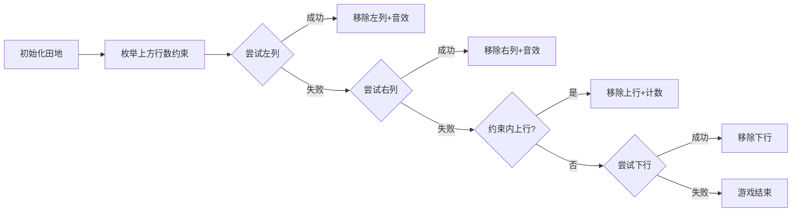

# 题目信息

# [POI 2006] ORK-Ploughing

## 题目描述

Byteasar, the farmer, wants to plough his rectangular field. He can begin with ploughing a slice from any of the field's edges, then he can plough a slice from any unploughed field's edges, and so on, until the whole field is ploughed. After the ploughing of every successive slice, the yet-unploughed field has a rectangular shape. Each slice has a span of $1$, and the length and width of the field are the integers $n$ and $m$.

Unfortunately, Byteasar has only one puny and frail nag (horse) at his disposal for the ploughing. Once the nag starts to plough a slice, it won't stop until the slice is completely ploughed. However, if the slice is to much for the nag to bear, it will die of exhaustion, so Byteasar has to be careful. After every ploughed slice, the nag can rest and gather strength. The difficulty of certain parts of the field varies, but Byteasar is a good farmer and knows his field well, hence he knows every part's ploughing-difficulty.

Let us divide the field into $m\times n$ unitary squares - these are called tiles in short.

We identify them by their coordinates $(i,j)$, for $1\le i\le m$ and $1\le j\le n$.

Each tile has its ploughing-difficulty - a non-negative integer.

Let $t_{i,j}$ denote the difficulty of the tile which coordinates are $(i,j)$.


For every slice, the sum of ploughing-difficulties of the tiles forming it up cannot exceed a certain constant $k$ - lest the nag dies.

A difficult task awaits Byteasar: before ploughing each subsequent slice he has to decide which edge of the field he'll plough, so that the nag won't die. On the other hand, he'd like to plough as few slices as possible.

TaskWrite a programme that:

reads the numbers $k$,$m$ and $n$ from the input file, as well as the ploughing-difficulty coefficients,     determines the best way to plough Byteasar's field,     writes the result to the output file.

Byteasar想耕种他那块矩形的田，他每次能耕种矩形的一边（上下左右都行），在他每次耕完后，剩下的田也一定是矩形，每块小区域边长为$1$，耕地的长宽分别为$m$和$n$，不幸的是Byteasar只有一匹老弱的马，从马开始耕地开始，只有当它耕完了一边才会停下休息。但有些地会非常难耕以至于马会非常的累，因此Byteasar需要特别小心。当耕完了一边之后，马可以停下来休息恢复体力。每块地耕种的难度不一，但是Byteasar都非常清楚。我们将地分成$m\times n$块单位矩形——我们用坐标$(i,j)$来定义它们。每块地都有一个整数$t_{i,j}$,来定义$(i,j)$的耕种难度。所以每次马耕一边地时的难度就是所有它耕种的地的难度总和，对于这匹虚弱的马而言，这个值不能超过他的体力值。Byteasar想知道在马不死掉的情况下最少需要耕多少次才能把地耕完。


## 说明/提示

感谢@NaVi\_Awson 提供翻译


## 样例 #1

### 输入

```
12 6 4
6 0 4 8 0 5
0 4 5 4 6 0
0 5 6 5 6 0
5 4 0 0 5 4```

### 输出

```
8```

# AI分析结果


# 💡 Kay的C++算法解析：ORK-Ploughing 深入学习指南 💡

## 1. 题目解读与核心算法识别

✨ **本题主要考察**：`贪心算法` + `枚举思想`

🗣️ **初步分析**：
> 解决耕地问题就像玩层层剥开的俄罗斯方块——每次只能从矩形边缘移除一行/一列，且每次移除的方块总难度不能超过马的体力值K。核心思想是**枚举约束条件下的贪心策略**：  
> - 先确定主攻方向（行或列），枚举另一方向的限制次数  
> - 在约束下按优先级顺序移除边缘（如列优先则按"左→右→上→下"顺序）  
> - 通过前缀和快速计算边缘难度，确保每次操作合法  
>
> **可视化设计思路**：  
> 用8位像素风格展示田地，当前尝试移除的边缘高亮闪烁（如左边列亮蓝色边框）。移除成功时播放"叮"音效，方块消失并收缩剩余矩形。控制面板显示枚举约束值（如"上方最多移除: 3行"）和操作计数器，帮助理解约束与贪心的配合逻辑。

---

## 2. 精选优质题解参考

**题解一：龙神哈迪斯**
* **点评**：思路清晰直白，将问题拆解为"纵向为主/横向为主"两种模式。代码规范（前缀和变量名`g`/`f`含义明确），通过`work1/work2`函数分离逻辑。亮点在于用枚举约束（`st`）控制贪心优先级，实践价值高——可直接用于竞赛，边界处理严谨。作者提到"枚举-贪心很玄学"，实则揭示了算法本质。

**题解二：Alex_Wei**
* **点评**：创新性地用动态规划状态`f[l][r]`表示剩余行区间，通过双指针收缩范围。代码简洁高效（时间复杂度O(nm)），但状态转移思想较抽象。亮点在于避免显式枚举，直接用`while`循环处理列移除，适合进阶学习者理解贪心本质。

**题解三：CatFromMars**
* **点评**：通过`up/dn`计数器显式追踪移除行数，直观展示枚举约束的作用。代码中`work`函数的`lim`参数和条件判断`up < lim`清晰体现约束逻辑。亮点在于完整统计操作类型，帮助学习者理解枚举与贪心的协作机制。

---

## 3. 核心难点辨析与解题策略

1.  **难点：确定贪心优先级与枚举约束的配合**
    * **分析**：如龙神哈迪斯解法中，枚举"上方最多移除行数"后，贪心时需严格遵循"左→右→上(约束内)→下"顺序。若顺序错误（如先处理未约束方向），可能错过最优解。
    * 💡 **学习笔记**：枚举约束为贪心提供"安全操作区"，优先级顺序保障策略完备性。

2.  **难点：高效计算边缘难度**
    * **分析**：如CatFromMars解法使用前缀和数组`rowSum/colSum`，将每次边缘难度计算从O(n)降至O(1)。例如`rowSum[i][j]`存储第i行前j列总和，查询左列难度即`colSum[bottom][left] - colSum[top-1][left]`。
    * 💡 **学习笔记**：前缀和是优化矩形边缘计算的利器。

3.  **难点：边界条件处理**
    * **分析**：每次操作后需动态更新田地的四个边界（`top/bottom/left/right`），并确保新边界合法（如`left ≤ right`）。Alex_Wei解法中`while(p<=q)`是经典边界控制。
    * 💡 **学习笔记**：边界值维护是迭代贪心的生命线。

### ✨ 解题技巧总结
- **技巧1：问题分解与枚举约束**——将复杂操作分解为行/列主方向+另一方向约束
- **技巧2：贪心优先级设计**——约束方向操作受限，非约束方向按固定序尝试
- **技巧3：前缀和预计算**——O(1)时间查询行/列总和，避免重复计算

---

## 4. C++核心代码实现赏析

**通用核心C++实现参考**
* **说明**：综合优质题解思路，展示枚举约束下的贪心框架
* **完整核心代码**：
```cpp
#include <iostream>
#include <climits>
using namespace std;
const int MAX_N = 2005;
int K, m, n;
int field[MAX_N][MAX_N], rowSum[MAX_N][MAX_N], colSum[MAX_N][MAX_N];

int verticalFirst(int topLimit) { // 列为主方向，约束上方最多移除topLimit行
    int top = 1, bottom = n, left = 1, right = m, steps = 0;
    while (left <= right && top <= bottom) {
        steps++;
        if (colSum[bottom][left] - colSum[top-1][left] <= K) { 
            left++; continue; // 左列合法
        }
        if (colSum[bottom][right] - colSum[top-1][right] <= K) { 
            right--; continue; // 右列合法
        }
        if (top <= topLimit && rowSum[top][right]-rowSum[top][left-1] <= K) { 
            top++; continue; // 上行合法且在约束内
        }
        if (rowSum[bottom][right]-rowSum[bottom][left-1] <= K) { 
            bottom--; continue; // 下行合法
        }
        return INT_MAX; // 无合法操作
    }
    return steps;
}

int main() {
    cin >> K >> m >> n;
    for (int i = 1; i <= n; i++) {
        for (int j = 1; j <= m; j++) {
            cin >> field[i][j];
            rowSum[i][j] = rowSum[i][j-1] + field[i][j];
            colSum[i][j] = colSum[i-1][j] + field[i][j];
        }
    }
    
    int ans = INT_MAX;
    for (int topLimit = 0; topLimit <= n; topLimit++) // 枚举上方行数约束
        ans = min(ans, verticalFirst(topLimit));
    // 对称处理横向为主方向(代码类似)
    cout << ans << endl;
}
```
* **代码解读概要**：
  - 初始化：读入田地数据，构建行列前缀和
  - `verticalFirst`：列为主方向的核心贪心逻辑，按优先级尝试移除边缘
  - 主循环：枚举上方行数约束`topLimit`，取最小操作次数

---

**题解一核心片段赏析**
```cpp
int work1(int st) { // st: 上方最多移除行数
    int s1=1, t1=n, s2=1, t2=m, cnt=0;
    while(s1<=t1 && s2<=t2) {
        cnt++;
        if(g[t1][s2]-g[s1-1][s2] <= K) { s2++; continue; } // 左列
        if(g[t1][t2]-g[s1-1][t2] <= K) { t2--; continue; } // 右列
        if(s1<st && f[s1][t2]-f[s1][s2-1] <= K) { s1++; continue; } // 上行(约束内!)
        if(f[t1][t2]-f[t1][s2-1] <= K) { t1--; continue; } // 下行
        break; // 无合法操作
    }
    return cnt;
}
```
* **亮点**：简洁直观的优先级链，约束条件`s1<st`无缝融入判断
* **学习笔记**：贪心优先级链中，约束条件只需在特定位置校验

**题解二核心片段赏析**
```cpp
while(p <= q) {
    if(c[r][p] - c[l-1][p] <= k) p++; // 左列可移除
    if(c[r][q] - c[l-1][q] <= k) q--; // 右列可移除
    if(p>q) cmin(ans, n-len+m); // 更新答案
    if(row[l][q]-row[l][p-1] <= k) f[l+1][r]={p,q}; // 上行移除
}
```
* **亮点**：隐式枚举约束，通过DP状态转移自然处理行移除
* **学习笔记**：DP状态`f[l][r]`巧妙表示剩余行区间，避免显式约束参数

**题解三核心片段赏析**
```cpp
int work(int lim) {
    int up = 0, x1=1, x2=n, y1=1, y2=m;
    while(y1 <= y2) {
        if(colSum[x2][y1]-colSum[x1-1][y1] <= K) y1++; // 左列
        else if(colSum[x2][y2]-colSum[x1-1][y2] <= K) y2--; // 右列
        else if(up < lim && rowSum[x1][y2]-rowSum[x1][y1-1] <= K) 
            { x1++; up++; } // 上行(计数!)
        else if(rowSum[x2][y2]-rowSum[x2][y1-1] <= K) x2--; // 下行
        else return INT_MAX;
    }
    return (y2-y1+1) + up + (n-x2); // 总操作数
}
```
* **亮点**：用`up`计数器显式追踪约束内操作，增强可读性
* **学习笔记**：显式计数帮助调试和理解枚举约束的作用

---

## 5. 算法可视化：像素动画演示

**主题**：8位农场大冒险  
**核心演示**：枚举约束下的贪心操作链（以列为主方向为例）  



**关键交互设计**：
1. **像素网格**：FC红白机风格，不同难度地块用色区分（绿<黄<红）
2. **动态边框**：当前尝试的边缘闪烁高亮（左列蓝框/右列紫框/上行黄框/下行橙框）
3. **约束计数器**：面板显示"上方最多移除: 3/当前已移除: 2"
4. **音效系统**：
   - 移除成功：清脆"叮"声
   - 约束触顶：警告音
   - 游戏通关：8位胜利旋律
5. **AI演示模式**：自动播放贪心过程，调速滑块控制步骤间隔
6. **关卡机制**：每关对应不同(K, m, n)，通关解锁更复杂田地

---

## 6. 拓展练习与相似问题思考

**通用思路迁移**：
1. **俄罗斯方块消除**：在固定操作顺序下最小化消除次数
2. **图像裁剪优化**：从边缘逐步移除像素满足约束
3. **资源分配问题**：在限额下按优先级分配资源

**洛谷练习推荐**：
1. **P1880 石子合并**  
   → 巩固区间操作和动态规划思想
2. **P1090 合并果子**  
   → 强化贪心优先级设计能力
3. **P1106 删数问题**  
   → 训练约束条件下的最优序列生成

---

## 7. 学习心得与经验分享

> **经验摘录 (龙神哈迪斯)**：  
> *"枚举上方最多耕的次数是有限次... 耕地的优先级：左-右-上-下"*  
> **Kay点评**：  
> 枚举约束本质是为贪心划定安全区。经验强调的"优先级顺序"与"约束融合判断"是避免贪心失效的关键，调试时可打印每一步的边界值和约束计数验证。

---

通过本次分析，相信大家已掌握枚举约束与贪心结合的解题范式。记住：复杂问题往往需分解为"约束枚举+局部贪心"的组合。继续加油，下次算法冒险再见！💪

---
处理用时：244.41秒