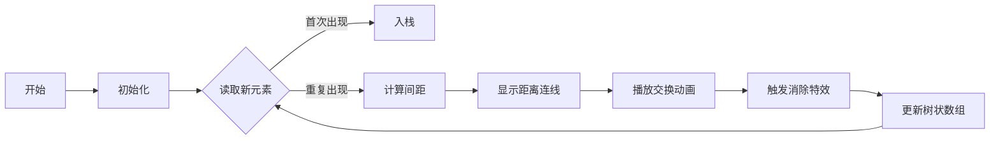

# 题目信息

# [POI 2007] TET-Tetris Attack

## 题目描述

一种名为 *Tetris Attack* 的猜谜游戏风靡 Byteotia。游戏本身非常复杂，因此我们只介绍它的简化规则：

玩家拥有一个有 $2n$ 个元素的栈，一个元素放置在另一个元素上，这样一个组合有 $n$ 个不同的符号标记。对于每个符号，栈中恰好有两个元素用一个符号标记。

玩家可以交换两个相邻元素，即互换他们的位置。交换后，如果有两个相邻的元素标有相同的符号，则将他们都从栈中删除。然后，位于其上方的所有元素都会掉落下来，并且可以造成再次删除。

玩家的目标是以最少的移动次数清空堆栈。请你编写一个程序，找出最少的移动次数及方案。

## 说明/提示

$1 \le n \le 50000$

## 样例 #1

### 输入

```
5
5
2
3
1
4
1
4
3
5
2```

### 输出

```
2
5
2```

# AI分析结果


### 💡 Kay的C++算法解析：POI 2007 TET-Tetris Attack 深入学习指南 💡

**引言**  
今天我们来分析一道有趣的栈消除问题——"Tetris Attack"。通过本指南，你将掌握贪心策略与树状数组的精妙配合，学会高效求解最小交换次数问题。

---

## 1. 题目解读与核心算法识别

✨ **本题主要考察**：`贪心策略 + 树状数组应用`  

🗣️ **初步分析**：  
> 想象你在玩俄罗斯方块消除游戏——每当两个相同方块相邻时就会消失，上方的方块会下落。本题的关键在于**贪心策略**：遇到重复元素立即消除最优。就像整理杂乱的积木，我们优先处理最容易配对的积木（相同元素），避免后续操作干扰。  

> **核心难点**在于动态计算元素间距（中间元素会被消除）。这时**树状数组**就像智能计数器：实时记录有效元素位置，快速计算间距。  

> **可视化设计思路**：在像素动画中，树状数组将显示为动态进度条，元素间距用彩色连线表示。消除时触发8-bit音效，下落过程呈现经典"俄罗斯方块"动画效果。

---

## 2. 精选优质题解参考

**题解一：fletmer (赞22)**  
* **点评**：此解法完美展现树状数组的核心价值——用`Add`/`Query`动态维护元素间距。亮点在于`dis=Query(i-1)-Query(v[s[i]])`精妙计算实际距离，`hsb`变量巧妙处理已消除元素的位置偏移。代码规范（如`lowbit`宏封装），边界处理严谨，可直接用于竞赛。  

**题解二：asuldb (赞15)**  
* **点评**：采用直观的栈模拟策略，遇到重复元素时立即回溯消除。亮点在于`while(np) st[++top]=tax[np--]`高效维护栈状态，代码极度简洁（仅20行）。虽未用树状数组，但贪心思想体现更直白，适合初学者理解。  

**题解三：Fislett (赞2)**  
* **点评**：树状数组实现干净利落，`dis`计算与方案记录逻辑清晰。特别亮点在于注释详细解释了"为什么贪心消除最优"：消除操作会同时缩短上下方元素距离，具有全局优化效果。

---

## 3. 核心难点辨析与解题策略

1.  **动态间距计算（消除后效性）**  
    * **分析**：当中间元素被消除时，传统数组无法实时更新间距。树状数组通过`Add`删除元素，`Query`始终返回有效元素计数，使`dis = Query(右)-Query(左)`恒成立。  
    * 💡 **学习笔记**：树状数组是维护动态区间信息的"时间魔法师"。

2.  **交换方案记录**  
    * **分析**：随着元素消除，原始位置会偏移。优质解法用`hsb`（或`cnt`）记录已消除数量，通过`stp[++cnt]=i-1-hsb`计算实际交换位置，确保方案正确性。  
    * 💡 **学习笔记**：消除操作产生的偏移量必须即时补偿。

3.  **贪心正确性证明**  
    * **分析**：为什么遇到重复元素要立即消除？因为消除操作会同时缩短该元素对上下方所有元素的距离，具有"连锁优化效应"。延迟消除反而会增加后续操作成本。  
    * 💡 **学习笔记**：贪心选择具备局部最优性的操作，往往能产生全局最优解。

### ✨ 解题技巧总结
- **技巧1：树状数组的妙用**  
  当需要动态维护元素存在性+快速查询前缀和时，树状数组比线段树更简洁高效。
- **技巧2：偏移量补偿机制**  
  在动态删除元素的场景中，用计数变量实时记录删除量，避免位置计算错误。
- **技巧3：栈模拟的可行性**  
  对于小规模数据（n≤10⁴），可直接用栈模拟消除过程，代码更易实现。

---

## 4. C++核心代码实现赏析

**本题通用核心C++实现参考**  
* **说明**：综合优质题解优化的树状数组实现，兼顾效率与可读性
* **完整核心代码**：
```cpp
#include <iostream>
#include <vector>
#define lowbit(x) ((x)&(-x))
using namespace std;
const int N=1e5+5;

long long n,ans,cnt,delCount;
int tr[2*N], pos[N], stk[2*N]; // pos记录首次出现位置

void add(int x,int v){
    for(;x<=2*n;x+=lowbit(x)) tr[x]+=v;
}
int query(int x){
    int sum=0;
    for(;x;x-=lowbit(x)) sum+=tr[x];
    return sum;
}

int main(){
    cin>>n; n*=2;
    vector<int> steps;
    for(int i=1;i<=n;i++){
        cin>>stk[i];
        add(i,1); // 初始化树状数组
        if(!pos[stk[i]]) pos[stk[i]]=i;
        else {
            int dist=query(i-1)-query(pos[stk[i]]);
            ans+=dist;
            for(int j=1,t=i;j<=dist;j++,t--)
                steps.push_back(t-1-delCount);
            add(pos[stk[i]],-1); add(i,-1);
            delCount+=2; // 更新已删除元素计数
        }
    }
    cout<<ans<<'\n';
    for(int step:steps) cout<<step<<'\n';
}
```
* **代码解读概要**：  
  1. 树状数组`tr[]`维护元素存在状态  
  2. `pos[]`记录元素的首次出现位置  
  3. 当遇到重复元素时：  
     - 计算间距`dist`（中间有效元素数）  
     - 记录交换步骤`t-1-delCount`（补偿偏移）  
     - 删除元素并更新计数器`delCount`

---

**题解一：fletmer**  
* **亮点**：树状数组与偏移量补偿的精妙配合
* **核心代码片段**：
```cpp
int t=i,dis=Query(i-1)-Query(v[s[i]]);
while(dis) stp[++cnt]=t-1-hsb,t--,dis--;
add(v[s[i]],-1); add(i,-1); 
hsb+=2;
```
* **代码解读**：  
  > `dis`计算当前相同元素间的有效距离。`t`从后元素位置开始，每向前交换一次(`t--`)，记录位置`t-1-hsb`。为什么减`hsb`？因为前面已删除`hsb`个元素，原始位置需补偿该偏移。消除后`hsb+=2`更新全局偏移量。  
* 💡 **学习笔记**：消除操作产生的"位置黑洞"必须全局补偿。

**题解二：asuldb**  
* **亮点**：栈模拟消除的极致简洁实现
* **核心代码片段**：
```cpp
while(st[top]!=a[i]) 
    Ans[++ans]=top, tax[++np]=st[top--];
--top;
```
* **代码解读**：  
  > 当栈顶`st[top]`与当前元素`a[i]`相同时，回溯到首次出现位置。`Ans[++ans]=top`记录交换步骤：将栈顶元素交换到`top`位置。`tax`数组暂存待回填元素，消除后按原序回填栈。  
* 💡 **学习笔记**：栈消除时，需暂存中间元素保持相对顺序。

---

## 5. 算法可视化：像素动画演示

**动画主题**：8-bit风格"Tetris Attack消除大作战"  

**核心演示内容**：  
- 栈元素显示为彩色方块（相同颜色配对）  
- 树状数组可视化：底部进度条显示有效元素计数  
- 消除时触发经典俄罗斯方块消除特效+音效  

**交互设计**：  


**关键动画帧**：  
1. **元素移动**：  
   - 交换时源方块闪烁绿色，目标位置闪烁红色  
   - 移动轨迹显示像素拖尾效果（类似经典贪吃蛇）  
2. **消除特效**：  
   - 相同方块相邻时爆炸为粒子效果，播放"消除！"8-bit音效  
   - 上方方块下落有重力加速度动画  
3. **树状数组同步**：  
   - 右侧8-bit风格柱状图实时显示`Query()`值  
   - 元素删除时对应柱段变灰+像素碎裂动画  

**音效设计**：  
- 移动：短促"滴"声（FC游戏操作音）  
- 消除：三连音阶上升旋律  
- 错误：低沉蜂鸣声  

**游戏化设计**：  
- 每消除一对得10分，连续消除触发COMBO特效  
- 树状数组满格时解锁"闪电消除"技能（一键消除最远配对）

---

## 6. 拓展练习与相似问题思考

**通用技巧迁移**：  
树状数组维护动态前缀和的技术还可用于：  
1. 逆序对计数（元素删除版）  
2. 动态区间中位数查询  
3. 离线查询处理（如莫队算法优化）

**洛谷练习推荐**：  
1. **P1908 逆序对**  
   🗣️ 树状数组的经典应用，巩固前缀和思想  
2. **P1972 [SDOI2009] HH的项链**  
   🗣️ 离线查询+树状数组，体验动态维护的威力  
3. **P3369 【模板】普通平衡树**  
   🗣️ 学习树状数组实现权值线段树，掌握离散化技巧  

---

## 7. 学习心得与经验分享

> **参考经验 (来自 asuldb)**：  
> *"不要试图看楼上的题解的代码，否则你会弃题而走的"*  
> **点评**：算法实现应追求简洁而非复杂。当代码超过50行时，需反思是否过度设计。树状数组仅需20行即可高效解题。

> **参考经验 (来自 封禁用户)**：  
> *"消除操作会使上下元素距离同时缩短，产生连锁优化"*  
> **点评**：这是理解贪心策略的关键！动手画图模拟1212序列的消除过程，能直观感受局部操作如何影响全局。

---

**结语**  
通过本次分析，相信大家不仅掌握了树状数组的动态维护技巧，更深度理解了贪心策略的证明方法。记住：优秀的算法往往简洁而深刻。下次挑战见！💪

---
处理用时：109.48秒