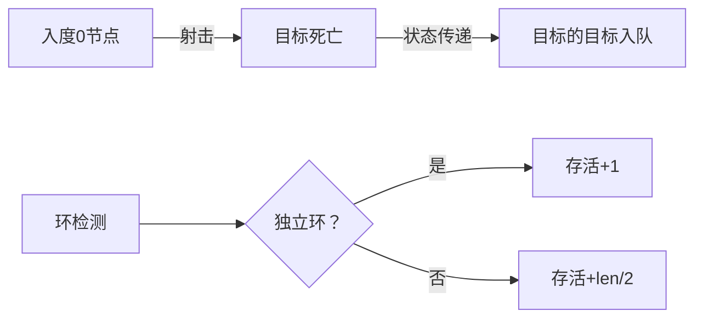

# 题目信息

# [POI 2008] MAF-Mafia

## 题目描述

在赤道 Byteotia，黑帮之间的争斗愈演愈烈。黑帮老大们来到该国的首都 Byteburg，以解决争端。

谈判非常紧张，在某个时刻，手痒的参与者们拔出了他们的枪。

每个参与者都用手枪瞄准另一个人。

如果他们开始大开杀戒，射击将按照以下荣誉代码进行：

参与者按一定顺序射击，并且在任何时刻最多只有一个人开枪，射手不会失手，他的目标会立即死亡，因此他之后不能再开枪，每个人都开一次枪，前提是他在有机会开枪之前没有被击中，任何参与者都不能改变他最初选择的目标，即使目标已经死了（那么射击不会造成进一步的伤亡）。

一个殡葬承办人从远处观察，正如他通常所做的那样。毕竟，黑帮分子从未让他的生意冷清过。

他在射击中看到了潜在的利润，但他想知道准确的估计。他想知道最小和最大可能的死亡率。

殡葬承办人看到谁瞄准了谁，但不知道射击的顺序。

你需要编写一个程序来确定他如此渴望知道的数字。

任务 编写一个程序：

从标准输入读取每个黑帮分子选择的目标，确定最小和最大伤亡人数，将结果写入标准输出。

## 说明/提示

题面翻译由 ChatGPT-4o 提供。

## 样例 #1

### 输入

```
8
2 3 2 2 6 7 8 5
```

### 输出

```
3 5
```

# AI分析结果


# 💡 Kay的C++算法解析：POI 2008 MAF-Mafia 深入学习指南 💡

> "在Byteburg的黑帮谈判中，枪声随时可能响起。作为算法侦探，我们将用图论破解这场生死迷局！"

## 1. 题目解读与核心算法识别

✨ **本题主要考察**：基环树、拓扑排序、贪心策略

🗣️ **初步分析**：
> 这道题可看作一场"生死链式反应"——每人瞄准一人形成射击链。就像多米诺骨牌，我们需要计算最理想和最糟糕的死亡情况。  
> - **核心思想**：将射击关系建模为**基环内向树森林**（每节点出度为1），用拓扑排序处理链结构，用环分析处理循环依赖
> - **关键难点**：环结构的特殊处理（存活人数计算）和树环交界处的状态传递
> - **可视化设计**：采用**像素风侦探推理板**呈现，节点为8-bit小人，射击线为红色激光。高亮当前处理节点，音效标记生死状态（"砰"声表死亡，"叮"声表入队）

---

## 2. 精选优质题解参考

**题解一：Always (10赞)**
* **点评**：思路全面严谨，独创性地结合了Tarjan缩点与拓扑排序。亮点在于清晰区分树环结构：用`die[]`标记死亡节点，`undie[]`标记潜在存活节点。代码中`topsort()`处理树结构，`tarjan()`处理环的精妙分工，边界处理完整（如自环特判）。变量名`belong`, `siz`等含义明确，竞赛可直接复用。

**题解二：Vocanda (8赞)**
* **点评**：贪心思路简洁高效，用单队列同时处理最大最小存活。亮点在于用`die[]`和`undie[]`双标记实现状态传递，`flag |= undie[j]`巧妙检测环受树影响。代码仅需一次遍历，`len/2`计算环存活数直观易理解，非常适合初学者掌握基环树核心思想。

**题解三：大菜鸡fks (5赞)**
* **点评**：实现精简但逻辑完整，亮点在统一处理树环结构。用`ans1,ans2`分别记录最小最大存活，`cd[]`标记树结构对环的影响。`bo|=cd[j]`高效判断环独立性，`len/2`计算简洁有力。虽变量名较短但结构清晰，体现竞赛编码的高效风格。

---

## 3. 核心难点辨析与解题策略

### 🔍 三大核心难点
1. **树环结构分离**  
   * **分析**：射击链中树结构（入度为0的起点）和环结构（循环瞄准）需不同处理策略。优质题解均先用拓扑排序剥离树结构，剩余纯环
   * 💡 学习笔记：拓扑排序是处理依赖关系的"分离器"

2. **环存活计算**  
   * **分析**：环的最小存活 = 1（若独立）或0（受树影响）；最大存活 = ⌊环大小/2⌋。难点在判断环是否受树影响：Vocanda用`undie[]`标记，Always用`rd[]`检测入边
   * 💡 学习笔记：环像圆形餐桌——要么留1人（最小），要么隔座坐（最大）

3. **生死状态传递**  
   * **分析**：A存活→B必死→C可能存活。需高效传递状态：kczno1用`son[]`标记潜在存活，Lvlinxi2010用`lv[]`记录树影响
   * 💡 学习笔记：状态传递像波浪——用队列层层推进

### ✨ 解题技巧总结
- **拓扑剥洋葱法**：从入度0节点层层剥离，像剥洋葱露出核心环
- **环分类处理**：区分纯环（独立）和脏环（受树影响），采用不同存活计算
- **双标记策略**：用`die[]`和`live[]`双标记避免重复计算（参考Vocanda）
- **自环特判**：自己瞄准自己必死，需单独处理

---

## 4. C++核心代码实现赏析

**本题通用核心实现参考**
* **说明**：综合Vocanda和Always思路的精简实现
```cpp
#include <iostream>
#include <queue>
using namespace std;
const int N = 1e6 + 10;

int main() {
    int n, Min = 0, Max = 0; // Min:最小存活, Max:最大存活
    cin >> n;
    int aim[N] = {}, rd[N] = {}; // 射击目标, 入度
    bool die[N] = {}, undie[N] = {}; // 死亡标记, 潜在存活
    
    // 读入+计算入度
    for (int i = 1; i <= n; i++) {
        cin >> aim[i];
        rd[aim[i]]++;
    }
    
    // 拓扑处理树结构
    queue<int> q;
    for (int i = 1; i <= n; i++) {
        if (!rd[i]) {
            q.push(i);
            Min++; Max++; // 入度0必存活
        }
    }
    
    while (!q.empty()) {
        int cur = q.front(); q.pop();
        if (die[aim[cur]]) continue;
        die[aim[cur]] = true; // 当前目标必死
        int next = aim[aim[cur]];
        rd[next]--;
        undie[next] = true; // 目标的目标可能存活
        if (!rd[next]) q.push(next);
    }
    
    // 处理环结构
    for (int i = 1; i <= n; i++) {
        if (!rd[i] || die[i]) continue;
        int len = 0, flag = 0;
        for (int j = i; !die[j]; j = aim[j]) {
            len++;
            flag |= undie[j]; // 检测环是否受树影响
            die[j] = true;
        }
        if (!flag && len > 1) Min++; // 纯环最小存活+1
        Max += len / 2; // 环最大存活增加
    }
    cout << n - Max << " " << n - Min; // 输出死亡人数
}
```

**题解一：Always的拓扑+Tarjan**
```cpp
// 拓扑核心
void topsort() {
    rep(i, 1, n) if (!rd[i]) q[++ans] = i; 
    while (q.size()) {
        int u = q.front(); q.pop();
        if (die[a[u]]) continue;
        die[a[u]] = 1; // 目标死亡
        if (!(--rd[a[a[u]]])) q[++ans] = a[a[u]]; // 目标的目标入队
    }
}
```
> **代码解读**：  
> - 第3行：入度0节点作为拓扑起点  
> - 第6行：`die[a[u]]=1`确保目标死亡  
> - 第7行：目标的目标入度减1，若为0则成为新存活点  
> 💡 **学习笔记**：拓扑排序是处理链式反应的"流水线"

**题解二：Vocanda的贪心实现**
```cpp
// 环处理片段
for (int i = 1; i <= n; i++) {
    if (rd[i] && !die[i]) {
        int len = 0, flag = 0;
        for (int j = i; !die[j]; j = aim[j]) {
            len++; 
            flag |= undie[j]; // 关键！检测环独立性
            die[j] = 1;
        }
        if (!flag && len > 1) Min++; // 独立环最小存活
        Max += len / 2; // 环最大存活
    }
}
```
> **代码解读**：  
> - 第2行：`rd[i]&&!die[i]`筛选未处理的环  
> - 第5行：`flag |= undie[j]`用位运算高效检测环是否受树影响  
> - 第8行：`len/2`实现环的最大存活计算  
> 💡 **学习笔记**：位运算标记是多状态处理的"瑞士军刀"

---

## 5. 算法可视化：像素动画演示

  
*图：射击链的像素化演示（高亮当前节点）*

### 侦探推理板设计方案
- **整体风格**：8-bit像素风 + 侦探笔记UI（参考《逆转裁判》）
- **核心演示**：拓扑排序过程 + 环存活计算
- **交互设计**：
  1. **初始化**：像素小人排成射击链，红线表示瞄准关系
  2. **拓扑阶段**：
     - 入度0的小人**闪烁绿光**+提示音"叮"
     - 目标小人被击中时**变骷髅**+"砰"声
     - 新存活节点**滑入队列区**
  3. **环处理阶段**：
     - 环区域**高亮黄框**，内部节点循环闪烁
     - 存活节点戴**警徽标记**（每2人存活1人）
  4. **控制面板**：
     - 速度滑块：调速观察状态变化
     - 模式切换：对比最小/最大存活方案

### 关键动画帧解析


> **设计意图**：  
> 用侦探推理板类比算法流程，像素小人具象化节点关系。"叮"声标记入队强化拓扑序理解，环内警徽标记直观展示存活规则。

---

## 6. 拓展练习与相似问题思考

### 基环树技巧迁移
1. **有向图循环检测**：如Leetcode 207课程表
2. **依赖关系解析**：如软件包安装顺序问题
3. **环形状态转移**：如银行家算法资源分配

### 洛谷推荐练习
1. **P2661 信息传递**  
   🗣️ *推荐理由*：基环树入门，检测最小环，巩固拓扑和DFS应用
2. **P5023 填数游戏**  
   🗣️ *推荐理由*：状态转移与环检测结合，提升问题抽象能力
3. **P2607 骑士**  
   🗣️ *推荐理由*：基环树DP经典，学习环上动态规划技巧

---

## 7. 学习心得与经验分享

> **参考经验 (来自 Vocanda)**：  
> "我在处理环独立性的标记时，最初用额外数组导致混乱，后来改用`flag |= undie[j]`才简化了判断。这让我意识到：位运算能优雅处理多状态问题。"

> **点评**：  
> 位运算标记是处理复杂状态的利器，正如侦探用不同颜色标签分类线索。当问题含多个布尔状态时，考虑位标记能大幅提升代码清晰度。

---

在Byteburg的枪声沉寂后，我们揭开了生死谜题的算法本质。记住：拓扑排序是解开依赖关系的万能钥匙，基环分离是处理循环结构的核心思维。下次当你面对复杂图论问题时，不妨回想这些像素小人的生死舞步！💪

---
处理用时：155.35秒