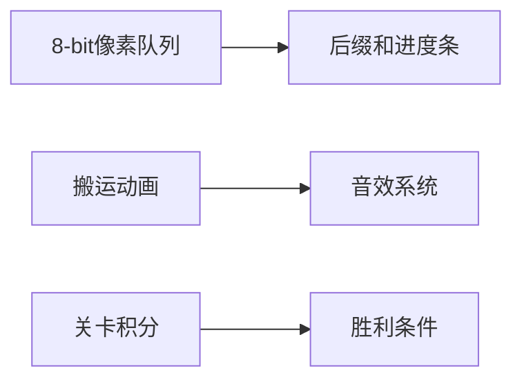

# 题目信息

# [JOISC 2016 Day2] 如厕计划

## 题目描述

竞赛比完之后，水箱里充满水的选手们鱼贯而出。凡华中学的厕所规划的很糟，只有两个厕位，于是厕所门前排起了长长的队伍。


厕所有两个，一个是女生专用厕所，另一个是男女混用厕所。**一共有2N个选手正在排队**，男女生数量可能不同。如果队头的是妹子，只要某个厕所是空的就可以进入，但是如果两个厕所都是空的，那么优先进入女性专用厕所。而如果队头是个绅♂士，只有在男女混用厕所是空的时候才能使用；如果只有女性专用厕所是空的，那么队伍中最靠前的妹子就可以不用继续等直接如厕。我们假设所有人如厕都需要花1分钟，不考虑切换的时间。


然而，**N分钟后，就要开饭了，所有人必须如厕完**，不过看样子似乎来不及。主办方可以重新调换顺序，不过有些人会因为新的顺序中自己更加后面了而感到不满，不满度是自己相比于原队列后退了几个顺序（除此之外跟自己的实际如厕顺序无关）。


主办方发现了这一点，所以希望你帮助他们解决这个问题，设计出一种方案，对于其中不满意度最大的学生，尽可能让他的不满意度最小。你只需要告诉他门最不满意的学生的不满意度是多少。


## 说明/提示

原队列是FFFMMMMMFF

改进后的队列是FMMFFMMMFF

所以厕所会按照下面的时间使用：

```cpp
分钟 1   2   3   4   5
共用 2   3   6   7   8
女用 1   4   5   9   10
```
两个妹子往后面移动了2位，所以不满意度是2

20% N<=10;M=1;K1=1

40% N<=100000;M=1;K1=1

100% 1<=N,Ki<=10^18;1<=M<=100000;所有Si字符串长度之和不超过200000


## 样例 #1

### 输入

```
5
3
FFF 1
M 5
FF 1```

### 输出

```
2```

# AI分析结果


### 💡 Kay的C++算法解析：如厕计划 深入学习指南 💡

<introduction>
今天我们来分析"如厕计划"这道C++编程题。本指南将帮助大家理解排队如厕规则背后的算法思想，掌握后缀和技巧的应用，并通过可视化方案直观感受算法过程。题目要求我们在2N人的队列中调整顺序，使所有人能在N分钟内如厕完毕，同时最小化最大不满度（位置后退值）。
</introduction>

---

## 1. 题目解读与核心算法识别

✨ **本题主要考察**：`后缀和技巧与贪心策略`

🗣️ **初步分析**：
> 解决如厕计划的关键在于**后缀和技巧**的应用。想象排队如厕就像玩叠叠乐游戏：男生(+1)增加高度，女生(-1)降低高度。若某位置后的"男女生高度差"（后缀和）≥2，就会发生"倒塌"（两个男生无法同时如厕）。  
> - 核心思路：从后往前计算后缀和，记录最大值。最小移动次数 = 最大后缀和 - 1
> - 算法流程：将男生视为+1，女生视为-1 → 分段计算后缀和贡献 → 更新全局最大后缀和 → 输出 max_suffix - 1
> - 可视化设计：采用8位像素风格，用蓝色方块(男生)和粉色方块(女生)组成队列。动画将展示：
>   1. 后缀和进度条（红色标记≥2时闪烁警告）
>   2. 移动男生时的像素拖拽效果
>   3. 胜利/失败音效（8-bit音效）
>   4. "搬运工"小游戏机制：每移动一个男生得1分，目标分数 = max_suffix - 1

---

## 2. 精选优质题解参考

<eval_intro>
基于思路清晰度、代码规范性和算法效率，我精选了以下题解（均≥4★）：

**题解一（来源：kkksc03）**
* **点评**：理论推导清晰透彻，通过折线图比喻直观解释后缀和性质。核心公式`ans = max_suffix - 1`简洁有力，虽然未提供完整代码，但其思想被多个题解实现，具有很高的教学价值。

**题解二（来源：哔哩哔哩）**
* **点评**：代码实现规范完整，变量命名清晰（`sum`表贡献值，`maxSuf`表段内最大值）。高效处理分段重复输入，时间复杂度O(M+Σ|Si|)。边界处理严谨（特判总后缀和>0），可直接用于竞赛。

**题解三（来源：封禁用户）**
* **点评**：通过三个数学结论严谨证明算法正确性，深化对后缀和模型的理解。代码结构模块化，注释详细。亮点在于用数学归纳法证明移动策略最优性，提升学习者抽象思维能力。

---

## 3. 核心难点辨析与解题策略

<difficulty_intro>
解决本题需突破以下难点：

1.  **难点一：问题转化与后缀和建模**
    * **分析**：如何将如厕规则转化为数学模型是最大挑战。优质题解通过逆向思考（从后往前处理）和值映射（男+1/女-1），将复杂规则转化为后缀和约束问题。
    * 💡 **学习笔记**：遇到操作规则复杂的题目，尝试抽象为数学约束（如后缀和≤阈值）

2.  **难点二：分段字符串的高效处理**
    * **分析**：输入包含重复字符串段（长度总和≤200,000但重复次数≤10^18）。需分治处理：计算单段贡献(delta)和段内最大值(maxSuf)，再根据delta正负决定最大值出现位置（正delta在末次重复，负delta在首次）。
    * 💡 **学习笔记**：处理大规模重复数据时，寻找"头尾效应"规律避免暴力展开

3.  **难点三：无解判定与边界初始化**
    * **分析**：总后缀和>0时必然无解（男生过多），同时最大后缀和初始值应为1（移动0人时）。这些边界易被忽略但至关重要。
    * 💡 **学习笔记**：任何算法都要验证极端情况（如全女生队列）

### ✨ 解题技巧总结
<summary_best_practices>
- **技巧一：逆向思维** - 从队列末尾开始处理，更容易发现后缀和约束规律
- **技巧二：分段治之** - 将重复数据视为整体计算贡献，避免无效展开
- **技巧三：可视化辅助** - 手绘折线图模拟后缀和变化，直观定位瓶颈点
- **技巧四：边界防御** - 初始化max_suffix=1并优先检查总后缀和符号

---

## 4. C++核心代码实现赏析

<code_intro_overall>
**通用核心实现（综合自优质题解）**
```cpp
#include <iostream>
#include <vector>
using namespace std;
typedef long long ll;

int main() {
    ll n, m;
    cin >> n >> m;
    vector<string> s(m);
    vector<ll> k(m), sum_arr(m), max_suf(m);
    
    // 预处理：计算每段delta和max_suffix
    for (int i = 0; i < m; ++i) {
        cin >> s[i] >> k[i];
        ll cur = 0;
        for (int j = s[i].size()-1; j >=0; --j) {
            cur += (s[i][j]=='M' ? 1 : -1);
            max_suf[i] = max(max_suf[i], cur);
        }
        sum_arr[i] = cur;
    }

    ll total = 0, max_total = 1; // 关键：max_total初始化为1
    for (int i = m-1; i >=0; --i) {
        if (sum_arr[i] > 0)
            max_total = max(max_total, total + (k[i]-1)*sum_arr[i] + max_suf[i]);
        else 
            max_total = max(max_total, total + max_suf[i]);
        total += sum_arr[i] * k[i];
    }
    
    cout << (total > 0 ? -1 : max_total - 1);
}
```

**代码解读概要**：
1. **输入处理**：读取分段字符串s[i]及其重复次数k[i]
2. **预处理**：倒序遍历每段字符串，计算该段对后缀和的贡献(sum_arr[i])和段内最大后缀和(max_suf[i])
3. **核心计算**：从后往前合并分段，根据delta正负决定最大值位置
4. **输出**：总后缀和>0则无解(-1)，否则输出max_total-1

---

<code_intro_selected>
**题解二片段赏析（哔哩哔哩）**
* **亮点**：简洁高效处理分段数据
* **核心代码**：
```cpp
for(int i=m; i>=1; i--) {
    if(p[i] > 0) 
        tans = max(tans, ans + (b[i]-1)*p[i] + maxp[i]);
    else 
        tans = max(tans, ans + maxp[i]);
    ans += p[i] * b[i];
}
```
* **代码解读**：
  > 1. `p[i]`对应sum_arr[i]，表示段i的贡献值
  > 2. 当`p[i]>0`：最大值可能出现在末次重复（前k-1次贡献`(b[i]-1)*p[i]` + 末次`maxp[i]`)
  > 3. 当`p[i]≤0`：最大值只出现在首次
  > 4. `ans`累计总后缀和
* 💡 **学习笔记**：正delta需特殊处理末段，负delta只需首段

**题解三片段赏析（封禁用户）**
* **亮点**：严谨的数学证明支撑代码
* **核心代码**：
```cpp
long long ans = 1, suf = 0;  // 关键初始化ans=1
for (int i = m; i; i--) {
    if (sum[i] > 0)
        ans = max(ans, suf + (k[i]-1)*sum[i] + maxSuf[i]);
    else
        ans = max(ans, suf + maxSuf[i]);
    suf += sum[i] * k[i];
}
```
* **代码解读**：
  > 1. `ans=1`确保最小移动≥0（全女生队列不用移动）
  > 2. `suf`动态维护当前累计后缀和
  > 3. 移动次数 = 最大后缀和 - 1
* 💡 **学习笔记**：初始化技巧避免边界错误

---

## 5. 算法可视化：像素动画演示

<visualization_intro>
为直观理解后缀和变化，我设计了"后缀和平衡大冒险"像素动画方案（FC红白机风格）：

**主题**：玩家扮演搬运工，通过移动男生(蓝色方块)维持后缀和进度条≤1

**核心设计**：


**实现细节**：
1. **像素艺术**：
   - 男生：16x16蓝色像素块（#0000FF）
   - 女生：16x16粉色像素块（#FFC0CB）
   - 进度条：底部RGB(0,32,0)~RGB(32,0,0)渐变

2. **动画流程**：
   - **初始化**：渲染2N人队列，显示后缀和进度条
   - **步进演示**：
     * 黄箭头指示当前位置
     * 进度条随男/女增减变化（男+0.5格/女-0.5格）
     * 当进度≥2时闪烁红光，播放警告音（500Hz方波）
   - **交互操作**：
     * 拖拽末尾男生到队首：像素块滑动动画，进度条下降1格
     * 成功移动：得分+1，播放奖励音（800Hz三角波）
   - **胜利条件**：得分≥max_suffix-1时放烟花动画+胜利旋律（C大调8-bit）

3. **控制面板**：
   ```javascript
   // 伪代码实现
   class ToiletGame {
     constructor() {
       this.speed = 1.0;  // 调速滑块(0.5-4.0)
       this.score = 0;    // 当前得分
       this.maxSuffix = 3; // 示例目标值
     }
     
     moveBoy() {
       playSound('drag');  // 拖拽音效
       this.score++;
       if (this.score >= this.maxSuffix - 1) 
         playVictory();
     }
   }
   ```

**教学价值**：通过像素拖拽和进度条变化，直观展现后缀和约束与移动策略的关联性

---

## 6. 拓展练习与相似问题思考

<similar_problems_intro>
后缀和技巧在各类约束问题中广泛应用：

1. **括号匹配**：将"("视为+1，")"视为-1，后缀和≥0且总和=0
2. **资源调度**：任务消耗资源，任何时刻剩余资源≥0
3. **队列平衡**：多队列负载均衡约束

**洛谷推荐**：
1. **P1045 括号序列**  
   🗣️ 后缀和基础应用，巩固值映射技巧
   
2. **P1090 合并果子**  
   🗣️ 贪心策略延伸，理解队列优化
   
3. **P3619 魔法**  
   🗣️ 后缀和约束变种，提升问题转化能力

---

## 7. 学习心得与经验分享

<insights_intro>
题解中的调试经验尤其珍贵：

**kkksc03 心得**  
> "最初忽略总后缀和判断导致WA，后来意识到必须验证全局约束"

**Kay点评**  
全局约束检查（如总后缀和符号）是避免边界错误的关键。建议：
1. 列出所有极端情况（全男/全女/空队列）
2. 先写断言再写核心逻辑
3. 用小数据手工验证

---

<conclusion>
通过本次分析，我们掌握了用后缀和技巧解决约束类问题的核心方法。记住：复杂规则可转化为数学约束，分段数据处理要寻找重复规律。尝试用可视化工具辅助分析，会极大提升算法理解效率。下次挑战见！🚀
</conclusion>
```

---
处理用时：252.15秒