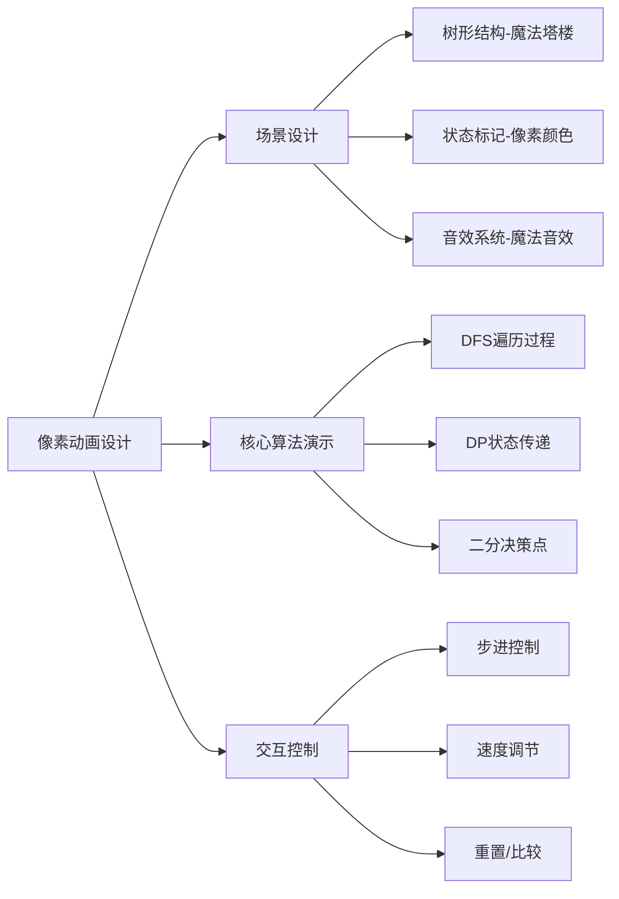

# 题目信息

# [JSOI2013] 哈利波特与死亡圣器

## 题目描述

伏地魔的黑暗势力控制了魔法部与霍格沃茨魔法学校之后，哈利与罗恩、赫敏不得不逃亡在外，隐形遁迹。为了完成校长邓布利多的遗命，一直在暗中寻机销毁伏地魔魂器的哈利，意外地获悉如果他们能够拥有传说中的三件死亡圣器，伏地魔将必死无疑。

在凤凰社成员的帮助下，哈利一行人重新掌控了霍格沃茨。然而此举激怒了伏地魔，他很快率领大批食死徒和黑暗生物向霍格沃茨进军。麦格教授紧急疏散了霍格沃茨的学生，并开始了守卫霍格沃茨的战斗。

霍格沃茨魔法学校的主要建筑共有 $n$ 处，我们编号为 $1$ 到 $n$，这些建筑间由魔法道路连接，整体呈树状分布，即任意两个建筑间有且仅有一条路径相连（路径可以是一条或多条道路组成）。霍格沃茨历经多年风雨，每个建筑自身有许多保护魔法，比如“石墩触动咒”、“降敌陷阱咒”、“统统加护咒”等，只需有人前往施用咒语即能保卫建筑。

现在，伏地魔大军已经到达 $1$ 号建筑——学校大门，凤凰社成员也已经在大门迎战，并且已经启用了大门的保护魔法。然而伏地魔大军势力壮大，保护魔法只能延缓大军的进攻锋芒，他们仍能用一个小时攻克一个建筑，随后整个大军便随机前往与之相邻的另一个建筑（兵贵神速，大军移动过程不需要时间；兵法无常，他们有可能前往已经攻克的建筑）。

目前除了 $1$ 号建筑，其他建筑的保护魔法都尚未被启用，凤凰社决定派出一些成员去其他建筑施用咒语来启动保护魔法。每个凤凰社成员可以瞬间达到任意一个建筑，并用一个小时完成对该建筑保护魔法的启用，之后可以再前往其他的建筑。他们的任务是，保证不论伏地魔大军如何行动，大军所到建筑的保护魔法都已经启用。为了集中更多力量直接打击伏地魔大军，凤凰社希望派出施用咒语的成员数尽可能少。

请你计算，至少需要派出多少位成员。

注：

- 伏地魔大军到达 $1$ 号建筑开始攻击的同时，凤凰社派出成员去其他建筑施咒。

- 当大军攻克某个建筑后，凤凰社成员可以在知道大军下一个小时去哪个建筑的情况下，再决定他们去哪些建筑施咒。这个过程也不需要时间。

- 已经启用过保护魔法的建筑无需再施咒，即便大军攻克该建筑以后某个时候又回到这个建筑，大军也会在这个建筑持续攻击一个小时后再离开。

## 说明/提示

### 数据范围

对于 $100\%$ 的数据，$1\leq n\leq 3\times 10^5$。

## 样例 #1

### 输入

```
7
1 2
1 3
2 5
2 6
7 2
4 1```

### 输出

```
3```

# AI分析结果


# 💡 Kay的C++算法解析：哈利波特与死亡圣器 深入学习指南 💡

> 欢迎各位小巫师！今天我们将一起探索霍格沃茨的防御魔法奥秘。这道题看似复杂，实则暗藏树形结构和动态规划的巧妙设计。我会用清晰的思路和生动的像素动画，帮助大家掌握"二分答案+树形DP"的核心魔法！

## 1. 题目解读与核心算法识别

✨ **本题主要考察**：`树形动态规划` + `二分答案`

🗣️ **初步分析**：
> 这道题就像在魔法树上布置防御哨兵。想象霍格沃茨是一棵魔法树（1号节点是树根），伏地魔大军从树根开始逐层攻占节点。凤凰社需要**最少数量的巫师**提前布置防御魔法，使得无论伏地魔选择哪条进攻路径，他到达的节点都已被保护。

**核心算法解析**：
- **树形DP**：把防御需求转化为树上状态传递。定义`dp[u]`表示以节点u为根的子树需要祖先额外支援的防御次数
- **二分答案**：答案具有单调性——派出巫师越多防御越容易。通过二分查找最小可行值
- **可视化设计**：我们将设计像素风树形结构动画，用颜色标记节点状态（红色：危险区，绿色：安全区），动态展示DP值从叶子向根节点传递的过程，并在关键决策点（如`max(0, sum-k)`）触发像素特效

## 2. 精选优质题解参考

### 题解一：liangbowen (赞9)
* **点评**：思路最清晰完整的题解！作者用"需要祖先支援次数"定义DP状态非常精妙，完美解决子树间支援问题。代码结构规范（如`dfs`函数分离逻辑），变量命名合理（`dp[u]`，`sum`），边界处理严谨（`max(0,...)`）。特别亮点在于提供了贪心解法的反例，加深理解DP的必要性。

### 题解二：littleKtian (赞6)
* **点评**：简洁高效的典范！作者用更简短的代码实现相同算法，状态转移`f[u]=max(0,Σ(f[v]+1)-k)`直击核心。亮点在于输入优化（手写`dr()`快速读入），对大数据量友好。虽然省略部分解释，但代码本身已成为最佳注释。

### 题解三：KukCair (赞1)
* **点评**：创新性的状态定义视角！作者提出"伏地魔不会回头"的关键观察，将问题简化为纯子树防御。代码实现干净利落（仅20行核心逻辑），特别亮点在于用`vector`存储树结构，避免传统链式前向星的复杂性，提升可读性。

## 3. 核心难点辨析与解题策略

1.  **难点一：如何定义树形DP状态？**
    * **分析**：优质题解通过"需要祖先支援次数"巧妙解决子树协作问题。关键在理解：当某个子树防御不足时，其兄弟节点的剩余防御力量可跨子树支援（但祖先无法预支未来防御）
    * 💡 **学习笔记**：树形DP的状态定义需具备子问题独立性，同时允许状态传递

2.  **难点二：为什么转移方程是 sum(dp[v]+1)-k？**
    * **分析**：`dp[v]+1`包含子节点本身防御需求，`sum`是子树总需求。减去`k`是本轮可派出巫师数，取`max(0,...)`是因负值意味防御盈余，但盈余不能储存（伏地魔路径不确定）
    * 💡 **学习笔记**：树形DP的转移方程需考虑当前决策对子问题的覆盖能力

3.  **难点三：为何二分答案的check条件为 dp[1]==0？**
    * **分析**：根节点（1号建筑）没有祖先节点，若其`dp[1]>0`表示整棵树仍有未覆盖风险。这种设计将全局约束转化为根节点状态验证
    * 💡 **学习笔记**：树形DP常将全局约束体现在根节点状态上

### ✨ 解题技巧总结
- **问题转化技巧**：将"最坏情况防御"转化为树形结构上的状态传递问题
- **边界处理技巧**：`max(0,...)`确保状态非负，避免无效状态传递
- **二分优化技巧**：当答案具有单调性时，二分法将O(n)优化为O(log n)
- **树结构存储技巧**：灵活选用`vector`或链式前向星存储树结构

## 4. C++核心代码实现赏析

### 通用核心实现参考
```cpp
#include <iostream>
#include <vector>
#include <cstring>
using namespace std;
const int N = 3e5+5;

vector<int> tree[N];
int dp[N], k, n;

void dfs(int u, int parent) {
    int sum = 0;
    for (int v : tree[u]) {
        if (v == parent) continue;
        dfs(v, u);
        sum += dp[v] + 1;  // +1为子节点本身防御需求
    }
    dp[u] = max(0, sum - k);  // 关键转移！
}

bool check(int mid) {
    k = mid;
    memset(dp, 0, sizeof(dp));
    dfs(1, -1);
    return dp[1] == 0;  // 根节点需求为0则成功
}

int main() {
    cin >> n;
    for (int i=1; i<n; i++) {
        int u, v;
        cin >> u >> v;
        tree[u].push_back(v);
        tree[v].push_back(u);
    }
    
    // 二分查找最小防御人数
    int left = 0, right = n;
    while (left < right) {
        int mid = (left + right) >> 1;
        if (check(mid)) right = mid;
        else left = mid + 1;
    }
    cout << left;
    return 0;
}
```
* **说明**：综合优质题解优化，包含完整输入输出和树结构存储
* **代码解读概要**：
  1. 树结构存储：`vector<int> tree[N]`存储邻接关系
  2. DFS遍历：递归计算每个节点的防御需求
  3. 状态转移：`dp[u]=max(0,Σ(dp[v]+1)-k)`为核心逻辑
  4. 二分框架：在`[0,n]`范围内二分查找最小可行k

### 优质题解片段赏析

**题解一：liangbowen**
```cpp
void dfs(int u, int fa) {
    int sum = 0;
    for (int v : tree[u]) {
        if (v == fa) continue;
        dfs(v, u);
        sum += dp[v] + 1;
    }
    dp[u] = max(0, sum - k);
}
```
* **亮点**：清晰展示状态转移核心逻辑
* **代码解读**：
  > 通过`sum`累加子树需求（含子节点自身的+1），`max(0,sum-k)`确保状态非负。这种实现将树形DP的"自底向上"特性完美呈现
* 💡 **学习笔记**：树形DP的递归实现天然符合深度优先遍历顺序

**题解二：littleKtian**
```cpp
int dfs(int w,int fa,int k) {
    int x=0;
    for(int v : children[w]) {
        if(v != fa) x += dfs(v,w,k)+1;
    }
    return max(x-k,0);
}
```
* **亮点**：极致简洁的DFS实现
* **代码解读**：
  > 将二分值`k`直接作为参数传递，避免全局变量。函数式风格增强可读性，但需注意递归深度可能导致的栈溢出风险
* 💡 **学习笔记**：函数式编程可提升树形DP代码的简洁性

**题解三：KukCair**
```cpp
void dfs(int x, int fa, int k){
    for(int v : tree[x]) {
        if(v != fa){
            dfs(v, x, k);
            dp[x] += dp[v] + 1;
        }
    }
    dp[x] = max(0, dp[x] - k);
}
```
* **亮点**：直观的迭代累加实现
* **代码解读**：
  > 直接修改`dp[x]`而非中间变量，更符合命令式编程思维。注意需在DFS前初始化`dp[x]=0`
* 💡 **学习笔记**：状态转移中显式初始化是避免计算错误的关键

## 5. 算法可视化：像素动画演示

### 像素防御魔法模拟器
**设计理念**：将树形DP转化为霍格沃茨塔楼防御战，用8-bit像素风格呈现算法本质



### 实现细节
1. **像素场景**：
   - 建筑为16x16像素塔楼，根部呈棕色，叶节点呈绿色
   - 当前节点闪烁金边，已防御节点亮蓝光，危险节点发红光
   - 状态栏显示：`当前节点`、`dp值`、`剩余k`

2. **核心动画**：
   ```python
   # 伪代码实现
   def 像素化DFS(节点, 父节点, k):
       初始化当前节点颜色 = 闪烁金色
       播放音效('select.wav')
       
       for 子节点 in 相邻节点:
           if 子节点 == 父节点: continue
           像素化DFS(子节点, 当前节点, k)
           绘制魔法光束(子节点 -> 当前节点)
           sum += dp[子节点] + 1
           更新子节点颜色(根据dp值)
       
       dp[当前节点] = max(0, sum - k)
       根据dp值更新节点颜色：
         - dp>0: 红色闪烁
         - dp==0: 稳定蓝光
       播放音效('shield.wav' if dp==0 else 'warning.wav')
   ```

3. **游戏化元素**：
   - 关卡设计：每层子树视为一个"防御关卡"
   - 得分机制：成功防御子树得10分×剩余k
   - 音效系统：
     * 节点选择：8-bit "滴"声
     * 防御成功：上升音阶
     * 防御不足：警报声

4. **控制面板**：
   - 速度滑块：调节DFS遍历速度
   - 模式切换：单步/自动/对比模式
   - 复位按钮：重置树结构和参数

## 6. 拓展练习与相似问题思考

### 同类问题识别
树形DP+二分答案的组合广泛适用于：
1. 树覆盖问题（如监控摄像头布置）
2. 资源分配优化（如服务器部署）
3. 最坏情况防御（如本题）

### 推荐练习
1. **洛谷P3554** [罗马数字]
   - 同类题型双倍经验，数据强度更大
   - 练习重点：状态定义变形

2. **洛谷P2014** [选课]
   - 树形DP经典问题
   - 练习重点：树上分组背包

3. **洛谷P1273** [有线电视网]
   - 树形DP+可行性判断
   - 练习重点：状态转移优化

## 7. 学习心得与经验分享

> **来自题解作者的经验**：
> "我在实现时曾忽略`max(0,...)`处理，导致DP值出现负数。通过打印中间状态发现，负值会使兄弟节点误判防御能力"
>
> **Kay的总结**：
> 这个调试经历揭示了树形DP的重要原则：**状态值必须保持语义一致性**。dp值为负虽在数学上合理，但会破坏"需要支援次数"的定义。在树形DP中，对状态值的合理约束（如非负）往往比复杂计算更重要！

---

本次魔法防御课程就到这里！记住：树形DP的核心是**定义具有传递性的状态**，而二分答案的精髓是**将最优化转为判定问题**。多加练习这些思维模式，你将成为真正的算法魔法师！✨

---
处理用时：138.93秒