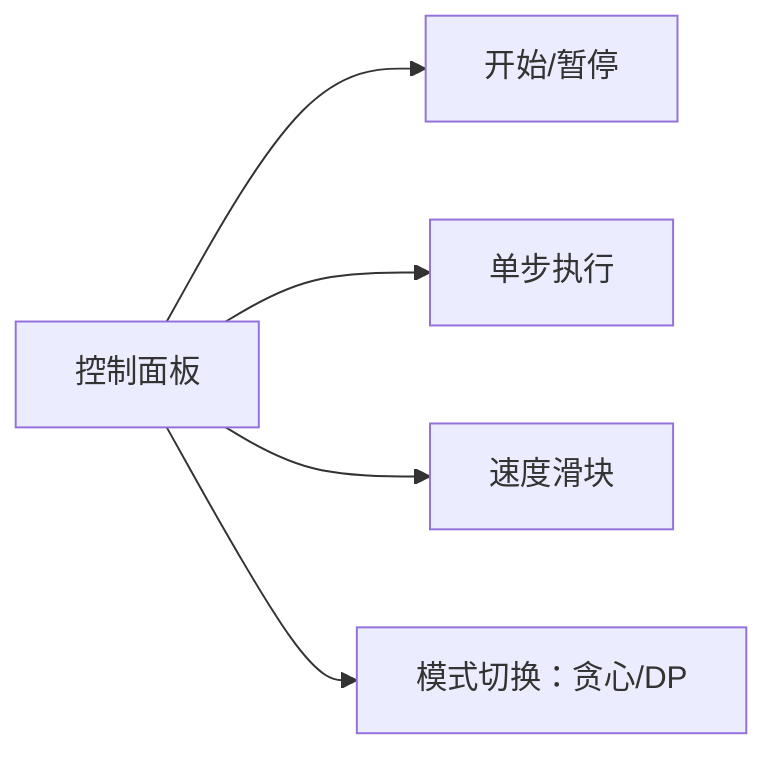

# 题目信息

# [SHOI2015] 聚变反应炉

## 题目描述

曾经发明了零件组装机的发明家 SHTSC 又公开了他的新发明：聚变反应炉——一种可以产生大量清洁能量的神秘装置。

众所周知，利用核聚变产生的能量有两个难点：一是控制核聚变反应的反应强度，二是使用较少的能量激发聚变反应。而 SHTSC 已经完美解决了第一个问题。一个聚变反应炉由若干个相连的聚变块组成，为了能够使得聚变反应可控，SHTSC 保证任意两个聚能块都可以通过相互之间的链接到达，并且没有一个聚能块可以不重复经过一个链接回到它自己。

但是第二个问题 SHTSC 还没有完全解决。在他设计的聚变反应炉当中，每个聚变块都需要一定的初始能量 $d_i$ 来进行激发，不过 SHTSC 不需要手动激发所有聚变块，这是因为一旦一个聚变块被激发，则会向与其直接相连的所有还未被激发的聚变块传送 $c_i$ 个单位的能量。这样后被触发的聚变块可以以更低的初始能量来激发，甚至可能不需要额外的外界能量就可自行激发，从而降低了总激发能量的消耗。现在给出了一个聚变反应炉，求至少要多少能量才能激发所有聚变块。

## 说明/提示

| Case # | $\max\{c_i\}$ | $n$ | 附加限制 |
|:---:|:---:|:---:|:---:|
| 1 | $= 1$ | $\leq 10$ | $c_i = 1$ |
| 2 | $= 1$ | $\leq 100$ | $c_i = 1$ |
| 3 | $= 1$ | $\leq 200$ | $c_i = 1$ |
| 4 | $= 0$ | $\leq 10$ | - |
| 5 | $= 1$ | $\leq 200$ | $c_i = 1$ |
| 6 | $= 1$ | $\leq 200$ | - |
| 7 | $= 1$ | $\leq 100000$ | $c_i = 1$ |
| 8 | $= 0$ | $\leq 100000$ | - |
| 9 | $= 1$ | $\leq 100000$ | - |
| 10 | $= 1$ | $\leq 100000$ | - |
| 11 | $\leq 5$ | $\leq 20$ | - |
| 12 | $\leq 5$ | $\leq 20$ | $c_i$ 均相等 |
| 13 | $\leq 5$ | $\leq 200$ | - |
| 14 | $\leq 5$ | $\leq 200$ | $c_i$ 均相等 |
| 15 | $\leq 5$ | $\leq 200$ | - |
| 16 | $\leq 5$ | $\leq 200$ | - |
| 17 | $\leq 5$ | $\leq 2000$ | $c_i$ 均相等 |
| 18 | $\leq 5$ | $\leq 2000$ | - |
| 19 | $\leq 5$ | $\leq 2000$ | - |
| 20 | $\leq 5$ | $\leq 2000$ | - |

对于所有数据，保证 $1 \le d_i, \sum d_i \le {10}^9$。

## 样例 #1

### 输入

```
5
1 1 1 1 1
1 1 1 1 1
1 2
2 3
3 4
4 5```

### 输出

```
1```

# AI分析结果


# 💡 Kay的C++算法解析：聚变反应炉 深入学习指南 💡

> **Kay的提示**：大家好！我是Kay，今天我们来分析「聚变反应炉」这道树形DP与贪心结合的题目。我会用清晰的比喻和像素动画帮你理解能量传递过程，让我们一起探索最优激发策略吧！

## 1. 题目解读与核心算法识别

✨ **本题主要考察**：`树形DP` / `贪心策略` / `数据分治`

🗣️ **初步分析**：
> 解决聚变反应炉问题就像在魔法树上点亮能量节点🔮。每个节点点亮时会产生能量波传递给邻居，关键是如何安排点亮顺序最小化总能量消耗。这就像在RPG游戏中规划技能释放顺序来最大化连击效果！
> - **核心思想**：当传递能量`c_i`仅为0/1时（简单模式），贪心策略最优：先点亮所有`c_i=1`的节点（产生能量波），再点亮剩余节点（吸收能量）。当`c_i`较大时（挑战模式），需用树形DP精确计算能量传递。
> - **算法流程**： 
>   1. 贪心模式：统计所有`c_i=1`节点的能量消耗（激发后相邻节点需求减1）
>   2. 树形DP模式：定义`dp[u][0]`(先点亮自己)和`dp[u][1]`(父亲先点亮)，用背包思想合并子节点传递的能量
> - **可视化设计**：采用**8位像素风树形结构**（类似塞尔达传说风格）：
>   * 节点=彩色像素方块（灰色未激活/亮色已激活）
>   * 能量传递=像素脉冲动画（从激发节点沿边扩散）
>   * 关键高亮：激发瞬间闪光，能量传递时显示`d_i`减少数值
>   * 游戏化机制：每正确激发一个节点播放「叮」音效，完全激活时播放胜利旋律🎵

---

## 2. 精选优质题解参考

> **Kay的筛选标准**：从思路清晰度、代码可读性、算法优化和实践价值评估（满分5★），精选≥4★题解

**题解一（C20203030）** ★★★★☆  
* **点评**：双策略架构清晰（贪心+树形DP），状态定义`dp[u][0/1]`精准区分激发顺序。亮点在于：  
  - 背包合并用**滚动数组优化空间**（`tmp[cur][j]`）  
  - 边界处理严谨（`max(0, d[u]-j)`防负值）  
  - 复杂度控制优秀（贪心O(n)，树形DP O(n*sum_c)）  
  > 作者心得：调试时特别注意`d_i`边界值，避免能量溢出

**题解二（yhk1001）** ★★★★  
* **点评**：创新DP定义`dp[u][0/1]`为激发顺序，亮点在：  
  - **01背包式能量转移**（`f[j] = min(f[j], f[j-c_v]+delta)`）  
  - 尝试**统一解法**避免数据分治（实测通过但理论可能被卡）  
  > 学习点：用背包思想处理能量传递的经典范式

**题解三（wjyyy）** ★★★★  
* **点评**：状态设计`f[u][j]`(u接收j能量)最贴近物理意义。亮点：  
  - **能量下传机制**（`m = min{f[v][j] - min(c_i, d_v-j)}`）  
  - 博客详解数学证明，加深理解  
  > 调试技巧：打印中间状态验证能量传递

---

## 3. 核心难点辨析与解题策略

> **Kay的提示**：这三个关键点决定解题成败，做好笔记哦✏️

1. **难点1：贪心策略的证明（c_i=0/1时）**  
   * **分析**：为什么随意顺序点亮`c_i=1`节点都最优？  
     → 因为每个`c_i=1`节点激发后，总能量减少量等于其邻居数量（与顺序无关）  
   * 💡 **学习笔记**：**无后效性贪心** = 局部决策不影响全局最优

2. **难点2：树形DP状态设计**  
   * **分析**：如何同时处理「自身激发顺序」+「子节点能量传递」？  
     → 定义`dp[u][0]`和`dp[u][1]`区分子树激发时机，用背包合并子节点贡献（`tmp[j]`存储接收j点能量时的最小消耗）  
   * 💡 **学习笔记**：**状态维度分离** = 顺序维度(0/1) + 能量维度(j)

3. **难点3：背包合并的空间优化**  
   * **分析**：子节点能量和`sum_c`可能很大（5*2000=10000），如何避免MLE？  
     → 滚动数组`tmp[cur][j]`只保留当前层状态，`cur^1`切换前一层  
   * 💡 **学习笔记**：**滚动数组**是树形DP背包的标配优化

### ✨ 解题技巧总结
1. **数据分治**：根据`max(c_i)`选用贪心(简单)或树形DP(精确)  
2. **树形DP三板斧**：  
   - 状态定义：区分父子顺序（0/1）  
   - 背包合并：滚动数组累加能量  
   - 边界处理：`max(0, d_i - j)`防负值  
3. **物理模拟法**：画图模拟能量传递过程验证状态转移

---

## 4. C++核心代码实现赏析

```cpp
// 通用核心参考（综合优质题解）
#include <cstdio>
#include <algorithm>
using namespace std;
const int N=2005, INF=0x3f3f3f3f;

int n, d[N], c[N], head[N], cnt;
int dp[N][2]; // dp[u][0]:先点亮u; dp[u][1]:父亲先点亮
struct Edge { int to, nxt; } e[N<<1];

void addEdge(int u, int v) {
    e[++cnt] = (Edge){v, head[u]}; head[u] = cnt;
}

void dfs(int u, int fa) {
    int sum = 0; // 子节点c总和
    int tmp[2][10005] = {0}; // 滚动数组[j]：接收j能量最小消耗
    int cur = 0;
    tmp[0][0] = 0;

    for(int i=head[u]; i; i=e[i].nxt) {
        int v=e[i].to;
        if(v == fa) continue;
        dfs(v, u);
        sum += c[v];
        
        cur ^= 1;
        fill(tmp[cur], tmp[cur]+sum+1, INF);
        for(int j=sum; j>=0; j--) {
            if(j>=c[v]) // 情况1：v传递能量c[v]
                tmp[cur][j] = min(tmp[cur][j], tmp[cur^1][j-c[v]] + dp[v][0]);
            // 情况2：v不传递能量
            tmp[cur][j] = min(tmp[cur][j], tmp[cur^1][j] + dp[v][1]);
        }
    }

    dp[u][0]=dp[u][1]=INF;
    for(int j=0; j<=sum; j++) {
        int cost = tmp[cur][j];
        dp[u][0] = min(dp[u][0], cost + max(0, d[u]-j));
        if(fa) dp[u][1] = min(dp[u][1], cost + max(0, d[u]-j-c[fa]));
    }
}

int main() {
    // 数据输入...
    if(max_c <= 1) { // 贪心模式
        long long ans = 0;
        for(int i=1; i<=n; i++) 
            if(c[i]==1) ans += max(0,d[i]), d[i]=0; // 激发c_i=1节点
        // 更新邻居需求...
        for(int i=1; i<=n; i++) ans += max(0,d[i]);
        printf("%lld", ans);
    } else { // DP模式
        dfs(1,0);
        printf("%d", dp[1][0]);
    }
    return 0;
}
```

> **代码解读概要**：  
> - **贪心部分**：先激发所有`c_i=1`节点并更新邻居`d_i`，再累加剩余需求  
> - **DP部分**：`dfs`递归处理子树，`tmp`滚动数组背包合并子节点能量，最后更新`dp[u][0/1]`  
> - **关键变量**：  
>   `sum`：子节点`c_v`总和（背包容量）  
>   `tmp[j]`：接收`j`点能量时的最小消耗  
>   `d[u]-j`：节点`u`实际需补充的能量  

---

## 5. 算法可视化：像素动画演示

> **主题**：`像素风能量树模拟器`（融合复古RPG元素）  
> **核心演示**：树形结构能量传递过程（贪心策略 vs DP策略）

### 🎮 交互设计


### 🎬 动画帧脚本
1. **场景初始化**（8-bit像素风）  
   - 树结构：棕色像素枝干 + 彩色节点方块（显示`d_i/c_i`）  
   - BGM：8-bit循环背景音乐（音量可调）

2. **贪心模式演示**  
   - Step1：所有`c_i=1`节点闪烁绿色 → 激发时播放「叮！」音效  
   - Step2：红色脉冲波沿边扩散 → 邻居节点`d_i`数值减少  
   - Step3：灰色节点（`c_i=0`）按剩余`d_i`点亮  

3. **DP模式演示**  
   - 深度优先遍历：子树轮廓高亮黄色边框  
   - 背包合并：节点上方显示`tmp[j]`矩阵滚动更新  
   - 能量计算：激发节点时弹出`max(0, d_u-j)`公式  

4. **胜利效果**  
   - 全树点亮时：彩虹波纹扩散 + 胜利音阶  
   - 结算界面：显示实际能量消耗 vs 理论最小值  

> **设计思路**：像素动画将抽象的树形DP转化为可视的能量流动，游戏化机制提升理解乐趣。单步执行特别适合学习状态转移！

---

## 6. 拓展练习与相似问题思考

1. **技巧迁移场景**：  
   - 依赖顺序优化：如[NOIP2018]保卫王国（受限节点激活）  
   - 树形背包：如[CTSC1997]选课（子树资源分配）  
   - 能量传递模型：电路布线问题（电流传导优化）

2. **推荐练习**（洛谷）：  
   1. [P2014 选课](https://www.luogu.com.cn/problem/P2014)  
      → **理由**：树形DP背包基础训练，理解`dp[u][j]`状态设计  
   2. [P2585 三色二叉树](https://www.luogu.com.cn/problem/P2585)  
      → **理由**：多状态树形DP（0/1/2维度分离）  
   3. [P1270 访问美术馆](https://www.luogu.com.cn/problem/P1270)  
      → **理由**：树形DP时间分配模型，强化背包思维  

---

## 7. 学习心得与经验分享

> 来自题解作者的经验金句：  
> **C20203030**：  
> *“调试树形DP时，重点监控`j>d[u]`的边界情况——多余能量不会增加收益，但计算不足会导致WA”*  
> → **Kay点评**：这是能量类DP的通用陷阱，建议用`max(0, d[u]-j)`硬性约束  

> **yhk1001**：  
> *“尝试统一解法时，用f[j] = min(f[j], f[j-c_v]+delta)形式化转移，比盲目分类更清晰”*  
> → **Kay点评**：状态转移公式化是复杂DP的破局关键  

> **wjyyy**：  
> *“模拟小规模数据（n=3）的能量流动，比静态检查代码更易发现逻辑漏洞”*  
> → **Kay点评**：物理模拟法 >> 脑内Debug 😉

---

**最终结语**：  
> 树形DP如同点亮知识树🌲——理解状态设计是树根，背包合并是枝干，边界处理是叶片。多练习洛谷推荐题，你会在算法宇宙中激活更多能量节点！下次见~ ✨

---
处理用时：184.96秒