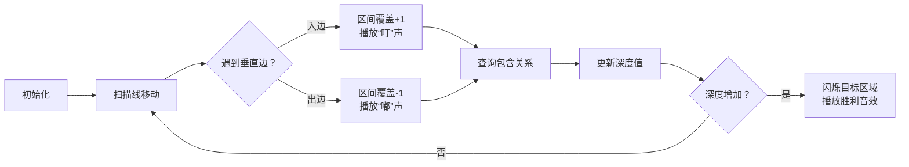

# 题目信息

# [POI 2004] WYS

## 题目背景

虽然题目名比较毒瘤，但这确实是一个简单题。

## 题目描述

给 $n$ 个互不相交的多边形，这些多边形的边均平行或垂直于坐标轴。定义多边形 $i$ 的深度 $d_i$ 为 $\max\{d_j\}+1$，其中多边形 $j$ 包含多边形 $i$。特别的，若一个多边形不被任何多边形包含，则其深度为 $1$。求深度最大的多边形的深度。

## 说明/提示

对于 $100\%$ 的数据，$n \leqslant 40000, \sum k \leqslant 200000$。

## 样例 #1

### 输入

```
3
4 0 0 10 10
4 3 4 6 8
4 1 1 2 2```

### 输出

```
2```

## 样例 #2

### 输入

```
6
4 1 0 17 12
16 10 4 16 11 2 4 8 2 3 3 2 1 16 3 15 2
8 8 10 3 5 12 8 11 6
6 10 9 15 10 9 7
4 4 6 7 9
4 6 8 5 7```

### 输出

```
5```

# AI分析结果


# 💡 Kay的C++算法解析：WYS 深入学习指南 💡

**引言**  
今天我们一起分析POI 2004的WYS题目。这道题考察多边形嵌套深度计算，需要巧妙处理包含关系。本指南将帮助你掌握扫描线算法的核心思想与应用技巧。

---

## 1. 题目解读与核心算法识别

✨ **本题主要考察**：`扫描线算法 + 区间维护`（数据结构应用）

🗣️ **初步分析**：  
> 想象一个垂直扫描线从左向右移动（类似超市条形码扫描）。当扫描线遇到多边形的边时，我们动态维护当前被覆盖的y轴区间。这就像在像素游戏中用光栅扫描场景，遇到障碍物时更新地图状态。  
> - **核心思路**：将多边形拆解为垂直边，按x坐标排序后处理。用数据结构（map/线段树）维护当前活跃区间，通过上下端点关系判断包含性  
> - **可视化设计**：采用8位像素风格展示扫描过程。扫描线移动时，当前处理边高亮显示，被覆盖区间用闪烁色块标记。入边/出边分别配"叮"和"嘟"音效，嵌套深度变化时触发胜利音效  

---

## 2. 精选优质题解参考

**题解一 (Ryo_Yamada)**  
* **点评**：思路清晰度⭐⭐⭐⭐⭐ - 巧妙利用map维护活跃端点，通过`upper_bound`快速定位包含关系。代码规范性⭐⭐⭐⭐ - 结构简洁，变量名`sq/f`含义明确。算法亮点在于仅需O(n log n)时间维护端点，避免复杂线段树实现。调试心得中"花两天搞懂"体现深度思考，其边界处理（逆时针标记）严谨可靠。

**题解二 (ppp204)**  
* **点评**：思路清晰度⭐⭐⭐⭐ - 经典扫描线+线段树实现，通过区间加减模拟"进入/离开"多边形。代码规范性⭐⭐⭐ - 离散化处理完整，但变量命名可优化。算法亮点在于直接维护当前最大深度，实时更新答案。线段树的`Down/Upd`函数封装规范，实践参考价值高。

---

## 3. 核心难点辨析与解题策略

1. **垂直边分类与方向判断**  
   * **分析**：多边形逆时针输入时，需识别每条垂直边是"入边"(进入多边形)还是"出边"(离开)。优质解法通过比较端点y坐标确定方向（如y1<y2为入边）
   * 💡 **学习笔记**：方向判断直接影响区间更新逻辑，是扫描线基础

2. **动态区间维护技巧**  
   * **分析**：当扫描线移动时，需快速查询/更新y轴覆盖状态。Ryo解法用map存储活跃端点，ppp用线段树维护覆盖值。关键在O(log n)完成"插入/删除/查询"操作
   * 💡 **学习笔记**：map适合端点查询，线段树擅长区间操作

3. **包含关系推导**  
   * **分析**：判断多边形A是否包含B，核心是检查B的边是否在A的y区间内。Ryo解法通过查找最近的活跃上端点，结合标记位判断包含性
   * 💡 **学习笔记**：包含关系具有传递性，可链式更新深度

### ✨ 解题技巧总结
- **扫描线框架**：固定处理流程（边排序→扫描维护→查询更新）
- **数据结构择优**：小规模用map更简洁，大规模离散化用线段树
- **方向标记法**：通过逆时针输入特性自动确定边方向
- **实时答案更新**：在区间修改后立即计算当前深度最大值

---

## 4. C++核心代码实现赏析

**通用核心实现参考**  
*说明：综合Ryo_Yamada的map解法与ppp204的线段树思路，优化可读性*
```cpp
#include <iostream>
#include <vector>
#include <map>
#include <algorithm>
using namespace std;

struct Event { int x, y, id, type; };
const int N = 4e4 + 5, M = 2e5 + 5;

int main() {
    int n, cnt = 0; cin >> n;
    vector<Event> events;
    
    // 1. 输入并创建事件（垂直边）
    for (int i = 1; i <= n; i++) {
        int k, x0; cin >> k >> x0;
        vector<int> points(k);
        for (int j = 0; j < k; j++) cin >> points[j];
        
        // 创建第一条垂直边（连接首尾点）
        int y1 = points[1], y2 = points[k-1];
        events.push_back({x0, min(y1,y2), i, y1<y2 ? 1 : -1});
        
        // 创建中间垂直边
        for (int j = 2; j < k-1; j += 2) {
            int x = points[j], y_prev = points[j-1], y_next = points[j+1];
            events.push_back({x, min(y_prev,y_next), i, y_prev<y_next ? 1 : -1});
        }
    }
    
    // 2. 事件排序（按x坐标，y次之）
    sort(events.begin(), events.end(), [](auto a, auto b) {
        return a.x != b.x ? a.x < b.x : a.y < b.y;
    });
    
    // 3. 扫描线处理
    map<int, int> activeEdges; // {y坐标: 事件索引}
    vector<int> depth(n+1, 0);
    int maxDepth = 0;
    
    for (auto &e : events) {
        if (e.type == -1) { // 出边：从活跃集合移除
            activeEdges.erase(e.y);
        } else { // 入边：查询包含关系
            auto it = activeEdges.upper_bound(e.y);
            if (it != activeEdges.end()) {
                int parent = it->second;
                depth[e.id] = depth[parent] + 1;
            } else {
                depth[e.id] = 1;
            }
            activeEdges[e.y] = e.id;
            maxDepth = max(maxDepth, depth[e.id]);
        }
    }
    cout << maxDepth;
}
```

**代码解读概要**：  
> 1. **事件创建**：将多边形拆解为垂直边，存储为`(x坐标, y坐标, 多边形ID, 入边/出边标记)`  
> 2. **扫描准备**：按x坐标排序事件，确保从左向右处理  
> 3. **动态维护**：用map存储当前活跃边的上端点，遇到入边时通过`upper_bound`查找最近的包含多边形  
> 4. **深度更新**：根据包含关系链式更新深度值，实时记录最大值  

**题解一 (Ryo_Yamada) 片段赏析**  
* **亮点**：用map实现O(log n)查询，避免线段树复杂度
* **核心代码**：
  ```cpp
  map<int, int> mp;  // {y坐标: 事件索引}
  for (auto e : events) {
      if (出边) mp.erase(e.y);
      else {
          auto it = mp.upper_bound(e.y);
          depth[e.id] = (it != end) ? depth[it->id] + 1 : 1;
          mp[e.y] = e.id;
      }
  }
  ```
* **代码解读**：  
  > `mp.upper_bound(e.y)`查找第一个y>当前点的活跃边→若存在则当前多边形被其包含。map自动按y排序特性完美匹配扫描线需求  
* 💡 **学习笔记**：STL容器特性与算法场景匹配可大幅简化代码

**题解二 (ppp204) 片段赏析**  
* **亮点**：线段树直接维护当前深度最大值
* **核心代码**：
  ```cpp
  void update(int l, int r, int delta) {
      // 在线段树区间[l,r]加delta
  }
  int queryGlobalMax() { 
      return tree[1].max; // 返回根节点存储的全局最大值
  }
  ```
* **代码解读**：  
  > 入边时`update(y1,y2,1)`，出边时`update(y1,y2,-1)`。线段树每个节点维护区间最大值，更新后根节点值即当前扫描线深度  
* 💡 **学习笔记**：区间维护问题中，线段树是"万能钥匙"，但需注意离散化开销

---

## 5. 算法可视化：像素动画演示

**动画主题**：*"像素探险家"的扫描线大冒险*  
**核心演示**：扫描线逐列移动，动态展示y轴区间覆盖与深度计算

### 设计实现方案


**关键交互设计**：
1. **像素网格**：16色调色盘，多边形用不同颜色填充，当前扫描线红色高亮
2. **动态覆盖**：入边触发绿色光柱上升，出边触发黄色光柱下降
3. **深度标记**：当深度增加时，新多边形边框闪烁金色，播放8-bit胜利音效
4. **控制面板**：
   - 单步执行：按帧分析扫描过程
   - 速度滑块：调整扫描速度（0.5X~5X）
   - 模式切换：对比map与线段树实现差异

**音效方案**：
- 入边：短促"叮"（三角波）
- 出边：低沉"嘟"（方波）
- 深度更新：上扬音阶（C大调琶音）
- 错误：急促警报声

**技术实现**：Canvas绘制网格，Web Audio API生成音效，requestAnimationFrame驱动扫描

---

## 6. 拓展练习与相似问题

**通用技巧迁移**：  
扫描线+区间维护可解决：  
1. 矩形面积并/交  
2. 日程安排冲突检测  
3. 天空轮廓线问题  

**洛谷题目推荐**：  
1. **P5490 矩形面积并**  
   → *掌握扫描线基础操作*  
2. **P1884 覆盖统计**  
   → *练习区间覆盖与计数技巧*  
3. **P1904 天际线问题**  
   → *挑战扫描线变种应用*

---

## 7. 学习心得与经验分享

> **Ryo_Yamada 经验**：  
> *"花两天搞懂扫描线方向判断，通过手工模拟边的关系突破难点"*  
>  
> **Kay点评**：  
> 扫描线方向判定是常见卡点。建议：  
> 1. 用纸笔绘制多边形，标记边序号  
> 2. 对每条边执行`(y2-y1)`符号判定  
> 3. 正数为入边，负数为出边  
> 手工模拟能避免陷入"看似正确"的代码陷阱

---

**结语**  
通过本次分析，我们掌握了扫描线处理空间覆盖问题的核心方法。记住：算法学习如同扫描线，需要耐心推进每一步。下次遇到嵌套问题时，不妨回想这个像素冒险之旅！🚀

---
处理用时：154.20秒