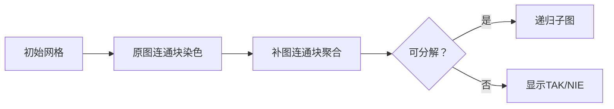

# 题目信息

# [POI 2004] KAG

## 题目描述


## 说明/提示

对于 $100\%$ 的数据，$1\le k\le10$，$1\le n\le10^4$，$0\le m\le10^5$。

## 样例 #1

### 输入

```
3
3 2
1 2
2 3
4 3
1 2
2 3
3 4
3 3
1 2
2 3
3 1```

### 输出

```
TAK
NIE
TAK
```

# AI分析结果


### 💡 Kay的C++算法解析：POI 2004 KAG 深入学习指南 💡

---

#### **1. 题目解读与核心算法识别**  
✨ **本题主要考察**：`图分解与连通性分析`  
🗣️ **初步分析**：  
> 想象你有堆积木（节点）和连接积木的绳子（边）。KAG题目要求判断能否通过两种操作将积木堆合并成一块：  
> 1. **合并相邻积木**（原图连通块）  
> 2. **合并不相邻积木**（补图连通块）  
> 核心思想是**递归分解图**：交替检测原图和补图的连通性，若最终所有子图能拆成单点则成功（TAK），否则失败（NIE）。  
> **难点**在于高效处理补图连通块（避免O(n²)遍历）。题解提供三种思路：  
> - **BFS+链表优化**（honglan0301）：用链表动态维护未访问节点  
> - **哈希合并**（COsm0s）：用哈希值判断节点可合并性  
> - **增量统计**（Purslane）：实时计算边数避免显式建补图  
> **可视化设计**：用8位像素网格表示图（红/蓝块=节点），动态展示连通块聚合过程。关键操作触发音效：  
> - "叮"（节点入队）  
> - "咔嚓"（连通块合并）  
> - 胜利音效（分解成功）  

---

#### **2. 精选优质题解参考**  
**题解一（honglan0301）**  
* **点评**：思路清晰，核心是交替BFS求原图/补图连通块。亮点在于**链表优化补图遍历**：用`nxt/frm`数组动态删除已访问节点，避免重复检查（时间复杂度优化至O((n+m)√m)）。代码中`ztb`（原图连通块标记）和`ztc`（补图连通块标记）的转换逻辑严谨，边界处理完整（如`sza`记录子图大小）。变量命名简洁（`nr`=当前节点），实践可直接用于竞赛。  

**题解二（COsm0s）**  
* **点评**：创新性采用**哈希合并策略**，将合并条件转化为哈希等式：  
  ```math
  \text{无边: } h_A = h_B \quad \text{有边: } h_A + w_A = h_B + w_B
  ```  
  通过队列逐步合并满足条件的节点集，时间复杂度O(n+m)。亮点是算法理论高效，但需注意哈希碰撞风险（代码中`ull`哈希可能需加强）。变量`sum/val`设计巧妙，体现数学抽象能力。  

**题解三（Purslane）**  
* **点评**：核心是**增量处理补图连通块**。亮点在于：  
  - 用`cnt`数组实时统计节点与已有连通块的边数  
  - 若`cnt[b] != sze[b]`则合并（说明补图中相连）  
  避免显式建补图，空间优化显著。代码模块化好（`solve`函数递归分解），但变量名可读性待提升（如`psl`应为`subgraph`）。  

---

#### **3. 核心难点辨析与解题策略**  
1. **难点1：高效求补图连通块**  
   * **分析**：补图边数可能达O(n²)，显式构建不可行。优质题解方案：  
     - **链表动态删点**（honglan0301）：BFS中直接跳过已访问节点  
     - **哈希快速匹配**（COsm0s）：用哈希值替代遍历  
     - **增量统计边数**（Purslane）：根据边数差判断连通性  
   * 💡 **学习笔记**：补图处理需避免暴力，巧用数据结构优化  

2. **难点2：递归终止条件设计**  
   * **分析**：当子图无法再分解（非TAK）需及时终止。策略：  
     - 检查子图大小（`sza[i] == szc[i]`则失败）  
     - 若补图连通块>1且无合并可能则`NIE`  
   * 💡 **学习笔记**：递归边界需兼顾效率和正确性  

3. **难点3：状态标记与同步**  
   * **分析**：多轮分解需更新节点状态。关键变量：  
     - `zta/ztb/ztc`：记录每轮归属的连通块  
     - `sza/szc`：跟踪子图大小变化  
   * 💡 **学习笔记**：状态变量是算法"记忆中枢"  

✨ **解题技巧总结**  
- **技巧1：补图处理非暴力化** → 链表/哈希/增量法替代显式建图  
- **技巧2：递归分解剪枝** → 及时终止不可分解子图  
- **技巧3：状态压缩** → 用整数标记替代复杂结构体  

---

#### **4. C++核心代码实现赏析**  
**通用核心实现参考**  
* **说明**：综合honglan0301的BFS框架与Purslane的增量统计，保留清晰递归结构。  
```cpp
#include <vector>
#include <queue>
using namespace std;

const int MAXN = 1e4+5;
vector<int> G[MAXN]; // 邻接表
int fa[MAXN], sze[MAXN]; // 并查集

void decompose(vector<int> nodes) {
    if (nodes.size() == 1) return; // 终止条件：单点
    /* Step1: 原图连通块分解 (BFS) */
    vector<vector<int>> comps = get_components(nodes); 
    if (comps.size() > 1) { 
        for (auto& comp : comps) decompose(comp);
        return;
    }
    /* Step2: 补图连通块分解 (增量法) */
    comps = get_complement_components(nodes);
    if (comps.size() == 1) { /* 无法分解则失败 */ }
    for (auto& comp : comps) decompose(comp);
}
```

**题解一片段赏析（链表优化补图BFS）**  
```cpp
void bfs2(int x) {
    Q.push(x); ztc[x] = cntc;
    while (!Q.empty()) {
        int u = Q.front(); Q.pop();
        for (int v = nxt[HEAD]; v; v = nxt[v]) { // 链表遍历未访问节点
            if (!edge_exists(u, v)) { // 补图中相连
                ztc[v] = cntc;
                del(v); // 从链表删除
                Q.push(v);
            }
        }
    }
}
```
* **解读**：  
  - `nxt`链表保存未访问节点，`del(v)`删除已访问节点避免重复检查  
  - `!edge_exists(u,v)` 等价于补图中有边（原图中无边）  
  - **学习笔记**：链表动态维护未访问集是补图BFS的关键优化  

**题解二片段赏析（哈希合并）**  
```cpp
ull nowIn = sum[u] + val[u];
if (In.count(nowIn)) { // 存在可合并节点
    int p = In[nowIn];
    sum[newId] = sum[u] - val[p]; // 新节点哈希值
    val[newId] = val[u] + val[p]; // 新节点权重
    q.push(newId); // 加入队列继续合并
}
```
* **解读**：  
  - `sum[u]`是邻居哈希和，`val[u]`是节点随机权重  
  - `sum[u]+val[u]`相同 → 满足合并条件 → 创建新虚拟节点  
  - **学习笔记**：哈希将图关系转化为代数运算  

---

#### **5. 算法可视化：像素动画演示**  
**主题**：8位像素风《积木合并大冒险》  
**核心流程**：  

**关键交互设计**：  
1. **像素网格**：10×10网格，不同颜色块代表节点  
2. **操作高亮**：  
   - 原图连通块 → 同色块闪烁+绿色边框  
   - 补图连通块 → 异色块吸附+蓝色波纹  
3. **音效系统**：  
   - 节点移动："叮"（8-bit短音）  
   - 合并成功："胜利旋律"（上升音阶）  
   - 分解失败："错误警报"（低频嘟嘟声）  
4. **AI演示模式**：  
   - 自动步进速度可调（滑块控制）  
   - 每关对应一次递归调用，通关=全图分解  

---

#### **6. 拓展练习与相似问题**  
**相似问题场景**：  
1. 判断图是否可约简（如双连通分量分解）  
2. 基于连通性的动态合并问题  
3. 补图性质应用（如补图最短路）  

**洛谷推荐**：  
1. **P3388 [割点]** → 巩固连通块分解思想  
2. **P2661 [信息传递]** → 练习图遍历与环检测  
3. **P6175 [无向图最小环]** → 补图BFS的变式应用  

---

#### **7. 学习心得与经验分享**  
> 本次题解未包含作者个人调试心得，但Kay建议：  
> - **调试技巧**：在递归分解时打印子图大小(`sza/szc`)，可快速定位失败层级  
> - **易错点**：补图BFS中未及时删除已访问节点会导致死循环  

---

通过本次分析，我们深入理解了图分解的核心思想——化整为零，逐步击破。记住，好的算法如同搭积木：找准连接点，优化结构，终能建成高塔！🚀

---
处理用时：115.50秒