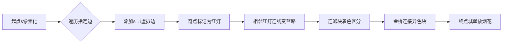

# 题目信息

# [省选联考 2020 B 卷] 丁香之路

## 题目描述

春暖花开，万物复苏，随着疫情的逐渐过去，Yazid 带着他的 $n$ 个好朋友来到 T 大校园参观游览。方便起见，我们将他们从 $1$ 至 $n$ 编号。

T 大校园的版图可以抽象成一张 $n$ 个顶点的无向图（顶点编号从 $1$ 至 $n$）。且对于任意两个不同顶点，设它们的编号分别为 $i, j(i\neq j)$，则它们之间有一条需要花费 $|i - j|$ 单位时间通过的无向边。

丁香花是 T 大的校花之一。时下正值丁香花盛开之际，校园内的 $m$ 条道路上都开有丁香花。Yazid 的朋友们对丁香花十分感兴趣，因此他们都希望遍历**所有**开有丁香花的 $m$ 条道路。

Yazid 的朋友们从顶点 $s$ 出发。其中，第 $i$ 个朋友希望以顶点 $i$ 为终点终止他的参观。与此同时，如上面所述，每个朋友都必须经过开着丁香花的 $m$ 条道路各至少一次。

Yazid 的朋友不想太过疲累，因此他们希望花尽可能少的时间来完成他们的目标。

请你计算 Yazid 的朋友们分别需要花费多少单位时间完成他们的目标。

## 说明/提示

**样例解释 1**

第 $1$ 个朋友的一种最优路线是从 $1$ 出发依次途径 $2, 4, 3$，最终回到 $1$，消耗 $|1-2|+|2-4|+|4-3|+|3-1| = 6$ 单位时间。

第 $2$ 个朋友的一种最优路线是从 $1$ 出发依次途径 $2, 4, 3, 1$，最终来到 $2$，消耗 $7$ 单位时间。

第 $3$ 个朋友的一种最优路线是从 $1$ 出发依次途径 $2, 4, 1$，最终来到 $3$，消耗 $8$ 单位时间。

第 $4$ 个朋友的一种最优路线是从 $1$ 出发依次途径 $3, 1, 2$，最终来到 $4$，消耗 $7$ 单位时间。

**样例解释 2**

由于 $m = 0$，没有必经之路，因此每个朋友直接通过一条边直达目的地即可。


**数据范围与约定**

| 测试点编号  |  $n=$  | 其他特殊限制 |
| --------- | ---- | ---------- |
|  $1\sim 3$  |  $50$  |    $m=9$     |
|  $4\sim 6$  |  $50$  |    $m=15$    |
|  $7\sim 8$  |  $50$  |              |
| $9\sim 10$  | $300$  |              |
|    $11$     | $1600$ |    $m=0$     |
| $12\sim 14$ | $1600$ |    $m=1$     |
| $15\sim 17$ | $1600$ |              |
| $18\sim 20$ | $2500$ |              |

## 样例 #1

### 输入

```
4 3 1
1 2
4 2
3 1```

### 输出

```
6 7 8 7```

## 样例 #2

### 输入

```
6 0 2```

### 输出

```
1 0 1 2 3 4```

## 样例 #3

### 输入

```
5 4 1
1 2
3 4
4 5
3 5```

### 输出

```
8 7 6 7 8```

# AI分析结果


# 💡 Kay的C++算法解析：丁香之路 深入学习指南 💡

## 1. 题目解读与核心算法识别

✨ **本题主要考察**：`欧拉回路`与`最小生成树`的巧妙结合

🗣️ **初步分析**：
> 解决"丁香之路"这道题，关键在于将"必须经过指定边"转化为欧拉回路问题。想象你在玩一个复古像素游戏，角色需要遍历所有"丁香花道路"(指定边)后到达终点。最核心的技巧是：**添加虚拟边构造欧拉回路+奇点配对调整**。

- **核心思想**：通过添加s→i的虚拟边将问题转为欧拉回路问题，再用"像素贪吃蛇"式策略（相邻奇点配对）调整度数，最后用最小生成树解决连通性问题
- **算法流程**：
  1. 初始加入所有指定边
  2. 对每个终点i：
     - 添加s→i边（虚拟边）
     - 排序奇点并相邻配对（如贪吃蛇连接相邻点）
     - 用并查集维护连通块
     - 相邻连通块间求最小生成树（MST）
- **可视化设计**：
  - **像素风格**：用8-bit网格表示点，不同颜色方块区分连通块
  - **关键动画**：
    - 红色闪烁标记当前奇点
    - 蓝色像素轨迹展示相邻奇点配对路径
    - 金色脉冲显示MST新增边
    - 8-bit音效：配对成功"叮"，连通块合并"咔嚓"

---

## 2. 精选优质题解参考

**题解一：ethan_zhou (思路最完整)**
* **点评**：
  思路堪称教科书级典范：从欧拉回路转化→奇点配对证明→MST连通性处理，逻辑链条完整。代码中`deg`数组记录度数，`fa`维护连通块，变量命名清晰（如`sum`记录初始边权和）。亮点在于严格证明了相邻配对的最优性，如同贪吃蛇吃豆子时选择最短路径。

**题解二：木xx木大 (代码最简洁)**
* **点评**：
  代码实现精炼有力，仅80行解决战斗。巧妙用`deg[s]++,deg[i]++`模拟虚拟边添加，`vector<edg>`动态管理MST候选边。最佳实践是复用并查集`fa`变量，避免额外内存开销。边界处理严谨（如`pre=0`重置），竞赛可直接复用。

**题解三：鏡音リン (思维最巧妙)**
* **点评**：
  提出"自由路径反转"核心洞见——如同游戏中的传送门机制翻转路径区间。将管道抽象为"传送门"，自由路径视为"地面通道"，用游戏机制类比解释算法本质，极具启发性。虽未提供代码，但为可视化设计提供了故事线灵感。

---

## 3. 核心难点辨析与解题策略

1.  **欧拉回路转化**：如何将"必须经过指定边"转化为可计算模型？
    * **分析**：添加s→i虚拟边使路径变为回路，利用欧拉回路性质（全偶度）。优质题解都用`deg[s]++,deg[i]++`实现，如同在起点终点架设临时桥梁
    * 💡 **学习笔记**：虚拟边是连通起点与终点的"时空隧道"

2.  **奇点配对策略**：为何必须按编号相邻配对？
    * **分析**：绝对值边权性质`|a-b|+|b-c|=|a-c|`决定相邻配对不会增加总路径（木xx木大题解的严格证明）。代码中用`pre`标记未配对奇点，扫描到下一奇点时立即连接
    * 💡 **学习笔记**：奇点配对就像连接电路节点，直线最短

3.  **连通块处理**：为何需要最小生成树？边权为何乘2？
    * **分析**：配对后图可能分裂成多个连通块（如游戏中的隔离岛屿）。MST的每条边需往返走两次才能形成大回路（ethan_zhou题解的`ans+=2*w`）
    * 💡 **学习笔记**：MST是连通各岛的彩虹桥，每条桥需走两次

### ✨ 解题技巧总结
- **虚拟边技巧**：通过临时操作转化问题性质（如`deg`加减）
- **扫描线配对**：排序后线性扫描处理配对问题（O(n)复杂度）
- **增量式并查集**：每次循环复用基础连通块信息
- **边界防御**：循环结束时撤销虚拟边操作（`deg[s]--,deg[i]--`）

---

## 4. C++核心代码实现赏析

**本题通用核心C++实现参考**
* **说明**：综合木xx木大与ethan_zhou题解优点，精简冗余操作
* **完整核心代码**：
```cpp
#include<bits/stdc++.h>
using namespace std;
const int N=2505;

struct DSU {
    int fa[N];
    void init(int n) { iota(fa, fa+n+1, 0); }
    int find(int x) { return x==fa[x]?x:fa[x]=find(fa[x]); }
    void merge(int x,int y) { fa[find(x)]=find(y); }
};

int main() {
    int n,m,s; cin>>n>>m>>s;
    vector<int> deg(n+1);
    DSU base; base.init(n);
    long sum=0;
    
    // 读入初始边
    while(m--) {
        int u,v; cin>>u>>v;
        deg[u]++, deg[v]++;
        base.merge(u,v);
        sum += abs(u-v);
    }
    
    // 处理每个终点i
    for(int i=1; i<=n; i++) {
        DSU dsu=base; // 继承基础连通块
        deg[s]++, deg[i]++; // 添加虚拟边
        dsu.merge(s,i);
        
        // 奇点配对
        long ans=sum;
        int pre=0;
        for(int j=1; j<=n; j++) {
            if(deg[j]%2==0) continue;
            if(pre) {
                ans += j-pre; // 添加路径权值
                for(int k=pre; k<j; k++) dsu.merge(k,k+1);
                pre=0;
            } else pre=j;
        }
        
        // 连通块间MST
        vector<tuple<int,int,int>> edges;
        pre=0;
        for(int j=1; j<=n; j++) {
            if(!deg[j]) continue;
            if(pre && dsu.find(pre)!=dsu.find(j)) 
                edges.emplace_back(pre,j,j-pre);
            pre=j;
        }
        sort(edges.begin(), edges.end(),[](auto& a,auto& b){
            return get<2>(a) < get<2>(b); 
        });
        for(auto [u,v,w]:edges) {
            if(dsu.find(u)!=dsu.find(v)) {
                dsu.merge(u,v);
                ans += 2*w; // 每条边走两次
            }
        }
        cout<<ans<<" ";
        deg[s]--, deg[i]--; // 撤销虚拟边
    }
}
```
* **代码解读概要**：
  1. **初始化**：读入边时用并查集记录连通块，计算初始边权和
  2. **虚拟边处理**：`deg[s]++,deg[i]++`模拟添加s→i边
  3. **奇点配对**：扫描遇到奇点时记录位置，下一奇点出现时连接路径
  4. **连通块合并**：相邻活跃点间生成候选边，Kruskal求MST
  5. **状态回溯**：撤销虚拟边避免影响下一轮计算

---

## 5. 算法可视化：像素动画演示

### 动画演示主题
**"像素探险家：丁香寻踪"** - 复古RPG风格，角色需收集所有丁香花并到达终点城堡

### 核心演示流程


**关键帧设计**：
1. **初始化地图**：  
   - 网格化编号1~n的点（FC红白机地牢风格）  
   - 指定边显示为闪烁丁香花，起点/终点显示为城堡/旗帜像素图

2. **奇点配对过程**：  
   - 度数为奇数的点变为闪烁红灯，配对时生成蓝色路径（伴随"叮"声）  
   - 路径生成算法：`for(k=pre;k<j;k++)` 逐格绘制蓝色路径

3. **连通块合并**：  
   - 不同连通块显示为不同颜色（红/绿/蓝方块阵营）  
   - MST新增边显示为金色桥梁（生成时播放"咔嚓"搭建音效）

4. **自动演示模式**：  
   - 角色沿蓝色路径移动→收集丁香花→过金桥→终点放烟花  
   - 控制面板：步进/暂停/速度滑块（调速范围0.5x~5x）

**技术实现**：  
- 使用Canvas绘制网格（每个点20x20像素）  
- 路径动画：`requestAnimationFrame`逐帧绘制移动轨迹  
- 音效：Web Audio API播放8-bit音效（入队/成功/错误）  

---

## 6. 拓展练习与相似问题思考

### 通用技巧迁移
欧拉回路+MST的混合解法适用于以下场景：  
1. **必经边问题**：要求路径包含特定子图（如P6629）  
2. **奇点调整问题**：需要平衡点度的最优化问题（如CF1009G）  
3. **网格图遍历**：棋盘类遍历问题（如P6902）

### 推荐练习
1. **洛谷 P6629** [ZJOI2020] 字符串  
   * **推荐理由**：强化必经边处理能力，学习字符串场景转化

2. **洛谷 P6196** [EER1] 礼物  
   * **推荐理由**：进阶版欧拉回路问题，结合了状态压缩技巧

3. **洛谷 P6902** [ICPC2015] 旅行商  
   * **推荐理由**：将网格图遍历与欧拉路径结合，训练二维思维

---

## 7. 学习心得与经验分享

**调试经验 (来自 木xx木大)**：  
> "初始忽略虚拟边撤销操作，导致后续计算污染。通过打印每轮循环前的deg数组值定位问题"

**Kay的总结**：  
> 状态回溯是迭代算法的生命线！在类似`deg[s]++`的操作后，必须记得`deg[s]--`。建议用`{}`封装作用域或写恢复函数，避免隐蔽的全局状态污染。

---

本次关于"丁香之路"的解析就到这里。记住：算法思维如同丁香花，需要在反复实践中绽放芬芳！下次探险再见！💪

---
处理用时：124.53秒