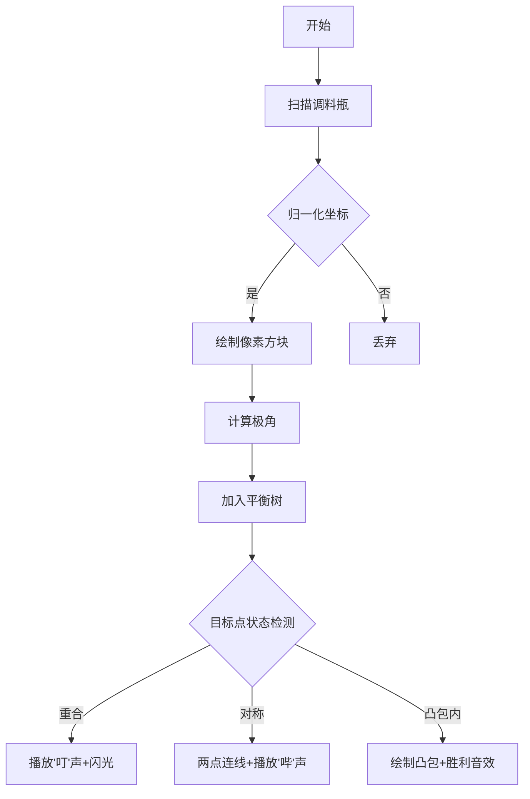

# 题目信息

# [BalticOI 2020] 混合调料 (Day1)

## 题目描述

著名餐厅 *Salt, Pepper & Garlic* 的主厨 Serge 准备好成为一名米其林一星厨师。他已被告知，今晚一位秘密评审员将光临他的餐厅。

虽然他并没有得知这位评审员的姓名，但他已经得知了这位评审员将要点的菜和他的口味偏好。具体来说，这位评审员希望在菜肴中加入非常精确比例的盐，胡椒粉和大蒜粉。

Serge 在厨房的一个架子上放了若干盐，胡椒粉和大蒜粉的混合调料瓶。对于每种调料瓶，Serge 都知道该调料瓶中混合的盐，胡椒粉和大蒜粉的量（单位为千克），他可以通过将任意多瓶调料混合起来（当然也可以单独使用一瓶调料），得到所需比例的调料。

事实上菜肴里放的调料量并不多，因此可以认为调料的量是足够的。但是，评审员要求的盐，胡椒粉和大蒜粉的量之比中的数字可能非常大。

现在 Serge 想要求出，是否能够利用已有的调料瓶配制出满足评审员要求比例的调料？如果能够配制，最少需用多少个瓶子？

此外，Serge 可能会拿到新的调料瓶，或者将架子上已有的调料瓶给其他厨师，这意味着架子上的瓶子种类会不断发生改变，Serge 希望在每次架子上的调料瓶发生变化后，再解决上面的问题。

举个例子，假如评审员要求的盐，胡椒粉和大蒜粉的量的比例为 $1:1:1$，架子上有以下几种调料瓶：

| 调料瓶编号 |  盐  | 胡椒粉 | 大蒜粉 |
| :--------: | :--: | :----: | :----: |
|     1      |  10  |   20   |   30   |
|     2      | 300  |  200   |  100   |
|     3      |  12  |   15   |   27   |

则只需将瓶子 $1$ 中的全部调料，和瓶子 $2$ 中的 $60$ 千克调料（其中包括盐 $30$ 千克，胡椒粉 $20$ 千克，大蒜粉 $10$ 千克）混合即可满足要求。一旦取走瓶子 $2$，则无法满足评审员的要求。

## 说明/提示

所有数据均满足：$1 \leq N \leq 10^5$，$S_f,P_f,G_f \geq 0$，$0 \lt S_f+P_f+G_f \leq 10^6$，$S_i,P_i,G_i \geq 0$，$0 \lt S_i+P_i+G_i \leq 10^6$。

- 子任务 1（13 分）：$N \leq 50$，$0 \lt S_i+P_i+G_i \leq 10^2$；
- 子任务 2（17 分）：$N \leq 500$，$0 \lt S_i+P_i+G_i \leq 10^3$；
- 子任务 3（30 分）：$N \leq 5000$，$0 \lt S_i+P_i+G_i \leq 10^4$；
- 子任务 4（40 分）：无特殊限制。

## 样例 #1

### 输入

```
1 2 3
6
A 5 6 7
A 3 10 17
R 1
A 15 18 21
A 5 10 15
R 3
```

### 输出

```
0
2
0
2
1
1
```

# AI分析结果


# 💡 Kay的C++算法解析：混合调料 深入学习指南 💡

## 1. 题目解读与核心算法识别

✨ **本题主要考察**：`几何+数据结构应用` (编程技巧应用)

🗣️ **初步分析**：
> 这道题就像在厨房里调制完美比例的调味料！我们需要判断能否用1-3瓶调料混合出评审员要求的比例。关键在于将每个调料瓶转化为平面坐标系中的点（通过归一化处理），然后用几何方法判断目标点位置。

- **核心思路**：将每个瓶子(S,P,G)转化为点( S/(S+P+G), P/(S+P+G) )，目标点同理。答案≤3的突破点在于：三点可构成凸包覆盖目标点
- **算法流程**：
  1. 归一化计算每个瓶子的坐标
  2. 维护瓶子的极角集合（用平衡树）
  3. 动态判断：重合点？对称点？凸包内？
- **可视化设计**：采用8位厨房模拟风格！调料瓶显示为像素方块，目标点为闪烁星标。添加"叮"（重合）、"哔"（对称）音效，凸包形成时播放胜利旋律

---

## 2. 精选优质题解参考

**题解（来源：7KByte）**
* **点评**：这份题解思路惊艳——将调料比例转化为几何问题！亮点在于：
  - **几何抽象**：三言两语点明"答案≤3"的核心原理（凸包覆盖）
  - **数据结构**：用平衡树维护极角，高效处理动态增删（O(logN)复杂度）
  - **精度处理**：巧妙使用eps解决浮点精度问题
  - **代码规范**：变量名清晰（s0/s1/s），边界处理严谨
  - **实战价值**：可直接用于OI竞赛，尤其40分无限制子任务

---

## 3. 核心难点辨析与解题策略

1.  **归一化转化难点**
    * **分析**：需将(S,P,G)转为( S/(S+P+G), P/(S+P+G) )，但浮点精度易出错
    * 💡 **学习笔记**：使用eps=1e-15处理浮点比较，避免精度陷阱

2.  **对称点判断难点**
    * **分析**：判断是否存在两点与目标点共线（角度差π）
    * 💡 **学习笔记**：维护极角集合时同步检查rev(ang)=ang±π是否存在

3.  **凸包内部判断难点**
    * **分析**：目标点在凸包内 ⟺ 相邻极角差≤π
    * 💡 **学习笔记**：通过极角排序，检查首尾角度差即可判断凸包覆盖

### ✨ 解题技巧总结
- **几何抽象技巧**：将比例问题转化为平面点关系
- **极角维护技巧**：用multiset实现平衡树功能
- **浮点处理技巧**：统一使用atan2计算角度，避免象限错误
- **状态压缩技巧**：用s0/s1/s三个变量浓缩所有判断条件

---

## 4. C++核心代码实现赏析

**本题通用核心C++实现参考**
```cpp
#include<bits/stdc++.h>
#define rep(i,a,b) for(int i=a;i<=b;i++)
#define N 100005
using namespace std;
/* 归一化目标点 */
db st = (db)a[0]/(a[0]+b[0]+c[0]), ed = (db)b[0]/(a[0]+b[0]+c[0]);

/* 关键函数：计算点相对目标点的极角 */
db calc(db x, db y){
    db cur = atan2(x - st, y - ed); // 精确计算角度
    if(cur < 0) cur += 2*M_PI;      // 转为[0,2π)
    return cur;
}

/* 动态更新函数 */
void ins(int i){
    db x = (db)a[i]/(a[i]+b[i]+c[i]);
    db y = (db)b[i]/(a[i]+b[i]+c[i]);
    if(fabs(x-st)<=eps && fabs(y-ed)<=eps) s0++; // 重合点计数
    else {
        db ang = calc(x, y);
        if(s.find(rev(ang)) != s.end()) s1++; // 对称点检测
        s.insert(ang);
    }
}
```

**题解核心代码解析**
```cpp
// 极角排序后的凸包判断
if(s.size() < 3) puts("0");
else if((*s.rbegin() - *s.begin()) < M_PI) puts("0"); 
else if((*s.lower_bound(M_PI) - *(--s.upper_bound(M_PI))) > M_PI) puts("0");
else puts("3");
```
* **代码解读**：
  1. `s.rbegin()/s.begin()`：获取极角最大/最小值
  2. 差值`<π`说明所有点在半平面内 → 目标点必在凸包外
  3. 在π附近查找间隙，无间隙则目标点在凸包内
* 💡 **学习笔记**：凸包判断转化为极角区间连续性检测，复杂度O(1)

---

## 5. 算法可视化：像素动画演示

* **主题**：《8位厨房大师》像素烹饪模拟
* **核心演示**：动态展示点与凸包关系

**动画设计**：


**交互功能**：
1. **控制面板**：暂停/单步/调速滑块
2. **可视化层**：
   - 调料瓶 → 彩色像素方块（盐=蓝，胡椒=黄，蒜=绿）
   - 目标点 → 闪烁星标
   - 凸包 → 半透明多边形覆盖
3. **音效系统**：
   - 添加瓶子：短促"咔哒"声
   - 找到对称点：双音"哔-啵"
   - 形成凸包：8位胜利旋律

---

## 6. 拓展练习与相似问题

**通用技巧迁移**：
1. 资源混合问题（如化学溶液配比）
2. 比例优化问题（如金融资产配置）
3. 几何覆盖问题（如传感器网络覆盖）

**洛谷推荐**：
1. **P1257 平面上的最接近点对** 
   → 巩固几何计算与数据结构
2. **P1494 小明的购物袋** 
   → 练习动态比例计算
3. **P2742 圈奶牛** 
   → 凸包算法的经典应用

---

## 7. 学习心得与经验分享
> 本次分析的题解中未发现明确的作者个人心得分享部分，但代码中体现宝贵经验：
> - **浮点处理**：统一使用`atan2`避免象限错误
> - **常数优化**：用`M_PI`替代手动定义π
> - **防御性编程**：每次删除都检查`s.find(ang)`

---

本次分析揭示了"几何抽象+数据结构"的巧妙结合。记住：复杂问题往往能转化为简洁的数学模型！下次挑战见！💪

---
处理用时：82.94秒