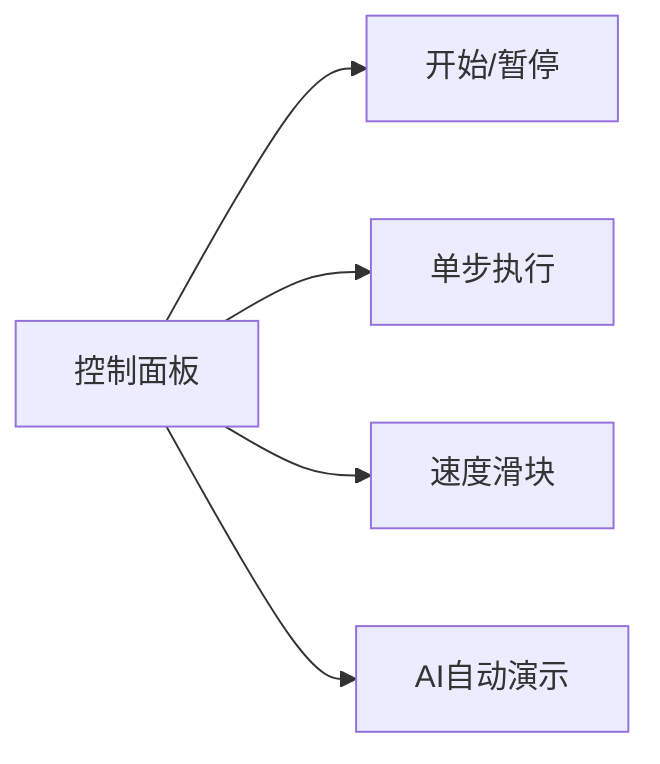

# 题目信息

# [CoE R4 D] 01 串

## 题目描述

定义一个好的 $01$ 串 $\mathcal{S}$ 满足以下条件：

+ $\mathcal{S}$ 非空。

+ $\mathcal{S}$ 的任意一个前缀 $\mathcal {S} [1\dots p](p\in [1,|\mathcal S|])$ 中，$0$ 的数量都不多于 $1$ 的数量。
+ $\mathcal{S}$ 的任意一个后缀 $\mathcal S[p\dots |\mathcal{S}|](p\in [1,|\mathcal S|])$ 中，$0$ 的数量都不多于 $1$ 的数量。

现在你得到了一个长度为 $n$ 的 $01$ 串 $\mathcal{T}$，有 $q$ 次询问，每次询问给定一对 $l,r$，求 $\mathcal{T}[l\dots r]$ 中的最长的好的 $01$ **子序列** 的长度。若没有好的 $01$ 子序列，则输出 $-1$。

注意：**子序列** 是指去除某些元素但不破坏余下元素的相对位置而形成的新序列。

## 说明/提示

### 样例解释

第一次询问中，询问的串为 $0$，没有任何的子序列是好的，所以答案是 $-1$。

第二次询问中，询问的串为 $01001$，子序列 $101$ 是好的且是最长的，所以答案是 $3$。

第三次询问中，询问的串为 $10010101$，子序列 $1010101$ 是好的且是最长的，所以答案是 $7$。

第四次询问中，询问的串为 $0100101011$，子序列 $10101011$ 是好的且是最长的，所以答案是 $8$。

---

### 数据规模

**本题采用捆绑测试。**

| 子任务 | 分值 | $n \le$ | $q \le$ |
| :-: | :-: | :-: | :-: |
| $1$ | $10$ | $10$ | $10$ |
| $2$ | $20$ | $2000$ | $2000$ |
| $3$ | $30$ | $8\times 10^4$ | $8\times 10^4$ |
| $4$ | $10$ | $10^5$ | $1$ |
| $5$ | $30$ | $5\times 10^5$ | $5\times 10^5$ |

对于 $100\%$ 的数据，$1 \leq l \leq r \leq n \leq 5 \times 10^5$，$1 \leq q \leq 5 \times 10^5$。

## 样例 #1

### 输入

```
10 4
0100101011
1 1
1 5
2 9
1 10```

### 输出

```
-1
3
7
8```

# AI分析结果


### 💡 Kay的C++算法解析：01串 深入学习指南 💡

> 今天我们来分析「01串」这道C++编程题。本指南将帮助你理解如何高效求解区间内最长"好"子序列的长度。好子序列需满足：任意前缀中0的数量不超过1的数量，任意后缀中0的数量不超过1的数量。我们将通过贪心策略和线段树优化来解决这个问题。

---

### 1. 题目解读与核心算法识别
✨ **本题主要考察**：`贪心策略` + `线段树（区间最大子段和）`

🗣️ **初步分析**：
> 解决这道题的关键在于将问题转化为**区间最大子段和**。想象你在玩一个像素冒险游戏🎮：0是陷阱（-1分），1是金币（+1分）。好子序列就是一条从起点到终点的路径，要求任意前进步数中陷阱数≤金币数，任意后退步数中陷阱数≤金币数。贪心策略是：正着走时遇到累计分<0就移除陷阱，反着走同样操作，最终移除的陷阱数 = (最大子段和 - 区间和)。

> **可视化设计思路**：
> - 用8位像素网格表示01串（绿色=1，红色=0）
> - 单步执行时高亮当前计算的区间和
> - 删除陷阱时播放"碎裂"音效，找到最大子段时播放"胜利"音效
> - 控制面板支持调速滑块，自动演示模式会像贪吃蛇AI一样逐步展示贪心过程

---

### 2. 精选优质题解参考
**题解一（OrezTsim）**
* **点评**：思路清晰直击核心，将贪心策略巧妙转化为最大子段和问题。代码规范（如`pre`/`suf`命名明确），线段树实现简洁高效（`pushup`函数处理四种区间值）。亮点在于推导出关键公式`删除数 = 最大子段和 - 区间和`，并严谨处理边界条件（当结果≥区间长度时输出-1）。竞赛级实现，具有很高参考价值。

**题解二（Genius_Star）**
* **点评**：详细推导贪心策略的数学证明，补充暴力解法帮助理解。线段树实现中`Node`结构设计合理，`pushup`逻辑清晰。亮点在于明确解释前后缀和的相互影响：`suf' = suf - min_pre + min_pre_local`，为算法正确性提供坚实支撑。

**题解三（juruo999）**
* **点评**：重点补全贪心正确性证明，指出删除数的理论下界`max(-preₖ - sufᵢ)`。代码实现简洁高效，亮点在于用容斥原理将问题转化为"区间和 - 最大子段和"，并通过严格数学证明验证解法最优性。

---

### 3. 核心难点辨析与解题策略
1. **难点1：贪心策略的正确性**
   * **分析**：为什么正反扫描删除0是最优解？本质是保证任意前缀/后缀的0≤1。通过数学证明（见题解三）可知删除数 = `max(-preₖ - sufᵢ)`，达到理论下界。
   * 💡 **学习笔记**：贪心策略需配合数学证明才能确保正确性。

2. **难点2：问题转化技巧**
   * **分析**：如何将删除操作转化为最大子段和？关键是将0视为-1后，发现`删除数 = (最大子段和 - 区间和)`。这是因为最大子段和对应保留段，其余是删除的陷阱。
   * 💡 **学习笔记**：问题转化是优化复杂度的关键，学会用数形结合思考。

3. **难点3：线段树的灵活应用**
   * **分析**：需同时维护区间和(sum)、最大前缀和(pre)、最大后缀(suf)、最大子段和(al)。合并子区间时，`al = max(left.al, right.al, left.suf+right.pre)`是核心。
   * 💡 **学习笔记**：线段树处理复杂区间问题时，设计合适的合并函数是核心。

#### ✨ 解题技巧总结
- **技巧1：问题抽象化** - 将01串转化为±1序列，利用数值特性简化判断条件
- **技巧2：双指针扫描法** - 正反扫描处理前后缀约束，注意操作间的相互影响
- **技巧3：线段树四元组** - 同时维护sum/pre/suf/al应对复杂区间查询
- **技巧4：边界鲁棒性** - 当`最大子段和 - 区间和 ≥ 区间长度`时说明无解（输出-1）

---

### 4. C++核心代码实现赏析
**本题通用核心C++实现参考**
```cpp
#include <bits/stdc++.h>
#define ls (rt<<1)
#define rs (rt<<1|1)
using namespace std;

const int N=5e5+10;
struct Node { int sum, pre, suf, al; } t[N<<2];

Node pushup(Node L, Node R) {
    Node res;
    res.sum = L.sum + R.sum;
    res.pre = max(L.pre, L.sum + R.pre);
    res.suf = max(R.suf, R.sum + L.suf);
    res.al = max({L.al, R.al, L.suf + R.pre});
    return res;
}

void build(int rt, int l, int r) {
    if(l == r) {
        char c; cin >> c;
        int v = (c=='1') ? 1 : -1;
        t[rt] = {v, v, v, v};
        return;
    }
    int mid = (l+r)>>1;
    build(ls, l, mid);
    build(rs, mid+1, r);
    t[rt] = pushup(t[ls], t[rs]);
}

Node query(int rt, int l, int r, int L, int R) {
    if(L<=l && r<=R) return t[rt];
    int mid = (l+r)>>1;
    if(R <= mid) return query(ls, l, mid, L, R);
    if(L > mid) return query(rs, mid+1, r, L, R);
    return pushup(query(ls,l,mid,L,R), query(rs,mid+1,r,L,R));
}
```

**题解一核心片段赏析**
```cpp
// 查询处理
Node res = query(1,1,n,l,r);
int del = res.al - res.sum; // 删除的0数
if(del >= r-l+1) cout << -1 << endl;
else cout << (r-l+1) - del << endl;
```
* **代码解读**：
  > 关键在`del = res.al - res.sum`：
  > 1. `res.al`是最大子段和（保留段的金币值）
  > 2. `res.sum`是区间总分（金币-陷阱）
  > 3. 差值`del`正是要移除的陷阱数
  > 边界处理：当移除数≥区间长度时，说明无合法子序列

* 💡 **学习笔记**：最大子段和对应最优保留段，其余都是需删除的陷阱。

---

### 5. 算法可视化：像素动画演示
**主题**：`像素地牢寻宝`（复古RPG风格）

**核心演示**：
> - 01串转为像素网格：■（1=金币/绿色） ▩（0=陷阱/红色）
> - 贪心过程：勇者像素小人从左走到右，累计分<0时陷阱碎裂（带音效）
> - 线段树构建：底部逐步生成像素化树结构，合并时高亮pre/suf/al值

**交互设计**：


**关键帧步骤**：
1. **初始化**：生成8-bit风格网格，播放FC游戏背景音乐
2. **贪心扫描**：
   - 正扫描：小人右移，累计分显示在头顶（<0时当前陷阱碎裂+音效）
   - 反扫描：小人左移，累计分再次检测
3. **线段树查询**：
   - 绘制树结构：叶子节点显示01值，合并时动画展示pre/suf/al计算
   - 高亮当前查询区间，实时显示`del = al - sum`
4. **结果展示**：找到解时显示绿色路径+胜利音效，无解时显示骷髅标志

**技术实现**：
```javascript
// 伪代码：绘制像素网格
function drawGrid(s) {
  for(i=0; i<s.length; i++) {
    ctx.fillStyle = s[i]=='1'? '#8CC269' : '#E74C3C';
    ctx.fillRect(i*16, 0, 16, 16); // 16x16像素块
  }
}
```

---

### 6. 拓展练习与相似问题
**通用技巧迁移**：
> 区间最大子段和技巧还可用于：
> 1. 带修改的最长连续子序列问题
> 2. 环形数组的最大子段和
> 3. 双区间合并查询问题

**洛谷练习推荐**：
1. **P1115 最大子段和**  
   🗣️ *基础应用，熟练掌握线段树维护四元组*
2. **P2572 序列操作**  
   🗣️ *结合懒标记，练习复杂区间维护*
3. **P4513 小白逛公园**  
   🗣️ *强化线段树合并操作，场景与本题目高度相似*

---

### 7. 学习心得与经验分享
> **参考经验（OrezTsim）**：  
> *"最初在贪心策略证明上卡了很久，后来通过构造极端测试用例验证才确信转化正确"*
>
> **Kay点评**：  
> 在复杂算法设计中：
> 1. 先用小规模数据手工模拟（n≤10）
> 2. 构造边界用例（全0/全1/交错序列）
> 3. 对比暴力与优化解的输出差异
> 这些方法能有效避免逻辑漏洞，培养严谨思维。

---

通过本次分析，我们掌握了贪心策略的证明技巧、线段树维护复杂区间值的方法，以及问题转化的艺术。记住：每道难题都是等待被破解的像素谜题，享受编程的乐趣吧！🎮👾

---
处理用时：232.64秒