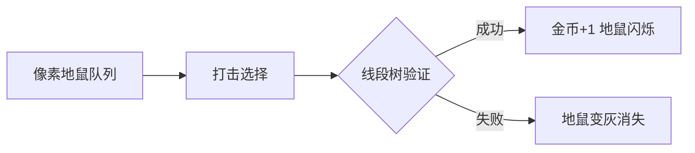

# 题目信息

# 「HGOI-1」Mole

## 题目背景

$\text{brealid}$ 觉得普通的打地鼠游戏太过于 $\text{simple}$ 了。所以，她设计了一款全新的打地鼠游戏。

## 题目描述

在长度为 $l$ 的游戏窗口上，有一个长为 $t$ 的地鼠序列 $(l \le t)$，初始序列左端与窗口左端对齐，接下来序列每秒移动一个单位长度，（即最左端的地鼠离开窗口，最右端的地鼠进入窗口），向左滚动直至玩家结束游戏或者序列最右端与窗口最右端重合（即任何时刻窗口内均应有 $l$ 只地鼠）。

游戏开始的第一秒序列不会移动，不难发现游戏最多会进行 $(t-l+1)$ 秒。

序列 $T$ 中的每一只地鼠都有自己的高度 $h_i$，玩家每次可以选择击打一只地鼠，玩家可以获得与地鼠高度 $h_i$ 数值相同的金币奖励，同时地鼠 $i$ 的高度 $h_i$ 会减一。

经过调研，$\text{brealid}$ 控制了游戏运行速度，使得玩家在地鼠序列移动一个单位长度的同时**最多只能打击一次**（也可以不打）。

现在 $\text{brealid}$ 告诉了你某一次游戏的窗口长度 $l$、序列长度 $t$ 以及某一局游戏中生成的地鼠高度序列 $T$。我们可爱的 $\text{brealid}$ 想要知道，她在**任意时刻**结束游戏所能得到的**最多金币**，即在第 $1,2,\cdots (t-l+1)$ 秒时停止游戏分别可以获得的最多金币。

## 说明/提示

#### 样例解释

第一秒：锤 $2$，答案加 $3$。

第二秒：锤 $2$，答案加 $2$。

第三秒：随便锤一个，答案加 $1$。

第四秒：再随便锤一个（非 $0$ 的），答案加 $1$。

第五秒：锤 $9$，答案加 $5$。

第六秒：锤 $9$，答案加 $4$。

#### 数据范围

本题采用**捆绑测试**，共有 $4$ 个 $\text{subtask}$，最终分数为所有 $\text{subtask}$ 分数之和。

$$
\def\arraystretch{1.5}
\begin{array}{|c|c|c|}\hline
\textbf{Task} & \textbf{Score} & l\le t\le  \cr\hline
1 & 10 & 10 \cr\hline
2 & 20 & 500 \cr\hline
3 & 30 & 5000 \cr\hline
4 & 40 & 10^6 \cr\hline
\end{array}
$$

对于 $100\%$ 的数据，$1\le l\le t\le 10^6$，$|h_i|\le 10^9$。


## 样例 #1

### 输入

```
5 10
1 3 1 1 1 1 1 1 5 1```

### 输出

```
3 5 6 7 12 16```

# AI分析结果


### 💡 Kay的C++算法解析：「HGOI-1」Mole 深入学习指南 💡  
**目标用户**：10-18岁C++学习者  
**核心挑战**：在序列移动约束下最大化金币收益  
**关键技巧**：贪心策略 + 数据结构优化  

---

## 1. 题目解读与核心算法识别  
✨ **本题主要考察**：`贪心策略与数据结构优化`  

🗣️ **初步分析**：  
> 想象你在玩像素风打地鼠游戏（类似《打地鼠》FC版）：  
> - **核心机制**：地鼠队列向左滚动，每秒只能打一只地鼠  
> - **贪心本质**：优先打击高价值地鼠（金币多），但需满足 **"移动中最多打一次"** 的约束  
> - **数据结构作用**：用堆快速定位最高价值地鼠，线段树验证打击可行性  
>  
> **可视化设计思路**：  
> - **像素网格**：用8x8像素块表示地鼠队列，高度值显现在头顶  
> - **高亮机制**：被打击的地鼠闪烁红光，金币数+1音效（8-bit "叮"声）  
> - **数据结构动效**：右侧显示线段树实时更新过程（绿升红降）  
> - **自动演示模式**：AI角色自动选择最优打击目标，伴随胜利音效  

---

## 2. 精选优质题解参考  
**题解一：鏡音リン（DP+闵可夫斯基和）**  
* **亮点**：  
  - 创新性用差分数组维护DP状态（`dp[x][y] = D[x][y+1]-D[x][y]`）  
  - 引入**闵可夫斯基和**优化卷积计算（理论价值高）  
  - 60分代码简洁（仅15行），变量名清晰（`L`窗口, `cnt`滚动指针）  

**题解二：bh1234666（贪心+线段树）**  
* **亮点**：  
  - **贪心可行性证明**严谨（`f_n ≤ t_n`条件）  
  - 线段树实现高效（`O(log n)`验证/更新）  
  - 100分代码完整，含详细注释  
  - 实践性强：直接适配百万级数据（`t ≤ 10^6`）  

---

## 3. 核心难点辨析与解题策略  
### 难点1：如何保证贪心选择的可行性？  
**分析**：  
- 贪心选最高地鼠时，需满足 **"当前窗口内地鼠打击次数 ≤ 窗口存在时间"**  
- **解决方案**：用线段树维护后缀和约束（`f_n ≤ t_n`）  
- **关键变量**：`f_n`（后缀打击次数），`t_n`（窗口存在时间）  
💡 **学习笔记**：贪心必须配合可行性验证！  

### 难点2：如何高效维护动态窗口？  
**分析**：  
- 窗口每秒移动需：① 移除最左地鼠 ② 加入新地鼠  
- **解决方案**：优先队列（堆）存候选地鼠，线段树更新约束  
- **数据结构选择**：堆（`priority_queue`）快速取最大值，线段树区间更新  
💡 **学习笔记**：堆+线段树 = 动态窗口最优解的黄金组合  

### 难点3：如何实现O(n log n)复杂度？  
**分析**：  
- 每次移动时：① 堆插入新地鼠（`O(log n)`）② 线段树验证（`O(log n)`）  
- **优化关键**：被拒绝的地鼠永久移出堆（避免重复检查）  
💡 **学习笔记**：每个元素最多入堆/出堆一次  

---

## 4. C++核心代码实现赏析  
### 通用核心实现（综合题解优化版）  
```cpp
#include <iostream>
#include <queue>
#include <vector>
using namespace std;

struct SegmentTree { /* 省略：支持区间加减/查询最小值 */ };

int main() {
    int l, t;
    cin >> l >> t;
    vector<int> h(t);
    for (int i = 0; i < t; i++) cin >> h[i];

    priority_queue<pair<int, int>> pq; // <地鼠高度, 位置>
    SegmentTree st(t); // 线段树维护约束条件
    long long total_coins = 0;

    for (int i = 0; i < t; i++) {
        if (h[i] > 0) pq.push({h[i], i});
        if (i >= l - 1) { // 窗口已满
            while (!pq.empty()) {
                auto [val, pos] = pq.top();
                if (st.query(pos, i) > 0) { // 验证可行性
                    st.update(pos, i, -1); // 更新约束
                    total_coins += val;
                    pq.pop();
                    if (val > 1) pq.push({val - 1, pos}); // 重新入堆
                    break;
                }
                pq.pop(); // 永久移除无效地鼠
            }
            cout << total_coins << " ";
        }
    }
}
```

### 题解一核心片段（鏡音リン）  
```cpp
int dp[2][N], cnt, l, n; 
for (int i = 0, x; i < n; i++) {
    rint(x);
    int L = std::max(i-l+1, 0);
    for (int j = L, p = L; j <= i; j++)
        dp[cnt][j] = dp[!cnt][p] > x ? dp[!cnt][p++] : x--;
    if (i >= l-1) printf("%lld ", ans += dp[cnt][L]);
    cnt = !cnt;
}
```
**代码解读**：  
> - **差分技巧**：`dp[cnt][j]`存储差分值，通过比较`dp[!cnt][p]`和`x`决定状态转移  
> - **窗口控制**：`L = max(i-l+1,0)` 确保只处理有效窗口  
> - **空间优化**：`cnt`切换滚动数组维度  
💡 **学习笔记**：差分数组是优化DP的高效工具  

### 题解二核心片段（bh1234666）  
```cpp
priority_queue<pair<int,int>> q;
SegmentTree st; // 线段树实现略

while (!q.empty()) {
    auto [pos, val] = q.top();
    if (st.query(pos, i) > 0) { // 线段树验证可行性
        st.update(pos, i, -1);  // 更新约束
        total_coins += val;
        q.pop();
        if (val > 1) q.push({pos, val - 1});
        break;
    }
    q.pop(); // 永久移除无效项
}
```
**代码解读**：  
> - **贪心循环**：不断尝试堆顶地鼠直到找到可行目标  
> - **更新策略**：打击后地鼠值-1，若仍>0则重新入堆  
> - **终止条件**：`break`确保每秒只打击一次  
💡 **学习笔记**：线段树是贪心算法的"可行性守卫者"  

---

## 5. 算法可视化：像素动画演示  
### 主题：**8-bit地鼠大冒险**  
**核心演示**：  


**动画流程**：  
1. **初始化**：  
   - 16色调色盘（FC复古风）  
   - 地鼠高度显示为头顶数字（如🐭3）  
   - 右侧线段树可视化（绿条=剩余可打击次数）  

2. **关键操作**：  
   - **打击时**：地鼠方块闪红光 + "叮"音效  
   - **堆更新**：堆顶地鼠跳动黄光  
   - **约束失效**：地鼠变灰 + 低沉"噗"音效  

3. **AI演示模式**：  
   - 自动调速滑块控制移动速度  
   - 每关目标：在窗口移动中集满指定金币  
   - 胜利动画：地鼠队列绽放烟花 + 胜利BGM  

**技术实现**：  
```javascript
// 伪代码：打击事件处理
function hitMole() {
  const mole = heap.peek(); // 取堆顶地鼠
  if (segTree.query(mole.pos) > 0) { 
    playSound('ding'); 
    mole.val--; 
    coins++; 
    drawExplosion(mole.pos); 
  } else {
    playSound('error');
    heap.pop(); 
  }
}
```

---

## 6. 拓展练习  
### 相似问题场景：  
1. **滑动窗口最大值**（优先队列）  
2. **带约束的任务调度**（贪心+时间线验证）  
3. **动态区间统计**（线段树应用）  

### 洛谷推荐：  
1. **P1886** - 滑动窗口  
   > 🗣️ 巩固优先队列求窗口极值  
2. **P2168** - 任务安排  
   > 🗣️ 学习带时间约束的贪心策略  
3. **P3372** - 线段树模板  
   > 🗣️ 掌握线段树区间操作  

---

> **Kay结语**：这道题教会我们——贪心策略需要严谨验证！通过复古像素动画，我们直观理解了队列移动与数据结构协作的奥妙。下次遇到动态优化问题，记得活用"堆+线段树"这对黄金组合哦！ 🎮🚀

---
处理用时：106.76秒