# 题目信息

# [POI 2022 ~2023R1] zbo

## 题目背景

题目译自 [POI2022~2023R1 zbo](https://sio2.mimuw.edu.pl/c/oi30-1/p/zbo/)。

## 题目描述

远古时期有一个国王，他统治了 $n$ 个村庄，这些村庄以 $n-1$ 条道路连接，原来的国王城堡在 $1$ 号村庄。

国王的儿子不久就要成年了，作为成年的王子们，其需要自己的城堡，所以在一些村庄会有**新的城堡**。

每座城堡都需要进行通讯，但是无奈距离太过遥远，为此，每个城堡每天都会派出若干个信鸽，向其他每个城堡发送消息。一只信鸽每行驶一公里就要吃一克谷物。

请你实现一个程序，求出按照输入顺序建造的每个城堡建造完之后所有城堡都能通讯的最少花费谷物数量。

具体的，定义 $dis(x,y)$ 为 $x$ 到 $y$ 所花费的谷物数，求每个城堡 $i$ 建造完后的 $\sum ^{i} _{x=1} \sum ^{i}_{y=1} dis(x,y)$。

注意上述式子默认两个相同的地点所花费为 $0$。

## 说明/提示

子任务分配如下：

| 子任务编号 | 特殊性质 | 分值 |
| :----------: | :----------: | :----------: |
| $1$ | $n \cdot k \leq 10^5$ | $15$ |
| $2$ | 村庄是一条从 $1$ 到 $n$ 的链 | $35$ |
| $3$ | 无特殊性质 | $50$ |

本题中，子任务 $0$ 为样例。

## 样例 #1

### 输入

```
5 3
1 4 3
3 1 6
1 2 5
4 5 1
5
3
2```

### 输出

```
8
40
90
```

# AI分析结果


# 💡 Kay的C++算法解析：zbo 深入学习指南 💡

> 大家好，我是Kay！今天我们一起探索POI题目「zbo」——一个关于城堡通讯的有趣问题。我们将通过生动比喻和像素动画，帮助大家理解树形结构中的动态距离计算技巧。准备好了吗？让我们开始吧！

## 1. 题目解读与核心算法识别

✨ **本题主要考察**：树链剖分 + 线段树（动态路径维护）

🗣️ **初步分析**：
> 想象一棵倒挂的圣诞树🎄，每个村庄是挂饰，城堡是发光的星星⭐。新星星加入时，我们需要计算所有星星之间的"光线距离"总和。核心技巧是：**将距离拆解为深度和最近公共祖先（LCA）**，就像把光线分解为上行和下行路径。

- **核心思路**：  
  `dis(x,y) = dep[x] + dep[y] - 2*dep[lca(x,y)]`  
  总消耗谷物 = `2*(k-1)*Σdep - 4*Σdep[lca]`
  
- **动态维护**：  
  每次添加新城堡时：
  1. 更新深度和（A += dep[x]）
  2. 通过**树剖+线段树**快速计算LCA深度和（B += 路径查询值）
  3. 将新城堡到根的路径"点亮"（路径加1）

- **可视化设计**：  
  采用8-bit像素风格🌌，城堡显示为闪烁星星✨。添加新城堡时：
  - 黄光高亮新增路径（类似《塞尔达》传送特效）
  - 路径边权显示为像素柱🌫️，高度随加1操作上升
  - "叮"声标记路径查询📊，胜利音效提示计算完成🎉

## 2. 精选优质题解参考

> 从思路清晰度、代码规范性和算法效率等维度，我精选了3份优质题解：

**题解一：Hoks（树剖经典实现）**
* **点评**：这份题解如同精心绘制的像素地图🗺️：
  - 思路直白：清晰拆解距离公式，用"路径染色"比喻解释LCA求和
  - 代码工整：变量名`dep`/`dfn`含义明确，树剖实现标准
  - 亮点突出：边权下放处理巧妙，时间复杂度O(n log²n)高效
  - 实战价值：可直接用于竞赛，边界处理严谨（如根节点特判）

**题解二：_lbw_（简洁高效版）**
* **点评**：这份题解像精准的自动机⚙️：
  - 逻辑精炼：30行核心代码完成树剖+线段树维护
  - 空间优化：省去冗余数组，内存使用更紧凑
  - 技巧亮点：用`dfn`直接映射边权，避免额外存储
  - 学习价值：适合掌握基础后追求代码简洁性的学习者

**题解三：zzhbpyy（公式推导导向）**
* **点评**：这份题解如同数学魔法书🔮：
  - 推导严谨：逐步展开距离公式，揭示LCA求和的本质
  - 教学性强：用"路径交"比喻解释线段树维护原理
  - 结构清晰：分离深度维护与LCA计算模块，方便调试
  - 特别亮点：注释详细解释每个变量物理意义

---

## 3. 核心难点辨析与解题策略

> 攻克本题需突破三大关卡，下面是我的通关秘籍：

1. **难点1：动态求和转化**  
   *分析*：如何将Σdis转化为可维护项？优质题解普遍采用：  
   $$ans = 2(k-1)A - 4B$$  
   其中$A=Σdep[x]$, $B=Σ_{i<j}dep[lca(i,j)]$  
   💡 **学习笔记**：距离计算本质是路径叠加问题

2. **难点2：LCA深度和动态维护**  
   *分析*：通过"路径染色"技巧——新点加入时：  
   - 查询根→x路径权值和即得B的增量  
   - 更新该路径权值(+1)  
   *数据结构选择*：树剖将路径查询/更新降至O(log²n)  
   💡 **学习笔记**：树剖是处理链操作的瑞士军刀🗡️

3. **难点3：边权下放处理**  
   *分析*：将边权赋给子节点，根节点权值为0。线段树维护：  
   `节点值 = 染色次数 × 边权`  
   确保路径求和等于LCA深度和  
   💡 **学习笔记**：边权点化是树操作的常用技巧

### ✨ 解题技巧总结
1. **问题分解术**：将复杂距离和拆解为深度和与LCA深度和
2. **动态维护法**：用树剖+线段树实现路径高效更新
3. **边界防御**：特别注意根节点无父边的特殊情况
4. **调试技巧**：先模拟小规模树（n=3），验证路径操作

---

## 4. C++核心代码实现赏析

### 本题通用核心C++实现
```cpp
#include <bits/stdc++.h>
#define int long long
using namespace std;
const int N=1e5+5;

struct Edge{int v,w;};
vector<Edge> G[N];
int dep[N], fa[N], top[N], sz[N], son[N];
int dfn[N], idx, w[N]; // w[i]: 点i的边权（来自父边）

// 树剖预处理
void dfs1(int u,int p){
    fa[u]=p; sz[u]=1;
    for(auto [v,wt]:G[u]){
        if(v==p) continue;
        dep[v]=dep[u]+wt; w[v]=wt;
        dfs1(v,u); sz[u]+=sz[v];
        if(sz[v]>sz[son[u]]) son[u]=v;
    }
}
void dfs2(int u,int tp){
    top[u]=tp; dfn[u]=++idx;
    if(son[u]) dfs2(son[u],tp);
    for(auto [v,wt]:G[u])
        if(v!=fa[u] && v!=son[u]) dfs2(v,v);
}

// 线段树维护路径
struct SegTree {
    int sumW[N<<2], sumV[N<<2], tag[N<<2];
    void build(int p,int l,int r){
        if(l==r) { sumW[p]=w[l]; return; }
        int mid=(l+r)>>1;
        build(p<<1,l,mid); build(p<<1|1,mid+1,r);
        sumW[p]=sumW[p<<1]+sumW[p<<1|1];
    }
    void push(int p,int val){
        tag[p]+=val;
        sumV[p]+=val*sumW[p];
    }
    void pushdown(int p){
        if(!tag[p]) return;
        push(p<<1,tag[p]); push(p<<1|1,tag[p]);
        tag[p]=0;
    }
    void update(int p,int l,int r,int ql,int qr){
        if(ql<=l && r<=qr) return push(p,1);
        pushdown(p); int mid=(l+r)>>1;
        if(ql<=mid) update(p<<1,l,mid,ql,qr);
        if(qr>mid) update(p<<1|1,mid+1,r,ql,qr);
        sumV[p]=sumV[p<<1]+sumV[p<<1|1];
    }
    int query(int p,int l,int r,int ql,int qr){
        if(ql<=l && r<=qr) return sumV[p];
        pushdown(p); int mid=(l+r)>>1, res=0;
        if(ql<=mid) res+=query(p<<1,l,mid,ql,qr);
        if(qr>mid) res+=query(p<<1|1,mid+1,r,ql,qr);
        return res;
    }
} T;

// 路径更新与查询
void path_update(int x){
    while(x){
        T.update(1,1,n,dfn[top[x]],dfn[x]);
        x=fa[top[x]];
    }
}
int path_query(int x){
    int res=0;
    while(x){
        res+=T.query(1,1,n,dfn[top[x]],dfn[x]);
        x=fa[top[x]];
    }
    return res;
}

signed main(){
    cin>>n>>k;
    // 建树...
    dfs1(1,0); dfs2(1,1); T.build(1,1,n);
    
    int A=0, B=0, k_count=1; // 初始城堡1
    A += dep[1]; path_update(1);
    
    while(k--){
        int x; cin>>x;
        A += dep[x];        // 更新深度和
        B += path_query(x); // 查询LCA深度和
        path_update(x);     // 更新路径
        k_count++;
        cout << 2*(k_count-1)*A - 4*B << endl;
    }
}
```

* **代码解读概要**：
  1. **树剖预处理**：`dfs1`计算深度/子树大小，`dfs2`标重链
  2. **线段树设计**：维护`sumW`(固定边权和)与`sumV`(动态权值×边权)
  3. **路径操作**：`path_update`实现链加1，`path_query`获取LCA深度和
  4. **动态维护**：添加城堡时更新A/B，套用公式输出答案

---

## 5. 算法可视化：像素动画演示

> 让我们通过8-bit像素动画🎮直观感受算法流程！设计思路：用《塞尔达传说》复古地牢风格呈现树结构，算法操作转化为光效互动。

### 🎮 动画方案设计

```mermaid
graph LR
  A[初始树] --> B[添加城堡]
  B --> C[路径高亮]
  C --> D[线段树更新]
  D --> E[结果显示]
```


* **像素场景**：
  - 树节点：8×8像素方块，城堡用金色⭐，普通村庄用绿色🌳
  - 路径：蓝色光束连接节点，随加1操作升高像素柱📊
  - 控制台：右下角按钮（暂停/步进/调速）

* **关键动画帧**：
  1. **初始化**：  
     ![树结构]  
     显示带边权的树，节点1为金色城堡

  2. **添加新城堡**：  
     - 新节点闪烁红光🔴，播放"叮"声  
     - 根→新节点路径黄光流动💛（持续1秒）

  3. **路径查询**：  
     - 线段树界面展开，显示当前路径权值和  
     - 对应路径蓝光脉冲🔵（0.5秒）

  4. **路径更新**：  
     - 路径上每个节点升起像素柱（高度+1）  
     - 柱顶显示新权值，音效随高度变化📈

  5. **结果显示**：  
     - 屏幕顶部显示：`新答案 = 公式计算值`  
     - 播放胜利音效🎉，城堡间显示金色连接线

* **交互控制**：
  - `空格键`：单步执行
  - `A键`：自动播放（速度可调）
  - `R键`：重置动画

---

## 6. 拓展练习与相似问题

> 掌握本题后，可挑战更多树形问题：

1. **洛谷 P4211 [LNOI2014]LCA**  
   🗣️ *推荐理由*：同款"路径染色"技巧，学习离线查询处理

2. **洛谷 P3398 仓鼠找sugar**  
   🗣️ *推荐理由*：深化LCA应用，判断路径相交

3. **洛谷 P2146 [NOI2015]软件包管理器**  
   🗣️ *推荐理由*：树剖经典应用，掌握安装/卸载的链操作

---

## 7. 学习心得与经验分享

> 来自题解作者的调试经验：

**Hoks的调试心得**：  
*"初始忽略根节点无边权导致WA，后通过打印dfn序列发现根节点权值未初始化"*

💡 **Kay总结**：树剖建树时需特别注意：
1. 根节点无父边，权值应为0
2. 边权下放时，子节点权值=父边权
3. 调试时先验证小样本（3个节点）

---

> 本次解析就到这里！记住：算法学习如同培育像素树🌳——每天浇灌一点思考，终将收获参天智慧。下次挑战再见！🚀

---
处理用时：209.25秒