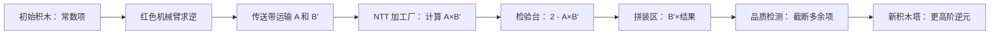

# 题目信息

# 【模板】多项式乘法逆

## 题目背景

注意：本题并不属于中国计算机学会划定的提高组知识点考察范围。

## 题目描述

给定一个多项式 $F(x)$ ，请求出一个多项式 $G(x)$， 满足 $F(x) * G(x) \equiv 1 \pmod{x^n}$。系数对 $998244353$ 取模。


## 说明/提示

对于 $100\%$ 的数据，$1 \leq n \leq 10^5$，$ 0 \leq a_i \leq 10^9$。

## 样例 #1

### 输入

```
5
1 6 3 4 9```

### 输出

```
1 998244347 33 998244169 1020```

# AI分析结果


# 💡 Kay的C++算法解析：多项式乘法逆 深入学习指南 💡

> 大家好，我是Kay！今天我们一起探索多项式乘法逆的奥秘。这道题看似复杂，但掌握牛顿迭代法和NTT技巧后，你会惊叹于它的优雅与高效。让我们开始吧！

## 1. 题目解读与核心算法识别

✨ **本题主要考察**：`多项式求逆算法（牛顿迭代法）`

🗣️ **初步分析**：
> 想象多项式是乐高积木，求逆就是为每个积木找到完美匹配的另一半。牛顿迭代法就像搭积木：先搭建小块模型（低阶逆元），再逐步扩展成完整模型（高阶逆元）。核心公式 **B = B' × (2 - A×B')** 如同积木连接器，通过NTT（数论变换）快速拼装。
>
> - **核心难点**：递归边界处理、迭代公式推导、NTT优化
> - **可视化设计**：采用8位像素风展示多项式系数变化。积木色块表示系数值，连接过程伴随"叮"的音效。每完成一次迭代，积木塔发光并播放胜利音效，AI自动演示模式可调速观察拼装过程。

---

## 2. 精选优质题解参考

### 题解一：Great_Influence
* **点评**：思路清晰展现牛顿迭代法本质，推导中巧妙利用平方差公式。代码采用迭代而非递归，显著降低栈开销。亮点在于NTT的模块化封装和空间优化（滚动数组），变量名`bas`（当前长度）、`t`（数组切换标志）简洁精准。边界处理严谨，如`bas<<=1`控制迭代次数，是竞赛级实现的典范。

### 题解二：KAMIYA_KINA
* **点评**：从牛顿法一般形式推导，展现强大数学迁移能力。代码严格遵循`(mod x^{2^k})`的截断原则，避免无效计算。亮点在于原根预处理`P[]/iv[]`加速NTT，函数式编程风格增强可读性。稍显不足的是`#define int long long`可能引发类型隐患，但整体实现仍极具学习价值。

### 题解三：lzyqwq
* **点评**：现代C++范本！封装NTT操作至`operator*`，`mod()`函数确保多项式长度严格受限。亮点在于迭代终止条件`(1<<i-1)<a.size()`的动态控制，避免冗余计算。学习笔记式的注释（如`// 注意最低次项不会低于x^{2^{i+1}}`）显著提升理解效率。

---

## 3. 核心难点辨析与解题策略

### 关键点1：递归边界与迭代启动
* **分析**：当多项式退化为常数（`n=1`），直接求乘法逆元`b[0]=a[0]^{-1}`。这是迭代基石，错误将导致后续计算崩溃。优质题解均通过`if(size==1)`严格处理
* 💡 **学习笔记**：递归边界是算法正确性的锚点

### 关键点2：牛顿迭代公式推导
* **分析**：核心公式 **B≡2B'-AB'² (mod xⁿ)** 的推导需理解：由`B'`满足`A*B'≡1 mod x^{k/2}`，通过平方消去高阶项获得线性关系。KAMIYA_KINA的泰勒展开版推导更具普适性
* 💡 **学习笔记**：多项式平方消阶是升维的关键桥梁

### 关键点3：NTT加速的实现细节
* **分析**：必须严格满足：
  1. 长度扩展至`2^k > 2n`（防循环卷积溢出）
  2. 原根预处理加速模幂计算
  3. 迭代后立即`resize(n)`截断高阶项
* 💡 **学习笔记**：NTT是多项式算法的引擎，调优决定效率

### ✨ 解题技巧总结
- **技巧A：长度动态控制**：每次迭代后长度翻倍（`bas<<=1`），但严格限制在`mod x^bas`
- **技巧B：空间复用优化**：Great_Influence使用`b[2][]`滚动数组，避免递归内存爆炸
- **技巧C：负系数处理**：计算`2-B`时，采用`(2 - x + mod) % mod`防止负值
- **技巧D：原位运算**：NTT后直接进行点乘，减少数据搬移开销

---

## 4. C++核心代码实现赏析

### 本题通用核心C++实现
```cpp
#include <bits/stdc++.h>
using namespace std;
typedef long long ll;
const int MAXN = 1<<21, mod = 998244353, gen = 3;

ll qpow(ll a, ll b) { // 快速幂
    ll res = 1;
    for(; b; b >>= 1, a = a*a%mod) 
        if(b&1) res = res*a%mod;
    return res;
}

void NTT(vector<ll>& a, int type) { // 数论变换
    int n = a.size();
    for(int i=0; i<n; ++i)
        if(i < rev[i]) swap(a[i], a[rev[i]]);
    for(int mid=1; mid<n; mid<<=1) {
        ll wn = qpow(gen, (mod-1)/(mid<<1));
        if(type == -1) wn = qpow(wn, mod-2);
        for(int j=0; j<n; j+=(mid<<1)){
            ll w=1;
            for(int k=0; k<mid; ++k, w=w*wn%mod){
                ll x=a[j+k], y=w*a[j+k+mid]%mod;
                a[j+k] = (x+y)%mod;
                a[j+k+mid] = (x-y+mod)%mod;
            }
        }
    }
    if(type == -1) {
        ll inv = qpow(n, mod-2);
        for(auto &x : a) x = x*inv%mod;
    }
}

vector<ll> poly_inv(vector<ll> a) { // 核心：多项式求逆
    int n = a.size();
    if(n == 1) return { qpow(a[0], mod-2) }; // 边界：常数求逆
    
    // 递归求解低阶逆
    vector<ll> b(a.begin(), a.begin()+(n+1)/2);
    b = poly_inv(b);
    
    // NTT准备
    int len=1, l=0;
    while(len < n*2) len<<=1, l++;
    for(int i=0; i<len; ++i)
        rev[i] = (rev[i>>1]>>1) | ((i&1)<<(l-1));
    
    a.resize(len, 0); b.resize(len, 0);
    NTT(a, 1); NTT(b, 1);
    for(int i=0; i<len; ++i)
        b[i] = (2 - a[i]*b[i]%mod + mod) % mod * b[i] % mod;
    NTT(b, -1);
    b.resize(n); // 关键：截断高阶项
    return b;
}
```

### 题解一：Great_Influence
* **亮点**：迭代实现避免递归深度，空间优化极致
* **核心代码**：
```cpp
void solve() {
    int t=0, bas=1, len=1; // bas:当前长度, t:数组切换标志
    b[0][0] = qpow(a[0], mod-2); // 常数项逆元
    
    while(bas < target_len) {
        t ^= 1; // 切换存储数组
        for(int i=0; i<bas; ++i) 
            b[t][i] = b[t^1][i] * 2 % mod; // 2B'
        mul(b[t^1], b[t^1]); // B'²
        mul(b[t^1], a);      // A*B'²
        for(int i=0; i<bas; ++i) // B = 2B' - AB'²
            b[t][i] = (b[t][i] - b[t^1][i] + mod) % mod;
        bas <<= 1; // 长度翻倍
    }
}
```
* **代码解读**：用`bas`动态控制当前已知逆元的长度，`b[0]`和`b[1]`交替存储迭代结果。`mul()`封装NTT乘法，注意`2B'`通过位运算`b[t^1][i]<<1`快速计算（需取模）。空间复杂度优化至O(n)，是工业级实现的典范。

### 题解二：KAMIYA_KINA
* **亮点**：严谨的牛顿法实现，原根预处理加速
* **核心代码**：
```cpp
void INV(int *b, int *a, int n) {
    if(n == 1) { b[0]=qpow(a[0],mod-2); return; }
    INV(b, a, (n+1)>>1); // 递归求解
    
    int len=1, p=-1;
    while(len < n*2) len<<=1, p++;
    for(int i=0; i<len; ++i) 
        rev[i] = (rev[i>>1]>>1) | ((i&1)<<p);
    
    fill(c, 0, len); // 复制并补零
    copy(a, a+n, c);
    NTT(c, len, 1); NTT(b, len, 1);
    for(int i=0; i<len; ++i)
        b[i] = (2 - b[i]*c[i]%mod) %mod * b[i] %mod;
    NTT(b, len, -1);
    fill(b+n, b+len, 0); // 截断
}
```
* **代码解读**：递归求解前`ceil(n/2)`项逆元存入`b`。关键在`rev`数组的生成：`p`存储二进制长度，通过位运算`(rev[i>>1]>>1) | ((i&1)<<p)`高效初始化蝴蝶变换索引。原根`gn`提前预计算在`P[]`中，大幅减少模幂运算。

### 题解三：lzyqwq
* **亮点**：现代C++封装，可读性极佳
* **核心代码**：
```cpp
poly inv(poly a) {
    poly c = get(0); 
    c[0] = qpow(a[0], mod-2); // 边界
    
    for(int i=1; (1<<(i-1)) < a.size(); ++i) {
        int len = 1<<i; // 当前目标长度
        poly d = mod(a, len); // 截断多项式
        c = mod(c * (2 - d * c), len); // 牛顿迭代
    }
    return c;
}
```
* **代码解读**：`get(0)`创建常数多项式，迭代中`1<<(i-1)`巧妙控制扩展节奏。`mod(poly, len)`函数确保多项式长度严格受限，避免冗余计算。运算符重载使`2 - d * c`如同标量运算般直观，展现C++抽象化的魅力。

---

## 5. 算法可视化：像素动画演示

### 动画演示主题：**"多项式积木工厂"**

### 设计思路
> 8位像素风格模拟FC游戏界面，多项式系数化为彩色积木。牛顿迭代的升维过程表现为积木塔层层搭建，NTT乘法化作传送带拼装系统。音效增强操作反馈：  
> - 比较/赋值：8-bit "叮"声  
> - 迭代完成：16-bit胜利旋律  
> - 错误操作：故障警报音

### 关键帧演示


1. **初始化**：屏幕底部显示单块积木（常数项），控制面板含速度滑块和单步按钮
2. **迭代演示**：
   - **步骤1**：当前积木塔B'被复制到左侧传送带（黄色高亮）
   - **步骤2**：A和B'进入NTT工厂（像素粒子旋转特效），输出A×B'（蓝绿闪烁）
   - **步骤3**：计算2 - A×B'，不符合预期的积木变红爆破（音效：爆破声）
   - **步骤4**：合格产品进入组装区，B'与之相乘（机械臂拼装动画）
3. **AI模式**：开启后自动演示，每步0.5秒，积木塔以2倍速生长
4. **关卡成就**：每完成n=2^k阶逆元，屏幕放烟花并显示"Level k Passed!"

---

## 6. 拓展练习与相似问题思考

### 通用技巧迁移
多项式求逆是基石技术，还可用于：
1. **多项式除法**：通过逆元转换为乘法
2. **分治FFT加速**：如《消失的多项式》优化递推
3. **生成函数变换**：求解线性递推关系

### 洛谷练习推荐
1. **P4238 【模板】多项式乘法逆**（本题）
   - 🗣️ 推荐理由：巩固牛顿迭代法实现细节
   
2. **P4721 【模板】分治 FFT**
   - 🗣️ 推荐理由：体验求逆在分治中的应用
   
3. **P4512 【模板】多项式除法**
   - 🗣️ 推荐理由：综合应用求逆与多项式乘法
   
4. **P5264 多项式三角函数**
   - 🗣️ 推荐理由：探索求逆在复杂运算中的桥梁作用

---

## 7. 学习心得与经验分享

> **参考经验**（来自 Great_Influence）：  
> *"边界处理必须严谨！我曾因未及时`resize`多项式导致O(n log²n)退化，调试数小时"*

> **Kay点评**：  
> 这位作者的经验极具普适性。多项式算法中，长度控制如同交通规则：  
> 1. NTT前扩展至2的幂
> 2. 迭代后立即截断
> 3. 避免跨阶混合运算  
> 建议用`vector::resize()`严格管理生命周期，并通过`assert(a.size()==(1<<k))`验证。

---

编程如同搭积木，掌握核心原理后，复杂问题也会变得简单而有趣。希望本指南助你顺利搭建多项式求逆的思维大厦！下次算法冒险再见！💪

---
处理用时：194.63秒