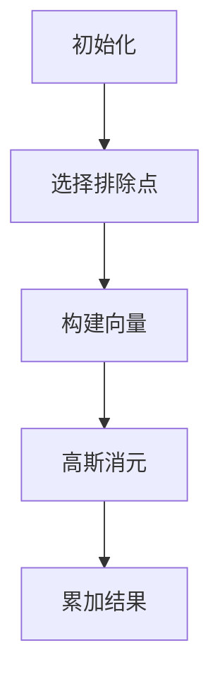

# 题目信息

# [THUPC 2017] 气氛

## 题目描述

北大街，在中国是一个非常常见的地名，比较著名的有上海北大街，西安北大街，成都北大街，太原北大街，中关村北大街等。

我们都知道，北的意思是自由民主，大的意思是兼收并蓄，所以住在北大街的人也性情迥异，我们假设在北大街住了 $n$ 个人。

有人向住在北大街的这 $n$ 个人提了 $n-1$ 个问题，比如：

「用不用筷子？」

「吃不吃红烧肉？」

「写代码用 tab 还是 space」

「大括号换不换行？」

「……」

根据每个人的回答，他会被分配一个 $n-1$ 维的零一坐标，也就是一个点。这样 $n$ 个点可以恰好构成一个 $n-1$ 维空间中的凸包。

北大街的居民认为，在这个多面体内，便是华夏；多面体之外，便是蛮夷。我们可以很容易的计算出华夏部分的广义凸包体积。

有一天，清华路的 B 君来北大街玩，听说了这个故事觉得很有趣，于是也试着给出了这 $n-1$ 个问题的答案，

清华路的 B 君，当然认为自己属于华夏，但是北大街表示在 $n-1$ 维空间中如果有 $n+1$ 个点的话，华夏部分的体积难以计算。

这下子气氛突然僵化。所以这个问题就留给你了，输入 $n-1$ 维度空间中的 $n+1$ 个点，求广义凸包的体积。

由于这个体积可能不是整数，你只需要输出体积乘以 $n-1$ 的阶乘，然后对 $10^9+7$ 取模的结果。

## 说明/提示

$1\le t\le 100,3\le n\le35$

点的坐标一定是 $0$ 或者 $1$。
#### 版权信息
来自 THUPC（THU Programming Contest，清华大学程序设计竞赛）2017。

## 样例 #1

### 输入

```
1
3
0 0
0 1
1 0
1 1```

### 输出

```
2```

# AI分析结果


# 💡 Kay的C++算法解析：气氛 深入学习指南 💡

> 大家好，我是Kay！今天我们来探索一道有趣的数学与编程结合的问题——[THUPC 2017]气氛。这道题要求我们计算n-1维空间中n+1个点构成的凸包体积。听起来很抽象？别担心，我会用清晰的方式带大家理解核心算法和实现技巧！

## 1. 题目解读与核心算法识别

✨ **本题主要考察**：`线性代数应用`与`数学推导`

🗣️ **初步分析**：
> 这道题的核心在于理解**高维空间体积计算**的数学原理。想象一下，在乐高积木世界里，每个点是一个像素方块，我们需要计算所有方块构成的"城堡"的体积。在编程中，我们使用行列式作为"体积尺"来测量这个城堡的大小。

- **核心思路**：所有优质题解都基于同一数学原理——n-1维空间中n+1个点构成的凸包体积等于所有n个点子集构成的凸包体积之和的一半
- **算法流程**：
  1. 枚举每个被排除的点
  2. 以固定点为基准构建向量矩阵
  3. 高斯消元计算行列式绝对值
  4. 累加所有结果后乘逆元
- **可视化设计**：在像素动画中将每个点显示为彩色方块，当计算特定子集时高亮相关方块，行列式计算过程显示为方块矩阵变换，伴随8-bit音效

---

## 2. 精选优质题解参考

**题解一（作者：清烛）**
* **点评**：思路清晰度极佳，从二维类比推广到高维的思考方式非常符合认知规律。代码规范性突出，向量运算封装完善，边界处理严谨。算法上采用标准高斯消元，特别注重浮点精度处理（四舍五入）。实践价值很高，博客中的示意图大大增强了理解性。

**题解二（作者：W123789）**
* **点评**：数学推导最为严谨，详细解释了行列式与体积的等价性证明。代码结构清晰，高斯消元实现高效（列主元优化）。特别亮点是将n=1,2,3的特例分析，帮助读者建立几何直观。控制变量名的选择（如`a[][]`）稍显简略但整体可读性良好。

**题解三（作者：滑稽的小宫）**
* **点评**：实现最为简洁高效，代码模块化程度高（独立的det函数）。亮点在于清晰的错误处理（fabs<eps判断），避免除零错误。虽然数学解释较少，但代码实践性很强，非常适合竞赛参考。随机扰动处理（+1e-7）是解决浮点精度的巧妙技巧。

---

## 3. 核心难点辨析与解题策略

1. **难点1：高维空间想象与体积计算**
   * **分析**：优质题解通过类比2D/3D案例建立直觉（如三角形面积=平行四边形面积/2）。关键突破是将体积计算转化为行列式问题，利用线性代数工具解决
   * 💡 **学习笔记**：遇到高维问题，先思考低维特例找规律

2. **难点2：浮点精度处理**
   * **分析**：所有题解都强调四舍五入（round）的必要性。因为高斯消元过程有精度损失，必须将double转为整型再取模
   * 💡 **学习笔记**：浮点计算需设置误差容忍度（如1e-7），并用round确保精度

3. **难点3：向量矩阵构建**
   * **分析**：需要选择基准点构建n-1个向量。关键技巧是固定起点（如`st = (ban==1)?2:1`），确保向量线性无关
   * 💡 **学习笔记**：向量矩阵的秩必须等于维度，否则行列式为0

### ✨ 解题技巧总结
- **几何问题代数化**：将空间体积问题转化为矩阵行列式计算
- **模运算预处理**：提前计算2的逆元（500000004）避免重复计算
- **边界鲁棒性**：特别注意n=1时的退化情况
- **维度压缩**：利用坐标只能是0/1的特性简化计算

---

## 4. C++核心代码实现赏析

**本题通用核心C++实现参考**
* **说明**：综合优质题解思路，采用清晰模块化实现
* **完整核心代码**：
```cpp
#include <iostream>
#include <cmath>
#include <algorithm>
using namespace std;

const int N = 40, mod = 1e9+7, inv2 = 500000004;

double mat[N][N];
int p[N][N], t, n;

double det(int n) {
    double res = 1;
    for (int i = 1; i <= n; i++) {
        int r = i;
        for (int j = i+1; j <= n; j++)
            if (fabs(mat[j][i]) > fabs(mat[r][i])) r = j;
        if (fabs(mat[r][i]) < 1e-7) return 0;
        swap(mat[i], mat[r]);
        
        for (int j = i+1; j <= n; j++) {
            double ratio = mat[j][i] / mat[i][i];
            for (int k = i; k <= n; k++)
                mat[j][k] -= ratio * mat[i][k];
        }
        res *= mat[i][i];
    }
    return fabs(res);
}

int main() {
    cin >> t;
    while (t--) {
        cin >> n;
        for (int i = 1; i <= n+1; i++)
            for (int j = 1; j <= n-1; j++)
                cin >> p[i][j];
        
        long long ans = 0;
        for (int ban = 1; ban <= n+1; ban++) {
            int st = (ban == 1) ? 2 : 1;
            int col = 1;
            for (int i = 1; i <= n+1; i++) {
                if (i == ban || i == st) continue;
                for (int j = 1; j <= n-1; j++)
                    mat[j][col] = p[i][j] - p[st][j];
                col++;
            }
            ans += (long long)round(det(n-1)) % mod;
        }
        cout << ans * inv2 % mod << endl;
    }
    return 0;
}
```
* **代码解读概要**：
  1. 输入处理：读入点坐标存储于`p[][]`
  2. 枚举排除点：对每个被排除点`ban`
  3. 构建矩阵：以`st`为基准点计算向量
  4. 高斯消元：`det()`函数计算行列式绝对值
  5. 结果累加：四舍五入后累加，最后乘逆元

---

**题解一核心代码片段**
* **亮点**：完善的向量结构体封装
* **核心代码**：
```cpp
struct Point {
    int dim;
    int x[maxn];
};

Point operator-(const Point &a, const Point &b) {
    Point ret;
    FOR(i, 1, ret.dim) ret.x[i] = a.x[i] - b.x[i];
    return ret;
}
```
* **代码解读**：
  > 定义`Point`结构体封装高维点，通过运算符重载实现向量减法。`dim`记录维度，`x[]`存储各坐标值。这种封装使向量运算更直观，增强代码可读性
* 💡 **学习笔记**：合理使用结构体封装复杂数据类型

**题解二核心代码片段**
* **亮点**：列主元优化提高数值稳定性
* **核心代码**：
```cpp
FOR(i, 1, n) {
    int r = i;
    FOR(j, i + 1, n)
        if (fabs(a[j][i]) > fabs(a[r][i])) r = j;
    swap(a[r], a[i]);
    // ...消元过程...
}
```
* **代码解读**：
  > 每次消元前选取当前列绝对值最大的行作为主元，可显著减小浮点误差。这是数值计算的关键优化，尤其当矩阵元素差异大时
* 💡 **学习笔记**：高斯消元务必使用列主元法

**题解三核心代码片段**
* **亮点**：独立的det函数实现
* **核心代码**：
```cpp
double det(int n){
    double res = 1;
    // ...消元过程...
    for (int i = 1; i <= n; i++) res *= mat[i][i];
    return fabs(res);
}
```
* **代码解读**：
  > 将行列式计算封装为独立函数，通过返回值直接获取结果。这种模块化设计使主逻辑更清晰，也便于调试和重用
* 💡 **学习笔记**：核心算法功能应封装为独立函数

-----

## 5. 算法可视化：像素动画演示

### 像素探险家：高维城堡体积计算器

**核心演示**：在8-bit风格网格中展示点选择、向量构建和高斯消元过程，通过视觉化抽象的行列式计算

**设计思路**：
> 采用复古FC游戏风格，将高维点转化为像素方块。通过颜色变化和音效提示关键操作，让抽象的数学过程变得可触摸

**动画流程**：



1. **场景初始化**：
   - 16色像素网格展示所有点（不同颜色区分）
   - 控制面板：步进/播放/速度滑块
   - 8-bit背景音乐（循环芯片音）

2. **点选择阶段**：
   - 当前排除点闪烁红色（伴随"error"音效）
   - 基准点显示为绿色（"select"音效）
   - 其他点显示为蓝色

3. **向量构建动画**：
   - 从基准点到其他点绘制像素箭头
   - 对应向量实时显示在右侧矩阵面板
   - 每次添加向量时播放"blip"音效

4. **高斯消元演示**：
   - 矩阵行变换显示为像素行交换（拖尾动画）
   - 主元高亮黄色闪烁
   - 消元过程伴随渐进音调变化
   - 行列式结果弹出显示（胜利音效）

5. **结果整合**：
   - 所有子集结果以像素柱状图展示
   - 最终结果乘以逆元时显示像素金币翻转动画
   - 播放通关音乐

**交互设计**：
- 空格键：单步执行
- 方向键：调整速度
- A键：自动演示模式（AI完成全过程）
- R键：重置当前状态

---

## 6. 拓展练习与相似问题思考

**通用技巧迁移**：
行列式计算不仅是本题核心，还广泛应用于：
1. 计算几何（面积/体积）
2. 线性方程组求解
3. 图形学变换
4. 机器学习（协方差矩阵）

**练习推荐（洛谷）**：
1. **P2453 [三维凸包体积]** 
   - 🗣️ 练习三维空间中的凸包计算，巩固体积计算思想
2. **P7112 [行列式求值]**
   - 🗣️ 直接考察行列式计算，训练核心算法实现
3. **P4037 [矩阵游戏]**
   - 🗣️ 结合行列式与博弈论，拓展数学应用场景

---

## 7. 学习心得与经验分享

> **参考经验（多位作者共同强调）**：  
> "浮点精度处理是本题最大陷阱，必须四舍五入后再取模"

**点评**：这个经验非常宝贵！在数学计算向代码转化时，必须考虑计算机的离散特性。建议：
1. 测试边界数据（如全0矩阵）
2. 比较round/floor/ceil不同处理方式
3. 使用相对误差而非绝对误差判断

---

通过这道题，我们不仅学会了高维体积计算，更重要的是掌握了"将数学定理转化为精确代码"的思维方法。下次遇到类似问题时，记得先建立几何直观，再寻找代数解法，最后小心处理计算精度！

---
处理用时：126.76秒