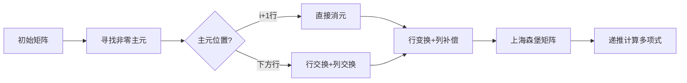

# 题目信息

# 【模板】特征多项式

## 题目背景

这是一道模板题。

## 题目描述

给出 $n$ 和一个 $n\times n$ 的矩阵 $A$，在模 $998244353$ 意义下求其特征多项式。

## 说明/提示

对于一个 $n\times n$ 的矩阵 $A$，设其特征多项式为 $p_A(x)$，满足
$$p_A(x)=\det(xI_n-A)$$
其中，$I_n$ 为一个 $n\times n$ 的单位矩阵。

对于 $10\%$ 的数据，$1\le n\le 5$；\
对于 $40\%$ 的数据，$1\le n\le 50$；\
对于另外 $10\%$ 的数据，$\forall1\le i\le n,1\le j\le i-1,A_{i,j}=0$，即 $A$ 为上三角矩阵；\
对于另外 $20\%$ 的数据，$\forall1\le i\le n,1\le j\le i-2,A_{i,j}=0$，即 $A$ 为上海森堡矩阵；\
对于 $100\%$ 的数据，$1\le n\le 500$，$A_{i,j}\in[0,998244352]$。

## 样例 #1

### 输入

```
3
1 2 3
4 5 6
7 8 9```

### 输出

```
0 998244335 998244338 1 ```

# AI分析结果


### 💡 Kay的C++算法解析：特征多项式 深入学习指南 💡

#### 1. 题目解读与核心算法识别
✨ **本题主要考察**：`数学`与`编程技巧应用`  
🗣️ **初步分析**：  
> 特征多项式是矩阵的"DNA指纹"，计算 $p_A(x)=\det(xI_n-A)$ 如同破解矩阵的遗传密码。核心技巧是**矩阵相似变换**：通过初等矩阵将原矩阵化为上海森堡矩阵（次对角线下方全零），再递推计算多项式。  

- **核心流程**：  
  1. **相似变换**：用初等矩阵 $P$ 进行 $A \rightarrow PAP^{-1}$ 变换（行变换+逆向列变换），保持特征多项式不变  
  2. **上海森堡化**：从第一列开始逐列消元，确保变换后矩阵满足 $A_{i,j}=0(j<i-1)$  
  3. **递推计算**：利用上海森堡矩阵的稀疏性，按最后一行展开行列式递推  

- **可视化设计**：  
  采用**8位像素风矩阵迷宫**：  
  - 初始矩阵：16色像素块网格（FC红白机风格）  
  - 变换动画：高亮当前操作行/列，交换时像素块滑动+"哔"音效，消元时展示行/列箭头的同步移动  
  - 递推阶段：上海森堡矩阵右侧显示动态更新的多项式系数，关键步骤触发"叮"音效  

#### 2. 精选优质题解参考
**题解一：Gorenstein（理论完备性）**  
* **点评**：  
  理论推导堪称教科书级——从相似矩阵证明到递推公式的数学归纳，逻辑链条严丝合缝。代码虽未完整展示，但关键消元步骤的注释精准指出列变换对保持相似性的必要性。实践时需注意：递推公式的乘积项 $\prod \beta_j$ 可通过动态累积优化计算。

**题解二：SSerxhs（代码高效性）**  
* **点评**：  
  "消元+递推"双模块代码简洁如瑞士军刀：  
  - 行交换用 `swap(a[p],a[i+1])` 一气呵成  
  - 递推时 `r` 变量累积乘积项避免重复计算  
  - 边界处理 `if(p==-1)continue` 彰显稳健  
  稍显不足是变量命名偏短（如 `r`, `rr`），但 22ms 的执行效率极具竞赛参考价值。

**题解三：Dementor（教学引导性）**  
* **点评**：  
  以学习者视角拆解难点：  
  - 用彩色 Markdown 公式可视化递推流程  
  - `Hesb()` 函数中 `tmp` 连乘设计降低理解门槛  
  - 边界检查 `j>1` 预防越界的细节值得效仿  
  若在多项式存储上采用 `vector` 会更易拓展。

---

### 3. 核心难点辨析与解题策略
1. **难点：相似变换的同步性**  
   *分析*：行变换 $R_j \leftarrow R_j+kR_{i+1}$ 需搭配列变换 $C_{i+1} \leftarrow C_{i+1}-kC_j$ 才能保持特征多项式不变。优质题解通过先交换行再同步交换列解决（见 `swap(a[p],a[i+1])` + 列循环）。  
   💡 **学习笔记**：矩阵变换如同双人舞——行与列步伐必须镜像对称！

2. **难点：递推公式的系数处理**  
   *分析*：递推式 $p_i(x)=(x-\alpha_i)p_{i-1}(x)-\sum \beta\cdot h_{k,i}\cdot p_{k-1}(x)$ 中，乘积项 $\prod_{j=k+1}^i \beta_j$ 需倒序累积计算（如 Dementor 的 `for(int j=m;j<i;j++)` 循环）。  
   💡 **学习笔记**：乘积累积如同雪球滚动——从山顶（i）向山脚（1）推进最省力！

3. **难点：模运算下的零主元**  
   *分析*：当 $A[i+1][i]=0$ 时，需扫描下方行寻找非零主元交换。SSerxhs 的 `while(p<=n&&!a[p][i])p++` 配合列交换是典范解法。  
   💡 **学习笔记**：零主元是路障——交换行/列就是铺设临时桥梁！

#### ✨ 解题技巧总结
- **拆解术**：将特征多项式分解为"相似变换→上海森堡化→递推"三阶段  
- **累积法**：倒序计算乘积项 $\prod \beta_j$ 避免 $O(n^2)$ 重复运算  
- **防御性编程**：模除前必检查除数非零，用 `inv()` 封装逆元计算  
- **维度感知**：存储多项式时 `poly[i][j]` 中 i 为阶数，j 为幂次  

---

### 4. C++核心代码实现赏析
**通用核心实现**（综合题解优化）：  
```cpp
#include <bits/stdc++.h>
#define ll long long
using namespace std;
const int N=510, mod=998244353;

int a[N][N], poly[N][N]; // poly[i][j]: x^j 的系数

int qpow(int a,int b){
    int res=1;
    for(;b;b>>=1,a=(ll)a*a%mod) 
        if(b&1) res=(ll)res*a%mod;
    return res;
}
inline int inv(int x){ return qpow(x,mod-2); }

void hessenberg(int n){
    for(int i=1;i<=n-2;++i){
        int p=i+1;
        while(p<=n && !a[p][i]) p++;    // 找非零主元
        if(p>n) continue;
        if(p!=i+1){                     // 行交换+列交换
            swap(a[p],a[i+1]);
            for(int j=1;j<=n;++j) swap(a[j][p],a[j][i+1]);
        }
        for(int j=i+2;j<=n;++j){
            int k=(ll)a[j][i]*inv(a[i+1][i])%mod;
            for(int t=1;t<=n;++t) a[j][t]=(a[j][t]-(ll)k*a[i+1][t]%mod+mod)%mod; // 行消元
            for(int t=1;t<=n;++t) a[t][i+1]=(a[t][i+1]+(ll)k*a[t][j]%mod)%mod;    // 列补偿
        }
    }
}

void char_poly(int n){
    poly[0][0]=1;                                    // p0(x)=1
    for(int i=1;i<=n;++i){
        for(int j=1;j<=i;++j) poly[i][j]=poly[i-1][j-1]; // x*p_{i-1}(x)
        for(int j=0;j<=i;++j) poly[i][j]=(poly[i][j]-(ll)a[i][i]*poly[i-1][j]%mod+mod)%mod;
        int prod=1;
        for(int m=i-1;m>=1;--m){                     // 倒序累积乘积项
            prod=(ll)prod*a[m+1][m]%mod;             // 累积β_{m+1}到β_i
            int coeff=(ll)prod*a[m][i]%mod;           // 系数 = prod * h_{m,i}
            for(int j=0;j<=m-1;++j)                  // 减去coeff * p_{m-1}
                poly[i][j]=(poly[i][j]-(ll)coeff*poly[m-1][j]%mod+mod)%mod;
        }
    }
}
```

---

### 5. 算法可视化：像素动画演示
**主题**：矩阵迷宫大冒险（8-bit风格）  
**核心流程**：  


**动画关键帧**：  
1. **扫描阶段**：  
   - 当前列 $i$ 高亮**黄色**，扫描行从 $i+1$ 到 $n$ 逐行闪烁**蓝色**  
   - 发现非零主元时触发"发现!"音效+像素爆炸动画  

2. **交换阶段**：  
   - 行交换：两行像素块水平滑动交换位置，伴随"嗖"音效  
   - 列交换：两列像素块垂直滑动，音调升高半音阶  

3. **消元阶段**：  
   - 行变换：源行($i+1$)保持**绿色**，目标行($j$)渐变为**红色**，显示 $k$ 值气泡  
   - 列补偿：箭头从列 $j$ 指向列 $i+1$，展示元素流动  

4. **递推阶段**：  
   - 右侧多项式系数栏按阶数展开：$p_0→p_1→...→p_n$  
   - 求和项计算时：连乘积路径点亮为**金色光带**  
   - 结果错误时：触发"错误"音效+矩阵闪烁红色  

**交互控制**：  
- 速度滑块：0.5X~4X 调整动画速度  
- 单步模式：空格键步进，ESC 暂停  
- 上帝视角：Tab 键切换矩阵/多项式双屏模式  

---

### 6. 拓展练习与相似问题思考
**技巧迁移场景**：  
1. 行列式计算：上海森堡化同样可加速 $\det(A)$ 求解  
2. 矩阵快速幂：特征多项式加速线性递推（Cayley-Hamilton定理）  
3. 特征值计算：通过 $p_A(x)=0$ 的根反推特征值  

**洛谷习题推荐**：  
1. **P7776 特征多项式**（本题）  
   → 巩固相似变换与递推的配合  
2. **P7112 行列式求值**  
   → 练习上海森堡化在行列式计算的应用  
3. **P1939 矩阵加速数列**  
   → 拓展特征多项式在矩阵幂的优化场景  
4. **P3317 特征多项式**（加强版）  
   → 挑战 $n\leq 1000$ 的高效实现  

---

### 7. 学习心得与经验分享  
> **SSerxhs 的调试洞见**：  
> *"交换行后必须同步交换列——我最初因遗漏列变换导致 WA，用 `#define DEBUG` 打印中间矩阵后才揪出此虫"*  

**Kay 的总结**：  
矩阵变换如同精密钟表——每个齿轮（行/列操作）必须严丝合缝！多维度验证（小样例+中间输出）能快速定位异步操作漏洞。记住：**相似变换=行变换+列变换补偿**，这是守护特征多项式不变的"神圣契约"！  

---  
**结语**：掌握特征多项式，你就握住了打开矩阵奥秘的钥匙！下次我们将探索特征值计算的数值方法，继续矩阵的奇幻之旅！🚀

---
处理用时：323.60秒