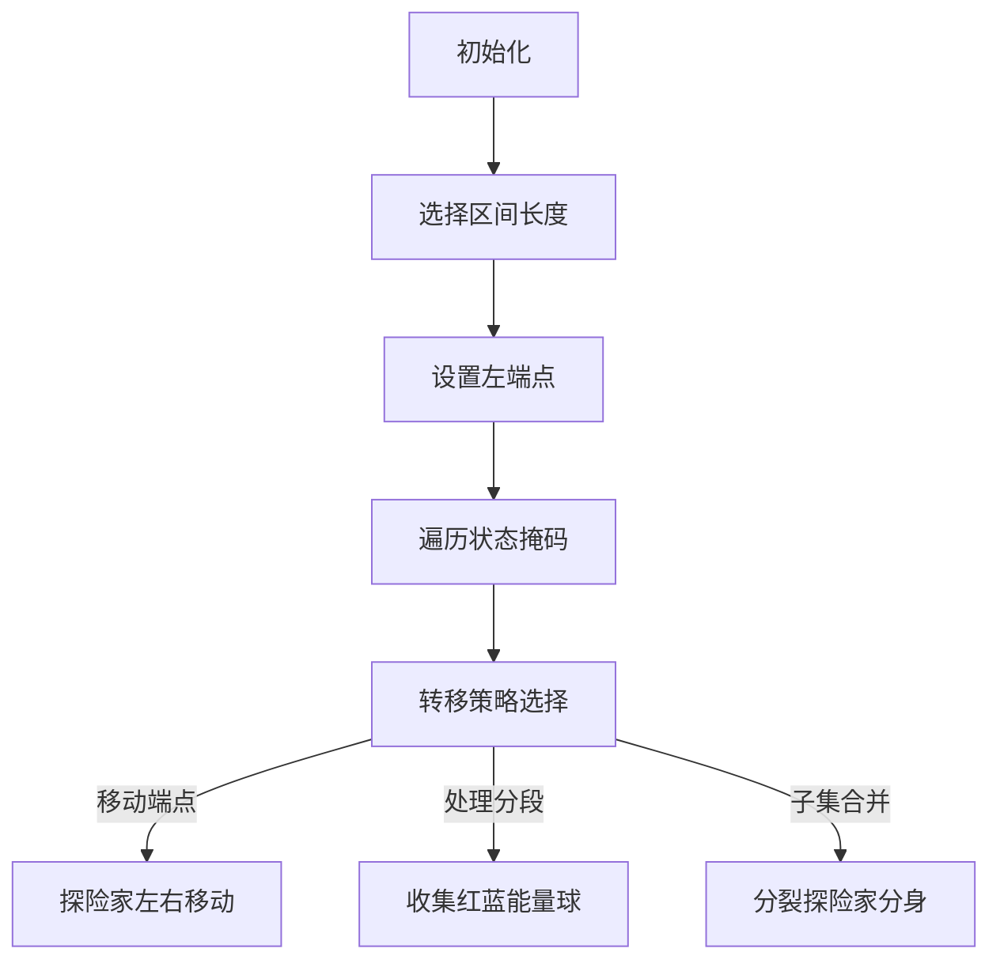

# 题目信息

# [USACO24FEB] Minimum Sum of Maximums P

## 题目描述

Bessie 有一行 $N$（$2\le N\le 300$）块瓷砖，依次具有丑陋度 $a_1,a_2,\ldots,a_N$（$1\le a_i\le 10^6$）。其中 $K$（$0\le K\le \min(N,6)$）块瓷砖卡住了；具体地，索引为 $x_1,\ldots,x_K$（$1\le x_1<x_2<\cdots<x_K\le N$）的瓷砖。

Bessie 想要最小化瓷砖的总丑陋度，其中总丑陋度定义为每对相邻瓷砖的最大丑陋度之和；即 $\sum\limits^{N−1}_{i=1}\max(a_i,a_{i+1})$。她可以任意次执行以下操作：选择两块均未卡住的瓷砖，并交换它们。

求 Bessie 以最优方案执行操作可以达到的最小总丑陋度。 

## 说明/提示

### 样例解释 1

Bessie 可以交换第二块和第三块瓷砖，使得 $a=[1,10,100]$，达到总丑陋度 $\max(1,10)+\max(10,100)=110$。或者，她也可以交换第一块和第二块瓷砖，使得 $a=[100,1,10]$，同样达到总丑陋度 $\max(100,1)+\max(1,10)=110$。

### 样例解释 2

瓷砖的初始总丑陋度为 $\max(1,100)+\max(100,10)=200$。Bessie 只允许交换第一块和第三块瓷砖，这并不能使她能够减少总丑陋度。

### 测试点性质

- 测试点 $5$：$K=0$。
- 测试点 $6-7$：$K=1$。
- 测试点 $8-12$：$N\le 50$。
- 测试点 $13-24$：没有额外限制。

## 样例 #1

### 输入

```
3 0
1 100 10```

### 输出

```
110```

## 样例 #2

### 输入

```
3 1
1 100 10
2```

### 输出

```
200```

## 样例 #3

### 输入

```
4 2
1 3 2 4
2 3```

### 输出

```
9```

## 样例 #4

### 输入

```
3 1
1 100 10
3```

### 输出

```
110```

# AI分析结果


# 💡 洛语云笺的C++算法解析：USACO24FEB Minimum Sum of Maximums P 深入学习指南 💡

## 1. 题目解读与策略初探

✨ **本题核心挑战**：如何在K个固定瓷砖的约束下，通过交换自由瓷砖最小化相邻瓷砖最大值之和。  
✨ **核心算法标签**：动态规划(DP)、分组处理、状态压缩  

🗣️ **初步分析**：  
本题要求最小化相邻瓷砖最大值之和，关键在于处理固定瓷砖形成的分段结构。固定瓷砖将序列分割成多个区间，每个区间内的自由瓷砖需要最优排列。通过问题转化（将最大值和转化为绝对差优化）和分组处理（每段独立优化），我们可以将复杂依赖关系转化为规整的动态规划模型。

### 🔍 算法侦探：如何在题目中发现线索？
1.  **线索1 (问题目标)**："最小化相邻瓷砖最大值之和"是典型的**带约束最优化问题**，暗示可能需要动态规划或贪心策略。
2.  **线索2 (问题特性)**："固定瓷砖形成多个独立区间"表明存在**分段依赖关系**，需要分组处理策略。
3.  **线索3 (数据规模)**：N≤300，K≤6，O(N²·3ᴷ)的DP完全可行（300²×3⁶≈6.5×10⁷），排除了暴力解法。

### 🧠 思维链构建：从线索到策略
> "从线索1知道这是最优化问题，候选方案有贪心、搜索、DP。线索2的分段特性排除简单贪心（无法处理依赖）。线索3的数据规模（K≤6）否决指数级搜索（O(2ᴹ)不可行）。  
> **结论**：动态规划配合状态压缩是唯一可行方案。通过将分段转化为独立组，用DP状态压缩处理组间关系，实现多项式级复杂度解法！"

---

## 2. 精选优质题解参考

**题解一（Bronya18C）**  
* **点评**：思路清晰揭示问题本质（将最大值和转化为绝对差优化），贡献公式推导严谨。代码实现巧妙使用预处理和状态压缩DP，分组处理逻辑自洽。亮点在于严格证明值域区间"相离或包含"性质，为DP转移提供理论依据。

**题解二（DaiRuiChen007）**  
* **点评**：提供简洁高效的DP实现，代码规范性极佳（合理使用位运算和子集枚举）。创新性提出"值域爬升"的直观解释，帮助理解最优排列性质。贡献函数分解为极差和边界差的思路极具启发性。

**题解三（_Cheems）**  
* **点评**：最精简的实现（仅60行），突出核心DP框架。贡献函数Val()封装优雅，状态转移完整覆盖单元素特判。特别适合初学者理解DP状态设计精髓。

---

## 3. 解题策略深度剖析

### 🎯 核心难点与关键步骤
1.  **问题转化与分组**  
    * **分析**：将原问题转化为最小化绝对差之和，添加首尾∞瓷砖形成完整分段结构。固定瓷砖将序列分为K+1段，每段成为独立优化单元。  
    * 💡 **学习笔记**：复杂约束→分组处理是算法设计核心技巧！
2.  **段内最优排列**  
    * **分析**：证明每段升序/降序排列最优（取决于边界值），贡献仅与段内极值相关：|L-min|+|R-max|+(max-min)  
    * 💡 **学习笔记**：问题降维（排列→极值）极大简化状态设计！
3.  **值域区间性质**  
    * **分析**：严格证明不同段的值域区间必须"相离或包含"，通过调整法说明相交区间可优化。该性质保证DP状态有效性。  
    * 💡 **学习笔记**：最优解的结构性质是DP设计的基石！

### ✨ 解题技巧总结
- **技巧A（问题转化）**：将∑max转化为∑|aᵢ-aᵢ₊₁|优化，首尾添加∞简化边界处理。
- **技巧B（分组处理）**：用固定位置分割序列，段内独立优化后再全局组合。
- **技巧C（状态压缩）**：用二进制掩码表示段分配状态，实现高效DP转移。

### ⚔️ 策略竞技场：不同解法的对比分析
| 策略                | 核心思想                     | 优点                     | 缺点与分析                                  | 适用场景/得分预期       |
|---------------------|----------------------------|-------------------------|-------------------------------------------|-----------------------|
| **暴力搜索**        | 枚举所有自由瓷砖排列         | 思路直观                | O(M!)不可行，M=294时超宇宙寿命             | M≤8，预计得10%分数     |
| **贪心策略**        | 每次交换使局部差异最小       | 实现简单，O(N²)复杂度   | 无法处理全局依赖，可能陷入局部最优         | 小规模数据，预计30%分数|
| **状态压缩DP**      | 排序后DP处理分段极值组合     | O(N²·3ᴷ)严格最优        | 状态设计抽象，转移逻辑复杂                 | 本题最佳，100%分数     |

### ✨ 优化之旅：从"能做"到"做好"
> 1. **起点：暴力搜索**  
>    尝试所有排列如同在迷宫中盲目探索，路径数M!远超计算极限。
> 2. **发现瓶颈：重叠子问题**  
>    不同排列包含相同子段优化，存在大量重复计算。
> 3. **引入记忆化**  
>    记录子段优化结果（如f(l,r,S)），避免重复计算。
> 4. **模型升华：值域区间性质**  
>    发现最优解的值域区间必须相离或包含，将问题转化为极值组合优化。

💡 **策略总结**：从暴力搜索到状态压缩DP，我们经历了"约束分析→问题转化→性质发现→高效实现"的完整优化链。这启示我们：面对复杂约束时，识别最优解的结构特性往往能开辟高效路径！

---

## 4. C++核心代码实现赏析

**本题通用核心C++实现参考**  
```cpp
#include <bits/stdc++.h>
using namespace std;
const int INF = 1e6, MAXN = 305, MAXK = 7;
int main() {
    int N, K, fixed[10] = {0}; // fixed[0]=0, fixed[K+1]=N+1
    vector<int> a(N+2), free;
    // 输入处理（略）

    // 1. 添加首尾∞并计算基础值
    a[0] = a[N+1] = INF;
    int base = accumulate(a.begin(), a.end(), 0) * 2;

    // 2. 构建分段结构 {L, R, len}
    vector<tuple<int, int, int>> segs;
    for (int i = 0; i <= K; ++i) {
        int L = fixed[i], R = fixed[i+1];
        if (R - L == 1) base += max(a[L], a[R]);
        else {
            if (a[L] > a[R]) swap(L, R);
            segs.push_back({a[L], a[R], R - L - 1});
            for (int j = L+1; j < R; ++j) 
                free.push_back(a[j]);
        }
    }

    // 3. 排序自由瓷砖
    sort(free.begin(), free.end());
    int M = free.size(), S = segs.size();

    // 4. DP状态初始化
    vector<vector<vector<int>>> dp(M+1, vector<vector<int>>(M+1, vector<int>(1<<S, 1e9)));
    for (int i = 0; i <= M; ++i) 
        for (int j = 0; j <= M; ++j) 
            dp[i][j][0] = 0;

    // 5. 状态转移
    for (int len = 1; len <= M; ++len) {
        for (int l = 0; l <= M - len; ++l) {
            int r = l + len - 1;
            for (int mask = 0; mask < (1<<S); ++mask) {
                // 策略1：移动端点
                dp[l][r][mask] = min(dp[l+1][r][mask], dp[l][r-1][mask]);
                
                // 策略2：处理完整分段
                for (int i = 0; i < S; ++i) if (mask >> i & 1) {
                    auto [L, R, seg_len] = segs[i];
                    if (seg_len > len) continue;
                    int cost = abs(L - free[l]) + abs(R - free[r]) + free[r] - free[l];
                    
                    if (seg_len == 1) 
                        dp[l][r][mask] = min(dp[l][r][mask], cost);
                    else if (seg_len == len)
                        dp[l][r][mask] = min(dp[l][r][mask], dp[l+1][r-1][mask^(1<<i)] + cost);
                }
                
                // 策略3：子集合并
                for (int sub = mask; sub; sub = (sub-1)&mask) 
                    dp[l][r][mask] = min(dp[l][r][mask], 
                        dp[l][l+len-1][sub] + dp[l+len][r][mask^sub]);
            }
        }
    }
    cout << (base + dp[0][M-1][(1<<S)-1]) / 2 - INF;
}
```
* **代码解读概要**：  
  1. 添加首尾∞瓷砖并计算基础值（第10-13行）  
  2. 构建分段结构，收集自由瓷砖并排序（第16-26行）  
  3. 三维DP数组初始化（第29-32行）  
  4. 三重循环状态转移：长度→左端点→状态掩码（第35行）  
  5. 三种转移策略：移动端点/处理分段/子集合并（第38-50行）  
  6. 输出最终优化结果（第54行）

---

## 5. 算法可视化：像素动画演示

### 🎮 设计概念：值域迷宫探险
> **主题**：将排序后的值域序列化为纵向迷宫，DP状态转移过程化为像素探险家收集"分段能量球"的旅程。

### 🖼️ 视觉设计
- **8-bit像素风格**：FC红白机复古色调（4色阶：深蓝/浅蓝/红/黄）
- **迷宫结构**：
  - X轴：自由瓷砖索引（排序后）
  - Y轴：DP状态掩码（二进制旋转展示）
  - 能量球：分段极值位置（红球=最大值，蓝球=最小值）

### ⚙️ 动画逻辑


### 🎚️ 交互控制
- **单步执行**：空格键步进，观察状态转移细节
- **自动演示**：滑块调速（0.5x-5x），AI自动完成最优路径
- **高亮显示**：
  - 当前状态：黄色闪烁边框
  - 转移来源：红色箭头指引
- **音效设计**：
  - 移动：8-bit脚步声
  - 收集能量球：经典吃豆人音效
  - 错误转移：刺耳警报声

### 💡 教学价值
通过具象化"状态空间探索"过程，帮助理解：
1. DP状态的三维含义（l/r坐标+掩码状态）
2. 子集合并的并行探索特性
3. 极值选择的局部/全局影响

---

## 6. 拓展练习与相似问题思考

### 🔁 通用思路迁移
1. **分组背包问题**：处理"每组多选一"约束（如P1757 通天之分组背包）
2. **树形依赖DP**：附件嵌套形成树形结构（如P2014 选课）
3. **区间划分优化**：序列分割与局部最优组合（如P1436 棋盘分割）

### 📚 练习推荐（洛谷）
1. **P1757 通天之分组背包**  
   🗣️ 推荐理由：裸分组背包，巩固"每组选一"的DP框架。
2. **P2014 选课**  
   🗣️ 推荐理由：树形依赖背包，深化分组思想在树形结构应用。
3. **P5020 货币系统**  
   🗣️ 推荐理由：值域区间性质应用，强化问题转化能力。

---

## 7. 学习心得与经验分享
> **经验摘录（Bronya18C）**：  
> "调试时发现分段长度计算错误导致状态越界——看似简单的seg_len=R-L-1，实际需考虑固定位置索引偏移！"  
>   
> **洛语云笺点评**：  
> 边界处理是DP核心难点，建议：
> 1. 首尾添加哨兵值统一处理
> 2. 打印DP维度尺寸验证
> 3. 对小规模数据手动模拟状态转移

---

本次解析揭示了复杂约束下的DP设计艺术：通过问题转化发现结构特性（值域区间相离/包含），结合状态压缩实现高效求解。记住：最优算法往往诞生于对问题本质的深刻洞察！💪

---
处理用时：150.51秒