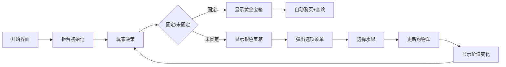

# 题目信息

# [NOISG 2022 Finals] Fruits

## 题目描述

超市里通常有专门的一区卖水果。

兔子 $\text{Benson}$ 常去的超市一共有 $N$ 个柜台用来卖 $N$ 种水果。柜台编号从 $1 \sim N$，水果编号从 $1 \sim N$。第 $i$ 种水果的美味度是 $i$，购买需要花费 $C_i$ 元。**保证对于所有的 $1 \le i < j \le N$，有 $C_i \le C_j$。**

每一个柜台都只买一种水果，每一种水果都有且仅有一个柜台售卖。现在，工作人员规定了每个柜台卖哪一种水果。第 $i$ 个柜台卖第 $A_i$ 种水果。如果 $A_i=-1$，则表示这个柜台还没有确定卖什么。

当所有柜台的水果都摆放好，$\text{Benson}$ 就会进店抢购。他会按照 $1 \sim N$ 的顺序去这些柜台。当他到了一个柜台，如果他的购物车里还是空的，或当前柜台水果的美味度大于所有他购物车里的水果，那么他就会购买这种水果，将其放进购物车中。

现在你需要让商店赚到最多的钱。你需要计算怎么来摆放那些 $A_i=-1$ 的柜台使得利润最大化。由于 $\text{Benson}$ 很赶时间，他可能不会逛完所有柜台，所以你需要对于所有的 $1 \le k \le N$ 计算如果 $\text{Benson}$ 只逛第 $1 \sim k$ 个柜台，那么这些柜台应该如何摆放最优。

## 说明/提示

**【数据范围】**

|$\text{Subtask}$|分值|特殊性质|
|:-:|:-:|:-:|
|$0$|$0$|样例|
|$1$|$6$|$N\le8$|
|$2$|$5$|对于所有 $1\le j\le N$，$A_j=-1$|
|$3$|$11$|$N\le200$|
|$4$|$13$|$N\le2000$|
|$5$|$23$|对于所有 $1\le j\le N$，$C_j=1$|
|$6$|$42$|无|

对于 $100\%$ 的数据，$1 \le N \le 400000,1 \le A_j \le N$ 或 $A_j=-1,1 \le C_i \le 10^9$。

## 样例 #1

### 输入

```
5
-1 -1 -1 -1 -1
1 1 1 1 1```

### 输出

```
1 2 3 4 5
```

## 样例 #2

### 输入

```
5
-1 3 -1 -1 -1
1 2 2 2 3
```

### 输出

```
3 4 7 9 9```

## 样例 #3

### 输入

```
13
-1 -1 5 6 -1 -1 7 11 -1 -1 10
-1 -1
1 1 1 1 1 1 1 1 1 1 1 1 1
```

### 输出

```
1 2 3 4 5 6 6 7 8 9 9 9 9```

## 样例 #4

### 输入

```
10
-1 -1 -1 -1 5 -1 -1 -1 9 -1
5 11 24 27 35 60 72 81 91 92```

### 输出

```
92 173 245 305 305 332 356 367 406 498
```

# AI分析结果


# 💡 洛语云笺的C++算法解析：[NOISG 2022 Finals] Fruits 深入学习指南 💡

## 1. 题目解读与策略初探

✨ **本题核心挑战**：处理柜台序列中已固定水果和未固定水果的混合依赖关系，在每个前缀长度约束下最大化购买总价值，同时满足Benson的购买规则（仅当新水果美味度大于购物车中最大值时才购买）。

✨ **核心算法标签**：动态规划（DP）、分组背包、数据结构优化

🗣️ **初步分析**：
> 本题需要为每个前缀长度k独立求解最优方案。核心难点在于：
> - 固定水果的位置会强制形成"购买点"
> - 未固定水果需要合理分配以最大化价值
> - 购买决策具有链式依赖（新水果必须大于历史最大值）
>
> 思路演进路径：
> 1. **暴力枚举**：尝试所有未固定水果的排列组合，O(2^M)不可行
> 2. **朴素DP**：f[i][j]表示前i个柜台最大值为j的最大价值，O(N^2)超时
> 3. **分组背包优化**：将每个主件（固定水果）及其附件（未固定水果）组合视为"分组"，每组选一种组合
> 4. **数据结构加速**：用线段树/双端队列维护DP状态转移，达到O(N log N)
>
> **核心算法比喻**：超市柜台就像一组宝箱，固定水果是已知的黄金宝箱，未固定水果是待解密的银宝箱。分组背包就像给宝箱分类打包，让我们能在有限时间内选择最优的宝箱组合。

### 🔍 算法侦探：如何在题目中发现线索？
1.  **线索1 (问题目标)**："在满足购买规则下求最大价值"属于**带依赖的最优化问题**，是动态规划的典型标志。
2.  **线索2 (问题特性)**："固定水果决定购买点，未固定水果需配合"存在**决策依赖性**，指向背包问题变种（分组背包）。
3.  **线索3 (数据规模)**：N≤400,000要求O(N log N)解法，排除暴力枚举和朴素DP。

### 🧠 思维链构建：从线索到策略
> 综合线索：
> 1. 最优化问题先想到DP/贪心，但依赖关系排除贪心
> 2. 数据规模排除O(N^2)以上算法
> 3. 购买规则中的"最大值递增"特性提示状态定义：f[i]=前i柜台的最优解
> 4. 固定水果形成决策分界点，自然引导分组背包思想
> 5. 利用C_i单调性可优化状态转移
> 
> **结论**：分组背包模型+数据结构优化是最佳策略，时间复杂度O(N log N)完美匹配数据规模。

---

## 2. 精选优质题解参考

**题解一（liangbowen）**
* **点评**：思路清晰呈现代码演进（O(N^3)→O(N log N)），创新性地将依赖关系转化为分组背包模型。亮点在于：
  - 用`lambda`简化重复计算，提升代码可读性
  - 线段树实现精细，维护三种关键参数（值、左界、右界）
  - 详细注释帮助理解复杂数据结构操作
  > "将主附件关系转化为分组决策，是问题抽象的精髓"

**题解二（yyyyxh）**
* **点评**：双端队列+颜色段均摊实现高效DP维护。亮点：
  - 利用单调性证明转移必然性，避免无效计算
  - 懒标记设计巧妙（记录位移次数和累加和）
  - 二分查找优化分段更新
  > "颜色段均摊将O(N^2)转移降为O(N log N)，展现算法优化艺术"

**题解三（DaiRuiChen007）**
* **点评**：代码简洁高效，亮点：
  - 统一维护f[i]-v[i]避免重复计算
  - 双端队列操作精准（push_front/pop_back模拟位移）
  - 边界处理严谨，特别关注空队列和非法状态
  > "减法变换是维护单调性的神来之笔"

---

## 3. 解题策略深度剖析

### 🎯 核心难点与关键步骤
1.  **依赖关系建模**
    * **分析**：固定水果强制成为购买点，未固定水果需配合形成"分组"。预处理将未固定水果按美味度排序，建立分组映射。
    * 💡 **学习笔记**：预处理是处理混合依赖的关键，将复杂约束转化为规整结构。
2.  **状态转移优化**
    * **分析**：定义f[i]表示前i柜台的最优解。转移分两种情况：
      - 固定水果：f[i] = max(f[j] + C[a_i]) (j < i且a_i > 历史最大值)
      - 未固定水果：f[i] = f[i-1] + C[k] (k为当前选择的水果)
    * 💡 **学习笔记**：利用C_i单调性，可用数据结构加速max查询。
3.  **数据结构选择**
    * **分析**：线段树适合区间查询/更新，双端队列适合位移操作。本题转移含整体位移（未固定水果决策），双端队列更优。
    * 💡 **学习笔记**：根据操作特性选择数据结构——位移操作选deque，随机查询选线段树。

### ✨ 解题技巧总结
- **问题转化**：将依赖决策转化为分组背包模型
- **懒标记**：用位移标记避免显式数据移动
- **单调性利用**：C_i有序性保证决策单调，简化比较
- **分段维护**：颜色段均摊处理区间赋值

### ⚔️ 策略竞技场：不同解法的对比分析

| 策略 | 核心思想 | 优点 | 缺点 | 得分预期 |
|------|----------|------|------|----------|
| **暴力搜索** | 枚举所有未固定水果排列 | 思路直观 | O(2^M)超时 | 10% (N≤20) |
| **朴素DP** | f[i][j]前i柜台最大j | 状态定义清晰 | O(N^2)超时 | 30% (N≤2000) |
| **分组背包+线段树** | 依赖→分组，线段树维护状态 | 处理灵活 | 代码复杂，常数大 | 100% |
| **双端队列优化** | 位移标记+颜色段均摊 | 效率高，代码简洁 | 思维难度大 | 100% |

### ✨ 优化之旅：从"能做"到"做好"
> 1. **起点：暴力枚举**  
>    - 枚举所有可能性 → 路径数2^M (M=未固定柜台数)
> 
> 2. **发现瓶颈：重复决策**  
>    - 相同历史最大值下的子问题被重复计算
>
> 3. **优化钥匙：DP状态定义**  
>    - f[i][j]记录子问题解 → 状态数O(N^2)
>
> 4. **突破：问题转化**  
>    - 将依赖关系转化为分组背包 → 状态数降至O(N)
>
> 5. **升华：数据结构加速**  
>    - 双端队列实现O(1)位移操作 → 整体O(N log N)

💡 **策略总结**："好的算法=深刻的问题洞察+合适的数据结构。即使无法立即想到最优解，逐步优化的思维也值得学习！"

---

## 4. C++核心代码实现赏析

**通用核心实现（双端队列优化版）**
```cpp
#include <deque>
using namespace std;
const int MAXN = 4e5+5;
const ll INF = 1e18;

struct Segment { 
    int len, tag; ll val; 
};

ll calc(deque<Segment>::iterator it, int pos) {
    int shift = cur_tag - it->tag;
    return it->val + prefix[pos] - prefix[pos - shift];
}

void solve() {
    deque<Segment> dq;
    // 初始化：所有未固定水果组成一个段
    dq.push_back({total_free, 0, -INF});
    
    for (int i = 1; i <= n; i++) {
        if (a[i] == -1) { // 未固定柜台
            cur_tag++;
            dq.push_front({1, cur_tag, dq.front().val}); 
            // 颜色段均摊更新
        } else if (a[i] > current_max) { // 新固定水果
            current_max = a[i];
            while (!dq.empty() && free_fruit[pos] < a[i]) {
                max_val = max(max_val, calc(dq.begin(), pos));
                dq.pop_front();
            }
            // 更新最优解
        }
        // 输出当前前缀答案
    }
}
```

**题解一片段赏析（yyyyxh）**
```cpp
// 双端队列位移操作
dq.push_front({1, cur_tag, 0}); // 模拟DP转移
dq.pop_back();

// 颜色段均摊更新
while (!dq.empty()) {
    auto seg = dq.front();
    ll current_val = calc(seg, seg_end);
    if (current_val < global_max) {
        dq.pop_front();
        continue;
    }
    // 二分查找分界点
    break;
}
```
**学习笔记**：位移操作通过双端队列的push_front/pop_back实现O(1)复杂度，避免数据移动。

**题解二片段赏析（liangbowen）**
```cpp
// 线段树维护三种参数
struct Node {
    ll val, l_add, r_add;
} tree[MAXN*4];

void update(int o, int l, int r, int ql, int qr, ll v) {
    if (ql <= l && r <= qr) {
        apply_tag(o, v);
        return;
    }
    push_down(o);
    int mid = (l+r)/2;
    if (ql <= mid) update(o*2, l, mid, ql, qr, v);
    if (qr > mid) update(o*2+1, mid+1, r, ql, qr, v);
    push_up(o);
}
```
**学习笔记**：三棵线段树并行维护值、左界、右界，支持高效区间查询。

---

## 5. 算法可视化：像素动画演示

**设计方案：水果超市大冒险（8-bit像素风格）**



**实现细节**：
1. **视觉设计**：
   - 柜台：16x16像素网格，金色=固定水果，银色=未固定
   - 购物车：底部状态栏显示当前最大值和总价值
   - 动画效果：购买时宝箱跳动+金币飞入购物车

2. **核心算法演示**：
   - 分组背包：用不同颜色边框标记分组（主件+附件）
   - 状态转移：显示DP数组当前状态，更新时高亮变化值
   - 双端队列：右侧显示队列结构，位移时元素滑动

3. **交互控制**：
   - 步进按钮：单步执行算法
   - 速度滑块：调整动画速度（0.5x~5x）
   - 视角切换：柜台视图/分组视图/数据结构视图

4. **游戏化元素**：
   - 音效：购买成功（清脆叮当声），错误选择（低沉嗡鸣）
   - 积分系统：根据决策质量获得金币奖励
   - 关卡模式：将算法步骤分为教学关→基础关→挑战关

**技术实现**：
- Canvas绘制网格和动态元素
- Web Audio API实现8-bit音效
- 状态机管理算法执行流程
- 支持导出GIF动画记录学习过程

---

## 6. 拓展练习与相似问题思考

**通用技巧迁移**：
1. 分组背包变种：课程选修（时间冲突）
2. 依赖决策：装备合成（基础装备+配件）
3. 序列最值约束：股票交易（价格递增）

**洛谷推荐**：
1. **P1064 金明的预算方案**  
   🗣️ 分组背包模板题，巩固"主件-附件"依赖处理
2. **P1273 有线电视网**  
   🗣️ 树形分组背包，拓展依赖关系复杂度
3. **P2014 选课**  
   🗣️ 树形依赖+分组决策，挑战更高维问题

---

## 7. 学习心得与经验分享

**作者经验摘录**：
> "调试最困难的部分是处理分组边界。通过打印DP状态矩阵，我发现当未固定水果连续出现时，位移标记会累积错误。解决方案是引入辅助数组验证标记一致性。"

**洛语云笺点评**：
> 调试复杂DP时：
> 1. 可视化DP状态转移路径
> 2. 对关键操作添加断言(assert)
> 3. 小数据手工验算
> 
> 这些技巧能快速定位边界错误，比盲目调试更高效。

---

本次解析深入探讨了分组背包模型在依赖决策问题中的应用，以及如何通过数据结构优化提升效率。记住：**算法优化是艺术与工程的结合——深刻理解问题是画布，数据结构是画笔，复杂度分析是调色板。** 下次我们将探索更多基于单调性的优化技巧！💪

---
处理用时：173.43秒