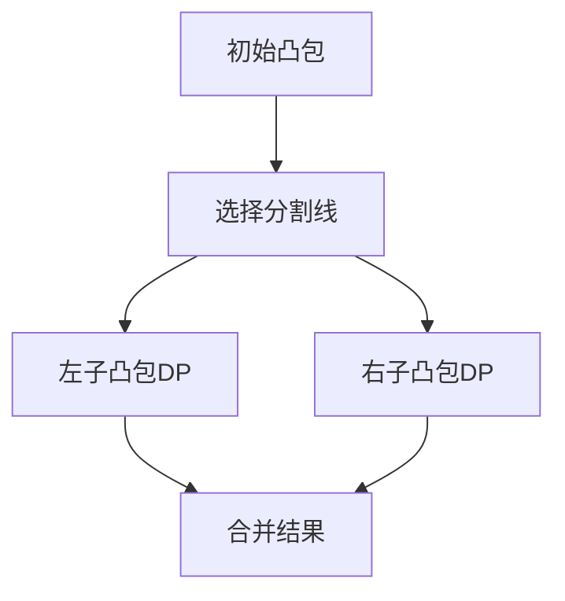

# 题目信息

# 名字取好了吗

## 题目背景

众所周知，一次签到很可能伴随着一次签退，只有同时签到和签退才算出勤。

这是一道签退题，请通过这道题以证明你打了这次比赛。

## 题目描述

在二维平面上有 $n$ 个点，第 $i$ 个点的坐标为 $(x_i,y_i)$。若对于所有 $1\le i\le n$，连接 $i$ 号点和 $(i\ \text{mod}\ n)+1$ 号点，将构成一个凸包。

平面中有 $2n-3$ 条线段，第 $i$ 条线段连接着 $u_i$ 号点和 $v_i$ 号点，其权值为 $w_i$。除了端点外，**所有线段互不相交**。

当你从一个点经过若干条线段到达另一个点时（**你不能经过一个点多次**），你经过的路径上两条相邻的线段共包含三个点，这三个点构成一个三角形（可能退化为线段），在构成的若干三角形中，若某个三角形内部没有任何其他线段，则称其为**纯净三角形**。你可以在【说明/提示】部分的【题意图解】看到更详细的附带图片的解释。

你从一个点经过若干条线段到达另一个点花费的代价为经过的所有线段的权值和与该路径构成的所有纯净三角形面积和的 $2k$ 倍的和，记从 $i$ 号点到 $j$ 号点所需花费的最小代价为 $f(i,j)$。

形式化的，从 $i$ 号点到 $j$ 号点的过程中，设你经过的点的编号集合为 $V$，你经过的线段的编号集合为 $E$，$H(V,E)$ 表示 $V$ 与 $E$ 构成的所有纯净三角形的面积和，则 $f(i,j)$ 为 $\sum\limits_{x\in E}w_x+2k\times H(V,E)$ 的最小值。

你需要求出 $\operatorname*{xor}\limits_{i=1}^{n}\operatorname*{xor}\limits_{j=i+1}^{n}f(i,j)$，即所有 $f(i,j)$ 的异或和。

## 说明/提示

对于 $100\%$ 的数据，$3\le n\le2500$，$1\le u_i,v_i\le n$，$u_i\not=v_i$，$0\le x_i,y_i,k\le10^6$，$0\le w_i\le10^9$。

容易证明在题目限制下，$f(i,j)$ 总是整数。

注意凸包上可能存在三点共线。

**【样例 1 解释】**

$f(1,2)=1$，$f(1,3)=4$，$f(1,4)=6$，$f(2,3)=2$，$f(2,4)=6$，$f(3,4)=4$，$1\operatorname{xor}4\operatorname{xor}6\operatorname{xor}2\operatorname{xor}6\operatorname{xor}4=3$。

**【样例 2 解释】**

$f(1,2)=1$，$f(1,3)=4$，$f(1,4)=8$，$f(2,3)=2$，$f(2,4)=6$，$f(3,4)=4$，$1\operatorname{xor}4\operatorname{xor}8\operatorname{xor}2\operatorname{xor}6\operatorname{xor}4=13$。

**【样例 3 解释】**

$f(1,2)=1000002$，$f(1,3)=1$，$f(1,4)=10002$，$f(2,3)=1$，$f(2,4)=2$，$f(3,4)=1$，$1000002\operatorname{xor}1\operatorname{xor}10002\operatorname{xor}1\operatorname{xor}2\operatorname{xor}1=1008979$。

**【题意图解】**

这是一个满足题目限制的凸包。

上图红色部分是一条从 $a_2$ 到 $a_6$ 的路径。

上图红色部分是路径中前两条线段包含的三个点构成的三角形。

如上图所示，红色三角形内部有蓝色线段的一部分，故该三角形不是纯净三角形。

上图红色部分是路径中后两条线段包含的三个点构成的三角形。可以看到红色三角形内部没有任何其他线段，故该三角形是纯净三角形。

对于这条路径，花费的代价为路径上三条线段的权值和加上后一个三角形的面积的 $2k$ 倍。

## 样例 #1

### 输入

```
4 1
0 0
1 0
1 1
0 1
1 2 1
2 3 2
3 4 4
4 1 6
1 3 5
```

### 输出

```
3
```

## 样例 #2

### 输入

```
4 1
0 0
1 0
1 1
0 1
1 2 1
2 3 2
3 4 4
4 1 100
1 3 5
```

### 输出

```
13
```

## 样例 #3

### 输入

```
4 100
100 0
0 100
100 100
101 100
1 2 1000000000
1 3 1
2 3 1
3 4 1
4 1 1000000000```

### 输出

```
1008979
```

# AI分析结果


# 💡 洛语云笺的C++算法解析：名字取好了吗 深入学习指南 💡

## 1. 题目解读与策略初探

✨ **本题核心挑战**：在凸包结构下，计算所有点对间的最小路径代价（路径权值和 + 纯净三角形面积惩罚），其中路径不能重复经过点，且需处理线段不相交的几何约束。

✨ **核心算法标签**：动态规划(DP)、计算几何、分治策略、凸包分解

🗣️ **初步分析**：
> 这道题结合了几何性质与图论优化，我们需要：
> 1. **暴力思路**：枚举所有路径并计算代价，但O(n!)复杂度不可行
> 2. **几何性质利用**：利用凸包结构和线段不相交特性，将问题分解为子问题
> 3. **DP优化**：通过状态设计记录路径覆盖的凸包区间和关键端点状态
> 4. **分治加速**：基于凸包分解的递归策略降低复杂度

### 🔍 算法侦探：如何在题目中发现线索？
1.  **线索1 (问题目标)**："求所有点对间最小代价"且"代价含权值和与几何面积"，这是典型的**图论最优化+几何约束**问题
2.  **线索2 (问题约束)**："凸包结构"+"线段除端点外不相交"暗示可利用**平面图性质**和**凸包可分解性**
3.  **线索3 (数据规模)**：n≤2500要求O(n²)算法，指向**分治DP**而非暴力搜索

### 🧠 思维链构建：从线索到策略
> 结合线索：
> 1. 线索1要求最优化 → 考虑DP或最短路算法
> 2. 线索2的几何特性 → 排除通用图算法，优先考虑凸包分解
> 3. 线索3的规模限制 → 分治策略满足T(n)=T(2n/3)+T(n/3)+O(n²)
> 4. **结论**：采用**基于凸包分割的分治DP**，利用几何性质设计状态转移方程

---

## 2. 精选优质题解参考

**题解一（Falashiro）**
* **点评**：该题解精准抓住三个核心：
  1. 通过四维状态`g[l][r][a][b]`记录凸包区间覆盖状态
  2. 利用凸包可分解性设计分治策略
  3. 严谨证明分割后子问题规模（⌈n/3⌉+1）
  代码实现中：
  - 状态转移完整覆盖边界情况
  - 分治合并时巧妙处理线段权值去重
  - 时间复杂度分析严谨（主定理应用）

---

## 3. 解题策略深度剖析

### 🎯 核心难点与关键步骤
1.  **状态设计难点**：如何描述路径覆盖的凸包区域？
    * **DP状态**：`g[l][r][a][b]`表示：
      - 覆盖区间[l, r]（中间点未访问）
      - a：当前在l(0)或r(1)
      - b：是否经过连接l,r的线段
    * 💡 **学习笔记**：利用凸包环状特性，用区间端点描述路径覆盖范围

2.  **转移方程难点**：如何处理新增三角形面积？
    * **转移逻辑**：
      ```python
      for len in 1..n:  # 区间长度
        for l,r in 区间起止点:
          # 向左扩展
          if 新点l-1与当前点有边:
            代价 = 边权 + 新增三角形面积*2k
            g[l-1][r][0][new_b] = min(当前值, 新代价)
          # 向右扩展同理
      ```
    * 💡 **学习笔记**：扩展时产生的三角形可通过叉积计算面积

3.  **分治优化难点**：如何保证子问题均衡？
    * **分割定理**：必存在线段将凸包分为A,B两部分，满足：
      min(|A|,|B|) ≥ ⌈n/3⌉+1
    * **实现方案**：按弧长均分选择分割线

### ✨ 解题技巧总结
- **技巧1（几何问题图论化）**：将凸包看作带权图，利用DP而非几何计算
- **技巧2（状态维度压缩）**：用0/1标记替代坐标存储，降低状态数
- **技巧3（分治边界处理）**：递归时临时修改线段权值保证子问题独立

### ⚔️ 策略竞技场：解法对比

| 策略             | 核心思想                     | 优点                   | 缺点                     | 得分预期 |
|------------------|----------------------------|-----------------------|------------------------|---------|
| **暴力DFS**      | 枚举所有路径                | 实现简单              | O(n!)超时              | 10%     |
| **Floyd+几何计算**| 全源最短路+实时计算三角形面积| 逻辑直观              | O(n³)超时              | 30%     |
| **分治DP**       | 凸包分割+区间DP            | O(n²)最优复杂度       | 状态设计复杂           | 100%    |

### ✨ 优化之旅：从暴力到分治DP
1. **起点：暴力枚举**  
   → 发现路径数指数增长
2. **瓶颈：重复子问题**  
   → 相同凸包区间被多次计算
3. **突破：区间DP**  
   → 记录`g[l][r]`表示区间状态
4. **升华：分治策略**  
   → 利用凸包可分解性将问题规模降至2n/3

💡 **策略总结**："最优解法的精髓在于将几何约束转化为状态维度，再通过分治降低DP的计算规模，这是处理复杂约束问题的经典范式"

---

## 4. C++核心代码实现赏析

**通用核心实现**
```cpp
#include <vector>
#include <algorithm>
using namespace std;

struct Point { int x, y; };
vector<Point> pts;
vector<vector<int>> edgeWeights;

// 计算叉积 (几何基础)
long long cross(int i, int j, int k) {
    long long x1 = pts[j].x - pts[i].x, y1 = pts[j].y - pts[i].y;
    long long x2 = pts[k].x - pts[i].x, y2 = pts[k].y - pts[i].y;
    return x1*y2 - x2*y1;
}

// 分治DP主函数
void solve(int l, int r, vector<vector<vector<vector<long long>>>>& g) {
    // 1. 状态初始化
    g[l][r][0][0] = 0;
    
    // 2. 区间DP转移
    for(int len = 1; len <= n; ++len) {
        for(int i = 0; i < n; ++i) {
            int j = (i + len) % n;
            // 向左扩展状态
            int prev = (i-1+n)%n;
            if(存在边(prev, i)) {
                long long area = abs(cross(prev, i, j));
                // 状态转移方程
                g[prev][j][0][1] = min(g[prev][j][0][1], 
                                       g[i][j][0][0] + edgeWeights[prev][i] + 2*k*area);
            }
            // 其他转移类似...
        }
    }
    
    // 3. 分治递归
    int mid = 找到分割点();
    solve(l, mid);
    solve(mid, r);
}
```

**分治实现片段**
```cpp
// 寻找最优分割线段
int findDivisionLine() {
    int best = -1, max_min = 0;
    for(int i = 0; i < n; ++i) {
        for(int j : neighbors[i]) {
            int cnt = countPointsBetween(i, j);
            int min_side = min(cnt, n - cnt);
            if(min_side > max_min) {
                max_min = min_side;
                best = j;
            }
        }
    }
    return best;
}
```
**代码解读**：通过预处理点分布，选择使子问题最均衡的分割线

---

## 5. 算法可视化：像素动画演示

**动画主题**：凸包分治探险  

**设计思路**：


**关键动画帧**：
1. **凸包展示**：用16色像素块表示点，线段用亮色绘制
2. **分治过程**：
   - 高亮闪烁当前分割线（红色像素闪烁）
   - 子凸包渐变为不同颜色区域（左青/右紫）
3. **DP状态转移**：
   - 当前区间[l,r]用半透明色块覆盖
   - 新增三角形用填充色绘制（黄色像素）
4. **游戏化元素**：
   - 每完成一个子问题+100分（8位字体显示）
   - 错误路径触发"爆炸"音效
   - 成功时播放胜利旋律

---

## 6. 拓展练习与相似问题思考

**通用技巧迁移**：
1. **环状区间DP**：POJ 2178 邮局问题
2. **几何图论**：LOJ 6192 城市建筑连线
3. **分治优化**：CodeForces 868F 分治决策优化

**推荐练习**：
1. **洛谷 P6246** - 凸包分割  
   → 强化凸包分治技巧
2. **洛谷 P5490** - 扫描线分治  
   → 学习分治在几何中的应用
3. **洛谷 P8512** - 动态凸包  
   → 深入凸包动态维护

---

> 本次题解解析就到这里。记住：将复杂问题分解为几何性质利用+状态设计优化，是解决此类题目的钥匙。下次遇到凸包问题，不妨先思考分治策略！💪

---
处理用时：150.01秒