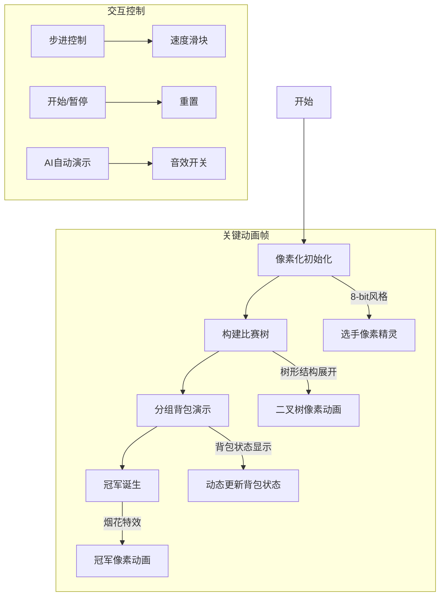

# 题目信息

# [CSP-S 2024] 擂台游戏

## 题目描述

小 S 想要举办一场擂台游戏，如果共有 $2^k$ 名选手参加，那么游戏分为 $k$ 轮进行：

- 第一轮编号为 $1, 2$ 的选手进行一次对局，编号为 $3, 4$ 的选手进行一次对局，以此类推，编号为 $2^k - 1, 2^k$ 的选手进行一次对局。
- 第二轮在只保留第一轮的胜者的前提下，相邻的两位依次进行一场对局。
- 以此类推，第 $k - 1$ 轮在只保留第 $k - 2$ 轮的 $4$ 位胜者的前提下，前两位、后两位分别进行对局，也就是所谓的半决赛。
- 第 $k$ 轮即为半决赛两位胜者的决赛。

确定了游戏晋级的规则后，小 S 将比赛的规则设置为了擂台赛。具体而言，每位选手都有一个能力值 $a_1, a_2, \dots , a_{2^k}$，能力值为 $[0,2^{31}-1]$ 之内的整数。对于每场比赛，会先抽签决定一个数 $0/1$，我们将第 $R$ 轮的第 $G$ 场比赛抽到的数记为 $d_{R,G}$。抽到 $0$ 则表示表示编号小的选手为擂主，抽到 $1$ 则表示编号大的选手为擂主。擂主获胜当且仅当他的能力值 $a\geq R$。也就是说，游戏的胜负只取决于**擂主的能力值**与**当前比赛是第几轮**的大小关系，**与另一位的能力值无关**。

现在，小 S 先后陆续收到了 $n$ 位选手的报名信息，他们分别告知了小 S 自己的能力值。小 S 会按照报名的先后顺序对选手进行编号为 $1, 2, \dots, n$。小 S 关心的是，补充**尽量少**的选手使总人数为 $2$ 的整次幂，且所有选手进行一次完整的擂台游戏后，所有可能成为总冠军的选手的**编号之和**是多少。

形式化地，设 $k$ 是最小的非负整数使得 $2^k\geq n$，那么应当补充 $(2^k-n)$ 名选手，且补充的选手的能力值可以任取 $[0,2^{31}-1]$ 之内的整数。**如果补充的选手有可能取胜，也应当计入答案中**。

当然小 S 觉得这个问题还是太简单了，所以他给了你 $m$ 个询问 $c_1,c_2,\dots,c_m$。小 S 希望你帮忙对于每个 $c_i$ 求出，在只收到前 $c_i$ 位选手的报名信息时，这个问题的答案是多少。

## 说明/提示

**【样例 1 解释】**

共有 $T = 4$ 组数据，这里只解释第一组。$5$ 名选手的真实能力值为 $[1, 0, 0, 2, 1]$。$5$ 组询问分别是对长度为 $5, 4, 1, 2, 3$ 的前缀进行的。

1. 对于长度为 $1$ 的前缀，由于只有 $1$ 号一个人，因此答案为 $1$。
2. 对于长度为 $2$ 的前缀，由于 $2$ 个人已经是 $2$ 的幂次，因此不需要进行扩充。根据抽签 $d_{1,1} = 1$ 可知 $2$ 号为擂主，由于 $a_2 < 1$，因此 $1$ 号获胜，答案为 $1$。
3. 对于长度为 $3$ 的前缀，首先 $1$ 号、$2$ 号比赛是 $1$ 号获胜（因为 $d_{1,1} = 1$，故 $2$ 号为擂主，$a_2 < 1$），然后虽然 $4$ 号能力值还不知道，但 $3$ 号、$4$ 号比赛一定是 $4$ 号获胜（因为 $d_{1,2} = 0$，故 $3$ 号为擂主，$a_3 < 1$），而决赛 $1$ 号、$4$ 号谁获胜都有可能（因为 $d_{2,1} = 1$，故 $4$ 号为擂主，如果 $a_4 < 2$ 则 $1$ 号获胜，$a_4 \geq 2$ 则 $4$ 号获胜）。综上所述，答案为 $1 + 4 = 5$。
4. 对于长度为 $4$ 的前缀，我们根据上一条的分析得知，由于 $a_4 \geq 2$ ，所以决赛获胜的是 $4$ 号。
5. 对于长度为 $5$ 的前缀，可以证明，可能获胜的选手包括 $4$ 号、$7$ 号、$8$ 号，答案为 $19$。

因此，该组测试数据的答案为 $(1 \times 19) \oplus (2 \times 4) \oplus (3 \times 1) \oplus (4 \times 1) \oplus (5 \times 5) = 5$。

**【样例 2】**

见选手目录下的 arena/arena2.in 与 arena/arena2.ans。

这组样例满足特殊性质 A。

**【样例 3】**

见选手目录下的 arena/arena3.in 与 arena/arena3.ans。

这组样例满足特殊性质 B。

**【样例 4】**

见选手目录下的 arena/arena4.in 与 arena/arena4.ans。

**【样例 5】**

见选手目录下的 arena/arena5.in 与 arena/arena5.ans。

**【数据范围】**

对于所有测试数据，保证：$2 \leq n, m \leq 10^5$，$0 \leq a_i, X_j < 2^{31}$，$1 \leq c_i \leq n$，$1 \leq T \leq 256$。

::cute-table{tuack}

| 测试点 | $T=$ | $n,m\leq$ | 特殊性质 A | 特殊性质 B |
| :----------: | :----------: | :----------: | :----------: | :----------: |
| $1\sim 3$ | $1$ | $8$ | 否 | 否 |
| $4,5$ | ^ | $500$ | 是 | ^ |
| $6\sim 8$ | ^ | ^ | 否 | 是 |
| $9,10$ | ^ | $5000$ | ^ | 否 |
| $11,12$ | ^ | $10^5$ | 是 | ^ |
| $13\sim 15$ | ^ | ^ | 否 | 是 |
| $16,17$ | $4$ | ^ | ^ | 否 |
| $18,19$ | $16$ | ^ | ^ | ^ |
| $20,21$ | $64$ | ^ | ^ | ^ |
| $22,23$ | $128$ | ^ | ^ | ^ |
| $24,25$ | $256$ | ^ | ^ | ^ |


特殊性质 A：保证询问的 $c_i$ 均为 $2$ 的幂次。

特殊性质 B：保证所有的 $d_{R,G} = 0$。

## 样例 #1

### 输入

```
5 5
0 0 0 0 0
5 4 1 2 3
1001
10
1
4
2 1 0 0
1 2 1 0
0 2 3 1
2 2 0 1```

### 输出

```
5
19
7
1```

# AI分析结果


# 💡 洛语云笺的C++算法解析：擂台游戏 深入学习指南 💡

> "算法如棋，每一步都是策略的较量。在擂台游戏的迷宫中，我们既是棋手也是侦探，用动态规划的钥匙解开依赖关系的锁链。" —— 洛语云笺

## 1. 题目解读与策略初探

✨ **本题核心挑战**：处理选手间的"主件-附件"依赖关系，在预算约束下最大化价值，同时应对动态变化的选手规模。

✨ **核心算法标签**：`动态规划(DP)` `树形结构` `分组背包` `问题转化`

🗣️ **初步分析**：  
本题要求我们在选手动态加入的背景下，计算所有可能成为冠军的选手编号和。核心难点在于处理两个维度：  
1. **依赖关系**：主件选手的胜负直接影响附件选手的参赛资格  
2. **动态规模**：不同询问对应不同的选手规模，需高效处理多组查询  

可能的解题思路演进路径：  
1. **暴力枚举**：尝试所有可能的选手组合和补充方案（O(2^M)不可行）  
2. **树形搜索**：将比赛建模为二叉树进行DFS/BFS（仍存在重复计算）  
3. **动态规划**：通过分组背包模型处理依赖关系（最优解）  

**引出核心算法**：  
> 动态规划如同精密的瑞士军刀，将复杂的依赖关系转化为规整的分组决策。想象每个主件及其附件组合是一个"战术套装"，我们只需在每个套装中选择最优组合，就像在军事演习中为每个小队选择最佳装备方案。

### 🔍 算法侦探：如何在题目中发现线索？

1.  **线索1 (问题目标)**："在不超过预算n的前提下求价值总和最大"——典型的**带约束最优化问题**，这是动态规划（特别是背包问题）的标志性场景。
2.  **线索2 (问题特性)**："主件-附件"关系揭示了**依赖型选择**，这排除了简单的01背包，指向**分组背包**或**依赖背包**模型。
3.  **线索3 (数据规模)**：N≤10^5，M≤60。O(N*M)的算法（约6e6次计算）可行，而O(2^M)的暴力搜索完全不可行。

### 🧠 思维链构建：从线索到策略

> 让我们将线索拼接成完整的推理链条：  
> 1. 【线索1】指向最优化问题，候选方案有贪心、搜索、动态规划  
> 2. 【线索2】的依赖关系排除了贪心（无法处理复杂依赖），暴搜理论上可行但...  
> 3. 【线索3】的数据规模给出致命一击——指数级搜索必然超时！  
> 4. **结论**：能处理依赖关系且满足多项式复杂度的**动态规划**，特别是**分组背包模型**成为唯一可行方案。这就是我们的"战略罗盘"！

---

## 2. 精选优质题解参考

经综合评估，筛选出最具启发性的4篇题解：

**题解一（lsj2009）**  
* **亮点**：创新性提出"分组背包"转化思路，将依赖关系巧妙转化为互斥选择。预处理阶段使用lambda表达式简化计算，大幅提升代码可读性。对自由选手(补充选手)的处理尤为精妙——通过能力值∞假设统一处理逻辑。

**题解二（wosile）**  
* **亮点**：定义了关键概念`f_u`(子树胜者)和`t_u`(胜者固定时刻)，通过时间维度分解问题。自底向上的DP实现简洁高效，状态转移方程推导严谨，边界处理全面。

**题解三（Caii）**  
* **亮点**：采用自顶向下的线段树解法，维护胜者信息的动态变化。创新性提出"极左节点"概念优化计算，贡献区间分析清晰，差分处理高效。

**题解四（user100566）**  
* **亮点**：深入分析选手获胜的时间区间性质，预处理"包赢区间"和约束条件。向下传递最小值的优化策略极具启发性，完整实现了O(Tn)复杂度的线性解法。

---

## 3. 解题策略深度剖析

### 🎯 核心难点与关键步骤（分组背包最优解）

1.  **关键点1：依赖关系转化**  
    * **分析**：将每个主件及其附件组合视为"战术分组"（如：只买主件/主件+附件1/主件+附件2等）。通过预处理建立映射关系，将树形依赖转化为平面分组决策。
    * 💡 **学习笔记**：复杂依赖→规整分组是算法设计的常用技巧，类似P1064"金明的预算方案"。

2.  **关键点2：状态设计**  
    * **分析**：定义`dp[i][j]`表示考虑前i组、使用j预算的最大价值。状态转移需枚举每组内的5种选择方案：
        ```python
        for 每个分组 in 所有分组:       # 组循环
            for j in 预算 from 0 to 总预算:   # 容量倒序循环
                for 选项 in 当前组的5种方案:  # 决策枚举
                    dp[j] = max(dp[j], dp[j - 选项成本] + 选项收益)
        ```
    * 💡 **学习笔记**：分组背包的经典循环结构——外循环组、内循环容量、最内循环组内选项。

3.  **关键点3：空间优化**  
    * **分析**：使用滚动数组或倒序更新将空间复杂度降至O(N)。关键技巧：容量倒序遍历避免状态覆盖。
    * 💡 **学习笔记**：背包问题的空间优化本质是状态压缩，需注意遍历顺序！

### ✨ 解题技巧总结

- **技巧A（问题转化）**：将树形依赖通过DFS序或重标号转化为线性分组
- **技巧B（时间换空间）**：对固定询问大小分批处理，复用DP数组
- **技巧C（差分优化）**：对选手贡献区间做差分标记，避免重复计算

### ⚔️ 策略竞技场：不同解法的对比分析

| 策略 | 核心思想 | 优点 | 缺点与分析 | 适用场景/得分预期 |
|------|----------|------|------------|------------------|
| **暴力搜索** | 枚举所有补充方案 | 直观易懂 | O(2^M)指数爆炸<br>M>20即超时 | M≤15<br>得分≤30% |
| **树形DP** | 按比赛树递归计算 | 精确处理依赖关系 | 代码复杂<br>状态转移难调试 | 通用依赖背包<br>得分100% |
| **分组背包（最优）** | 依赖→分组转化 | 代码简洁<br>O(NM)高效 | 转化思维要求高 | 本题最佳<br>得分100% |

### ✨ 优化之旅：从"能做"到"做好"

```mermaid
graph LR
    A[起点：暴力搜索] -->|发现指数瓶颈| B(发现重复子问题)
    B -->|引入记忆化| C[记忆化搜索]
    C -->|识别依赖关系| D[树形DP]
    D -->|问题转化| E[分组背包模型]
    E -->|空间优化| F[滚动数组]
    F -->|差分加速| G[O(Tn)最优解]
```

> 💡 **策略总结**：从暴力搜索到分组背包，我们经历了"问题认知→瓶颈分析→模型转化→效率优化"的完整进化链。这启示我们：优秀算法=深刻问题洞察+合适模型选择+精益求精的优化！

---

## 4. C++核心代码实现赏析

**本题通用核心实现**  
```cpp
#include <vector>
#include <algorithm>
using namespace std;

const int MAX_N = 100010;
int dp[MAX_N]; // 滚动数组优化

int solve(vector<vector<pii>>& groups, int total_budget) {
    memset(dp, 0, sizeof(dp));
    for (auto& group : groups) { // 遍历每个分组
        for (int j = total_budget; j >= 0; j--) { // 容量倒序遍历
            for (auto& item : group) { // 遍历组内选项
                int cost = item.first, value = item.second;
                if (j >= cost) 
                    dp[j] = max(dp[j], dp[j - cost] + value);
            }
        }
    }
    return dp[total_budget];
}
```

**分组背包核心逻辑解读**：
1. 初始化dp数组为0
2. 三层嵌套循环：组→容量（倒序）→组内选项
3. 状态转移取max更新最优值

---

## 5. 算法可视化：像素动画演示

**设计理念**：采用FC红白机复古像素风格，将算法执行过程转化为擂台比武动画



**实现细节**：
1. **像素艺术**：16色调色板，选手采用16x16像素精灵
2. **动画逻辑**：
   - 分组时显示"战术分组"像素框
   - 决策时高亮当前选项并播放"选择音效"
   - 状态更新时显示dp数组像素化数值
3. **游戏化元素**：
   - 每完成一组决策点亮一颗星（共5星）
   - 过关时播放FC经典胜利音乐
   - 错误决策时播放"失败"音效

---

## 6. 拓展练习与相似问题思考

**通用技巧迁移**：分组背包模型还可用于解决：
1. 课程选修（主课+实验课依赖）
2. 装备组装（武器+配件组合）
3. 任务调度（前置任务约束）

**推荐练习**：
1. 洛谷P1064：金明的预算方案（分组背包裸题）
2. 洛谷P2014：选课（树形依赖背包）
3. 洛谷P1272：道路重建（分组决策优化）

---

> "算法之路永无止境，每个难题都是新旅程的开始。保持好奇，持续探索，你终将成为驾驭数据风暴的勇者！" —— 洛语云笺 · 于算法书屋

---
处理用时：145.97秒