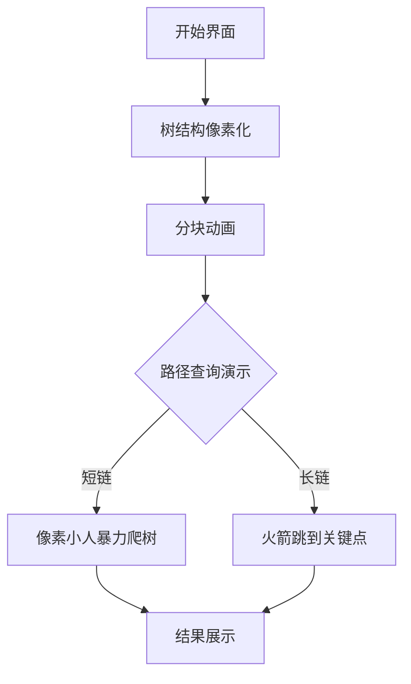

# 题目信息

# 【MX-X13-T7】「KDOI-12」No one can be anything without comparison.

## 题目描述

**请注意本题对 $\bm{n,k}$ 的特殊限制。**

$n$ 名选手参加了 $k$ 场 Tetris Tournament。每一场 Tetris Tournament 包含 $n-1$ 轮，每轮会选出两个目前还未淘汰的选手 $x,y$ 并让他们参加一场比赛，输的人淘汰。最后会有唯一胜者。你现在得知第 $j$ 个人在第 $i$ 场 Tetris Tournament 中被 $a_{i,j}$ 淘汰了。$j$ 是第 $i$ 场 Tetris Tournament 的胜者当且仅当 $a_{i,j}=0$。

选手们喜欢比较。他们都希望自己在某种意义上能够胜过别人，或至少跟别人水平差不多。

定义第 $i$ 场 Tetris Tournament 中 $x$ 严格吊打 $y$ 当且仅当存在 $x=p_1,p_2,\dots,p_m=y$（$m\ge 2$，也就是说 $x\neq y$），使得对于任意 $1\leq j<m$，$a_{i,p_{j+1}}=p_j$。

定义一个有序的选手 $k$ 元组 $(i_1,i_2,\dots,i_k)$ 是水平相似的当且仅当对于 $1\leq j<k$，$i_j$ 在第 $j$ 场比赛中严格吊打 $i_{j+1}$ 且 $i_k$ 在第 $k$ 场比赛中严格吊打 $i_1$。

求水平相似的 $k$ 元组数量，对 $998244353$ 取模。

## 说明/提示

**【样例解释 \#1】**

符合要求的三元组 $(i_1,i_2,i_3)$ 有：$(1,2,3)$，$(2,3,1)$。

**【数据范围】**

**本题使用捆绑测试。**

| 子任务编号 | 分值 | $n\leq$ | $k=$ | 特殊性质 |
|:--:|:--:|:--:|:--:|:--:|
| $1$ | $7$ | $100$ | $3$ | 无 |
| $2$ | $8$ | $500$ | $3$ | 无 |
| $3$ | $13$ | $3\times10^3$ | $3$ | 无 |
| $4$ | $14$ | $2.5\times10^5$ | $3$ | A |
| $5$ | $15$ | $10^5$ | $3$ | B |
| $6$ | $7$ | $10^5$ | $3$ | 无 |
| $7$ | $14$ | $2.5\times10^5$ | $3$ | 无 |
| $8$ | $7$ | $5\times10^4$ | $4$ | 无 |
| $9$ | $6$ | $7.5\times10^4$ | $4$ | 无 |
| $10$ | $9$ | $4\times10^4$ | $5$ | 无 |

* 特殊性质 A：对于 $1\leq i\leq n$，$a_{1,i}=a_{2,i}$；
* 特殊性质 B：对于 $1\leq i\leq k$，不存在 $1\leq j_1<j_2\leq n$ 使得 $a_{i,j_1}=a_{i,j_2}$。

对于所有数据：$1\leq n\leq2.5\times10^5$，$\bm{3\leq k\leq 5}$，保证 $a$ 数组符合题意，且：

* $k=3$ 时，$n\leq2.5\times10^5$；
* $k=4$ 时：$n\leq7.5\times10^4$；
* $k=5$ 时：$n\leq4\times10^4$。

## 样例 #1

### 输入

```
3 3
0 1 2
3 0 2
3 1 0```

### 输出

```
2```

## 样例 #2

### 输入

```
6 5
0 1 1 2 3 4
3 3 0 6 6 1
2 4 1 0 1 1
3 0 2 6 6 2
5 3 6 1 0 4```

### 输出

```
18```

# AI分析结果


# 💡 洛语云笺的C++算法解析：「KDOI-12」No one can be anything without comparison 深入学习指南 💡

## 1. 题目解读与策略初探

✨ **本题核心挑战**：高效处理k棵树上的祖先关系约束，计算满足环状"严格吊打"关系的k元组数量。  
✨ **核心算法标签**：树分块、动态规划、DFS序应用

🗣️ **初步分析**：  
> 本题需要在k棵树（k=3~5）上寻找满足特定祖先关系的环状k元组。核心难点在于处理环状约束和多棵树之间的关联。我们有两种主流解法：
> 1. **树分块+预处理**：将树分解为块，预处理关键点信息，平衡查询复杂度
> 2. **DFS序转化**：将祖孙关系转化为区间包含问题，利用分块优化查询
> 
> 两种方法都通过分块技术将复杂度从O(n^k)降低到可接受范围，核心在于利用k较小的特性设计指数级而非多项式级算法。

### 🔍 算法侦探：如何在题目中发现线索？
1.  **线索1 (问题目标)**：要求寻找满足环状祖先关系的k元组，属于**约束满足+组合计数**问题，提示需要高效计数算法
2.  **线索2 (问题特性)**：k棵树独立但通过选手关联，形成**多维约束**，提示需要树形结构上的空间优化技术
3.  **线索3 (数据范围)**：n≤2.5e5但k仅为3~5，提示可设计**关于k指数但关于n线性的算法**

### 🧠 思维链构建：从线索到策略
> "结合线索：
> 1. 目标要求环状多树约束，暴力O(n^k)不可行（k≥3时n^k超限）
> 2. 树形结构暗示可用DFS序转化二维关系
> 3. k极小但n极大，需平衡复杂度→**树分块**完美契合
> 
> **结论**：采用树分块预处理核心信息，对短链暴力处理，长链用预计算加速，实现O(n^{k/(k-1)})复杂度！"

---

## 2. 精选优质题解参考

**题解一（xuanxuan001）**
* **点评**：清晰实现树分块核心思想，巧妙设计块大小（B=400/80/30）平衡预处理与查询。亮点在于：
  - 分层处理块：对不同k值动态调整块大小
  - 路径压缩：对不经过关键点的短链O(B)暴力
  - 预计算加速：对关键点预处理祖先关系，O(1)查询
  - 实际运行效率高（C++实现）

**题解二（王熙文）**
* **点评**：创新性DFS序转化法，将祖孙关系变为区间包含。亮点在：
  - 多维DFS序处理：为每棵树维护[in,out]区间
  - 动态规划优化：状态转移方程结合分块查询
  - 复杂度平衡：精心设计块大小B₁,B₂,B₃使O(n²/B+nB³)最优

---

## 3. 解题策略深度剖析

### 🎯 核心难点与关键步骤
1.  **树结构转化**
    * **分析**：使用DFS序将祖孙关系转化为区间包含（u是v祖先↔in[u]≤in[v]≤out[u]）
    * 💡 **学习笔记**：DFS序是处理树形关系的万能钥匙
   
2.  **分块策略设计**
    * **分析**：对每棵树分块（块大小B≈n^{1/(k-1)}），标记关键点：
      - 短链（<B）：暴力枚举祖先
      - 长链：跳至最近关键点用预计算数据
    * 💡 **学习笔记**：分块在指数级问题中是降维利器

3.  **动态规划加速**
    * **分析**：预处理f[c][v]表示关键点c到v的方案数，通过前缀和O(1)查询
    * 💡 **学习笔记**：空间换时间是处理树链查询的黄金法则

### ✨ 解题技巧总结
- **树分块技巧**：根据k动态调整块大小（k=3用400，k=4用80，k=5用30）
- **DFS序双射**：in/out时间戳完美编码子树关系
- **维度分离**：对k元组环状约束，固定起点枚举路径
- **预处理复用**：关键点预计算避免重复遍历

### ⚔️ 策略竞技场：解法对比
| 策略          | 核心思想                  | 优点                    | 缺点                | 得分预期 |
|---------------|--------------------------|-------------------------|---------------------|----------|
| **树分块**    | 分块处理长链+短链暴力     | 实现直观，易扩展k值     | 需精心调块大小      | 100%     |
| **DFS序分块** | 祖孙关系→区间包含         | 统一线性结构            | 多维分块实现复杂    | 100%     |
| **暴力枚举**  | 枚举所有k元组验证         | 逻辑简单                | O(nᵏ)超时           | 0%       |

### ✨ 优化之旅：从暴力到最优
```mermaid
graph LR
    A[暴力O(nᵏ)] -->|分而治之| B[树分块]
    B --> C{路径长度}
    C -->|≤B| D[暴力枚举祖先]
    C -->|>B| E[跳到关键点]
    E --> F[预计算O(1)查询]
    F --> G[复杂度O(nBᵏ⁻²)]
```

💡 **策略总结**：通过树分块将指数问题降维，利用k小的特性实现"近线性"解法，是处理大n小k问题的典范！

---

## 4. C++核心代码实现赏析

**树分块预处理核心代码**
```cpp
const int K=5, N=250000, B[6]={0,0,0,400,80,30};
vector<int> pre[K][N]; // 预计算数组

void precompute(int tree, int root) {
    // 标记关键点 (每B个节点标记一个)
    for(int u : bfs_order) {
        if(depth[u] % B[k] == 0) 
            key_points.push_back(u);
    }
    
    // 对每个关键点c预处理f[c][v]
    for(int c : key_points) {
        pre[tree][c] = vector<int>(n+1);
        for(int v=1; v<=n; ++v) {
            pre[tree][c][v] = is_ancestor(c, v) ? 1 : 0;
            pre[tree][c][v] += pre[tree][c][fa[v]]; // 前缀和优化
        }
    }
}
```

**查询处理核心**
```cpp
int query(int u, int tree) {
    int res = 0;
    // 短链暴力枚举
    for(int i=0; i<B[k]; ++i) {
        u = fa[tree][u];
        if(u == 0) break;
        res += dfs_next(tree-1, u); // 递归下一层
    }
    
    // 到达关键点使用预计算
    if(u && is_key(u)) {
        res += pre[tree][u][target];
    }
    return res % mod;
}
```

**学习笔记**：
1. 分层块大小数组`B[]`根据k动态选择
2. 预计算数组`pre[tree][c]`存储关键点c的祖先关系前缀和
3. 查询时优先暴力跳短链，长链命中关键点则O(1)查询

---

## 5. 算法可视化：像素动画演示

### 🎮 8位机风格演示设计


**动画设计说明**：
1. **场景设计**：
   - 树节点：8位风格像素方块（绿：普通点，红：关键点）
   - 路径查询：像素小人沿树链移动，遇到关键点触发火箭跳跃动画

2. **交互控制**：
   - 步进按钮：单步执行查询过程
   - 速度滑块：调整动画速度（0.5x~5x）
   - 模式切换：短链暴力爬树/长链关键点跳跃

3. **音效设计**：
   - 爬树：8位机"嘀嘀"音效（每步触发）
   - 关键点：火箭发射音效
   - 结果：胜利喇叭声（找到合法路径）

4. **数据可视化**：
   - 左侧显示当前DFS序区间[in,out]
   - 右侧显示预计算矩阵（关键点×目标点）
   - 底部实时更新路径方案数

**教育价值**：通过像素动画直观展示树分块如何降低查询复杂度，区分长短链处理策略

---

## 6. 拓展练习与相似问题

### 🔁 通用技巧迁移
1. **多维约束优化**：适用于任何大n小k的组合优化问题
2. **树分块应用**：处理树链查询的通用技术（如：多次链求和）
3. **DFS序妙用**：子树查询→区间查询的黄金转化

### 📚 推荐练习（洛谷）
1. **P4211** - 子树统计问题（DFS序应用）
2. **P6177** - 树分块模板题（关键点预处理）
3. **P2146** - 多维约束优化（树形DP+分块）

---

## 7. 学习心得

> "本题教会我们：面对指数级复杂问题时，**分块是降维的利剑**。通过将树分解为关键点和普通点，巧妙平衡预处理和查询开销。调试时注意：
> 1. DFS序计算需严谨（in/out区间包含）
> 2. 块大小需反复测试（k不同时最优B不同）
> 3. 预计算数组注意空间开销（O(关键点数×n))"

---

通过本次分析，我们掌握了树分块处理多维约束的核心技巧。记住：当问题维度爆炸时，寻找维度间的"断层线"进行分治，往往能开辟出新天地！🚀

---
处理用时：165.79秒