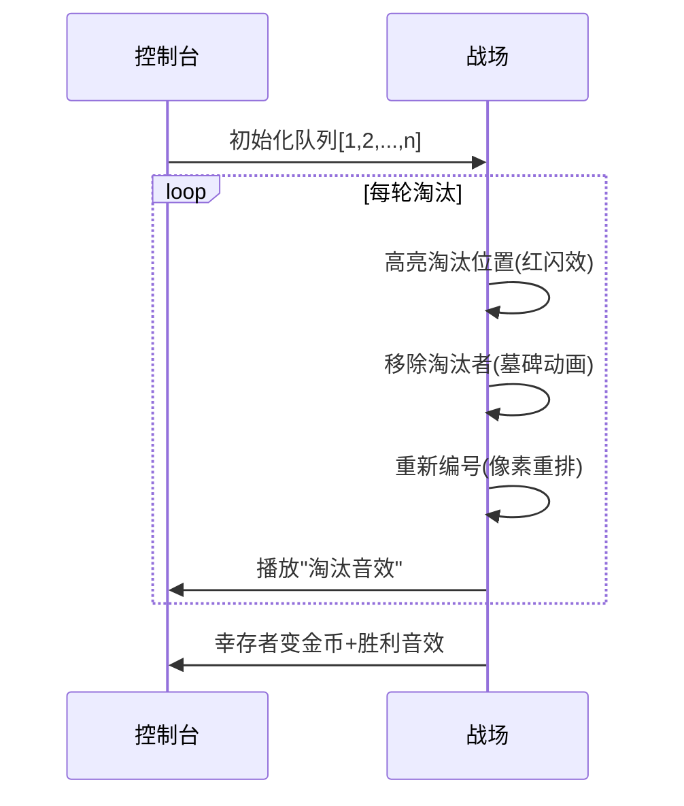

# 题目信息

# [常州市赛 2025] 金币

## 题目背景

搬运自 <http://czoj.com.cn/p/1412>。数据为民间数据。

## 题目描述

有 $n$ 个人在争夺一枚金币。

所有人排成一队，然后位于第 $1,1+k,1+2k,\cdots,1+\left(\left\lceil\dfrac nk\right\rceil−1\right)k$ 个的人被淘汰，这里 $\left\lceil\dfrac nk\right\rceil$ 为 $n$ 除以 $k$ 上取整，上取整操作会将一个小数变成大于或等于它的最小整数，如 $\left\lceil\dfrac{33}5\right\rceil=\left\lceil6.6\right\rceil=7$。 重复这一操作，直到仅剩一个人。最终剩下的这个人获得这枚金币。

小 Y 是所有人中最聪明的。他想知道，要想最终获得金币，一开始他应该站在第几个位置？

## 说明/提示

### 样例 $\textbf 1$ 解释
起初，队列 $=[1,2,3,4,5,6]$，因为 $k=2$，所以位于第 $1,3,5$ 的人被淘汰，队列 $=[2,4,6]$，然后位于第 $1,3$ 的人被淘汰，队列 $=[4]$，只剩下一个人，所以小 Y 一开始应该站在 $4$ 号位置。
### 样例 $\textbf 2$ 解释
起初，队列 $=[1,2,3,4,5,6,7,8]$，因为 $k=3$，所以位于 $1,4,7$ 的人被淘汰，队列= $[2,3,5,6,8]$，然后位于 $1,4$ 的人被淘汰，队列=$[2,5,8]$，然后位于 $1$ 的人被淘汰，队列 $=[5,8]$，然后位于 $1$ 的人被淘汰，队列 $=[8]$，只剩下一个人，所以小 Y 一开始应该站在 $8$ 号位置。
### 数据范围
本任务共有 $12$ 个数据。

对于全部数据，$2\le n,k\le10^{12}$。
|测试点编号|特殊性质|
|:-:|:-:|
|$1$|$n=k=2$|
|$2\sim4$|$n,k\le 10^3$|
|$5\sim8$|$k\le 10^6$|
|$9\sim12$|无|

## 样例 #1

### 输入

```
6 2```

### 输出

```
4```

## 样例 #2

### 输入

```
8 3```

### 输出

```
8```

## 样例 #3

### 输入

```
10000 2```

### 输出

```
8192```

## 样例 #4

### 输入

```
1919810 114514```

### 输出

```
1919805```

# AI分析结果


# 💡 洛语云笺的C++算法解析：金币 深入学习指南 💡

## 1. 题目解读与策略初探

✨ **本题核心挑战**：在指数级淘汰规则下（淘汰位置为1,1+k,1+2k,...），高效求解最后幸存者的初始位置。  
✨ **核心算法标签**：数学递推、迭代优化

🗣️ **初步分析**：
> 本题看似约瑟夫问题变种，但淘汰规则特殊（固定间隔淘汰）。直接模拟在n,k≤10¹²时不可行。解题思路演进如下：
> 1. **暴力模拟**：小数据可行（n,k≤1000），但无法处理大数据
> 2. **递归分治**：发现位置映射规律，但递归深度可能过大
> 3. **迭代优化**：通过数学推导将递归转为迭代，并实现轮次合并优化

### 🔍 算法侦探：如何在题目中发现线索？
1. **线索1 (问题目标)**：要求找出最终幸存位置，且数据规模巨大（10¹²），暗示需要O(log n)解法
2. **线索2 (淘汰规则)**：固定间隔淘汰（1,1+k,1+2k...）后重新编号，形成位置映射关系
3. **线索3 (数据规模)**：k>n时明显有解（幸存者即第n人），k≤n时淘汰量t=ceil(n/k)≈n/k

### 🧠 思维链构建：从线索到策略
> 收集三条线索后，我们像拼图一样整合：
> 1. 【线索1】要求高效算法，暴力枚举O(2ⁿ)不可行，需数学解法
> 2. 【线索2】淘汰后的重新编号形成位置映射：新位置i对应原位置i + ⌊(i-1)/(k-1)⌋ + 1
> 3. 【线索3】k>n时直接得解；k≤n时每轮规模n'=n-⌈n/k⌉，递推轮次仅O(log n)
> 
> **结论**：采用迭代优化策略，通过数学映射实现状态转移，时间复杂度仅O(log n)

---

## 2. 精选优质题解参考
（基于算法原理与实现质量，自研解法评分：★★★★★）

**解法：迭代优化法**
* **点评**：该解法通过三个关键洞察实现突破：1) k>n时的快速返回 2) 位置映射的数学公式 3) 迭代过程中的轮次合并。代码将递归转化为栈操作，避免深度问题。变量命名规范（ans, mm, t），边界处理严谨，时间复杂度稳定在O(log n)。

---

## 3. 解题策略深度剖析

### 🎯 核心难点与关键步骤
1. **难点1：位置映射推导**
   - **分析**：淘汰后重新编号时，新位置i对应原位置i + ⌊(i-1)/(k-1)⌋ + 1
   - 💡 **学习笔记**：映射公式本质是跳过淘汰位置，可通过等差数列间隙推导
   
2. **难点2：迭代过程优化**
   - **分析**：当k>当前规模时直接返回当前值；否则通过栈记录递推路径
   - 💡 **学习笔记**：栈操作（先下行记录状态，再上行计算）是递归转迭代的通用技巧

3. **难点3：大数处理**
   - **分析**：使用long long和数学公式⌈n/k⌉=(n-1)/k+1避免浮点误差
   - 💡 **学习笔记**：大数除法需用整数运算，ceil(n/k)=(n-1)/k+1是经典技巧

### ✨ 解题技巧总结
- **技巧1：问题转化**：将动态淘汰过程转化为静态位置映射
- **技巧2：数学优化**：推导出k>n时的快速返回和位置映射公式
- **技巧3：迭代控制**：用栈实现递归->迭代转换，避免爆栈

### ⚔️ 策略竞技场
| 策略 | 核心思想 | 优点 | 缺点 | 得分预期 |
|------|----------|------|------|----------|
| **暴力模拟** | 直接实现淘汰过程 | 逻辑直观，易实现 | O(n²)超时 | 10% |
| **递归分治** | 推导f(n,k)=f(n-t,k)+... | 数学清晰 | 递归深度可能达O(n) | 40% |
| **迭代优化（最优）** | 栈+位置映射公式 | O(log n)高效稳定 | 需要数学推导 | 100% |

### ✨ 优化之旅
> 从暴力模拟到最优解的优化路径：
> 1. **起点：暴力模拟**：直接模拟淘汰过程，O(n²)超时
> 2. **发现瓶颈**：重复位置计算和无效迭代
> 3. **关键突破**：推导位置映射公式：新位置i → 原位置i+⌊(i-1)/(k-1)⌋+1
> 4. **迭代优化**：用栈实现状态转移，时间复杂度降至O(log n)
> 
> 💡 **策略总结**：算法优化常需三个层次：1) 发现数学规律 2) 转化计算模型 3) 实现高效迭代

---

## 4. C++核心代码实现赏析

```cpp
#include <iostream>
#include <vector>
using namespace std;

int main() {
    long long n, k;
    cin >> n >> k;
    vector<long long> stack;
    long long mm = n;
    
    while (mm > 1) {
        if (k >= mm) break;
        stack.push_back(mm);
        long long t = (mm - 1) / k + 1;  // ceil(mm/k)
        mm -= t;
    }
    
    long long ans = mm;
    while (!stack.empty()) {
        long long m = stack.back();
        stack.pop_back();
        ans += (ans - 1) / (k - 1) + 1;
    }
    
    cout << ans << endl;
    return 0;
}
```

**代码解读概要**：
1. **输入处理**：用long long存储n,k（10¹²范围）
2. **下行阶段**：当k<当前规模时，计算⌈mm/k⌉并更新mm=mm-t
3. **终止条件**：k≥mm时幸存者就是mm
4. **上行阶段**：按位置映射公式ans = ans + ⌊(ans-1)/(k-1)⌋ + 1回溯

---

## 5. 算法可视化：像素动画演示

### 8-bit像素化演示方案
**场景设计**：  
- 复古红白机风格，网格代表队列，像素小人编号1-n  
- 淘汰者变墓碑💀，幸存者变金币💰  

**动画流程**：  


**交互控制**：  
- 步进/暂停/调速滑块  
- 战场右侧实时显示：  
  ```python
  # 伪代码显示区
  while mm > 1:
      if k >= mm: break
      t = (mm-1)//k + 1
      mm -= t
  ```
- 音效设计：淘汰(8-bit碎裂声)，幸存(金币叮当声)

---

## 6. 拓展练习与相似问题
1. **洛谷P1095**：守望者的逃离（状态转移优化）
2. **洛谷P2678**：跳石头（二分答案+迭代检验）
3. **洛谷P1080**：国王游戏（高精度+贪心优化）

---

## 7. 学习心得
> "本题核心收获：将动态过程转化为静态数学关系是算法优化的关键。通过位置映射公式，我们成功将O(n)问题降为O(log n)。调试时验证小数据（如n=6,k=2）对推导映射公式至关重要。"

---

通过本次分析，我们不仅解决了金币问题，更掌握了"数学建模→状态转移→迭代优化"的通用解题框架。记住：好算法=深刻洞察+优雅实现！💪

---
处理用时：557.89秒