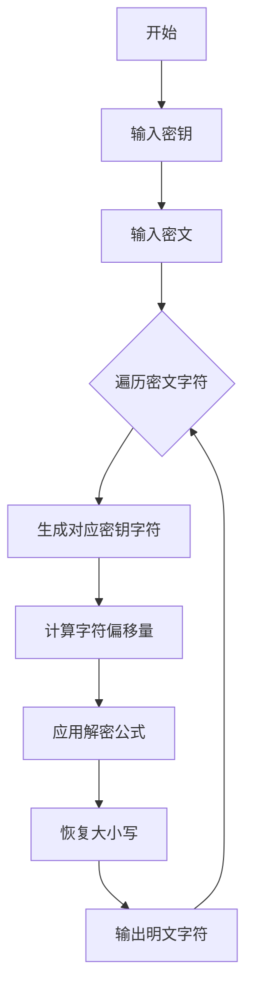

# 题目信息

# [NOIP 2012 提高组] Vigenère 密码

## 题目描述

16 世纪法国外交家 Blaise de Vigenère 设计了一种多表密码加密算法 Vigenère 密码。Vigenère 密码的加密解密算法简单易用，且破译难度比较高，曾在美国南北战争中为南军所广泛使用。

 
在密码学中，我们称需要加密的信息为明文，用 $M$ 表示；称加密后的信息为密文，用 $C$ 表示；而密钥是一种参数，是将明文转换为密文或将密文转换为明文的算法中输入的数据，记为 $k$。在 Vigenère 密码中，密钥 $k$ 是一个字母串，$k=k_1,k_2,…,k_n$。当明文 $M=m_1,m_2,…,m_n$ 时，得到的密文 $C=c_1,c_2,…,c_n$，其中 $c_i$=$m_i \operatorname{\circledR} k_i$，运算 $\circledR$ 的规则如下表所示：

$$\begin{array}{c|cccccccccccccccccccccccccc}
\circledR &\tt A \kern{-5pt} &\tt B \kern{-5pt} &\tt C \kern{-5pt} &\tt D \kern{-5pt} &\tt E \kern{-5pt} &\tt F \kern{-5pt} &\tt G \kern{-5pt} &\tt H \kern{-5pt} &\tt I \kern{-5pt} &\tt J \kern{-5pt} &\tt K \kern{-5pt} &\tt L \kern{-5pt} &\tt M \kern{-5pt} &\tt N \kern{-5pt} &\tt O \kern{-5pt} &\tt P \kern{-5pt} &\tt Q \kern{-5pt} &\tt R \kern{-5pt} &\tt S \kern{-5pt} &\tt T \kern{-5pt} &\tt U \kern{-5pt} &\tt V \kern{-5pt} &\tt W \kern{-5pt} &\tt X \kern{-5pt} &\tt Y \kern{-5pt} &\tt Z \kern{-5pt}  \\\hline
\tt A &\tt A \kern{-5pt} &\tt B \kern{-5pt} &\tt C \kern{-5pt} &\tt D \kern{-5pt} &\tt E \kern{-5pt} &\tt F \kern{-5pt} &\tt G \kern{-5pt} &\tt H \kern{-5pt} &\tt I \kern{-5pt} &\tt J \kern{-5pt} &\tt K \kern{-5pt} &\tt L \kern{-5pt} &\tt M \kern{-5pt} &\tt N \kern{-5pt} &\tt O \kern{-5pt} &\tt P \kern{-5pt} &\tt Q \kern{-5pt} &\tt R \kern{-5pt} &\tt S \kern{-5pt} &\tt T \kern{-5pt} &\tt U \kern{-5pt} &\tt V \kern{-5pt} &\tt W \kern{-5pt} &\tt X \kern{-5pt} &\tt Y \kern{-5pt} &\tt Z \kern{-5pt}  \\
\tt B &\tt B \kern{-5pt} &\tt C \kern{-5pt} &\tt D \kern{-5pt} &\tt E \kern{-5pt} &\tt F \kern{-5pt} &\tt G \kern{-5pt} &\tt H \kern{-5pt} &\tt I \kern{-5pt} &\tt J \kern{-5pt} &\tt K \kern{-5pt} &\tt L \kern{-5pt} &\tt M \kern{-5pt} &\tt N \kern{-5pt} &\tt O \kern{-5pt} &\tt P \kern{-5pt} &\tt Q \kern{-5pt} &\tt R \kern{-5pt} &\tt S \kern{-5pt} &\tt T \kern{-5pt} &\tt U \kern{-5pt} &\tt V \kern{-5pt} &\tt W \kern{-5pt} &\tt X \kern{-5pt} &\tt Y \kern{-5pt} &\tt Z \kern{-5pt} &\tt A \kern{-5pt}  \\
\tt C &\tt C \kern{-5pt} &\tt D \kern{-5pt} &\tt E \kern{-5pt} &\tt F \kern{-5pt} &\tt G \kern{-5pt} &\tt H \kern{-5pt} &\tt I \kern{-5pt} &\tt J \kern{-5pt} &\tt K \kern{-5pt} &\tt L \kern{-5pt} &\tt M \kern{-5pt} &\tt N \kern{-5pt} &\tt O \kern{-5pt} &\tt P \kern{-5pt} &\tt Q \kern{-5pt} &\tt R \kern{-5pt} &\tt S \kern{-5pt} &\tt T \kern{-5pt} &\tt U \kern{-5pt} &\tt V \kern{-5pt} &\tt W \kern{-5pt} &\tt X \kern{-5pt} &\tt Y \kern{-5pt} &\tt Z \kern{-5pt} &\tt A \kern{-5pt} &\tt B \kern{-5pt}  \\
\tt D &\tt D \kern{-5pt} &\tt E \kern{-5pt} &\tt F \kern{-5pt} &\tt G \kern{-5pt} &\tt H \kern{-5pt} &\tt I \kern{-5pt} &\tt J \kern{-5pt} &\tt K \kern{-5pt} &\tt L \kern{-5pt} &\tt M \kern{-5pt} &\tt N \kern{-5pt} &\tt O \kern{-5pt} &\tt P \kern{-5pt} &\tt Q \kern{-5pt} &\tt R \kern{-5pt} &\tt S \kern{-5pt} &\tt T \kern{-5pt} &\tt U \kern{-5pt} &\tt V \kern{-5pt} &\tt W \kern{-5pt} &\tt X \kern{-5pt} &\tt Y \kern{-5pt} &\tt Z \kern{-5pt} &\tt A \kern{-5pt} &\tt B \kern{-5pt} &\tt C \kern{-5pt}  \\
\tt E &\tt E \kern{-5pt} &\tt F \kern{-5pt} &\tt G \kern{-5pt} &\tt H \kern{-5pt} &\tt I \kern{-5pt} &\tt J \kern{-5pt} &\tt K \kern{-5pt} &\tt L \kern{-5pt} &\tt M \kern{-5pt} &\tt N \kern{-5pt} &\tt O \kern{-5pt} &\tt P \kern{-5pt} &\tt Q \kern{-5pt} &\tt R \kern{-5pt} &\tt S \kern{-5pt} &\tt T \kern{-5pt} &\tt U \kern{-5pt} &\tt V \kern{-5pt} &\tt W \kern{-5pt} &\tt X \kern{-5pt} &\tt Y \kern{-5pt} &\tt Z \kern{-5pt} &\tt A \kern{-5pt} &\tt B \kern{-5pt} &\tt C \kern{-5pt} &\tt D \kern{-5pt}  \\
\tt F &\tt F \kern{-5pt} &\tt G \kern{-5pt} &\tt H \kern{-5pt} &\tt I \kern{-5pt} &\tt J \kern{-5pt} &\tt K \kern{-5pt} &\tt L \kern{-5pt} &\tt M \kern{-5pt} &\tt N \kern{-5pt} &\tt O \kern{-5pt} &\tt P \kern{-5pt} &\tt Q \kern{-5pt} &\tt R \kern{-5pt} &\tt S \kern{-5pt} &\tt T \kern{-5pt} &\tt U \kern{-5pt} &\tt V \kern{-5pt} &\tt W \kern{-5pt} &\tt X \kern{-5pt} &\tt Y \kern{-5pt} &\tt Z \kern{-5pt} &\tt A \kern{-5pt} &\tt B \kern{-5pt} &\tt C \kern{-5pt} &\tt D \kern{-5pt} &\tt E \kern{-5pt}  \\
\tt G &\tt G \kern{-5pt} &\tt H \kern{-5pt} &\tt I \kern{-5pt} &\tt J \kern{-5pt} &\tt K \kern{-5pt} &\tt L \kern{-5pt} &\tt M \kern{-5pt} &\tt N \kern{-5pt} &\tt O \kern{-5pt} &\tt P \kern{-5pt} &\tt Q \kern{-5pt} &\tt R \kern{-5pt} &\tt S \kern{-5pt} &\tt T \kern{-5pt} &\tt U \kern{-5pt} &\tt V \kern{-5pt} &\tt W \kern{-5pt} &\tt X \kern{-5pt} &\tt Y \kern{-5pt} &\tt Z \kern{-5pt} &\tt A \kern{-5pt} &\tt B \kern{-5pt} &\tt C \kern{-5pt} &\tt D \kern{-5pt} &\tt E \kern{-5pt} &\tt F \kern{-5pt}  \\
\tt H &\tt H \kern{-5pt} &\tt I \kern{-5pt} &\tt J \kern{-5pt} &\tt K \kern{-5pt} &\tt L \kern{-5pt} &\tt M \kern{-5pt} &\tt N \kern{-5pt} &\tt O \kern{-5pt} &\tt P \kern{-5pt} &\tt Q \kern{-5pt} &\tt R \kern{-5pt} &\tt S \kern{-5pt} &\tt T \kern{-5pt} &\tt U \kern{-5pt} &\tt V \kern{-5pt} &\tt W \kern{-5pt} &\tt X \kern{-5pt} &\tt Y \kern{-5pt} &\tt Z \kern{-5pt} &\tt A \kern{-5pt} &\tt B \kern{-5pt} &\tt C \kern{-5pt} &\tt D \kern{-5pt} &\tt E \kern{-5pt} &\tt F \kern{-5pt} &\tt G \kern{-5pt}  \\
\tt I &\tt I \kern{-5pt} &\tt J \kern{-5pt} &\tt K \kern{-5pt} &\tt L \kern{-5pt} &\tt M \kern{-5pt} &\tt N \kern{-5pt} &\tt O \kern{-5pt} &\tt P \kern{-5pt} &\tt Q \kern{-5pt} &\tt R \kern{-5pt} &\tt S \kern{-5pt} &\tt T \kern{-5pt} &\tt U \kern{-5pt} &\tt V \kern{-5pt} &\tt W \kern{-5pt} &\tt X \kern{-5pt} &\tt Y \kern{-5pt} &\tt Z \kern{-5pt} &\tt A \kern{-5pt} &\tt B \kern{-5pt} &\tt C \kern{-5pt} &\tt D \kern{-5pt} &\tt E \kern{-5pt} &\tt F \kern{-5pt} &\tt G \kern{-5pt} &\tt H \kern{-5pt}  \\
\tt J &\tt J \kern{-5pt} &\tt K \kern{-5pt} &\tt L \kern{-5pt} &\tt M \kern{-5pt} &\tt N \kern{-5pt} &\tt O \kern{-5pt} &\tt P \kern{-5pt} &\tt Q \kern{-5pt} &\tt R \kern{-5pt} &\tt S \kern{-5pt} &\tt T \kern{-5pt} &\tt U \kern{-5pt} &\tt V \kern{-5pt} &\tt W \kern{-5pt} &\tt X \kern{-5pt} &\tt Y \kern{-5pt} &\tt Z \kern{-5pt} &\tt A \kern{-5pt} &\tt B \kern{-5pt} &\tt C \kern{-5pt} &\tt D \kern{-5pt} &\tt E \kern{-5pt} &\tt F \kern{-5pt} &\tt G \kern{-5pt} &\tt H \kern{-5pt} &\tt I \kern{-5pt}  \\
\tt K &\tt K \kern{-5pt} &\tt L \kern{-5pt} &\tt M \kern{-5pt} &\tt N \kern{-5pt} &\tt O \kern{-5pt} &\tt P \kern{-5pt} &\tt Q \kern{-5pt} &\tt R \kern{-5pt} &\tt S \kern{-5pt} &\tt T \kern{-5pt} &\tt U \kern{-5pt} &\tt V \kern{-5pt} &\tt W \kern{-5pt} &\tt X \kern{-5pt} &\tt Y \kern{-5pt} &\tt Z \kern{-5pt} &\tt A \kern{-5pt} &\tt B \kern{-5pt} &\tt C \kern{-5pt} &\tt D \kern{-5pt} &\tt E \kern{-5pt} &\tt F \kern{-5pt} &\tt G \kern{-5pt} &\tt H \kern{-5pt} &\tt I \kern{-5pt} &\tt J \kern{-5pt}  \\
\tt L &\tt L \kern{-5pt} &\tt M \kern{-5pt} &\tt N \kern{-5pt} &\tt O \kern{-5pt} &\tt P \kern{-5pt} &\tt Q \kern{-5pt} &\tt R \kern{-5pt} &\tt S \kern{-5pt} &\tt T \kern{-5pt} &\tt U \kern{-5pt} &\tt V \kern{-5pt} &\tt W \kern{-5pt} &\tt X \kern{-5pt} &\tt Y \kern{-5pt} &\tt Z \kern{-5pt} &\tt A \kern{-5pt} &\tt B \kern{-5pt} &\tt C \kern{-5pt} &\tt D \kern{-5pt} &\tt E \kern{-5pt} &\tt F \kern{-5pt} &\tt G \kern{-5pt} &\tt H \kern{-5pt} &\tt I \kern{-5pt} &\tt J \kern{-5pt} &\tt K \kern{-5pt}  \\
\tt M &\tt M \kern{-5pt} &\tt N \kern{-5pt} &\tt O \kern{-5pt} &\tt P \kern{-5pt} &\tt Q \kern{-5pt} &\tt R \kern{-5pt} &\tt S \kern{-5pt} &\tt T \kern{-5pt} &\tt U \kern{-5pt} &\tt V \kern{-5pt} &\tt W \kern{-5pt} &\tt X \kern{-5pt} &\tt Y \kern{-5pt} &\tt Z \kern{-5pt} &\tt A \kern{-5pt} &\tt B \kern{-5pt} &\tt C \kern{-5pt} &\tt D \kern{-5pt} &\tt E \kern{-5pt} &\tt F \kern{-5pt} &\tt G \kern{-5pt} &\tt H \kern{-5pt} &\tt I \kern{-5pt} &\tt J \kern{-5pt} &\tt K \kern{-5pt} &\tt L \kern{-5pt}  \\
\tt N &\tt N \kern{-5pt} &\tt O \kern{-5pt} &\tt P \kern{-5pt} &\tt Q \kern{-5pt} &\tt R \kern{-5pt} &\tt S \kern{-5pt} &\tt T \kern{-5pt} &\tt U \kern{-5pt} &\tt V \kern{-5pt} &\tt W \kern{-5pt} &\tt X \kern{-5pt} &\tt Y \kern{-5pt} &\tt Z \kern{-5pt} &\tt A \kern{-5pt} &\tt B \kern{-5pt} &\tt C \kern{-5pt} &\tt D \kern{-5pt} &\tt E \kern{-5pt} &\tt F \kern{-5pt} &\tt G \kern{-5pt} &\tt H \kern{-5pt} &\tt I \kern{-5pt} &\tt J \kern{-5pt} &\tt K \kern{-5pt} &\tt L \kern{-5pt} &\tt M \kern{-5pt}  \\
\tt O &\tt O \kern{-5pt} &\tt P \kern{-5pt} &\tt Q \kern{-5pt} &\tt R \kern{-5pt} &\tt S \kern{-5pt} &\tt T \kern{-5pt} &\tt U \kern{-5pt} &\tt V \kern{-5pt} &\tt W \kern{-5pt} &\tt X \kern{-5pt} &\tt Y \kern{-5pt} &\tt Z \kern{-5pt} &\tt A \kern{-5pt} &\tt B \kern{-5pt} &\tt C \kern{-5pt} &\tt D \kern{-5pt} &\tt E \kern{-5pt} &\tt F \kern{-5pt} &\tt G \kern{-5pt} &\tt H \kern{-5pt} &\tt I \kern{-5pt} &\tt J \kern{-5pt} &\tt K \kern{-5pt} &\tt L \kern{-5pt} &\tt M \kern{-5pt} &\tt N \kern{-5pt}  \\
\tt P &\tt P \kern{-5pt} &\tt Q \kern{-5pt} &\tt R \kern{-5pt} &\tt S \kern{-5pt} &\tt T \kern{-5pt} &\tt U \kern{-5pt} &\tt V \kern{-5pt} &\tt W \kern{-5pt} &\tt X \kern{-5pt} &\tt Y \kern{-5pt} &\tt Z \kern{-5pt} &\tt A \kern{-5pt} &\tt B \kern{-5pt} &\tt C \kern{-5pt} &\tt D \kern{-5pt} &\tt E \kern{-5pt} &\tt F \kern{-5pt} &\tt G \kern{-5pt} &\tt H \kern{-5pt} &\tt I \kern{-5pt} &\tt J \kern{-5pt} &\tt K \kern{-5pt} &\tt L \kern{-5pt} &\tt M \kern{-5pt} &\tt N \kern{-5pt} &\tt O \kern{-5pt}  \\
\tt Q &\tt Q \kern{-5pt} &\tt R \kern{-5pt} &\tt S \kern{-5pt} &\tt T \kern{-5pt} &\tt U \kern{-5pt} &\tt V \kern{-5pt} &\tt W \kern{-5pt} &\tt X \kern{-5pt} &\tt Y \kern{-5pt} &\tt Z \kern{-5pt} &\tt A \kern{-5pt} &\tt B \kern{-5pt} &\tt C \kern{-5pt} &\tt D \kern{-5pt} &\tt E \kern{-5pt} &\tt F \kern{-5pt} &\tt G \kern{-5pt} &\tt H \kern{-5pt} &\tt I \kern{-5pt} &\tt J \kern{-5pt} &\tt K \kern{-5pt} &\tt L \kern{-5pt} &\tt M \kern{-5pt} &\tt N \kern{-5pt} &\tt O \kern{-5pt} &\tt P \kern{-5pt}  \\
\tt R &\tt R \kern{-5pt} &\tt S \kern{-5pt} &\tt T \kern{-5pt} &\tt U \kern{-5pt} &\tt V \kern{-5pt} &\tt W \kern{-5pt} &\tt X \kern{-5pt} &\tt Y \kern{-5pt} &\tt Z \kern{-5pt} &\tt A \kern{-5pt} &\tt B \kern{-5pt} &\tt C \kern{-5pt} &\tt D \kern{-5pt} &\tt E \kern{-5pt} &\tt F \kern{-5pt} &\tt G \kern{-5pt} &\tt H \kern{-5pt} &\tt I \kern{-5pt} &\tt J \kern{-5pt} &\tt K \kern{-5pt} &\tt L \kern{-5pt} &\tt M \kern{-5pt} &\tt N \kern{-5pt} &\tt O \kern{-5pt} &\tt P \kern{-5pt} &\tt Q \kern{-5pt}  \\
\tt S &\tt S \kern{-5pt} &\tt T \kern{-5pt} &\tt U \kern{-5pt} &\tt V \kern{-5pt} &\tt W \kern{-5pt} &\tt X \kern{-5pt} &\tt Y \kern{-5pt} &\tt Z \kern{-5pt} &\tt A \kern{-5pt} &\tt B \kern{-5pt} &\tt C \kern{-5pt} &\tt D \kern{-5pt} &\tt E \kern{-5pt} &\tt F \kern{-5pt} &\tt G \kern{-5pt} &\tt H \kern{-5pt} &\tt I \kern{-5pt} &\tt J \kern{-5pt} &\tt K \kern{-5pt} &\tt L \kern{-5pt} &\tt M \kern{-5pt} &\tt N \kern{-5pt} &\tt O \kern{-5pt} &\tt P \kern{-5pt} &\tt Q \kern{-5pt} &\tt R \kern{-5pt}  \\
\tt T &\tt T \kern{-5pt} &\tt U \kern{-5pt} &\tt V \kern{-5pt} &\tt W \kern{-5pt} &\tt X \kern{-5pt} &\tt Y \kern{-5pt} &\tt Z \kern{-5pt} &\tt A \kern{-5pt} &\tt B \kern{-5pt} &\tt C \kern{-5pt} &\tt D \kern{-5pt} &\tt E \kern{-5pt} &\tt F \kern{-5pt} &\tt G \kern{-5pt} &\tt H \kern{-5pt} &\tt I \kern{-5pt} &\tt J \kern{-5pt} &\tt K \kern{-5pt} &\tt L \kern{-5pt} &\tt M \kern{-5pt} &\tt N \kern{-5pt} &\tt O \kern{-5pt} &\tt P \kern{-5pt} &\tt Q \kern{-5pt} &\tt R \kern{-5pt} &\tt S \kern{-5pt}  \\
\tt U &\tt U \kern{-5pt} &\tt V \kern{-5pt} &\tt W \kern{-5pt} &\tt X \kern{-5pt} &\tt Y \kern{-5pt} &\tt Z \kern{-5pt} &\tt A \kern{-5pt} &\tt B \kern{-5pt} &\tt C \kern{-5pt} &\tt D \kern{-5pt} &\tt E \kern{-5pt} &\tt F \kern{-5pt} &\tt G \kern{-5pt} &\tt H \kern{-5pt} &\tt I \kern{-5pt} &\tt J \kern{-5pt} &\tt K \kern{-5pt} &\tt L \kern{-5pt} &\tt M \kern{-5pt} &\tt N \kern{-5pt} &\tt O \kern{-5pt} &\tt P \kern{-5pt} &\tt Q \kern{-5pt} &\tt R \kern{-5pt} &\tt S \kern{-5pt} &\tt T \kern{-5pt}  \\
\tt V &\tt V \kern{-5pt} &\tt W \kern{-5pt} &\tt X \kern{-5pt} &\tt Y \kern{-5pt} &\tt Z \kern{-5pt} &\tt A \kern{-5pt} &\tt B \kern{-5pt} &\tt C \kern{-5pt} &\tt D \kern{-5pt} &\tt E \kern{-5pt} &\tt F \kern{-5pt} &\tt G \kern{-5pt} &\tt H \kern{-5pt} &\tt I \kern{-5pt} &\tt J \kern{-5pt} &\tt K \kern{-5pt} &\tt L \kern{-5pt} &\tt M \kern{-5pt} &\tt N \kern{-5pt} &\tt O \kern{-5pt} &\tt P \kern{-5pt} &\tt Q \kern{-5pt} &\tt R \kern{-5pt} &\tt S \kern{-5pt} &\tt T \kern{-5pt} &\tt U \kern{-5pt}  \\
\tt W &\tt W \kern{-5pt} &\tt X \kern{-5pt} &\tt Y \kern{-5pt} &\tt Z \kern{-5pt} &\tt A \kern{-5pt} &\tt B \kern{-5pt} &\tt C \kern{-5pt} &\tt D \kern{-5pt} &\tt E \kern{-5pt} &\tt F \kern{-5pt} &\tt G \kern{-5pt} &\tt H \kern{-5pt} &\tt I \kern{-5pt} &\tt J \kern{-5pt} &\tt K \kern{-5pt} &\tt L \kern{-5pt} &\tt M \kern{-5pt} &\tt N \kern{-5pt} &\tt O \kern{-5pt} &\tt P \kern{-5pt} &\tt Q \kern{-5pt} &\tt R \kern{-5pt} &\tt S \kern{-5pt} &\tt T \kern{-5pt} &\tt U \kern{-5pt} &\tt V \kern{-5pt}  \\
\tt X &\tt X \kern{-5pt} &\tt Y \kern{-5pt} &\tt Z \kern{-5pt} &\tt A \kern{-5pt} &\tt B \kern{-5pt} &\tt C \kern{-5pt} &\tt D \kern{-5pt} &\tt E \kern{-5pt} &\tt F \kern{-5pt} &\tt G \kern{-5pt} &\tt H \kern{-5pt} &\tt I \kern{-5pt} &\tt J \kern{-5pt} &\tt K \kern{-5pt} &\tt L \kern{-5pt} &\tt M \kern{-5pt} &\tt N \kern{-5pt} &\tt O \kern{-5pt} &\tt P \kern{-5pt} &\tt Q \kern{-5pt} &\tt R \kern{-5pt} &\tt S \kern{-5pt} &\tt T \kern{-5pt} &\tt U \kern{-5pt} &\tt V \kern{-5pt} &\tt W \kern{-5pt}  \\
\tt Y &\tt Y \kern{-5pt} &\tt Z \kern{-5pt} &\tt A \kern{-5pt} &\tt B \kern{-5pt} &\tt C \kern{-5pt} &\tt D \kern{-5pt} &\tt E \kern{-5pt} &\tt F \kern{-5pt} &\tt G \kern{-5pt} &\tt H \kern{-5pt} &\tt I \kern{-5pt} &\tt J \kern{-5pt} &\tt K \kern{-5pt} &\tt L \kern{-5pt} &\tt M \kern{-5pt} &\tt N \kern{-5pt} &\tt O \kern{-5pt} &\tt P \kern{-5pt} &\tt Q \kern{-5pt} &\tt R \kern{-5pt} &\tt S \kern{-5pt} &\tt T \kern{-5pt} &\tt U \kern{-5pt} &\tt V \kern{-5pt} &\tt W \kern{-5pt} &\tt X \kern{-5pt}  \\
\tt Z &\tt Z \kern{-5pt} &\tt A \kern{-5pt} &\tt B \kern{-5pt} &\tt C \kern{-5pt} &\tt D \kern{-5pt} &\tt E \kern{-5pt} &\tt F \kern{-5pt} &\tt G \kern{-5pt} &\tt H \kern{-5pt} &\tt I \kern{-5pt} &\tt J \kern{-5pt} &\tt K \kern{-5pt} &\tt L \kern{-5pt} &\tt M \kern{-5pt} &\tt N \kern{-5pt} &\tt O \kern{-5pt} &\tt P \kern{-5pt} &\tt Q \kern{-5pt} &\tt R \kern{-5pt} &\tt S \kern{-5pt} &\tt T \kern{-5pt} &\tt U \kern{-5pt} &\tt V \kern{-5pt} &\tt W \kern{-5pt} &\tt X \kern{-5pt} &\tt Y \kern{-5pt}  \\

\end{array}
$$

Vigenère 加密在操作时需要注意：

1. $\circledR$ 运算忽略参与运算的字母的大小写，并保持字母在明文 $M$ 中的大小写形式；
2. 当明文 $M$ 的长度大于密钥 $k$ 的长度时，将密钥 $k$ 重复使用。

例如，明文 $M=\texttt{Helloworld}$，密钥 $k=\texttt{abc}$ 时，密文 $C=\texttt{Hfnlpyosnd}$。

$$
\def\arraystretch{1.5}
\begin{array}{|c|c|c|c|c|c|c|c|c|c|c|} \hline
\textsf{明文} & \tt H & \tt e & \tt l & \tt l & \tt o & \tt w & \tt o & \tt r & \tt l & \tt d \\  \hline
\textsf{密钥} & \tt a & \tt b & \tt c & \tt a & \tt b & \tt c & \tt a & \tt b & \tt c & \tt a \\  \hline
\textsf{密文} & \tt H & \tt f & \tt n & \tt l & \tt p & \tt y & \tt o & \tt s & \tt n & \tt d \\  \hline
\end{array}
$$


## 说明/提示

对于 $100\%$ 的数据，输入的密钥的长度不超过 $100$，输入的密文的长度不超过 $1000$，且都仅包含英文字母。

NOIP 2012 提高组 第一天 第一题

## 样例 #1

### 输入

```
CompleteVictory
Yvqgpxaimmklongnzfwpvxmniytm```

### 输出

```
Wherethereisawillthereisaway```

# AI分析结果


# 💡 洛语云笺的C++算法解析：Vigenère密码 深入学习指南 💡

## 1. 题目解读与策略初探

✨ **本题核心挑战**：准确实现Vigenère密码的**逆向解密算法**，处理密钥循环使用和字母大小写转换问题  
✨ **核心算法标签**：`字符串处理` `模拟` `密码学基础`

🗣️ **初步分析**：  
> 这道题需要根据密码表逆向推导解密公式。最直观的思路是暴力查表，但效率较低；优化策略是**数学推导**解密公式。通过观察密码表规律，发现解密核心是计算`(密文字符-密钥字符+26)%26`的数学关系。难点在于处理大小写一致性和密钥循环机制。  

### 🔍 算法侦探：如何在题目中发现线索？
1.  **线索1 (问题目标)**: "题目要求将密文还原为明文，属于典型的**密码逆向工程**问题，需要分析加密规则并推导逆运算"
2.  **线索2 (问题约束/特性)**: "密钥循环使用机制（长度不足时重复）和大小写保持特性，要求算法必须处理**周期性索引**和**大小写敏感**"
3.  **线索3 (数据规模)**: "密钥长度≤100，密文长度≤1000，O(n)算法完全可行，无需复杂优化，重点在于实现准确性"

### 🧠 思维链构建：从线索到策略
> "收集线索后：  
> 1.  **线索1**指向需要解析加密规则的反向操作——这不是搜索问题而是**数学映射**问题  
> 2.  **线索2**强调两个关键约束：周期性密钥索引和大小写处理，需设计**循环计数**和**大小写分离**机制  
> 3.  **线索3**确认数据规模允许直接模拟，重点应放在**代码健壮性**而非算法复杂度  
> 4.  **结论**：最优策略是**推导数学解密公式**配合循环索引控制，以O(n)时间复杂度高效解决"

---

## 2. 精选优质题解参考

**题解一（作者：ingu）**  
* **点评**：运用ASCII位运算`(k[i]&31)`精妙提取字母序数，通过三元运算符优雅处理边界条件。公式`(c[i]&31)-t>0?c[i]-t:c[i]-t+26`完美体现解密数学本质。代码简洁高效（仅10行），是数学推导型解法的典范。

**题解二（作者：Sinwind）**  
* **点评**：创新性提出统一大小写预处理策略，通过`toupper`规范化简化计算。解密函数封装清晰，`(temp_c >= temp_k)`的条件分支处理体现对密码表规律的深刻理解。模块化设计提升代码可读性。

**题解三（作者：qhr2023）**  
* **点评**：首创四重条件判断处理大小写组合场景，使用`(c-k+26)%26`核心公式保持代码简洁。亮点在于用`c1[i]-'a'-k[i%j]+'A'`实现跨大小写计算，展现对字符编码的灵活运用。

---

## 3. 解题策略深度剖析

### 🎯 核心难点与关键步骤
1.  **数学公式推导**  
    * **分析**：通过密码表观察发现：明文字符 = (密文字符编码 - 密钥字符编码 + 26) % 26。需注意：
      - 字母编码统一为0-25（A/a=0, B/b=1...）
      - 负数补偿：当差值为负时+26保证结果非负
    * 💡 **学习笔记**：密码学问题常存在数学规律，发现`(x-y+26)%26`这类模运算可高效替代查表

2.  **大小写处理**  
    * **分析**：需保持密文原文大小写一致。策略：
      - 加密前保存密文字母大小写状态
      - 计算使用统一小写/大写编码
      - 结果根据保存状态恢复大小写
    * 💡 **学习笔记**：`isupper()`/`tolower()`等库函数能简化大小写处理

3.  **密钥循环机制**  
    * **分析**：通过`i%key_length`实现密钥循环访问，关键点：
      - 循环计数器随密文索引递增
      - 模运算重置索引：`index = i % key_len`
    * 💡 **学习笔记**：周期性访问问题首选模运算，避免显式字符串填充

### ✨ 解题技巧总结
- **技巧1（数学替代查表）**：通过代数推导将O(n²)查表转化为O(n)计算
- **技巧2（位运算优化）**：利用`char & 31`快速获取字母序数（A=1, B=2...）
- **技巧3（状态分离）**：将大小写状态与字母值分离处理，保证计算一致性

### ⚔️ 策略竞技场：不同解法对比分析
| 策略 | 核心思想 | 优点 | 缺点 | 适用场景 |
|------|----------|------|------|----------|
| **查表法** | 预存密码表反向查找 | 直观易理解 | 存储开销大，实现复杂 | 密码表复杂时 |
| **数学推导** | 公式`(C-K+26)%26`计算 | 代码简洁，O(n)高效 | 需理解数学原理 | 本题最佳方案 |
| **ASCII遍历** | 循环递减字母位置 | 逻辑简单 | 效率低(O(kn))，代码冗长 | 小规模数据 |

### ✨ 优化之旅：从"能做"到"做好"
> 1. **起点：暴力查表**  
>   直接存储26x26密码表，通过双循环查找明文字符。空间复杂度O(26²)，且实现繁琐  
>   
> 2. **发现瓶颈：重复计算**  
>   每次查表需遍历平均13次，1000字符需13000次查找  
>   
> 3. **优化钥匙：数学规律**  
>   观察发现密码表满足`(Mi + Ki) mod 26 = Ci`，推导出`Mi = (Ci - Ki + 26) mod 26`  
>   
> 4. **模型升华：位运算加速**  
>   用`k[i]&31`替代`(k[i]-'A')`计算字母序数，减少减法指令  

💡 **策略总结**：从暴力查表到数学公式的优化，体现了"发现隐藏规律→应用数学工具→位运算微优化"的经典优化路径，核心在于对问题本质的洞察

---

## 4. C++核心代码实现赏析

**本题通用核心C++实现参考**
```cpp
#include <iostream>
#include <cctype>
using namespace std;

int main() {
    string key, cipher;
    cin >> key >> cipher;
    
    for (int i = 0; i < cipher.size(); i++) {
        char k = key[i % key.size()];
        char c = cipher[i];
        bool isUpper = isupper(c);
        
        // 统一为小写计算
        k = tolower(k);
        c = tolower(c);
        
        // 核心解密公式
        char plain = (c - 'a' - (k - 'a') + 26) % 26 + 'a';
        
        // 恢复大小写
        if (isUpper) plain = toupper(plain);
        cout << plain;
    }
    return 0;
}
```
* **代码解读概要**：  
  1. 循环处理每个密文字符  
  2. 通过`i%key.size()`实现密钥循环  
  3. 统一大小写后应用`(c-k+26)%26`公式  
  4. 恢复原始大小写输出  

---

## 5. 算法可视化：像素动画演示

**动画主题**：像素风密码破译工坊  
**核心演示**：密钥流生成与字符解密过程  



**可视化设计**：  
1. **8-bit风格界面**：  
   - 顶部像素条显示密钥流（循环流动）  
   - 中部动态展示`密文→密钥→明文`转换过程  
   - 底部结果区实时输出明文  

2. **动态效果**：  
   - 密钥字符高亮流动（类似马里奥移动平台）  
   - 密文字符下落至解密工坊，经"公式机器"处理后变为明文字符  
   - 解密成功时像素烟花特效  

3. **交互控制**：  
   - 步进模式：空格键单步执行  
   - 速度滑块：调节解密速度  
   - 暂停/继续按钮  

4. **音效设计**：  
   - 字符处理："8-bit键盘"音效  
   - 解密成功：经典FC胜利旋律  
   - 错误提示：复古警告音  

---

## 6. 拓展练习与相似问题思考

**相似问题迁移**：  
1. 凯撒密码：单表替换密码的简化版  
2. RC4流密码：更复杂的密钥流生成机制  
3. 栅栏密码：位置变换型密码  

**洛谷题目推荐**：  
1. **P1914 凯撒密码**  
   - 推荐理由：单表替换密码基础，强化字符移位操作训练  
   
2. **P1086 花生采摘**  
   - 推荐理由：训练二维坐标与周期性访问思维  

3. **P1603 斯诺登的密码**  
   - 推荐理由：复杂字符串处理实战，提升密码学问题抽象能力  

---

## 7. 学习心得与经验分享

> **经验分享（综合题解）**：  
> "调试时常见错误是忽略密钥索引重置，建议在循环内打印`i%key_len`值验证；大小写处理易错点在于计算后未恢复原始大小写状态"  
>   
> **点评**：这些经验突显了两个关键调试技巧：  
> 1. **周期验证**：通过中间输出确认索引生成逻辑  
> 2. **状态分离**：将计算与格式处理完全分离可避免常见错误  

---

**结语**：Vigenère密码作为古典密码代表，融合了数学之美与编程智慧。掌握字符编码处理与模运算技巧，将为后续密码学学习奠定坚实基础。记住：优秀的算法往往藏在数学规律之中！💪

---
处理用时：112.86秒