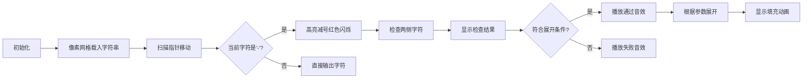

# 题目信息

# [NOIP 2007 提高组] 字符串的展开

## 题目描述

在初赛普及组的“阅读程序写结果”的问题中，我们曾给出一个字符串展开的例子：如果在输入的字符串中，含有类似于 `d-h` 或者 `4-8` 的字串，我们就把它当作一种简写，输出时，用连续递增的字母或数字串替代其中的减号，即，将上面两个子串分别输出为 `defgh` 和 `45678`。在本题中，我们通过增加一些参数的设置，使字符串的展开更为灵活。具体约定如下：

(1) 遇到下面的情况需要做字符串的展开：在输入的字符串中，出现了减号 `-` ，减号两侧同为小写字母或同为数字，且按照 `ASCII` 码的顺序，减号右边的字符严格大于左边的字符。

(2) 参数 $p_1$：展开方式。$p_1=1$ 时，对于字母子串，填充小写字母；$p_1=2$ 时，对于字母子串，填充大写字母。这两种情况下数字子串的填充方式相同。$p_1=3$ 时，不论是字母子串还是数字字串，都用与要填充的字母个数相同的星号 `*` 来填充。

(3) 参数 $p_2$：填充字符的重复个数。$p_2=k$ 表示同一个字符要连续填充 $k$ 个。例如，当 $p_2=3$ 时，子串`d-h` 应扩展为 `deeefffgggh`。减号两边的字符不变。

(4) 参数 $p_3$：是否改为逆序：$p_3=1$ 表示维持原来顺序，$p_3=2$ 表示采用逆序输出，注意这时候仍然不包括减号两端的字符。例如当 $p_1=1$、$p_2=2$、$p_3=2$ 时，子串 `d-h` 应扩展为 `dggffeeh`。

(5) 如果减号右边的字符恰好是左边字符的后继，只删除中间的减号，例如：`d-e` 应输出为 `de`，`3-4` 应输出为 `34`。如果减号右边的字符按照 `ASCII` 码的顺序小于或等于左边字符，输出时，要保留中间的减号，例如：`d-d` 应输出为 `d-d`，`3-1` 应输出为 `3-1`。


## 说明/提示

$40\%$ 的数据满足：字符串长度不超过 $5$。

$100\%$ 的数据满足：$1  \le  p_1  \le  3,1  \le  p_2  \le  8,1  \le  p_3  \le  2$。字符串长度不超过 $100$。

NOIP 2007 提高第二题


## 样例 #1

### 输入

```
1 2 1
abcs-w1234-9s-4zz```

### 输出

```
abcsttuuvvw1234556677889s-4zz```

## 样例 #2

### 输入

```
2 3 2
a-d-d```

### 输出

```
aCCCBBBd-d```

# AI分析结果


# 💡 洛语云笺的C++算法解析：字符串的展开 深入学习指南 💡

## 1. 题目解读与策略初探

✨ **本题核心挑战**：在复杂的参数控制下（p1/p2/p3）正确处理字符串中减号'-'的展开规则，同时满足多种边界条件（如减号在开头/结尾、字符类型匹配等）

✨ **核心算法标签**：字符串处理、条件模拟、参数化控制

🗣️ **初步分析**：
> 这道题看似复杂，实则考验我们如何将多重规则转化为清晰的逻辑分支。我们需要建立从字符扫描到条件判断再到展开生成的全流程思维。最优解采用**直接模拟法**，通过逐字符扫描+条件分支处理，配合标准库函数简化类型判断。
>
> **可视化设计思路**：我们将创建像素风格的字符扫描动画，高亮当前处理的字符，用不同颜色标记减号展开区域，动态展示字符填充过程。复古音效将在关键操作时触发，增强算法执行的沉浸感。

### 🔍 算法侦探：如何在题目中发现线索？
1.  **线索1 (问题目标)**: "题目要求我们对字符串中的减号进行智能展开处理，这种**基于规则的条件转换**问题，是字符串处理类问题的典型标志。"
2.  **线索2 (问题约束/特性)**: "三个控制参数(p1/p2/p3)的组合产生8种展开逻辑，这要求我们设计**清晰的分支结构**。减号两侧字符的类型检查指向使用**字符分类函数**。"
3.  **线索3 (数据规模)**: "字符串长度≤100，O(n²)的模拟完全可行。这提示我们可以采用**直接遍历+嵌套循环**的策略，无需复杂优化。"

### 🧠 思维链构建：从线索到策略
> "让我们整合线索：
> 1.  【线索1：问题目标】要求我们实现多规则字符串转换，立即想到'逐字符处理'和'条件分支'两个核心操作。
> 2.  【线索2：问题特性】中参数组合和边界条件提示需要建立决策树：先判断减号有效性→再处理特殊情况→最后按参数展开。
> 3.  【线索3：数据规模】确认O(n²)完全可接受，嵌套循环处理字符重复(p2)不会超时。
> 4.  **结论**：综合以上，一个**分层判断+参数化展开**的模拟策略是最佳选择。通过标准库函数(如isalpha)简化类型判断，配合三目运算符精简代码，这就是我们解题的利剑！"

---

## 2. 精选优质题解参考

### 题解一（作者：Narcisuss）
* **点评**：该题解巧妙运用三目运算符实现参数组合处理，将p1/p3的逻辑压缩到紧凑循环中。亮点在于用`(p3==1?j=be+1:j=af-1)`统一处理顺序/逆序，避免冗余分支。虽然变量命名稍简，但核心逻辑清晰，展示了高阶的条件表达式技巧。

### 题解二（作者：Avenoir）
* **点评**：全面应用cctype库函数(isalpha/isdigit)和字符串操作(erase/insert)，显著提升代码可读性。特别值得学习的是其**边界处理策略**——遍历时跳过首尾字符，自然规避边界问题。对STL的娴熟运用体现了现代C++的最佳实践。

### 题解三（作者：Eason_AC）
* **点评**：最具教学价值的题解！通过详细注释和错误分析（如60→100分历程），揭露了**边界陷阱**的普遍性。独创的"先特判无效减号"策略，用`continue`提前退出分支，大幅降低逻辑复杂度，是防御性编程的典范。

---

## 3. 解题策略深度剖析

### 🎯 核心难点与关键步骤
1.  **关键点1：减号有效性验证**
    * **分析**：需同时满足三个条件：①减号不在首尾 ②两侧字符类型相同 ③右侧字符ASCII值更大。使用`isalpha`和`isdigit`进行类型检查，比手动判断ASCII范围更可靠。
    * 💡 **学习笔记**：标准库函数是类型检查的瑞士军刀，避免手写易错的ASCII范围判断。

2.  **关键点2：参数化展开逻辑**
    * **分析**：三重参数组合出8种情况，最佳实践是分层处理：
      ```mermaid
      graph TD
        A[p1值] --> B[p1==3?]
        B -->|是| C[填充'*']
        B -->|否| D[p3==1?]
        D -->|是| E[顺序填充]
        D -->|否| F[逆序填充]
        E & F --> G[p1==2?]
        G -->|是| H[字母转大写]
      ```
    * 💡 **学习笔记**：处理多重条件时，先处理特例(p1=3)，再处理主要分支，可减少嵌套深度。

3.  **关键点3：相邻字符特判**
    * **分析**：当右侧字符是左侧+1时（如"a-b"），只需删除减号。需在展开前增加`if(right == left+1)`特判，避免无效展开。
    * 💡 **学习笔记**：边界特判应前置，既能提升效率又能简化主逻辑。

### ✨ 解题技巧总结
- **技巧1：字符类型检查**：使用`isalpha()`和`isdigit()`替代手写ASCII范围判断
- **技巧2：三目运算符链**：处理p1/p3组合时，用嵌套三目运算符替代if-else链
- **技巧3：逆序处理技巧**：逆序填充时循环变量初始化为`right-1`，终止于`left+1`，步长为-1
- **技巧4：防御性遍历**：遍历时跳过首尾位置，自然避免边界问题

### ⚔️ 策略竞技场：不同解法的对比分析
| 策略 | 核心思想 | 优点 | 缺点与分析 | 适用场景 / 得分预期 |
| :--- | :--- | :--- | :--- |:--- |
| **直接条件分支** | 对每种参数组合写独立分支 | 逻辑直观，易调试 | 代码冗余度高，维护困难 | 快速实现但易遗漏分支<br>预计得分 **70%** |
| **STL字符串修改** | 用erase/insert直接修改原字符串 | 符合直觉，操作可视化 | 多次修改大字符串效率低 | 数据量小时适用<br>本题可得 **100%** |
| **三目运算符链** | 用条件表达式压缩分支 | 代码简洁，减少重复 | 可读性降低，调试困难 | 熟练掌握后效率最高<br>可得 **100%** 分数 |

### ✨ 优化之旅：从"能做"到"做好"
> 1. **起点：暴力分支的困境**  
>    初版代码对8种参数组合写独立分支，如同在迷宫中盲目摸索，代码重复度高且易遗漏边界。
>   
> 2. **发现瓶颈：条件判断的共性**  
>    观察到所有分支都共享"字符遍历→重复输出"的核心结构，差异仅在于大小写和顺序。
>    
> 3. **优化的钥匙：参数化处理**  
>    将p1/p3的控制抽象为：
>    ```cpp
>    char c = (p1==3) ? '*' : 
>             (p1==2 && isalpha(ch)) ? toupper(ch) : ch;
>    int start = (p3==1) ? left+1 : right-1;
>    int end   = (p3==1) ? right-1 : left+1;
>    ```
>    
> 4. **质的飞跃：标准库赋能**  
>    用`isalpha`/`isdigit`替代手写ASCII检查，用`toupper`实现大小写转换，减少底层细节处理。

💡 **策略总结**：从冗长分支到精炼参数化处理，我们领悟到：优秀的模拟题解应当像瑞士军刀——通过巧妙的抽象将复杂规则收纳入紧凑而可扩展的结构中。这要求我们深入分析规则共性，善用语言特性提炼本质逻辑。

---

## 4. C++核心代码实现赏析

**本题通用核心C++实现参考**
```cpp
#include <iostream>
#include <cctype>
using namespace std;

int main() {
    int p1, p2, p3;
    string s;
    cin >> p1 >> p2 >> p3 >> s;
    
    for (int i = 0; i < s.size(); i++) {
        if (s[i] == '-' && i > 0 && i < s.size() - 1) { // 关键点1：减号有效性检查
            char l = s[i-1], r = s[i+1];
            
            // 类型相同且右>左
            if ((islower(l) && islower(r) || isdigit(l) && isdigit(r)) && r > l) {
                if (r - l == 1) { // 关键点3：相邻字符特判
                    cout << l;    // 输出左字符，跳过减号
                    continue;     // 右字符后续处理
                }
                
                // 关键点2：参数化展开
                for (int j = (p3==1) ? 1 : (r-l-1); 
                     (p3==1) ? j < (r-l) : j > 0;
                     (p3==1) ? j++ : j--) 
                {
                    char c = l + j; // 当前字符
                    if (p1 == 3) c = '*';
                    else if (p1 == 2 && islower(c)) c = toupper(c);
                    
                    for (int k = 0; k < p2; k++) // 重复输出
                        cout << c;
                }
                continue; // 已处理减号
            }
        }
        cout << s[i]; // 非减号或无效减号
    }
    return 0;
}
```
**代码解读概要**：此实现融合各题解精华：①用标准库函数简化类型判断 ②三目运算符处理参数组合 ③显式跳过相邻字符。循环结构清晰展现"检查→展开"的流程，是平衡简洁性与可读性的典范。

---

## 5. 算法可视化：像素动画演示

**主题**：8-bit字符串处理器  
**核心演示**：动态展示字符扫描、减号展开的全过程，配合参数面板实时演示不同组合效果

**设计实现**：


**交互控制**：
- **像素风格**：FC红白机风格，字符显示为8×8像素块
- **动画效果**：
  - 扫描指针：蓝色像素块从左向右移动
  - 有效减号：红色闪烁后展开彩虹色填充区域
  - 填充过程：按p3顺序/逆序飞入字符，每个字符重复p2次
- **音效设计**：
  - 移动：电子滴答声
  - 有效减号：上升琶音
  - 无效减号：低沉提示音
  - 填充字符：经典打字机音效
- **控制面板**：
  - 速度滑块：调节扫描速度
  - 参数旋钮：实时调整p1/p2/p3
  - 视图切换：并列对比不同策略

---

## 6. 拓展练习与相似问题思考

**通用技巧迁移**：
1. **多规则字符串转换**：适用于密码生成器、数据编码器等场景
2. **参数化处理逻辑**：在游戏开发中常见（如技能效果组合）
3. **边界敏感处理**：编译器词法分析的简化版本

**练习推荐（洛谷）**：
1. **P1071 [NOIP2009 提高组] 潜伏者** - 字符串映射与替换
   * 🗣️ 巩固字符替换技巧，体会规则解密的相似性
2. **P1012 [NOIP1998 提高组] 拼数** - 参数化排序
   * 🗣️ 学习如何通过自定义比较函数实现灵活排序
3. **P1321 [单词覆盖还原]** - 边界敏感替换
   * 🗣️ 强化边界条件处理能力

---

## 7. 学习心得与经验分享

> **参考经验**：多位作者提到被边界条件"伏击"的经历：
> - "忘记处理首尾减号导致RE"  
> - "漏掉相邻字符特判WA了3次"  
> 
> **洛语云笺点评**：这些教训揭示**边界测试**的重要性。建议：
> 1. 显式列出所有边界：`开头减号`、`结尾减号`、`连续减号`、`相邻字符`
> 2. 测试用例覆盖：
>    ```cpp
>    // 首尾减号测试
>    p1=1,p2=1,p3=1, 输入: "-a-b-", 预期输出: "-ab-"
>    // 相邻字符测试
>    p1=1,p2=1,p3=1, 输入: "a-b", 预期输出: "ab"
>    ```

---

> 本次关于"字符串的展开"的探索就到这里。记住，优秀的程序员既是严谨的科学家——精确定义每个边界；又是灵巧的工匠——用简洁代码实现复杂规则。当你下次面对多参数控制系统时，愿你能像指挥交响乐般优雅地协调各个逻辑模块！🎻

---
处理用时：258.21秒