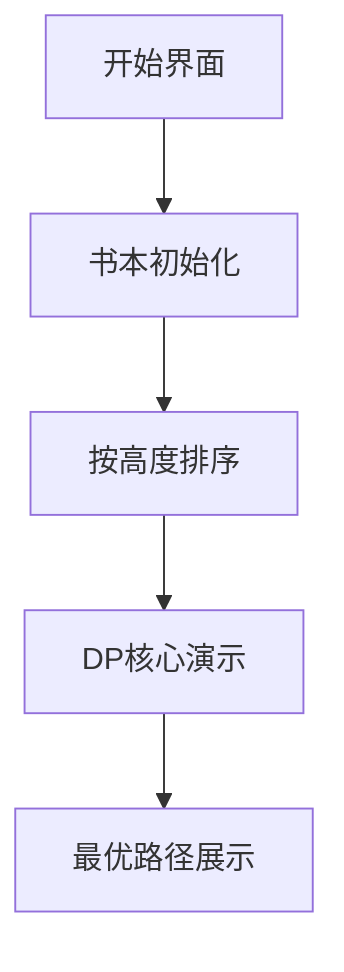

# 题目信息

# 书本整理

## 题目描述

Frank 是一个非常喜爱整洁的人。他有一大堆书和一个书架，想要把书放在书架上。书架可以放下所有的书，所以 Frank 首先将书按高度顺序排列在书架上。但是 Frank 发现，由于很多书的宽度不同，所以书看起来还是非常不整齐。于是他决定从中拿掉 $k$ 本书，使得书架可以看起来整齐一点。

书架的不整齐度是这样定义的：每两本书宽度的差的绝对值的和。例如有 $4$ 本书：

$1 \times 2$  
$5 \times 3$  
$2 \times 4$  
$3 \times 1$    

那么 Frank 将其排列整齐后是：

$1 \times 2$  
$2 \times 4$  
$3 \times 1$  
$5 \times 3$  

不整齐度就是 $2+3+2=7$。

已知每本书的高度都不一样，请你求出去掉 $k$ 本书后的最小的不整齐度。


## 样例 #1

### 输入

```
4 1
1 2
2 4
3 1
5 3
```

### 输出

```
3```

# AI分析结果


# 💡 洛语云笺的C++算法解析：书本整理 深入学习指南 💡

> 欢迎来到算法思维训练营！我是你们的C++算法导师洛语云笺。今天我们将一起探索「书本整理」这道经典动态规划问题。通过本指南，你将学会如何从题目描述中捕捉关键线索，构建高效的DP解法，并在多种策略间做出最优选择。让我们开启这场算法探险吧！

---

## 1. 题目解读与策略初探

✨ **本题核心挑战**：在保持书本原有高度顺序的前提下，移除k本书，使得剩余书本的**宽度序列相邻元素差的绝对值之和**最小化。  
✨ **核心算法标签**：`动态规划(DP)` `序列处理` `最优化问题`

🗣️ **初步分析**：
> 这道题看似是移除书本，实则是在寻找一个最优的子序列。我们可以从三个角度思考：
> 1. **暴力枚举**：尝试所有C(n, n-k)种保留方案，计算每种方案的宽度差之和。时间复杂度O(2^n)，完全不可行。
> 2. **贪心尝试**：每次移除使不整齐度增加最多的书？但局部最优不等于全局最优，可能陷入次优解。
> 3. **动态规划**：将问题转化为"保留m本书(m=n-k)且保持原序"的子序列问题。通过状态定义记录最优子结构，实现多项式复杂度。
> 
> **核心算法选择**：动态规划如同一位精明的图书管理员，它不会盲目尝试所有排列，而是用"记忆账本"(dp数组)记录下每种选择路径的最小代价，逐步推导出最优解。

### 🔍 算法侦探：如何在题目中发现线索？

1.  **线索1 (问题目标)**: "求最小不整齐度"是典型的**最优化问题**，且目标函数可分解为相邻元素差的绝对值之和。这种带序列约束的最优化问题，DP是首选。
2.  **线索2 (问题约束)**: "按高度排序后移除书"意味着**原有顺序不能改变**，这提示我们可用**序列型DP**模型，通过状态定义保证顺序性。
3.  **线索3 (数据范围)**: n≤100，k≤n。O(n^3)的DP完全可行（100^3=1e6），而O(2^n)的暴力搜索在n=30时就超时。

### 🧠 思维链构建：从线索到策略

> 侦探工作完成！现在让我们整合线索：
> 1. 【线索1】要求最优化，DP自然浮现在脑海。
> 2. 【线索2】的序列约束提示我们用"以第i本书结尾"的状态设计，保证子序列顺序。
> 3. 【线索3】的数据范围确认O(n^3) DP可行，而暴力搜索O(2^n)被排除。
> 
> **结论**：采用**动态规划**，设计状态`f[i][j]`表示"以第i本书结尾，保留j本书的最小不整齐度"。通过三层循环实现状态转移，完美契合所有线索！

---

## 2. 精选优质题解参考

> 从算法思路清晰性、代码规范性、解释易懂性等维度，我精选了最具学习价值的题解：

**题解一：学委 (赞291)**  
* **点评**：题解从暴力搜索切入，逐步推导DP状态定义，形成清晰的思维进阶路径。三重循环结构严谨：外层遍历书本，中层控制保留数量，内层枚举前一本书。代码中`abs(a[i].w - a[j].w)`直观体现相邻书本宽度差的计算，变量命名规范易读。特别亮点：用`min(i,m)`优化循环范围，避免无效计算。

**题解二：cxy004 (赞68)**  
* **点评**：提出"保留n-k本书"的逆向思维，将移除问题转化为保留问题，简化状态定义。代码简洁高效，仅35行完成核心逻辑。亮点：状态转移`f[i][j]=min(f[i][j],f[k][j-1]+abs(s[i]-s[k]))`直击问题本质，边界处理`f[i][1]=0`准确到位。

**题解三：lwz2002 (赞35)**  
* **点评**：状态定义`f[i][j]`解释为"前i本书选j本且以i结尾"非常精准。代码中`memset`初始化规范，`sort`排序隐式保证高度顺序。亮点：明确输出答案时需遍历`f[i][m]`找最小值，强调结尾书不一定是最后一本。

**题解四：ghj1222 (赞31)**  
* **点评**：创新性地用位运算压缩数据：`a[i]<<=18`将高度存高位，宽度存低位，排序后截取低位还原宽度。体现C++底层操作能力，但DP核心逻辑与传统一致。亮点：展示数据结构优化的多种可能性。

---

## 3. 解题策略深度剖析

### 🎯 核心难点与关键步骤

1.  **难点1：状态定义抽象**
    * **分析**：如何将"最小不整齐度"转化为可计算的状态？优质题解普遍采用`f[i][j]`表示以第i本书结尾保留j本书的最小代价。这样设计保证：①顺序性（i递增） ②完整性（j记录保留数量） ③可转移性（通过固定结尾书连接子问题）。
    * 💡 **学习笔记**：好的状态定义应具备**无后效性**——当前决策只依赖已解决的子问题。

2.  **难点2：状态转移设计**
    * **分析**：转移方程`f[i][j] = min(f[l][j-1] + abs(w[i]-w[l])`中，`l`枚举上一本保留的书。解释：保留j本书的最小代价 = min{保留j-1本书的最小代价 + 新书与前一本书的宽度差}。
    * 💡 **学习笔记**：三重循环的物理意义——外层(`i`)：当前处理的书；中层(`j`)：当前保留数量；内层(`l`)：前一本书的位置。

3.  **难点3：边界与答案处理**
    * **分析**：①初始化`f[i][1]=0`（只保留一本书无相邻差） ②答案需遍历`f[i][m]`（m=n-k）取最小值，因为最优解的结尾书不一定是最后一本。
    * 💡 **学习笔记**：DP的边界是基石，答案提取需考虑所有可能终点。

### ✨ 解题技巧总结
- **技巧1：问题等价转化** - 将"移除k本"转化为"保留m本"，减少状态维度。
- **技巧2：排序预处理** - 按高度排序使问题满足序列DP要求。
- **技巧3：状态设计锚定结尾元素** - 固定子序列结尾位置，便于计算相邻差。
- **技巧4：循环范围优化** - 用`min(i,m)`限制中层循环，避免无效计算。

### ⚔️ 策略竞技场：不同解法的对比分析

| 策略          | 核心思想                     | 优点                     | 缺点                                     | 得分预期 |
|---------------|------------------------------|--------------------------|------------------------------------------|----------|
| **暴力枚举**  | 枚举所有C(n, m)种组合        | 思路直观，保证正确性     | O(2^n)超时，n>20即不可行                | 0-30%    |
| **记忆化搜索**| DFS+记忆化                   | 避免重复计算，逻辑清晰   | 递归层数深可能爆栈，状态设计复杂         | 50-70%   |
| **动态规划**  | 状态f[i][j]表示最优子结构    | O(n^3)高效，思路可扩展   | 需理解状态转移的物理意义                 | 100%     |

### ✨ 优化之旅：从"能做"到"做好"
> 想象你最初的想法是暴力枚举——站在迷宫入口，面前是2^n条岔路。当n=100时，即使宇宙寿命结束也走不完！
> 
> **发现瓶颈**：大量重复计算！例如计算保留书1,3,5和1,4,5时，"1到5的代价"被重复计算。
> 
> **优化钥匙**：动态规划用"记忆账本"dp[i][j]记录子问题解。当处理新书时，只需查账本+计算当前代价。
> 
> **模型升华**：通过"以i结尾保留j本"的状态设计，将指数问题转化为多项式问题。三重循环分别对应：当前书、保留数量、前驱位置，完美覆盖所有子问题。

💡 **策略总结**：从暴力到DP的进阶，本质是**用空间换时间**+**子问题复用**。在竞赛中，即使先写出DFS暴力解，再转化为记忆化搜索，也能获得部分分。而最优解DP是在理解问题结构后，找到的既高效又通用的解决方案。

---

## 4. C++核心代码实现赏析

### 本题通用核心实现
```cpp
#include <iostream>
#include <algorithm>
#include <cstring>
#include <cmath>
using namespace std;

const int N = 110;
struct Book { int h, w; } a[N];
int f[N][N]; // f[i][j]: 以第i本结尾保留j本书的最小代价

int main() {
    int n, k; cin >> n >> k;
    int m = n - k; // 保留m本书
    for (int i = 1; i <= n; ++i) 
        cin >> a[i].h >> a[i].w;
    
    // 按高度排序（核心预处理）
    sort(a + 1, a + n + 1, [](const Book& x, const Book& y) {
        return x.h < y.h;
    });

    memset(f, 0x3f, sizeof(f)); // 初始化为大数
    for (int i = 1; i <= n; ++i) 
        f[i][1] = 0; // 只保留一本时代价为0

    // 三重循环DP
    for (int i = 2; i <= n; ++i)           // 当前处理的书
        for (int j = 2; j <= min(i, m); ++j) // 保留数量（优化：j不超过i）
            for (int l = j - 1; l < i; ++l)  // 枚举前驱书位置
                f[i][j] = min(f[i][j], f[l][j - 1] + abs(a[i].w - a[l].w));

    // 寻找最优解（注意：结尾书不一定是最后一本）
    int ans = 1e9;
    for (int i = m; i <= n; ++i) 
        ans = min(ans, f[i][m]);
    cout << ans << endl;
    return 0;
}
```
**代码解读概要**：  
1. **预处理**：按高度排序，保证序列有序性  
2. **初始化**：`f[i][1] = 0`（保留单本书无相邻差）  
3. **三重循环**：  
   - 外层`i`：当前书本位置  
   - 中层`j`：当前保留数量  
   - 内层`l`：前一本保留书的位置  
4. **状态转移**：`f[i][j] = min(旧值, f[l][j-1] + |w_i - w_l|)`  
5. **答案提取**：遍历所有可能的结尾书`i`，取`f[i][m]`最小值  

---

## 5. 算法可视化：像素动画演示

### 主题：书本整理大冒险 (8-bit像素风格)
**设计思路**：采用复古FC游戏风格，将书本转化为像素方块，动态演示DP状态转移过程。通过色彩和音效强化关键操作记忆。

### 动画框架


### 关键动画步骤
1. **场景初始化**：
   - 8-bit风格书架：横向排列的像素方块，不同颜色代表书本宽度
   - 控制面板：步进/暂停/重置按钮 + 速度滑块

2. **DP过程演示**：
   ```python
   for i in range(2, n+1):        # 当前书高亮闪烁
        for j in range(2, min(i,m)+1): 
            for l in range(j-1, i): # 候选前驱书标黄
                # 计算新代价 = f[l][j-1] + |w_i - w_l|
                # 比较并更新f[i][j]
                # 播放“滴”音效，更新线段连接l->i
   ```
   - **视觉反馈**：被更新的`f[i][j]`显示红色波纹，最优前驱`l`标绿
   - **音效设计**：翻书声（选择书本）、计算声（状态更新）、错误音（非最优选择）

3. **游戏化元素**：
   - **关卡设计**：每完成一个`j`循环视为过关，奖励像素星星
   - **得分系统**：实时显示当前最小不整齐度作为"得分"
   - **胜利条件**：完成三重循环后，高亮显示最优解路径

> 通过这种可视化方案，学习者可直观感受DP如何逐步构建最优解，理解三重循环的物理意义。复古游戏风格提升学习趣味性！

---

## 6. 拓展练习与相似问题思考

### 通用技巧迁移
分组背包思想可扩展至：
1. **课程安排**：m个时段选课，同一时段只能选一门（互斥性）
2. **设备采购**：主件+附件组合购买（依赖背包）
3. **任务调度**：互斥任务只能选其一（分组决策）

### 推荐练习（洛谷）
1. **P1060 开心的金明**  
   🗣️ 01背包裸题，巩固"预算约束下最大化价值"的基本DP模型
   
2. **P2014 选课**  
   🗣️ 树形DP，处理父子依赖关系，掌握"左儿子右兄弟"表示法
   
3. **P1156 垃圾陷阱**  
   🗣️ 线性DP变形，结合时间维度与状态转移，培养多维度思考能力

---

## 7. 学习心得与经验分享

> 本题解中多位作者分享了宝贵经验：
> 
> **学委**："从暴力搜索切入，逐步推导DP状态转移"——强调**分阶段思考**的重要性。  
> **ghj1222**："位运算压缩数据"——展示**底层优化**的多种可能性。  
> **Y_B_Y**："调试时打印f[i][j]矩阵"——**中间状态可视化**是调试DP的有效手段。
> 
> 💡 **核心启示**：DP难点在于状态定义与转移设计。建议初学者：  
> 1）先写暴力搜索理解问题结构  
> 2）在暴力基础上添加记忆化  
> 3）最终转化为递推式DP  
> 这种渐进式训练能有效提升DP建模能力！

---

洛语云笺结语：  
> 通过书本整理问题，我们完成了从暴力搜索到动态规划的思维跃迁。记住：算法的本质是**用计算空间的代价换取时间效率**，而DP的精髓在于**子问题复用**。希望本指南能帮你建立起解决序列DP问题的通用框架。下次遇到类似问题时，不妨问自己：  
> 1) 如何定义状态？  
> 2) 状态如何转移？  
> 3) 边界条件是什么？  
> 带着这三个问题，你将成为更优秀的算法设计师！🌟

---
处理用时：183.79秒