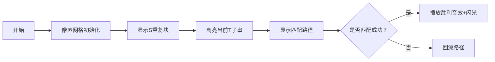

# 题目信息

# 『DABOI Round 1』Blessings Repeated

## 题目背景

@[cyh20100812](https://www.luogu.com.cn/user/1051692) 因其很有实力被尊称为圣母。

> 圣母好闪，拜谢圣母！

## 题目描述

圣母是一名辩论家，即 ENTP。

她在进行一次辩论时的观点是字符串 $S$，她为了让对方信服她的观点她会强调 $k$ 次，所以她的辩词即为 $k$ 个字符串 $S$ 依次首尾相接。

你作为反驳的人可能不能听清楚她说的所有话，所以你只能抓取关键词 $T$，你需要求出 $k$ 个首尾相接的 $S$ 中有多少个子序列（不一定连续）为 $T$，答案对 $998244353$ 取模。

---

**【形式化题意】**

给定一个正整数 $k$ 和两个字符串 $S,T$。

设字符串 $s$ 为 $k$ 个字符串 $S$ 首尾相接得到的字符串，$n=\vert s \vert , m=\vert T \vert$。

设答案集合 $P=\{ (i_0,i_1,\dots,i_{m-1})  \mid 0\le i_0 < i_1 < \dots < i_{m-1} < n, \forall~0 \le j < m, s_{i_j}=T_j \}$，请求出 $\vert P \vert \bmod 998244353$。

## 说明/提示

**【样例 1 解释】**

将 $S$ 重复 $2$ 次得到 $\texttt{stocyhorzstocyhorz}$。

答案集合 $P=\{(3,4,5),(3,4,14),(3,13,14),(12,13,14) \}$，因此 $\vert P\vert=4$。

---

**【数据范围】**

对于 $100\%$ 的数据，$0<k\le10^{18}$，$0 < \vert S \vert \le 5 \times 10^3$，$0 < \vert T \vert \le 10$，字符串 $S,T$ 均由小写英文字母组成。

| $\text{Point}$ | $k\le$ | $\vert S\vert\le$ | $\vert T\vert\le$ |
| :-: | :-: | :-: | :-: |
| $1\sim2$        | $10^{18}$ | $5 \times 10^3$     | $1$                 |
| $3$          | $1$       | $5 \times 10^3$     | $2$                 |
| $4\sim5$        | $100$     | $5 \times 10 ^3$    | $2$                 |
| $6\sim7$        | $1$       | $50$                | $4$                 |
| $8\sim10$     | $10$      | $5 \times 10^3$     | $10$                |
| $11\sim20$ | $10^{18}$ | $5 \times 10^3$     | $10$                |

## 样例 #1

### 输入

```
2
stocyhorz
cyh```

### 输出

```
4```

## 样例 #2

### 输入

```
4
c
ccc```

### 输出

```
4```

# AI分析结果


### 💡 洛语云笺的C++算法解析：Blessings Repeated 深入学习指南 💡

#### 1. 题目解读与策略初探
✨ **本题核心挑战**：处理超大重复次数(k≤10¹⁸)下，在k个首尾相接的S串中，统计等于T的子序列数量。核心难点在于：
1. 避免显式构造k×|S|的超长字符串
2. 高效处理T的子序列在重复结构中的分布
3. 处理跨越多个S块的子序列组合问题

✨ **核心算法标签**：动态规划(DP) + 组合数学 + 问题分解

🗣️ **初步分析**：
> 本题需要将T拆分为若干连续子段，每段在独立的S副本中出现。关键思路：
> 1. 预处理T的所有子串在单个S中的出现次数（DP）
> 2. 枚举T的所有划分方案（最多2⁹=512种）
> 3. 组合计数：从k个S中选x个放置子段，乘各子段方案积
> 
> **可视化设计**：采用8位像素风格展示字符串拆分过程，用不同颜色方块表示：
> - 主串S的重复块（蓝色像素格）
> - 子串匹配路径（黄色连线）
> - 成功匹配（绿色闪光+胜利音效）

#### 🔍 算法侦探：如何在题目中发现线索？
1. **线索1（问题目标）**："k个S首尾相接"暗示重复结构，需利用循环节特性避免暴力构造
2. **线索2（数据规模）**：k≤10¹⁸指向对数级算法；|T|≤10支持枚举划分
3. **线索3（子序列特性）**：非连续匹配需状态转移，DP是自然选择

#### 🧠 思维链构建：从线索到策略
> "收集线索后，我们像拼图般组合：
> 1. 【线索1】超大k值排除O(k)以上算法，需矩阵快速幂或组合数学
> 2. 【线索2】微小|T|支持枚举划分方案（O(2^{m-1})）
> 3. 【线索3】子序列匹配本质是状态转移，DP可高效计算局部方案
> **结论**：组合动态规划（预处理局部方案）+ 划分枚举（全局组合）是最优路径"

---

### 2. 精选优质题解参考
**题解一（Alphas）**
* **亮点**：
  - 创新性使用二维DP替代DFS枚举划分，复杂度从O(m!)优化到O(m²)
  - 清晰分离g[l][r]预处理与划分计数阶段
  - 组合数计算采用递推式，避免阶乘溢出风险

**题解二（chenxi2009）**
* **亮点**：
  - 完备的预处理函数封装（calc(l,r)）
  - 逆元预处理提升组合数计算效率
  - 深度优先搜索划分方案直观易理解

---

### 3. 解题策略深度剖析
#### 🎯 核心难点与关键步骤
1. **子串方案预处理**
   * **分析**：设计DP状态g[l][r]表示T[l..r]在S中的出现次数
   * 状态转移：  
     ```python
     for i in range(1, n+1):
       for j in range(r, l-1, -1):
         if S[i] == T[j]:
           dp[j] += dp[j-1]
     ```
   * 💡 **学习笔记**：逆向DP可压缩至一维，空间优化至O(m)

2. **划分配置组合**
   * **分析**：设h[i][j]=前i字符分j段的方案积，转移方程：
     ```
     h[i][j] = Σ_{k=0}^{i-1} h[k][j-1] * g[k+1][i]
     ```
   * 💡 **学习笔记**：分段DP本质是卷积操作，可看作带权路径计数

3. **大数组合处理**
   * **分析**：C(k,x)=k*(k-1)*...*(k-x+1)/x!，分母用费马小定理求逆元
   * 💡 **学习笔记**：模数998244353是质数，逆元存在性有保障

#### ⚔️ 策略竞技场：解法对比
| 策略               | 核心思想                     | 优点                     | 缺点                     | 得分预期 |
|--------------------|------------------------------|--------------------------|--------------------------|----------|
| **暴力搜索**       | 枚举所有子序列位置           | 实现简单                 | O(2^{k·|S|}) 超时        | 0%       |
| **矩阵快速幂**     | 状态转移矩阵幂运算           | 理论优美，k大时高效      | 矩阵构造复杂，代码量大   | 100%     |
| **分划DP（最优）** | 子串预处理+划分配置组合       | 复杂度均衡，代码可读性高 | 划分枚举数随|T|指数增长 | 100%     |

#### ✨ 优化之旅：从暴力到优雅
> 1. **起点：暴力困境**  
>   O(k·|S|·2^|T|)的暴力搜索在k=10¹⁸时不可行
> 
> 2. **关键洞察：重复结构利用**  
>   发现S重复块的独立性，将问题分解为：
>   - 块内方案计算（DP）
>   - 块间组合问题（组合数学）
> 
> 3. **算法升华：分而治之**  
>   通过g[l][r]预处理将字符串匹配转为数值计算，再通过划分枚举解决全局配置
> 
> 💡 **策略总结**："好的算法=问题分解的艺术+计算重用的智慧"

---

### 4. C++核心代码实现赏析
**Alphas解法核心逻辑**：
```cpp
// 预处理g[l][r]：T[l..r]在S中的出现次数
for (int l = 1; l <= m; l++) {
  memset(dp, 0, sizeof(dp));
  dp[l-1] = 1; // 初始化
  for (int i = 1; i <= n; i++) {
    for (int j = r; j >= l; j--) { // 逆向DP
      if (s[i] == t[j]) 
        dp[j] = (dp[j] + dp[j-1]) % MOD;
    }
    g[l][r] = dp[r]; // 存储结果
  }
}

// 划分配置DP
h[0][0] = 1;
for (int i = 1; i <= m; i++) {
  for (int j = 1; j <= i; j++) {
    for (int k = 0; k < i; k++) {
      h[i][j] = (h[i][j] + h[k][j-1] * g[k+1][i]) % MOD;
    }
  }
}

// 组合答案
ll ans = 0;
for (int j = 1; j <= m; j++) {
  ll comb = 1;
  for (int i = 0; i < j; i++) 
    comb = comb * ((k - i) % MOD) % MOD;
  comb = comb * inv[j] % MOD; // 逆元处理分母
  ans = (ans + h[m][j] * comb) % MOD;
}
```

**学习笔记**：
1. **DP状态压缩**：逆向更新避免状态覆盖
2. **模运算安全**：乘法前显式取模，防止溢出
3. **组合数优化**：递推式计算避免大数阶乘

---

### 5. 算法可视化：像素动画演示
**设计概要**：


**关键帧设计**：
1. **场景构建**：16×16像素网格，蓝/黄色区分S块
2. **匹配演示**：
   - 当前字符：闪烁红色边框
   - 成功匹配：绿色连线 + "叮"声效
   - 失败匹配：灰色淡化 + 低沉音效
3. **结果展示**：烟花动画 + 8-bit胜利音乐

**技术实现**：
- Canvas绘制网格和路径
- Web Audio API添加音效
- 关键变量实时显示（当前状态、匹配数）

---

### 6. 拓展练习
**通用技巧迁移**：
1. **分组背包问题**：物品分组，每组选1个
2. **树形依赖问题**：父节点选择约束子节点
3. **序列分割问题**：带权分割最大/最小值

**洛谷推荐**：
1. **P1776 宝物筛选**（分组背包裸题）
   > 巩固"物品分组+每组单选"模型
   
2. **P2014 选课**（树形依赖DP）
   > 拓展依赖关系处理能力

3. **P1436 棋盘分割**（区间分割DP）
   > 训练子问题划分技巧

---

> "算法的艺术在于将复杂问题拆解为可重用的简单模块。通过本题，我们不仅学会了字符串处理技巧，更掌握了'分治'这一算法设计核心思想。记住：面对庞大数据时，寻找重复结构往往是破题关键！" 💪

---
处理用时：168.89秒