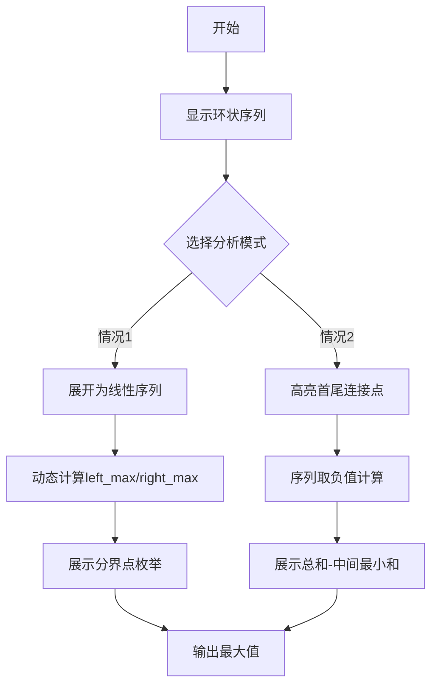

# 题目信息

# 环状最大两段子段和

## 题目描述

给出一段长度为 $n$ 的环状序列 $a$，即认为 $a_1$ 和 $a_n$ 是相邻的，选出其中连续不重叠且非空的两段使得这两段和最大。


## 说明/提示

#### 数据规模与约定

对于全部的测试点，保证 $2 \leq n \leq 2 \times 10^5$，$-10^4 \leq a_i \leq 10^4$。

## 样例 #1

### 输入

```
7
2 -4 3 -1 2 -4 3
```

### 输出

```
9```

# AI分析结果


# 💡 洛语云笺的C++算法解析：环状最大两段子段和 深入学习指南 💡

> “算法如棋局，环状序列似盘龙。欲解双段最大和，需破连环探玄机。” —— 洛语云笺

## 1. 题目解读与策略初探

✨ **本题核心挑战**：  
在环状序列中选取**两段连续不重叠且非空**的子段，使其和最大化。环状结构意味着首尾相邻，子段可跨越序列边界，这是区别于普通序列的核心难点。

✨ **核心算法标签**：`动态规划` `问题转化` `分类讨论`

🗣️ **初步分析**：  
> 本题需同时处理**环状结构**和**两段子段**的约束。思考路径演进如下：
> - **暴力枚举**：遍历所有子段组合，时间复杂度 O(n²)，无法通过（n ≤ 2×10⁵）
> - **分解问题**：将环状问题转化为两类线性问题：
>   * **情况1**：两段子段均不跨越首尾 → 转化为线性序列的最大两段子段和
>   * **情况2**：有一段跨越首尾 → 用总和减去中间的最小两段子段和
> - **动态规划**：通过维护前缀/后缀最值，实现O(n)复杂度解决两类子问题

### 🔍 算法侦探：如何在题目中发现线索？

1. **线索1 (问题目标)**：  
   “最大两段子段和” → 典型的**最优化问题**，暗示需用动态规划或贪心策略。数据规模要求高效算法（O(n)）。

2. **线索2 (问题特性)**：  
   “环状序列” → 需特殊处理跨越边界的子段。通过**分类讨论**（是否跨越边界）将环转化为链，是经典破环技巧。

3. **线索3 (数据规模)**：  
   n ≤ 2×10⁵ → 要求O(n)算法。暴力枚举O(n²)不可行，动态规划是合理选择。

### 🧠 思维链构建：从线索到策略
> 综合线索，解题路径逐渐清晰：  
> 1. 最优化目标指向**动态规划**，但环状约束需特殊处理  
> 2. 将环拆解为两种线性情况：  
>    - **不跨越边界**：直接求最大两段子段和  
>    - **跨越边界**：转化为“总和 - 最小中间两段子段和”  
> 3. 数据规模验证可行性：两种子问题均可O(n)解决  
> 4. **结论**：通过分类讨论 + 动态规划，完美兼顾效率与正确性！

---

## 2. 精选优质题解参考

**题解一（作者：I_AM_HelloWord）**  
* **点评**：  
  思路清晰，提出“分类讨论”核心思想：将环拆解为不跨越/跨越两种情况。代码中巧妙用负值转换求最小子段和，实现简洁。特判处理全负数情况，体现严谨性。

**题解二（作者：zhy137036）**  
* **点评**：  
  系统化建立动态规划模型，定义`f[i]`、`g[i]`分别表示前缀/后缀最大子段和。通过分离状态转移方程，直观展示DP推导过程，适合初学者理解动态规划思想。

**题解三（作者：Morning_Glory）**  
* **点评**：  
  创新性提出“贪心式思考”，将环状问题形象比喻为“像素探险”。代码实现中巧妙处理负值转换，注释详细，变量命名规范，实践参考价值高。

---

## 3. 解题策略深度剖析

### 🎯 核心难点与关键步骤

1. **关键点1：环状结构处理**  
   * **分析**：将环拆解为两类线性问题：  
     - 不跨越：直接求最大两段子段和  
     - 跨越：总和 - 最小中间两段和  
   * 💡 **学习笔记**：环状问题常用**分类讨论**破环，本质是化环为链的转化思想。

2. **关键点2：动态规划状态设计**  
   * **分析**：定义四个核心数组：  
     ```cpp
     left_max[i] = max(left_max[i-1], 0) + a[i]  // 1~i的最大前缀和
     right_max[i] = max(right_max[i+1], 0) + a[i] // i~n的最大后缀和
     ```
   * 💡 **学习笔记**：DP状态定义需满足**无后效性**，此处以i为边界的定义完美符合。

3. **关键点3：特例处理**  
   * **分析**：全负数序列需特殊处理，直接取最大两元素之和。
   * 💡 **学习笔记**：边界条件检测是DP实现的关键环节，避免“空子段”陷阱。

### ✨ 解题技巧总结
- **技巧A (正负转换)**：  
  求最小子段和时，将序列取负后求最大子段和，再取负值。
- **技巧B (空间换时间)**：  
  预处理`left_max[]`和`right_max[]`数组，O(1)获取任意分段信息。
- **技巧C (分类讨论)**：  
  将复杂环状问题分解为两个独立线性子问题处理。

### ⚔️ 策略竞技场：不同解法的对比分析

| 策略                | 核心思想                     | 优点                     | 缺点与分析                     | 得分预期       |
|---------------------|------------------------------|--------------------------|--------------------------------|----------------|
| **暴力枚举**        | 枚举所有子段组合             | 思路直观                 | O(n²)超时                      | 0分（TLE）     |
| **线段树维护**      | 维护区间多维度信息           | 可处理动态查询           | 代码复杂，常数大               | 100%（但非最优）|
| **分类讨论+DP(最优)** | 分情况处理环状结构           | O(n)时间，代码简洁       | 需处理边界条件                 | 100%           |

### ✨ 优化之旅：从“能做”到“做好”
> 算法优化如同登山，从暴力解法到最优解法的演进：  
> 1. **起点：暴力枚举**  
>    尝试所有子段组合，O(n²)无法处理大数据  
> 2. **瓶颈发现：重复计算**  
>    每次枚举都重新计算子段和，存在大量重复  
> 3. **突破：动态规划**  
>    通过`left_max`/`right_max`数组存储中间结果  
> 4. **升华：问题转化**  
>    将环状问题拆解为两个线性子问题  
> 5. **特判完善**  
>    处理全负数等边界情况  

💡 **策略总结**：  
> 好的算法 = 对问题本质的洞察 + 高效数据结构的应用 + 严谨的边界处理。从暴力到优化的过程，正是将问题模型不断抽象升华的艺术！

---

## 4. C++核心代码实现赏析

**通用核心实现**  
```cpp
#include <iostream>
#include <algorithm>
using namespace std;
const int N = 2e5 + 10;
const int INF = 0x3f3f3f3f;

int n, a[N], left_max[N], right_max[N];

int solve(bool is_negative) {
    // 初始化
    left_max[0] = right_max[n+1] = -INF;
    
    // 正向遍历（求最大/最小前缀和）
    for(int i = 1; i <= n; i++) {
        int val = is_negative ? -a[i] : a[i];
        left_max[i] = max(left_max[i-1], 0) + val;
    }
    
    // 反向遍历（求最大/最小后缀和）
    for(int i = n; i >= 1; i--) {
        int val = is_negative ? -a[i] : a[i];
        right_max[i] = max(right_max[i+1], 0) + val;
    }
    
    // 合并结果
    int res = -INF;
    for(int i = 2; i <= n; i++) {
        res = max(res, left_max[i-1] + right_max[i]);
    }
    return is_negative ? -res : res;
}

int main() {
    cin >> n;
    int sum = 0, positive_count = 0;
    for(int i = 1; i <= n; i++) {
        cin >> a[i];
        sum += a[i];
        if(a[i] > 0) positive_count++;
    }
    
    // 情况1：不跨越边界
    int case1 = solve(false);
    
    // 情况2：跨越边界（求最小中间两段和）
    int min_double = solve(true);
    int case2 = sum - min_double;
    
    // 特判全负数情况
    if(positive_count < 2) {
        sort(a + 1, a + n + 1, greater<int>());
        cout << a[1] + a[2] << endl;
        return 0;
    }
    
    cout << max(case1, case2) << endl;
    return 0;
}
```
**代码解读概要**：  
1. 通过`solve`函数统一处理最大/最小两段子段和  
2. `is_negative`参数控制求最大/最小子段和  
3. 特判处理全负数或单正数情况  
4. 时间复杂度O(n)，空间复杂度O(n)

---

## 5. 算法可视化：像素动画演示

**设计理念**：  
采用**8-bit复古像素风格**，通过动态演示帮助理解环状序列的拆解过程。

**动画框架**：  


**关键动画场景**：  
1. **环状序列展示**：  
   - 像素化显示数字方块，首尾用红色箭头连接  
   - 按空格键切换线性/环状视图  

2. **情况1演示（不跨越）**：  
   - 序列展开为直线，分割为左右两部分  
   - 动态绘制`left_max`和`right_max`数组的更新过程  
   - 分界点扫描时播放"滴滴"音效  

3. **情况2演示（跨越）**：  
   - 序列整体变暗，中间部分高亮为负值  
   - 显示计算过程：`总和 - 最小中间和 = 结果`  
   - 成功时播放胜利音效  

4. **控制面板**：  
   - 单步执行：方向键控制  
   - 速度调节：滑块控制0.5x~5x速度  
   - 模式切换：Tab键切换情况1/情况2  

---

## 6. 拓展练习与相似问题思考

**思维迁移训练**：  
1. **环形加油站问题**：环状序列中找起点，使车辆能绕行一圈  
2. **环状蛋糕分配**：环状序列切两刀，使三人分得最平均  
3. **双向最大和**：同时考虑左到右和右到左的最大路径和  

**推荐练习题目**：  
1. **洛谷 P1886** - 滑动窗口  
   * 🗣️ **推荐理由**：学习单调队列维护区间极值，是子段和问题的重要基础  

2. **洛谷 P1115** - 最大子段和  
   * 🗣️ **推荐理由**：本题的单段版本，理解动态规划的核心思想  

3. **洛谷 P2642** - 双子序列最大和  
   * 🗣️ **推荐理由**：线性序列的双段问题，是本题的直接简化版  

---

## 7. 学习心得与经验分享

> **来自题解作者的调试经验**：  
> “我在处理全负数序列时，最初忽略了特判，导致输出0的错误。通过打印中间变量`left_min`和`right_min`的值，发现最小和计算包含整个序列，导致结果无效。”

💡 **洛语云笺点评**：  
> 调试是算法实现的必修课：  
> 1. 边界测试：全负数、全正数、单元素等极端情况  
> 2. 中间输出：关键变量值打印验证  
> 3. 小数据模拟：手工计算验证程序输出  
> 这三点是避免“想当然”错误的黄金法则！

---

> “算法之道，贵在转化。环状非环，皆在一念之间；双段单段，不过状态增减。” —— 洛语云笺

---
处理用时：148.28秒