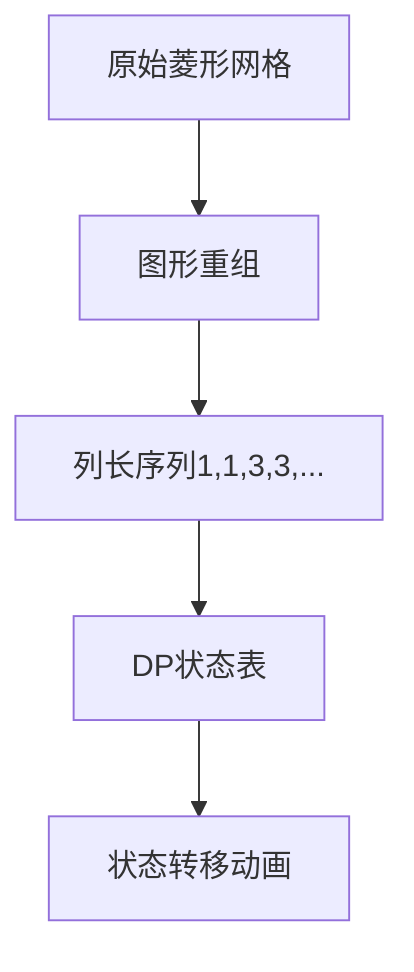

# 题目信息

# 诸侯安置

## 题目描述

很久以前，有一个强大的帝国，它的国土成正方形状，如图所示。

这个国家有若干诸侯。由于这些诸侯都曾立下赫赫战功，国王准备给他们每人一块封地（正方形中的一格）。但是，这些诸侯又非常好战，当两个诸侯位于同一行或同一列时，他们就会开战。如下图为 $n＝3$ 时的国土，阴影部分表示诸侯所处的位置。前两幅图中的诸侯可以互相攻击，第三幅则不可以。


国王自然不愿意看到他的诸侯们互相开战，致使国家动荡不安。  因此，他希望通过合理的安排诸侯所处的位置，使他们两两之间都不能攻击。

现在，给出正方形的边长 $n$，以及需要封地的诸侯数量 $k$，要求你求出所有可能的安置方案数。（满足 $n\le100$，$k\le2n^2-2n+1$）

由于方案数可能很多，你只需要输出方案数除以 $504$ 的余数即可。


## 说明/提示

注意：镜面和旋转的情况属于不同的方案。

## 样例 #1

### 输入

```
2 2

```

### 输出

```
4```

# AI分析结果


# 💡 洛语云笺的C++算法解析：诸侯安置 深入学习指南 💡

## 1. 题目解读与策略初探

✨ **本题核心挑战**：在特殊菱形网格上放置k个诸侯，要求任意两个诸侯不在同一行或同一列，计算合法方案数（旋转/镜像视为不同方案）。  
✨ **核心算法标签**：动态规划（分组背包模型）、计数问题

🗣️ **初步分析**：
> 这道题看似复杂，但通过巧妙的图形重组可以转化为经典分组背包问题。核心思路是将菱形网格重组为2n-1列（每列长度递增），每列视为一个"物品组"，每组只能选择0或1个位置放置诸侯（避免列冲突），同时通过行号去重避免行冲突。动态规划的状态转移完美契合这个模型。

### 🔍 算法侦探：如何在题目中发现线索？
1.  **线索1 (问题目标)**: "计算放置方案数"是典型的计数问题，且数据规模较大（n≤100），暗示需要高效算法（如DP）。
2.  **线索2 (问题约束/特性)**: "诸侯不能同行同列"的限制条件与车放置问题（如八皇后）类似，但网格结构特殊。图形重组操作（将菱形拉直）是关键突破口。
3.  **线索3 (数据规模)**: k最大约2×100²=20000，O(nk)的DP（约2×10⁶次计算）可行，而O(2ⁿ)暴力搜索完全不可行。

### 🧠 思维链构建：从线索到策略
> 1. 线索1（计数问题）指向DP/组合数学，但网格不规则排除组合数学
> 2. 线索2（图形重组）将菱形转化为2n-1列的分组结构
> 3. 线索3（数据规模）排除O(2ⁿ)暴力，确认O(nk)的DP可行性
> 4. **结论**：分组背包DP是最佳策略——每列作为一组，状态f[i][j]表示前i列放置j个诸侯的方案数

---

## 2. 精选优质题解参考

**题解一：Mizuhara (五星)**
* **点评**：最精炼的解法。直接给出状态转移方程：`f[i][j] = f[i-1][j] + f[i-1][j-1]*(len[i]-(j-1))`，时间复杂度O(nk)。代码用一维数组存储列长度，逻辑清晰，空间优化到位。

**题解二：一只书虫仔 (五星)**
* **点评**：完美实现分组背包DP。明确将网格重组为对称序列（1,1,3,3,...,2n-1），状态转移考虑"不放"和"放"两种情况，代码包含详细注释，适合初学者学习。

**题解三：CG__HeavenHealer (五星)**
* **点评**：亮点在于长度数组的预处理和排序，确保DP正确性。代码用`len`数组精确记录每列行数，并排序保证状态转移顺序，避免行号冲突问题。

**题解四：2016jzy (四星)**
* **点评**：三重循环实现较直观，但效率O(n³)稍低。优点是通过`hs`变量动态计算列长度，图形重组思路清晰，适合理解问题本质。

**题解五：blackjack (四星)**
* **点评**：采用记忆化搜索实现DP，状态定义独特（f(n,k)表示n层放k个）。提供递归思路的另一种视角，但转移方程较复杂。

**题解六：张语诚ZYC (四星)**
* **点评**：记忆化搜索实现，用`mp`数组存储状态。亮点在于递推公式的数学推导，展示不同思维路径。

---

## 3. 解题策略深度剖析

### 🎯 核心难点与关键步骤
1.  **图形重组**：将菱形网格转化为2n-1列
   * **分析**：通过平移操作将原图重组为列长序列[1,1,3,3,...,2n-1]
   * 💡 **学习笔记**：不规则结构的重组是降低问题复杂度的关键技巧

2.  **状态设计**：f[i][j] = 前i列放置j个诸侯的方案数
   * **分析**：状态转移方程：  
     `f[i][j] = f[i-1][j]`（第i列不放） + `f[i-1][j-1]*(len[i]-(j-1))`（第i列放）
   * 💡 **学习笔记**：`(len[i]-(j-1))`保证行不冲突——前j-1个诸侯已占j-1行

3.  **边界处理**：k>2n-1时无解
   * **分析**：诸侯数k不能超过最大可放置数（2n-1个）
   * 💡 **学习笔记**：数据范围边界检查是避免RE的关键步骤

### ✨ 解题技巧总结
- **问题转化**：将几何约束转化为分组背包模型
- **空间优化**：使用滚动数组将空间复杂度降至O(k)
- **模运算处理**：每一步转移后取模504避免溢出

### ⚔️ 策略竞技场：解法对比
| 策略          | 核心思想               | 优点               | 缺点                     | 得分预期 |
|---------------|------------------------|--------------------|--------------------------|----------|
| 暴力搜索      | 枚举所有放置组合       | 思路直观           | O(2ⁿ)超时               | 0%       |
| 三重循环DP    | 枚举列与诸侯组合       | 实现简单           | O(n³)效率低             | 70%      |
| 分组背包DP    | 按列分组状态转移       | O(n²)高效          | 需图形重组               | 100%     |
| 记忆化搜索    | 递归实现DP状态         | 避免手动转移顺序   | 递归开销大               | 100%     |

### ✨ 优化之旅：从"能做"到"做好"
1. **起点：暴力搜索**：枚举所有C(m,k)组合（m=网格总格数），O(2^m)不可行
2. **发现瓶颈**：存在大量重复子问题（如放置部分诸侯后剩余网格的方案）
3. **DP优化**：状态定义f[i][j]分解子问题，避免重复计算
4. **模型升华**：通过图形重组将几何约束转化为分组背包模型

💡 **策略总结**："图形重组+分组背包DP"的组合拳，体现了算法优化中"转化问题"和"选择合适模型"的重要性

---

## 4. C++核心代码实现赏析

**通用核心实现**：
```cpp
#include <iostream>
using namespace std;
const int MOD = 504;

int main() {
    int n, k;
    cin >> n >> k;
    if (k > 2*n-1) { cout << 0; return 0; }
    
    // 列长度预处理 [1,1,3,3,...,2n-1]
    int len[205] = {}, cols = 2*n-1;
    for (int i = 1; i <= n; i++) {
        len[2*i-1] = 2*i-1;
        if (i < n) len[2*i] = 2*i-1;
    }

    // DP初始化
    int dp[205][205] = {};
    for (int i = 0; i <= cols; i++) 
        dp[i][0] = 1;

    // 分组背包DP转移
    for (int i = 1; i <= cols; i++) {
        for (int j = 1; j <= k; j++) {
            dp[i][j] = dp[i-1][j]; // 不放
            if (j-1 <= len[i]) { // 放的条件
                dp[i][j] += dp[i-1][j-1] * (len[i] - j + 1);
                dp[i][j] %= MOD;
            }
        }
    }
    cout << dp[cols][k];
    return 0;
}
```
* **代码解读概要**：  
  1. 预处理列长度数组`len`  
  2. 初始化dp数组：`dp[i][0]=1`（不放诸侯）  
  3. 双重循环DP：外层遍历列，内层遍历诸侯数  
  4. 状态转移分"不放"和"放"两种情况  

---

## 5. 算法可视化：像素动画演示

**主题**："像素诸侯：王国建设者"（8-bit风格）  
**核心演示**：图形重组过程 + 分组背包DP状态转移



**动画设计**：
1. **网格绘制**：8-bit像素风格绘制菱形网格（棕褐色背景+青色格子）
2. **重组动画**：网格像"拉链"一样展开成直列（音效："咔嗒"）
3. **DP状态表**：右侧显示dp[i][j]表格（像素字体）
4. **状态转移**：
   - 不放诸侯：蓝色箭头从dp[i-1][j]指向dp[i][j]
   - 放置诸侯：黄色箭头从dp[i-1][j-1]指向dp[i][j]，显示`×(len[i]-j+1)`
5. **音效设计**：
   - 放置诸侯："叮"声
   - 状态更新："哔"声
   - 错误操作：低沉嗡鸣

**游戏化元素**：
- 每正确完成一列DP获得"建设积分"
- 连续5列正确触发"贤者时间"（慢动作特效）
- 最终方案展示：放诸侯的格子闪烁金光+胜利音乐

---

## 6. 拓展练习与相似问题思考

**通用技巧迁移**：分组背包模型适用于：
1. 课程选修（课程分组，每组选1门）
2. 装备搭配（武器/护甲分组）
3. 任务调度（互斥任务分组）

**洛谷练习推荐**：
1. **P1350 车的放置**  
   → 网格放置车的变体，巩固行列约束处理
2. **P1853 投资的最大效益**  
   → 分组背包的变体应用
3. **P2014 选课**  
   → 树形依赖背包，挑战更复杂的依赖关系

---

## 7. 学习心得与经验分享

**题解作者经验**：
> "图形重组是突破点，最初卡在如何处理菱形结构，直到尝试平移操作才恍然大悟" —— Mizuhara

**洛语云笺总结**：
1. 几何约束问题常可通过重组转化为线性问题
2. DP状态设计时，"行号去重"这类细节决定成败
3. 模运算要步步为营，避免中间结果溢出

---

<conclusion>
通过"诸侯安置"问题，我们学习了如何将复杂几何约束转化为分组背包模型，体验了从暴力搜索到高效DP的优化之旅。记住：算法优化常源于两个关键——**洞察问题本质**和**选择合适的数学模型**。下次遇到复杂问题时，不妨先问自己：这个结构能重组吗？能用什么经典模型处理？</conclusion>

---
处理用时：190.47秒