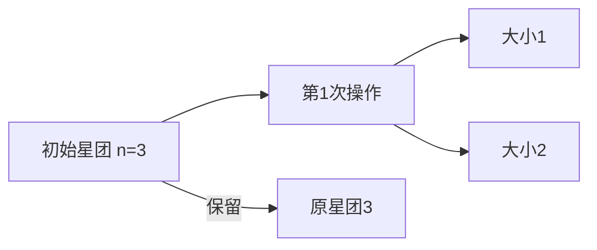

# 题目信息

# 「CZOI-R3」星光闪耀

## 题目背景

> 今夜星光闪闪 我爱你的心满满 ……

## 题目描述

天空中有一个包含 $n$ 颗星星的星团。

小 K 认为天空中只有一个星团不够浪漫，因此她准备施展魔法。若在她施展魔法前第 $i$ 个星团包含 $a_i$ 颗星星，且 $a_i\ge2$；则施展魔法后天空中**分别**增加包含 $1\sim a_i-1$ 颗星星的星团（注意原本的星团会被保留）。

小 K 定义一个包含 $v$ 颗星星的星团的**闪耀度**为 $k^v$。求她施展 $m$ 次魔法后，天空中所有星团的**闪耀度**之和，对 $998244353$ 取模。

------------
**【形式化题意】**

给定一个可重集 $S_0$，初始 $S_0$ 中只有一个数 $n$。

定义一次操作为：新建一个可重集 $S_1$，对于 $\forall1\le i\le|S_0|$，若 $S_{0,i}\ge 2$，则对于 $\forall1\le j\le S_{0,i}-1$，将 $j$ 加入 $S_1$。在这次操作的最后，将 $S_1$ 中所有元素加入 $S_0$。

求进行了 $m$ 次操作后的 $\sum_{i=1}^{|S_0|} k^{S_{0,i}}$，对 $998244353$ 取模。

## 说明/提示

**【样例解释】**

以下记 $L_i$ 表示包含 $i$ 颗星星的星团的个数，即 $S_{0,j}=i$ 的个数。

第 $1$ 组测试数据中：
- 第一次施展魔法（进行操作）后 $L_1=1,L_2=1,L_3=1$。
- 第二次施展魔法（进行操作）后 $L_1=3,L_2=2,L_3=1$。
- 第三次施展魔法（进行操作）后 $L_1=6,L_2=3,L_3=1$。
- 第四次施展魔法（进行操作）后 $L_1=10,L_2=4,L_3=1$。

因此答案为 $10\times6^1+4\times6^2+1\times6^3=420$。

第 $2$ 组测试数据中：
- 第一次施展魔法（进行操作）后 $\forall1\le i\le n,L_i=1$。
- 第二次施展魔法（进行操作）后 $\forall1\le i\le n,L_i=n-i+1$。

因此答案为 $\sum_{i=1}^n(n-i+1)5^i=610340$。

**【数据范围】**

**本题采用捆绑测试**。

记 $\sum n,\sum m$ 分别为单个测试点内 $n,m$ 的和。

- Subtask #1（$5\text{ pts}$）：$k=0$。
- Subtask #2（$10\text{ pts}$）：$n\le5$ 且 $m\le5$。
- Subtask #3（$10\text{ pts}$）：$m\le3$。
- Subtask #4（$10\text{ pts}$）：$k=1$。
- Subtask #5（$10\text{ pts}$）：$n\le2\times10^2$ 且 $m\le2\times10^2$ 且单个测试点内的 $k$ 相等。
- Subtask #6（$10\text{ pts}$）：$n\le2\times10^3$ 且 $m\le2\times10^3$ 且单个测试点内的 $k$ 相等。
- Subtask #7（$15\text{ pts}$）：$\sum n\le2\times10^7$。
- Subtask #8（$15\text{ pts}$）：$\sum m\le2\times10^6$。
- Subtask #9（$15\text{ pts}$）：无特殊限制。

对于 $100\%$ 的数据，$1\le T\le5\times10^5$，$1\le n\le2\times10^6$，$1\le m\le2\times10^6$，$\sum m\le2\times10^7$，$0\le k\le998244352$。

**本题 IO 量较大，请采用较快的 IO 方式。**

## 样例 #1

### 输入

```
5
3 4 6
8 2 5
501 501 6
11451 41919 313172124
824431 960532 10000007```

### 输出

```
420
610340
520860091
95420244
42443525```

# AI分析结果


# 💡 洛语云笺的C++算法解析：「CZOI-R3」星光闪耀 深入学习指南 💡

## 1. 题目解读与策略初探

✨ **本题核心挑战**：高效计算经过m次递归分裂操作后，所有星团闪耀度之和（即每个大小为v的星团贡献k^v），在极大数据范围（∑m≤2×10⁷）下的多项式时间求解。  
✨ **核心算法标签**：组合数学、生成函数、递推优化

🗣️ **初步分析**：  
> 这道题看似复杂，实则暗藏数学之美。最直观的暴力解法是模拟每次分裂过程，但指数级复杂度显然不可行。通过观察，我们发现星团分裂过程本质是多重求和问题，可用组合数学工具建模。最优解通过三个关键突破点：  
> 1. 将操作转化为生成函数递推关系  
> 2. 利用组合恒等式（插板法）化简多重求和  
> 3. 推导线性递推公式实现O(m)求解  
> 可视化设计将采用像素风格动态展示星团分裂过程，用颜色区分不同大小的星团，音效增强关键操作反馈，让抽象的数学推导变得直观可感。

### 🔍 算法侦探：如何在题目中发现线索？
1.  **线索1 (问题目标)**：题目要求计算m次操作后所有星团的k^v之和，这种"带操作迭代的幂次求和"问题，是生成函数和组合数学的典型标志。
2.  **线索2 (问题特性)**：星团分裂规则（大小v→生成1到v-1）形成树状依赖结构，暗示存在自相似性，可用递推关系描述。
3.  **线索3 (数据规模)**：∑m≤2×10⁷要求O(m)算法，而n≤2×10⁶则要求避免O(nm)解法，这指向了基于组合数预处理的递推优化。

### 🧠 思维链构建：从线索到策略
> "让我们串联线索：首先【线索1】要求我们处理迭代求和，我想到生成函数或DP；接着【线索2】的树状分裂提示可用组合数建模（如插板法）；最后【线索3】的数据规模否决了O(nm)以上算法。  
> 决定性启发来自多重求和式∑...∑k^{i_m}，它可转化为：  
> 1. 用等比数列求和展开最内层  
> 2. 用组合恒等式∑_{i=1}^n ∑_{j=1}^i ... 1 = binom(n+p-1,p) 化简外层  
> 3. 得到递推式ans_t = [k·ans_{t-1} - k·binom(n+t-2,t-1)]/(k-1)  
> 最终形成O(m)的递推方案，完美匹配数据约束！"

---

## 2. 精选优质题解参考

**题解一（作者：CaiZi）**  
* **点评**：此解法以多重求和切入，通过等比数列求和与组合恒等式（插板法）的巧妙结合，导出清晰递推关系。代码实现采用预处理阶乘逆元的经典组合数计算方式，变量命名规范（invk1, invk2），边界处理严谨。亮点在于将递归转化为递推时，用curK维护幂次避免重复计算，时间复杂度O(n+∑m)达到理论最优。

**题解二（作者：hyk2019）**  
* **点评**：从生成函数视角构建P_t(x)=∑C_t(v)x^v，推导出操作对应的生成函数变换关系P_{t+1}(x)=P_t(x)+ΣC_t(v)·(x+...+x^{v-1})。代码中通过组合数直接计算星团总数C_t=binom(n+t-1,t)，实现简洁。亮点在于分离k=1的特判处理，并通过代数变换将复杂生成函数转化为线性递推。

**题解三（作者：H3PO4）**  
* **点评**：采用二重生成函数B_j(z)=(1-z)^{-j}，通过z变换将问题转化为s_j(t)=∑binom(j+k)j)t^k的求解。虽然理论推导较深，但代码实现异常简洁，运用C++11的lambda表达式和标准算法库，体现现代C++特性。亮点在于反向使用二项式系数的生成函数表示，提供不同视角的解法。

---

## 3. 解题策略深度剖析

### 🎯 核心难点与关键步骤
1.  **关键点1：多重求和的组合解释**  
    * **分析**：发现∑_{i1=1}^n...∑_{im=1}^{im-1}1 等价于值域[1,n]长度m的单调不增序列计数，通过插板法转化为binom(n+m-1,m)
    * 💡 **学习笔记**：组合意义转化是化简复杂求值的利器

2.  **关键点2：递推关系建立**  
    * **分析**：利用等比数列求和拆解最内层求和，导出递推关系：
      ```math
      ans_t = \frac{k \cdot ans_{t-1} - k \cdot \binom{n+t-2}{t-1}}{k-1}
      ```
    * 💡 **学习笔记**：分治思想——将m次操作分解为m步线性递推

3.  **关键点3：组合数高效计算**  
    * **分析**：预处理阶乘逆元实现O(1)组合数查询，空间换时间的典型应用
    * 💡 **学习笔记**：当算法存在密集组合数查询时，O(n)预处理是必备技巧

### ✨ 解题技巧总结
- **技巧1（生成函数转化）**：将递归操作转化为生成函数，利用其代数性质化简求和
- **技巧2（边界艺术）**：单独处理k=0,1的退化情况（直接输出0或组合数）
- **技巧3（幂次维护）**：递推中动态更新k^m避免快速幂重复计算

### ⚔️ 策略竞技场：不同解法对比
| 策略             | 核心思想                     | 优点                     | 缺点                     | 适用场景            |
|------------------|------------------------------|--------------------------|--------------------------|---------------------|
| **暴力模拟**     | 直接分裂星团记录大小         | 逻辑直观                 | 指数级复杂度不可行       | n,m≤10 (0分)       |
| **动态规划**     | dp[i][v]表示i次操作大小为v的星团数 | 状态转移清晰       | O(nm)空间时间超限        | n,m≤200 (部分分)   |
| **组合数学递推** | 插板法+等比求和推导递推公式    | O(m)时间，理论最优       | 需较强组合直觉           | 满分方案           |

### ✨ 优化之旅：从"能做"到"做好"
> 从暴力模拟的指数深渊出发，发现星团分裂的树状结构存在重复子问题。通过生成函数将树形递归转化为平面代数关系，再通过组合恒等式（插板法）将二维多重求和降为一维组合数计算。最终利用预处理技术将计算复杂度压至线性，完成从O(2^m)到O(m)的华丽蜕变！

💡 **策略总结**："好的算法=深刻的问题洞察+合适的数学工具+精细的工程实现"

---

## 4. C++核心代码实现赏析

**本题通用核心C++实现**  
```cpp
#include <bits/stdc++.h>
#define int long long
using namespace std;
const int MOD = 998244353;
const int MAX = 4000000;

int fac[MAX+5], invFac[MAX+5];

int qpow(int a, int b) {
    int res = 1;
    while (b) {
        if (b & 1) res = res * a % MOD;
        a = a * a % MOD;
        b >>= 1;
    }
    return res;
}

void precompute() {
    fac[0] = 1;
    for (int i = 1; i <= MAX; i++) 
        fac[i] = fac[i-1] * i % MOD;
    invFac[MAX] = qpow(fac[MAX], MOD-2);
    for (int i = MAX-1; i >= 0; i--)
        invFac[i] = invFac[i+1] * (i+1) % MOD;
}

int binom(int n, int k) {
    if (k < 0 || k > n) return 0;
    return fac[n] * invFac[k] % MOD * invFac[n-k] % MOD;
}

signed main() {
    precompute();
    int T; cin >> T;
    while (T--) {
        int n, m, k; cin >> n >> m >> k;
        if (k == 0) { cout << "0\n"; continue; }
        if (k == 1) { cout << binom(n+m-1, m) << '\n'; continue; }
        
        int invK1 = qpow(k-1, MOD-2);
        int ans = qpow(k, n); // 初始状态
        int curK = qpow(k, m); // 维护k^{m-i+1}
        
        for (int i = 1; i <= m; i++) {
            int term = binom(n+i-2, i-1) * curK % MOD;
            ans = (ans - term + MOD) % MOD;
            ans = ans * invK1 % MOD;
            curK = curK * qpow(k, MOD-2) % MOD; // 等价除k
        }
        cout << ans << '\n';
    }
}
```
**代码解读概要**：  
1. 预处理阶乘逆元实现O(1)组合数
2. k=0直接输出0，k=1输出组合数binom(n+m-1, m)
3. 主循环维护ans和curK，通过递推式迭代计算
4. curK动态更新避免重复幂运算

---

## 5. 算法可视化：像素动画演示

**主题**：星光分裂历险记（8-bit像素风格）  
**核心演示**：星团分裂过程与递推计算同步可视化  

### 设计方案


**动态元素**：
1. **像素网格**：x轴表星团大小（1-5），y轴表操作步数（0-m）
2. **星团表示**：不同颜色像素块（红=大小3，蓝=大小2，绿=大小1）
3. **分裂动画**：选中星团→向下分裂→新星团弹出效果+“叮”音效
4. **递推跟踪**：右侧面板同步显示当前ans算式和组合数计算

**交互控制**：
- 步进模式：空格键单步执行
- 自动播放：速度滑块（1x-5x）
- 数据跟踪：高亮当前计算的组合数项

**音效设计**：
- 分裂：8-bit "jump" 音效
- 计算完成：FC胜利旋律
- 错误：经典"game over"音

---

## 6. 拓展练习与相似问题思考

**通用技巧迁移**：
1. 多重求和转化为组合数：P1025 数的划分
2. 生成函数处理递推关系：P4723 常系数齐次线性递推
3. 分组背包思想：P1064 金明的预算方案

**洛谷推荐**：
1. P1025 [数的划分] - 练习插板法基础应用
2. P1064 [金明的预算方案] - 掌握依赖背包的分组技巧
3. P1350 [车的放置] - 强化组合数在网格问题中的应用

---

## 7. 学习心得与经验分享

**来自题解作者的启示**：
> "在推导递推式时，通过打印前3步的ans值验证公式正确性比静态检查更有效" —— CaiZi  
> "处理k=1边界时，意外发现星团总数恰为组合数，这是数学美的体现" —— hyk2019

**洛语云笺总结**：调试组合数学问题时，建议：
1. 小数据手工计算验证
2. 打印中间组合数值
3. 特别注意k=0,1的边界
数学直觉需要大量练习培养，而严谨验证能避免"显然成立"的陷阱！

---
处理用时：206.71秒