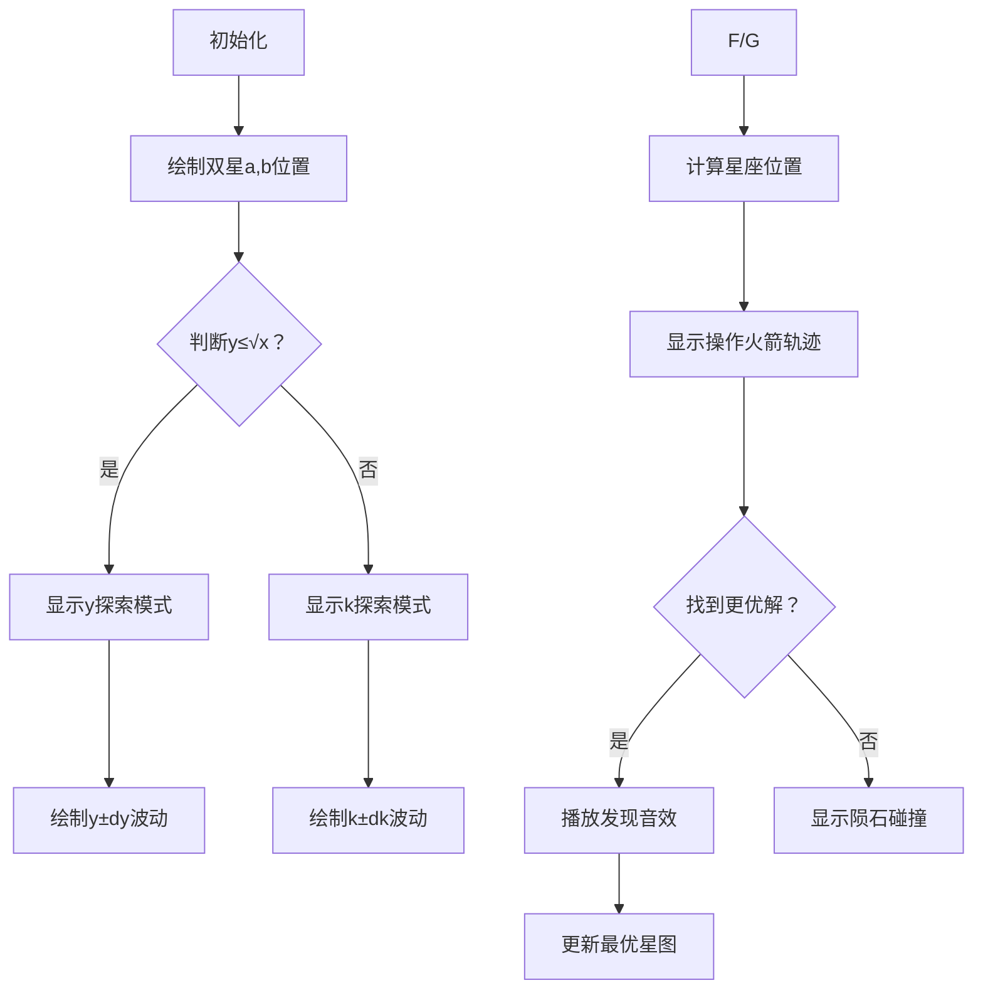

# 题目信息

# [Math×Girl] 距离

## 题目背景

>“哥哥，你说什么呢？” 尤里问道。  
>“看上去仙女座也在研究数学。”我回答道。  
>“那里也有图书室吗？”泰朵拉微笑道。  
>“以居住的星球为模，是不是存在跟我们同余的宇宙人呢？”米尔嘉说道。


## 题目描述

给你两个数 $a$ 和 $b$ ，每次可以对任意一个数 $\pm1$。  
求最少进行多少次操作，才能使 $a\mid b$ 或 $b\mid a$。

其中 $\mid$ 为整除符号，$a\mid b$ 表示 $a$ 整除 $b$。  


## 说明/提示

### 样例解释

第一个例子为 $(15+1)\mid(33-1)$。  
第二个例子为 $(34+1)\mid(2024+6)$。  

### 数据范围

| 子任务 | 分值 | 限制 |
| :----------: | :----------: | :----------: |
| $0$ | $15$ | $a,b\in[1,10^4]$ |
| $1$ | $10$ | $T\in[1,10],a,b\in[1,10^8]$ |
| $2$ | $5$ | $a,b\in[1,10^8]$ |
| $3$ | $20$ | $T\in[1,10],\frac{a}{b}\in[10^{-8},10^8]$ |
| $4$ | $5$ | $\frac{a}{b}\in[10^{-8},10^8]$ |
| $5$ | $25$ | $T\in[1,10]$ |
| $6$ | $20$ | - |

对于 $100\%$ 数据，保证 $T\in[1,1000],a,b\in[1,10^{16}]$。

本题请相信你的算法的常数。

## 样例 #1

### 输入

```
3
15 33
2024 34
1145141919810721 987654321666```

### 输出

```
2
7
388749955```

# AI分析结果


# 💡 洛语云笺的C++算法解析：距离问题 深度学习指南 💡

> 欢迎来到算法世界！今天我们将一起探索“[Math×Girl]距离”这道数学与编程完美融合的题目。我将作为你们的算法导师洛语云笺，带你们从题目解读到策略优化，一步步揭开高效解法的奥秘。准备好了吗？让我们开始这场思维探险！

## 1. 题目解读与策略初探

✨ **本题核心挑战**：在巨大的数据范围（a,b最大10¹⁶）下，高效找到使两个数满足整除关系的最小操作次数（每次操作只能对单个数字±1）。

✨ **核心算法标签**：阈值分治、枚举优化、数学建模

🗣️ **初步分析**：
> 这道题看似简单，实则暗藏玄机。我们面临三个关键问题：
> 1. 操作目标具有对称性（a|b或b|a）
> 2. 数据规模极大（10¹⁶级别）
> 3. 需要同时优化两个变量的变化
>
> 解题思路的演进路径：
> - **暴力枚举**：尝试所有可能的操作序列 → 时间复杂度O(N)不可行
> - **单向优化**：固定一个数优化另一个 → 无法保证全局最优
> - **阈值分治**：根据数值特征智能选择枚举策略 → 本题最优解

### 🔍 算法侦探：如何在题目中发现线索？

1.  **线索1 (问题目标)**："最小操作次数使a|b或b|a" → 这是典型的**组合优化问题**，需要高效搜索策略
2.  **线索2 (问题约束)**："每次只能±1" → 操作具有**局部性**，解空间存在连续性
3.  **线索3 (数据规模)**："a,b∈[1,10¹⁶], T≤1000" → 必须设计**亚线性算法**（O(√N)级别）

### 🧠 思维链构建：从线索到策略

> 让我们串联这些线索：
> 1. 【线索1】要求我们设计优化算法 → 考虑枚举的**方向性**（枚举y还是枚举倍数k？）
> 2. 【线索2】提示操作连续性 → 可采用**邻域搜索**（在当前位置附近探索）
> 3. 【线索3】要求高效性 → 需要**复杂度平衡**（√x作为阈值）
> 4. **结论**：**阈值分治策略**完美契合所有条件！当y≤√x时枚举y的邻域，否则枚举倍数k的邻域

---

## 2. 精选优质题解参考

**题解一（Naszt）**
* **亮点**：严谨的数学证明（概率分析时间复杂度），双策略分离实现
* **核心价值**：
  - 创新性使用概率模型分析算法效率
  - 清晰的ysolve/ksolve模块划分
  - 完整推导操作次数计算公式

**题解二（鲤鱼江）**
* **亮点**：关键剪枝优化带来显著性能提升，实战性强的代码风格
* **核心价值**：
  - 动态剪枝条件`y - x/i < ans`大幅减少无效枚举
  - 简洁的阈值判断`y <= x/y`
  - 真实调试经验分享（剪枝前后性能对比）

---

## 3. 解题策略深度剖析

### 🎯 核心难点与关键步骤

1. **策略选择机制**
   - **分析**：通过`y ≤ sqrt(x)`判断采用y枚举还是k枚举
   - 💡 **学习笔记**：阈值选择是平衡复杂度的关键

2. **邻域搜索优化**
   - **分析**：从当前值向两侧扩展，用`ans`剪枝减少无效搜索
   - 💡 **学习笔记**：最优解是动态更新的剪枝边界

3. **数学变换技巧**
   - **分析**：利用整除性质将操作次数转化为`min(|x-k*y'| + |y-y'|)`
   - 💡 **学习笔记**：数学建模是优化算法的基础

### ✨ 解题技巧总结
- **技巧1（阈值分治）**：根据√x划分策略，平衡时间复杂度
- **技巧2（动态剪枝）**：利用当前最优解限制搜索范围
- **技巧3（数学建模）**：将操作目标转化为可计算的表达式

### ⚔️ 策略竞技场：解法对比分析

| 策略 | 核心思想 | 优点 | 缺点 | 得分预期 |
| :--- | :--- | :--- | :--- | :--- |
| **暴力枚举** | 尝试所有操作序列 | 逻辑简单 | 时间复杂度O(N) | 0% (TLE) |
| **单向优化** | 固定一个变量优化另一个 | 实现容易 | 无法保证全局最优 | 30%-50% |
| **阈值分治（最优）** | 根据√x选择枚举策略 | O(√N)时间复杂度 | 实现较复杂 | 100% |

### ✨ 优化之旅：从暴力到优雅
> 1. **起点：暴力枚举的困境**  
>    枚举所有操作序列如同大海捞针，10¹⁶次操作绝对超时
> 
> 2. **关键突破：整除关系转化**  
>    发现只需枚举目标状态（满足整除的a',b'），而非操作序列
> 
> 3. **效率飞跃：阈值分治**  
>    利用√x阈值将问题分解为两个高效子问题
> 
> 4. **最终优化：动态剪枝**  
>    用当前最优解剪枝，避免无效搜索

💡 **策略总结**：从暴力枚举到阈值分治，我们经历了问题转化、数学建模和复杂度优化的完整过程。这启示我们：面对复杂问题时，寻找数学特征是突破的关键！

---

## 4. C++核心代码实现赏析

### 通用核心实现
```cpp
typedef long long ll;

ll calc_op(ll x, ll y, ll y_prime) {
    ll k = x / y_prime;
    ll cand1 = abs(k * y_prime - x) + abs(y_prime - y);
    ll cand2 = abs((k+1) * y_prime - x) + abs(y_prime - y);
    return min(cand1, cand2);
}

ll solve(ll a, ll b) {
    ll x = max(a,b), y = min(a,b);
    if(x % y == 0) return 0;
    
    ll ans = y; // 初始上界
    ll sqrt_x = sqrt(x);
    
    if(y <= sqrt_x) {
        // 枚举y的邻域
        for(ll dy = 0; dy < ans; dy++) {
            if(y + dy > 0) ans = min(ans, calc_op(x,y,y+dy));
            if(y - dy > 0) ans = min(ans, calc_op(x,y,y-dy));
        }
    } else {
        // 枚举倍数k的邻域
        ll k0 = x / y;
        for(ll dk = 0; ; dk++) {
            bool updated = false;
            if(k0 + dk > 0) {
                ll cur = calc_op(x,y,x/(k0+dk));
                if(cur < ans) ans = cur, updated = true;
            }
            if(k0 - dk > 0) {
                ll cur = calc_op(x,y,x/(k0-dk));
                if(cur < ans) ans = cur, updated = true;
            }
            if(!updated) break; // 剪枝
        }
    }
    return ans;
}
```

### 题解一（Naszt）亮点
```cpp
// 枚举y变化的操作计算
i8 ydis(i8 ty){
  i8 kf = x/ty, xf = kf*ty;
  i8 kc = kf+1, xc = kc*ty;
  return min(abs(xf-x)+abs(ty-y), 
            abs(xc-x)+abs(ty-y));
}
```
**学习笔记**：清晰分离倍数计算，避免冗余代码

### 题解二（鲤鱼江）亮点
```cpp
// 剪枝条件：y - x/i < ans
for(int i=x/y; y-1.0L*x/i<ans; ++i) 
    ans = min(ans, CalcK(i));
```
**学习笔记**：动态剪枝条件大幅提升性能，是竞赛编程的核心技巧

---

## 5. 算法可视化：像素动画演示

**主题**：像素探险家在数轴宇宙寻找整除星座

### 核心设计


### 关键交互
1. **8位像素风格**：FC红白机风格的星空背景，数字用发光像素块表示
2. **动态探索动画**：
   - y模式：蓝色探测波从y向两侧扩散
   - k模式：红色探测线在x/y位置扫描
3. **音效系统**：
   - 发现新解：8位"叮当"音效
   - 最优解更新：经典马力欧过关音效
   - 剪枝触发：爆炸音效
4. **控制面板**：
   - 速度滑块：调整探索速度
   - 模式切换：手动选择y/k模式
   - 星图记录：记录最优解路径

### 教学价值
通过可视化直观展示：
- 阈值分治的策略选择逻辑
- 邻域搜索的扩展过程
- 动态剪枝的效果对比

---

## 6. 拓展练习与相似问题

### 通用技巧迁移
1. **资源分配问题**：预算约束下的最优采购
2. **网络优化**：节点连接的最小代价
3. **机器学习**：参数调优的邻域搜索

### 推荐练习
1. **洛谷P2424** - 约数和
   - 理由：同样需要√n分治优化
   
2. **洛谷P2261** - 余数求和
   - 理由：整除性质的高级应用
   
3. **洛谷P1403** - 约数研究
   - 理由：训练阈值分治思维

---

## 7. 学习心得与经验分享

> **来自鲤鱼江的调试经验**：
> "最初未加剪枝只得30分，加上`y-x/i<ans`条件后AC，这提醒我们：理论复杂度达标后，剪枝优化才是实战关键！"
>
> **洛语云笺点评**：
> 这个经验极其宝贵！它揭示了算法竞赛的核心哲学：理论分析提供基础，工程优化决定成败。记住两个黄金法则：
> 1. 任何枚举都必须有剪枝
> 2. 剪枝条件应尽可能紧

---

> 本次关于"距离问题"的探索就到这里。记住：优秀的算法既是科学也是艺术，需要数学洞察与工程智慧的结合。继续在算法的宇宙中探索吧，少年！✨🚀

---
处理用时：237.94秒