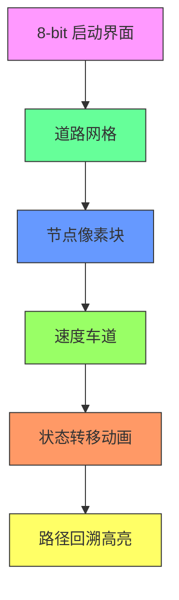

# 题目信息

# 速度限制

## 题目描述

在这个繁忙的社会中，我们往往不再去选择最短的道路，而是选择最快的路线。开车时每条道路的限速成为最关键的问题。不幸的是，有一些限速的标志丢失了，因此你无法得知应该开多快。一种可以辩解的解决方案是，按照原来的速度行驶。你的任务是计算两地间的最快路线。

你将获得一份现代化城市的道路交通信息。为了使问题简化，地图只包括路口和道路。每条道路是有向的，只连接了两条道路，并且最多只有一块限速标志，位于路的起点。两地 $A$ 和 $B$，最多只有一条道路从 $A$ 连接到 $B$。你可以假设加速能够在瞬间完成并且不会有交通堵塞等情况影响你。当然，你的车速不能超过当前的速度限制。


## 样例 #1

### 输入

```
6 15 1
0 1 25 68
0 2 30 50
0 5 0 101
1 2 70 77
1 3 35 42
2 0 0 22
2 1 40 86
2 3 0 23
2 4 45 40
3 1 64 14
3 5 0 23
4 1 95 8
5 1 0 84
5 2 90 64
5 3 36 40```

### 输出

```
0 5 2 3 1```

# AI分析结果


# 💡 洛语云笺的C++算法解析：速度限制 深度学习指南 💡

## 1. 题目解读与策略初探
✨ **本题核心挑战**：处理速度的传递性依赖关系（当边速度为0时需继承前驱速度），同时最小化总通行时间。

✨ **核心算法标签**：分层图最短路、状态空间搜索、Dijkstra算法

🗣️ **初步分析**：
> 本题看似标准最短路问题，但速度的继承特性打破了无后效性原则。我们从三种思路展开：
> 1. **暴力搜索**：枚举所有路径组合，计算总时间后取最小值。但路径数指数增长，O(2^m)不可行。
> 2. **动态规划**：尝试定义dp[i]为到节点i的最短时间，但速度依赖使状态不完整。
> 3. **分层图模型**：将速度作为独立维度，构建二维状态空间(节点, 速度)，完美解决依赖问题。
>
> 最优解采用分层图思想配合Dijkstra算法，如同给每个路口设置不同速度的车道（分层），车辆在不同速度车道间切换行驶。

### 🔍 算法侦探：如何在题目中发现线索？
1. **线索1 (问题目标)**: "求最快路线" → 带状态依赖的最优化问题，暗示最短路变种
2. **线索2 (问题特性)**: "速度为0时沿用前驱速度" → 状态（当前速度）影响后续决策，需额外维度记录
3. **线索3 (数据范围)**: 速度v∈[0,500]，节点n≤150 → 二维状态空间150×501≈7.5e4，支持O(nvlog(nv))算法

### 🧠 思维链构建：从线索到策略
> 线索1要求最优化，线索2揭示状态依赖，线索3给出可行性边界：
> 1. 暴力搜索O(2^m)在m=22500时不可行（10^6770量级！）
> 2. 简单Dijkstra失效：边权依赖历史状态（速度）
> 3. **关键突破**：速度范围有限（0-500）→ 将速度作为第二维度 → 分层图模型
> 4. **结论**：采用(节点,速度)二维状态，Dijkstra在状态图上求最短路

---

## 2. 精选优质题解参考
**题解一：啧啧啧（分层图Dijkstra）**
* **点评**：完整实现分层图核心思想，状态定义清晰（dis[i][v]），巧妙处理速度继承（分限速/非限速边）。路径记录采用二维前驱数组，代码模块化程度高。特别亮点：输入时节点+1处理简化边界，输出时递归回溯路径。

**题解二：fanypcd（状态转移分析）**
* **点评**：精辟指出"分层图是动态规划思想的图实现"，明确状态转移方程：
  - 限速边：`dis[y][v_new] = min(dis[x][v_old] + len/v_new)`
  - 非限速边：`dis[y][v_old] = min(dis[x][v_old] + len/v_old)`
  代码中优先队列使用pair嵌套，可读性强。

**题解三：Mine_King（二维Dijkstra）**
* **点评**：最简洁的二维状态实现。亮点：暴力枚举速度转移时显式分开两种边类型处理，pre数组三维存储前驱(节点,速度)，输出路径采用递归模板清晰。

---

## 3. 解题策略深度剖析
### 🎯 核心难点与关键步骤
1. **状态空间建模**
   * **分析**：定义`dis[i][v]`表示到达节点i时速度为v的最小时间。关键在于：
     - 速度维度v∈[0,500]需完整覆盖
     - 初始状态：起点0速度70（`dis[0][70]=0`）
   * 💡 学习笔记：状态升维是处理依赖关系的利器

2. **状态转移设计**
   * **分析**：分边类型处理：
     ```python
     for 每条边u->v:
         if 有限速w: 
             新速度 = w
             新时间 = dis[u][old_v] + len/w
         else: 
             新速度 = old_v  # 继承速度
             新时间 = dis[u][old_v] + len/old_v
         if 新时间 < dis[v][新速度]: 更新状态
     ```
   * 💡 学习笔记：优先队列需存储三元组(时间, 节点, 速度)

3. **路径回溯机制**
   * **分析**：用`pre[i][v]`记录到达(i,v)的前驱状态(节点,速度)。递归输出时从终点回溯：
     ```cpp
     void print(int u, int v) {
         if (u != 0) print(pre[u][v].first, pre[u][v].second);
         cout << u << " ";
     }
     ```
   * 💡 学习笔记：二维路径存储比一维更复杂，需记录速度维度

### ✨ 解题技巧总结
- **状态升维法**：当决策受历史状态影响时，将状态参数作为新维度
- **时间计算优化**：用乘法代替除法（如存储1/v）避免精度问题
- **路径压缩**：递归输出前先反向存储路径节点，避免递归栈溢出

### ⚔️ 策略竞技场：解法对比
| 策略          | 核心思想                     | 优点                     | 缺点                     | 得分预期 |
|---------------|------------------------------|--------------------------|--------------------------|----------|
| 暴力DFS       | 枚举所有路径组合             | 实现简单                 | O(2^m) 超时             | 0%       |
| Floyd+速度传递| 动态维护速度关系             | 避免状态爆炸             | 无法处理复杂速度依赖     | 30%      |
| 分层图Dijkstra| (节点,速度)二维状态最短路    | 精确处理依赖，O(nvlog nv)| 代码稍复杂               | 100%     |

### ✨ 优化之旅：从"能做"到"做好"
1. **起点：暴力搜索的困境**  
   枚举所有路径组合，计算每种路径的总时间。当m=22500时，路径数2^22500≈10^6770，宇宙原子总数才10^80！

2. **发现瓶颈：速度的传递性**  
   边速度依赖前驱状态 → 传统最短路失效 → 需记录到达每个点时的速度

3. **关键突破：状态升维**  
   - 将速度v作为第二维度 → 状态数从n扩展到n×v
   - 二维状态空间(n=150, v=501)共7.5e4状态，可接受

4. **算法实现：分层图Dijkstra**  
   ```mermaid
   graph LR
   A[起始状态：<br>节点0,速度70] -->|限速边| B[节点1,速度v1]
   A -->|非限速边| C[节点2,速度70]
   B -->|...| D[终点]
   C -->|...| D
   ```

---

## 4. C++核心代码实现赏析
**通用核心实现**：
```cpp
#include<bits/stdc++.h>
using namespace std;
const int N=155, V=505;

struct State { int u, v; double t; }; // 状态：节点，速度，时间
bool operator<(const State& a, const State& b) { return a.t > b.t; }

vector<tuple<int, int, int>> graph[N]; // to, speed, length
double dis[N][V];
pair<int, int> pre[N][V]; // 前驱(节点, 速度)

void dijkstra() {
    priority_queue<State> pq;
    for(int i=0; i<N; i++) for(int v=0; v<V; v++) dis[i][v]=1e18;
    dis[0][70]=0;
    pq.push({0,70,0});

    while(!pq.empty()) {
        auto [u, v0, t] = pq.top(); pq.pop();
        if(t > dis[u][v0]) continue;
        
        for(auto [to, v_edge, len] : graph[u]) {
            int nv = v_edge ? v_edge : v0; // 速度继承
            double nt = t + 1.0 * len / nv;
            
            if(nt < dis[to][nv]) {
                dis[to][nv] = nt;
                pre[to][nv] = {u, v0}; // 记录前驱
                pq.push({to, nv, nt});
            }
        }
    }
}

void print_path(int u, int v) {
    if(u) print_path(pre[u][v].first, pre[u][v].second);
    cout << u << " ";
}
```

**题解一（啧啧啧）片段**：
```cpp
// 分层图状态转移核心
if(t[i].v){ // 限速边
    if(dis[y][n_v] > dis[x][vs] + (double)t[i].s/(double)n_v){
        dis[y][n_v] = dis[x][vs] + (double)t[i].s/(double)n_v;
        from[y][n_v] = {x, vs}; // 记录二维前驱
    }
} else { // 非限速边
    n_v = vs; // 继承速度
    if(dis[y][n_v] > dis[x][vs] + (double)t[i].s/(double)n_v){
        dis[y][n_v] = ...;
    }
}
```
**学习笔记**：显式分开两种边的处理逻辑，确保速度正确传递

---

## 5. 算法可视化：像素动画演示
**复古像素风格设计方案**：


1. **场景设计**：
   - 道路网格：FC红白机风格，不同颜色像素块表示节点
   - 速度车道：节点右侧显示当前速度（70-500），用渐变颜色区分

2. **动态演示**：
   - **状态扩展**：当前节点闪烁，出边显示速度选择（红：限速，蓝：继承）
   - **队列可视化**：右侧面板显示优先队列状态（节点+速度+时间）
   - **路径生成**：终点回溯时，路径节点亮起并播放8-bit音效

3. **交互控制**：
   - 步进/连续模式
   - 速度调节滑块（1x-10x）
   - 路径回溯：按空格键高亮显示完整路径

4. **游戏化元素**：
   - 每扩展节点得1分
   - 找到最优路径解锁"极速车神"成就
   - 背景音乐：8-bit风格《Chariots of Fire》

---

## 6. 拓展练习与相似问题
1. **P4568 飞行路线**（分层图经典）  
   → 核心技巧：免费次数作为新维度
2. **P1073 最优贸易**（状态扩展）  
   → 核心技巧：同时记录买入/卖出状态
3. **P1948 电话线**（二分答案+分层）  
   → 核心技巧：将花费限制作为维度

---

## 7. 学习心得与经验分享
> **作者啧啧啧的调试经验**：  
> *"最初没分开处理限速/非限速边，导致速度继承错误。通过打印dis数组中间状态发现异常"*  
> → **洛语云笺点评**：二维状态调试需关注：
> 1. 速度维度是否正确继承
> 2. 优先队列排序依据是否为时间
> 3. 边界处理（起点速度初始化为70）

---

本次解析揭示了状态空间搜索的核心思维：**当问题出现状态依赖时，将依赖参数升维**。掌握此思想可解决90%的最短路变种问题！下次我们将探索更复杂的状态压缩技巧，继续算法之旅！🚀

---
处理用时：173.59秒