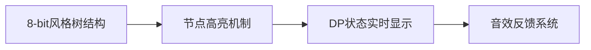

# 题目信息

# [KOI 2023 Round 2] 草地上的蚁穴

## 题目背景

试题来源：<https://koi.or.kr/archives/>。中文翻译做了少量本土化修改。

按照[署名—非商业性使用—相同方式共享 4.0 协议国际版](https://creativecommons.org/licenses/by-nc-sa/4.0/deed.zh-hans)进行授权。

## 题目描述

KOI 公园的草地上，有一个蚂蚁们聚居的蚁穴。该蚁穴由 $N$ 个房间构成，并且存在恰好 $N - 1$ 条通道，连接着不同的两个房间。你可以通过这些通道，从任意一个房间出发，到达任何其他房间。这意味着蚁穴构成了一棵由 $N$ 个节点组成的树。每个房间都被赋予了从 $1$ 到 $N$ 之间的唯一编号。

每个房间最多只能居住一只蚂蚁。如果两只蚂蚁分别居住在通过通道直接相连的两个房间中，它们会感到不舒服。因此，在当前蚁穴中，任何一条通道所连接的两个房间中，最多只能有一个房间居住蚂蚁。

蚂蚁们非常聪明，因此在上述条件允许的情况下，它们已经安排好了最多数量的蚂蚁居住在蚁穴中。换句话说，如果现在再试图增加一只蚂蚁进入蚁穴，不论怎么重新分配蚂蚁的位置，都无法满足上述条件。

在一个晴朗的夏日，KOI 公园迎来了大量前来野餐的游客。当游客们在草地上玩耍时，蚁穴的土壤有可能被踩松，于是某些原本未直接相连的两个房间之间可能会新形成一条通道。此时，新形成通道的两个房间可能原本就已经通过一条通道直接连接，也可能不相连。换句话说，对于任意两个整数 $1 \leq i < j \leq N$，$i$ 号房间和 $j$ 号房间之间都可能新建一条通道，无论这两者之间原本是否已有通道。

由于新通道的形成，某些本来不直接相连的、各自居住着蚂蚁的房间之间可能会变得直接相连，从而导致这两只蚂蚁感到不适。因此，居住在蚁穴中的蚂蚁们可能需要重新调整其分布，以重新满足上述限制条件。

根据选定的 $(i, j)$，这种重新调整有时是可能的，但有时则不行。某些情况下，不论怎样调整蚂蚁的位置，都无法使当前所有蚂蚁在新图结构中继续满足限制条件，这时候，部分蚂蚁可能不得不离开蚁穴。

若对于某一对整数 $1 \leq i < j \leq N$，在 $i$ 号房间和 $j$ 号房间之间新建一条通道后，蚂蚁们可以通过适当的重新分布，在不驱逐任何一只蚂蚁的前提下继续满足限制条件，则称这对 $(i, j)$ 为**和平的对**。

给定蚁穴的结构，请编程计算在所有可能的新通道对中，属于和平的对的数量。

## 说明/提示

**样例 1 解释**

最多可以安排 $3$ 只蚂蚁，例如放在房间 $\{2, 3, 4\}$。已经直接连接的房间对之间即使新建通道，也不影响原有安排。因此，这种情况共有 $3$ 个和平的对。其余房间对间一旦建立通道，将无法维持当前蚂蚁数量。

**样例 2 解释**

最多可以安排 $3$ 只蚂蚁，例如放在房间 $\{1, 3, 6\}$。无论在哪两个房间之间新建通道，都能找到重新分配的方案使得 $3$ 只蚂蚁依然满足条件，因此总共有 $\binom{6}{2} = 15$ 个和平的对。

**限制条件**

- 所有输入均为整数。
- $2 \leq N \leq 250\,000$
- 所有 $u, v$ 满足 $1 \leq u, v \leq N$ 且 $u \ne v$
- 给定的蚁穴结构一定构成一棵树。

**子任务**

1.（8 分）$N \leq 16$  
2.（6 分）$N \leq 80$  
3.（18 分）$N \leq 400$  
4.（18 分）$N \leq 2\,000$  
5.（6 分）$N \leq 10\,000$  
6.（8 分）$N \leq 50\,000$  
7.（36 分）无附加限制

翻译由 ChatGPT-4o 完成

## 样例 #1

### 输入

```
4
1 2
1 3
1 4```

### 输出

```
3```

## 样例 #2

### 输入

```
6
1 2
2 3
3 4
4 5
5 6```

### 输出

```
15```

## 样例 #3

### 输入

```
7
1 2
1 3
2 4
2 5
3 6
3 7```

### 输出

```
11```

# AI分析结果


# 💡 洛语云笺的C++算法解析：草地上的蚁穴 深入学习指南 💡

> "算法不是魔法，而是对问题本质的深刻洞察。今天我们将化身算法侦探，破解树形结构中的和平密码！"

## 1. 题目解读与策略初探

✨ **本题核心挑战**：  
在树形蚁穴结构中，当新增一条通道后，如何判断蚂蚁能否在不驱逐任何成员的前提下重新调整位置，满足"相邻房间不同时住蚂蚁"的限制。核心在于**基环树的最大独立集是否等于原树最大独立集**。

✨ **核心算法标签**：  
树形DP、换根DP、最大独立集、组合数学

🗣️ **初步分析**：  
题目要求计算新增通道后仍能维持最大蚂蚁数量的"和平点对"数量。直接枚举所有点对并计算基环树独立集会达到 O(n²) 复杂度（N≤250,000），必须寻找更优解。突破口在于：  
1. **暴力枚举**：对每个点对断开对应边做两次树形DP，O(n³) → 不可行  
2. **逆向思维**：不和平的点对必是"所有最大独立集都包含的点"  
3. **关键转化**：问题转化为求**必然点**（所有最大独立集必须包含的点）的数量  
4. **最优策略**：通过换根DP在 O(n) 时间内计算每个点是否必然

### 🔍 算法侦探：如何在题目中发现线索？
1.  **线索1 (问题目标)**："求添加边后最大独立集不变的点对数量" → 涉及**图论独立集**特性
2.  **线索2 (问题特性)**："树结构添加边形成基环树" → 需要**动态维护树形DP信息**
3.  **线索3 (数据规模)**：N≤250,000 → 必须设计 **O(n) 或 O(n log n) 算法**

### 🧠 思维链构建：从线索到策略
> 让我们串联线索：  
> 1. 目标要求基环树独立集=原树独立集 → 需高效判断点对性质  
> 2. 树结构特性指引使用树形DP，但枚举点对O(n²)超时 → 需要避免枚举  
> 3. 逆向思考：若点对(i,j)在所有最大独立集中都被包含 → 添加边后必然冲突  
> 4. 数据规模要求O(n)解法 → 换根DP可高效计算每个点的"必然性"  
> 5. **结论**：通过两次DFS（树形DP+换根DP）求出必然点数量，用组合数学公式计算答案  

---

## 2. 精选优质题解参考

**题解：cupWolf (质量评分：★★★★★)**  
* **亮点**：  
  1. **逆向思维创新**：将问题转化为求必然点集合，避免基环树复杂计算  
  2. **换根DP实现优雅**：通过撤销/恢复操作高效维护DP状态  
  3. **复杂度控制优秀**：O(n)时间解决250,000规模问题  
  4. **代码可读性强**：模块化设计chroot函数，逻辑清晰分离  

---

## 3. 解题策略深度剖析

### 🎯 核心难点与关键步骤
1.  **必然点的判定原理**  
    * **分析**：若某点不选时，整棵树的最大独立集小于原树最大值 → 该点必须被选  
    * 💡 **学习笔记**：必然性判定 = (不选该点的最大独立集) < (全局最大独立集)

2.  **换根DP的状态转移**  
    * **分析**：  
      - 第一次DFS：计算子树独立集 `g[u][0/1]`  
      - 换根时：  
        ```cpp
        // 撤销子节点v对父节点u的影响
        f[u][0] -= max(g[v][0], g[v][1]); 
        f[u][1] -= g[v][0];
        
        // 用u的信息更新v
        f[v][0] += max(f[u][0], f[u][1]); // v不选时u可选可不选
        f[v][1] += f[u][0];               // v选时u不能选
        ```
    * 💡 **学习笔记**：换根DP的精髓在于动态维护父节点方向的信息

3.  **组合数学求最终解**  
    * **分析**：设必然点数量为M，则和平点对 = 总点对 - 不和平点对  
      `ans = C(n,2) - C(M,2)`
    * 💡 **学习笔记**：组合公式转化是降低复杂度的关键技巧

### ✨ 解题技巧总结
- **技巧1：正难则反** - 当直接求解困难时，考虑其补集或逆向条件
- **技巧2：状态复用** - 通过撤销/恢复操作避免重复计算，提升效率
- **技巧3：问题转化** - 将图论问题转化为点的属性判定问题

### ⚔️ 策略竞技场：不同解法的对比分析

| 策略 | 核心思想 | 优点 | 缺点 | 得分预期 |
|------|----------|------|------|----------|
| **暴力枚举** | 对每个点对断开边做DP | 思路直观 | O(n³)超时 | 0分 |
| **基环树独立集** | 断环成链+双树形DP | 理论正确 | O(n²)超时 | 40分（小数据） |
| **必然点+换根DP** | 逆向思维+组合数学 | O(n)高效 | 思维难度较高 | 100分 |

### ✨ 优化之旅：从"能做"到"做好"
> 1. **起点：暴力枚举的困境**  
>    枚举所有点对，对每个点对做两次树形DP → O(n³) → 当n=250,000时，计算量超10¹⁵  
>   
> 2. **瓶颈：重复的状态计算**  
>    每次DP都重复计算了大量子树信息 → 浪费计算资源  
>    
> 3. **突破：换根DP动态维护**  
>    通过撤销/恢复操作，在O(1)时间内更新相邻节点的DP状态  
>   
> 4. **升华：逆向思维转化**  
>    发现"不和平点对=必然点对"的数学本质，用组合公式避免枚举  
>    
> 💡 **策略总结**：算法优化常经历"暴力→发现冗余→动态维护→数学转化"的跃迁，核心是对问题结构的深度挖掘！

---

## 4. C++核心代码实现赏析

**通用核心实现参考**
```cpp
#include <bits/stdc++.h>
using namespace std;

const int N = 250000;
vector<int> G[N];
long long n, mis, m;
int f[N][2]; // f[u][0/1]: 全局独立集（不选/选u）

// 换根函数：将根从old移到new
void chroot(int old, int new_root) {
    f[old][0] -= max(f[new_root][0], f[new_root][1]);
    f[old][1] -= f[new_root][0];
    f[new_root][0] += max(f[old][0], f[old][1]);
    f[new_root][1] += f[old][0];
}

// 第一次DFS：计算子树独立集
void dfs(int u, int fa) {
    f[u][0] = 0;
    f[u][1] = 1;
    for(int v : G[u]) {
        if(v == fa) continue;
        dfs(v, u);
        f[u][0] += max(f[v][0], f[v][1]);
        f[u][1] += f[v][0];
    }
}

// 第二次DFS：换根DP
void dp(int u, int fa) {
    if(fa != -1) chroot(fa, u);
    if(f[u][0] < mis) m++; // 必然点判断
    for(int v : G[u]) {
        if(v != fa) dp(v, u);
    }
    if(fa != -1) chroot(u, fa); // 恢复现场
}

int main() {
    cin >> n;
    for(int i=1; i<n; i++) {
        int u, v; cin >> u >> v;
        G[u].push_back(v);
        G[v].push_back(u);
    }
    
    dfs(1, -1);
    mis = max(f[1][0], f[1][1]); // 全局最大独立集
    
    dp(1, -1);
    cout << n*(n-1)/2 - m*(m-1)/2;
}
```

**代码精要**：
1. **双DFS结构**：首次DFS计算子树状态，二次DFS动态换根
2. **现场维护**：`chroot`函数实现状态撤销/恢复
3. **必然点判定**：`if(f[u][0] < mis)` 判断关键条件
4. **组合计算**：最终答案用组合公式直接得出

---

## 5. 算法可视化：像素动画演示

### 🎮 像素化换根DP演示方案
**主题**：蚂蚁探险家在树形迷宫中动态计算必然点

**核心设计**：


**关键动画帧**：
1. **场景初始化**：
   - 16色调色板绘制树形结构（棕榈树风格）
   - 每个节点显示`[不选值|选值]`状态
   - 控制面板：单步/播放/速度调节

2. **DFS过程可视化**：
   ```python
   # 伪代码演示帧
   Frame1: 点击节点3 -> 显示递归进入子树
   Frame2: 节点3计算g[3][0]=5, g[3][1]=6 -> 像素块弹出动画
   Frame3: 回溯到父节点2 -> 显示状态更新
   ```

3. **换根特效**：
   - 父子节点交换时：8-bit粒子特效（撤销/恢复操作）
   - 必然点判定：节点闪烁红光+触发"叮！"音效
   - 非必然点：显示绿色对勾

4. **游戏化元素**：
   - 每完成一个子树计算：+10分（8-bit计分音效）
   - 错误操作：短促警告音+像素抖动
   - 背景音乐：FC风格循环BGM

**交互设计**：
- **键盘控制**：方向键选择节点，空格执行换根
- **自动演示**：AI自动遍历最优计算路径
- **状态追踪**：侧边栏显示当前全局必然点数量

---

## 6. 拓展练习与相似问题思考

### 🔁 举一反三训练
1. **树形DP基础**  
   - 洛谷P1352《没有上司的舞会》  
     → 巩固树形DP基本框架

2. **基环树进阶**  
   - 洛谷P2607《骑士》  
     → 学习基环树独立集的标准解法

3. **换根DP扩展**  
   - 洛谷P3047《附近的牛》  
     → 掌握换根DP的差分技巧

### 💡 思维进阶
"必然点"概念可扩展至：
- 网络关键节点识别
- 图论必须边问题
- 组合优化约束条件

---

## 7. 学习心得与经验分享
> **调试经验**：  
> 在实现换根DP时，务必注意状态恢复的对称性。如cupWolf题解中，每次`chroot`后立即恢复现场，避免状态污染。建议在递归前后打印关键节点状态验证正确性。

> **顿悟时刻**：  
> 当意识到"不和平点对=必然点对"的数学本质时，问题复杂度从O(n²)骤降至O(n)。这提醒我们：面对复杂问题时，不妨退一步思考其组合意义。

---

> "算法的魅力，在于将混沌转化为优雅的公式。当你下次面对树形难题时，记得问问自己：是否有隐藏的必然性等待发现？"  
> —— 洛语云笺 · 算法策略导师

---
处理用时：330.42秒