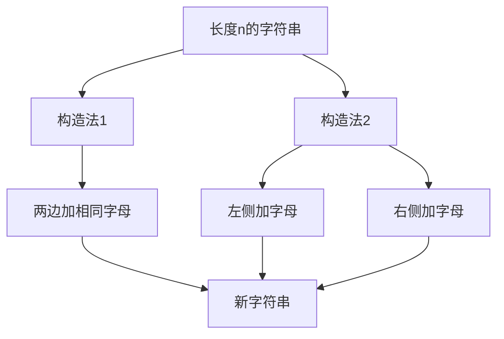

# 题目信息

# [蓝桥杯 2025 国 B] 近似回文字符串

## 题目描述

小蓝，一位昔日的编程大神，如今却因找不到工作，转行成了飞天大盗。近日，他正筹划着盗取蓝桥王国的至宝——水晶项链。

水晶项链被珍藏在一个固若金汤的保险库中，要想开启保险库，就必须破解保险库的密码。利用编程技能，小蓝截获情报，得知这个密码是一个长度为 $N$，且仅由小写英文字母构成的“近似回文字符串”。

一个字符串 $S$ 被称为“近似回文字符串”需满足以下条件：

1. $S$ 本身不是回文串。
2. 从 $S$ 中删除一个字符后，剩下的字符串是回文串。

例如，当 $S = \text{abbac}$ 时，$S$ 不是回文，但删除最后一个字符 $\text{c}$ 后得到的 $\text{abba}$ 是回文，所以 $S$ 是“近似回文字符串”。

现在，请你帮助小蓝计算长度为 $N$ 的“近似回文字符串”的数量，为转行做飞天大盗的小蓝提供助力。由于答案可能很大，你只需给出其对 $10^9 + 7$ 取余后的结果即可。


## 说明/提示

**【评测用例规模与约定】**

对于 10% 的评测用例，$2 \leq N \leq 6$。

对于 100% 的评测用例，$2 \leq N \leq 10^5$。

## 样例 #1

### 输入

```
2```

### 输出

```
650```

# AI分析结果


### 💡 洛语云笺的C++算法解析：[蓝桥杯 2025 国 B] 近似回文字符串 深入学习指南 💡

#### 引言
今天我们将探索一道关于"近似回文字符串"计数的题目。这道题不仅考察对回文串性质的理解，更考验我们如何通过巧妙的计数策略解决复杂约束问题。我们将一起拆解解题思路，分析动态规划的核心思想，并设计生动的像素化动画来直观展示算法过程。

---

### 1. 题目解读与策略初探

✨ **本题核心挑战**：计算长度为 N 的字符串中，满足"删除一个字符后成为回文串"但"自身不是回文串"的数量，要求高效处理 N ≤ 10⁵ 的大数据范围。

✨ **核心算法标签**：`动态规划`、`组合数学`、`递推优化`

🗣️ **初步分析**：
> 题目要求统计特殊字符串的数量，直接枚举所有可能性（复杂度 O(26ᴺ)）不可行。我们需要发现隐藏的递推规律：
> 1. **暴力枚举**：适用于 N≤6 的小数据（仅得 10% 分）
> 2. **动态规划**：利用字符串的对称性构建递推关系（最优解）
>
> 核心思路是将问题拆解为：
> - **S₁** = {删除一个字符后是回文串的字符串}
> - **S₂** = {自身是回文串的字符串}
> 答案 = |S₁| - |S₂|

#### 🔍 算法侦探：如何在题目中发现线索？
1.  **线索1 (问题目标)**："统计满足特定条件的字符串数量"且"N最大10⁵"，暗示需要**高效计数策略**而非暴力枚举。
2.  **线索2 (问题特性)**："删除一个字符成为回文串"的条件暗示**字符串结构存在对称性**，可利用回文性质构建递推关系。
3.  **线索3 (数据规模)**：N=10⁵ 要求时间复杂度≤O(N)，指向**线性递推或公式解法**。

#### 🧠 思维链构建：从线索到策略
> "我们收集到三条关键线索：
> 1. 目标要求高效计数→排除O(2ᴺ)暴力枚举
> 2. 条件依赖回文性质→考虑对称性构建状态转移
> 3. 数据规模极大→需O(N)或O(1)解法
>
> **结论**：动态规划递推是唯一可行方案。通过分析短字符串的合法模式，推导长度增加时的增量规律，最终得到线性递推式。"

---

### 2. 精选优质题解参考

**题解（作者：mrsuns）**
* **点评**：该题解亮点在于巧妙的问题分解策略：
  1. 将复杂条件拆解为S₁-S₂的集合运算
  2. 发现回文串数量|S₂|=26ᵏ（k=⌈N/2⌉）的关键性质
  3. 通过"两边加相同字母"和"单侧加字母"两种构造法建立递推：
     ```python
     dp[i] = 26·dp[i-2] + 2·25·26ⁱ/² - [i偶]·25·26
     ```
  4. 代码实现规范：预处理幂次优化，取模处理严谨

---

### 3. 解题策略深度剖析

#### 🎯 核心难点与关键步骤
1.  **难点1：如何无重复地构造S₁**
    * **分析**：定义dp[i]为长度为i的S₁大小
      - **构造1**：在dp[i-2]的字符串两侧加相同字母（26种）
      - **构造2**：在回文串上单侧加字母（25种×2方向）
    * 💡 **学习笔记**：构造法需避免重复计数，通过"单侧加不同字母"排除重叠

2.  **难点2：修正偶数长度的重复计数**
    * **分析**：当i为偶数时，需减去25×26修正重复项
      ```cpp
      dp[i] = 26·dp[i-2] + 50·26ⁱ/² - (i%2?0:650)
      ```
    * 💡 **学习笔记**：边界修正体现动态规划的完整性思考

3.  **难点3：最终答案推导**
    * **分析**：|S₂|=26⌈ᴺ/²⌉，故：
      ```cpp
      answer = (dp[n] - pow26[(n+1)/2] + MOD) % MOD;
      ```

#### ✨ 解题技巧总结
- **技巧1（问题分解）**：将"非回文但可删减为回文"拆解为S₁-S₂
- **技巧2（对称构造）**：利用回文对称性设计无重复的状态转移
- **技巧3（预处理优化）**：预先计算26的幂次降低时间复杂度

#### ⚔️ 策略竞技场：解法对比
| 策略         | 核心思想                     | 优点                  | 缺点                          | 得分预期 |
|--------------|------------------------------|-----------------------|-------------------------------|----------|
| **暴力枚举** | 检查每个字符串的所有删除位置 | 思路直观              | O(N·26ᴺ) 超时                | 10%      |
| **公式解法** | 奇偶分类推导封闭解           | O(1) 时间复杂度       | 推导复杂，易出错              | 100%     |
| **递推DP**   | 动态规划构造合法字符串       | O(N) 时间，逻辑清晰   | 需处理边界修正                | 100%     |

#### ✨ 优化之旅：从暴力到递推
> 1. **起点：暴力枚举**  
>   尝试所有26ᴺ种字符串，对每个字符串检查N个删除位置 → O(N²·26ᴺ) 绝对超时
>   
> 2. **关键发现：对称性规律**  
>   观察到删除字符后的回文性实际取决于原始字符串的对称结构
>   
> 3. **递推优化**  
>   从短字符串递推长字符串：  
>   - 两边添加相同字母保持性质（26种）  
>   - 单侧添加字母创建新合法串（50种）  
>   
> 4. **最终升华**  
>   通过修正项解决偶数长度重复计数，完成O(N)解法

💡 **策略总结**：从暴力到递推的优化之旅，展示了如何通过分析问题本质特征，将指数复杂度降为线性。这种"观察模式→建立递推→修正边界"的思维框架可推广至许多计数问题。

---

### 4. C++核心代码实现赏析

**通用核心实现**
```cpp
#include <bits/stdc++.h>
using namespace std;
const int MOD = 1e9+7;
const int N = 1e5+10;

int pw[N]; // 预计算26的幂次

void precalc() {
    pw[0] = 1;
    for(int i=1; i<N; ++i) 
        pw[i] = 1LL * pw[i-1] * 26 % MOD;
}

int solve(int n) {
    vector<int> dp(n+1);
    dp[0] = 1;  // 空串方案数
    dp[1] = 26; // 单字符方案数
    
    for(int i=2; i<=n; ++i) {
        long long term1 = 26LL * dp[i-2] % MOD;
        long long term2 = 2LL * 25 * pw[i/2] % MOD;
        long long term3 = (i%2 == 0) ? 650LL : 0LL;
        
        dp[i] = (term1 + term2 - term3 + MOD) % MOD;
    }
    return (dp[n] - pw[(n+1)/2] + MOD) % MOD;
}
```

**代码解读概要**：
1. **预处理优化**：`pw[]`数组存储26ᵏ避免重复计算
2. **递推核心**：
   - `term1`：两边加相同字母（继承dp[i-2]）
   - `term2`：单侧加不同字母（25种×2方向）
   - `term3`：偶数长度修正项
3. **最终答案**：`dp[n] - 回文串数量`

---

### 5. 算法可视化：像素动画演示

**主题**：`像素工厂 - 字符串构造流水线`  
**核心演示**：递推过程中三种构造法的可视化实现

#### 🎮 动画设计


1. **像素场景设计**
   - 8-bit风格工厂流水线，传送带运送字符串
   - 三种加工机械臂对应不同构造法：
     * 蓝色机械臂：两边添加相同字母（像素火花：💙）
     * 黄色机械臂：左侧添加字母（💛）
     * 红色机械臂：右侧添加字母（❤️）

2. **动态演示流程**
   ```plaintext
   1. 初始化：传送带出现短字符串（长度2）
   2. 构造法1演示：
        - 蓝色机械臂抓取字符串
        - 两侧附加相同字母（显示26色选择盘）
        - 新字符串放回传送带（"ab"→"aabb"）
   3. 构造法2演示：
        - 黄色机械臂抓取回文串"aa"
        - 左侧添加不同字母（"baa"，音效：叮！）
        - 红色机械臂同操作（"aab"）
   4. 修正流程（仅偶数长度）：
        - 警告灯闪烁🔶，显示重复计数
        - 机械臂移除非法字符串（像素爆炸效果）
   ```

3. **游戏化元素**
   - **关卡挑战**：每关构造指定长度字符串
   - **音效设计**：
     * 添加字母：8-bit电子音（音阶随字母变化）
     * 错误修正：短促警报声
     * 过关：经典FC胜利旋律
   - **实时数据显示**：
     * 顶部计数器：dp[i]当前值
     * 侧边栏：三种构造法使用次数统计

---

### 6. 拓展练习与相似问题

**通用技巧迁移**：
1. 带约束的字符串计数（如CodeForces 1327F）
2. 递推关系优化（如斐波那契变形）
3. 回文相关计数问题（如不同分割方案）

**洛谷推荐**：
1. **P1217 [基础动态规划]**  
   🗣️ 练习经典递推模型，巩固dp[i]=a·dp[i-1]+b·dp[i-2]型关系
   
2. **P1433 [回文字符串处理]**  
   🗣️ 强化回文串性质分析能力，需处理更复杂约束
   
3. **P2312 [计数问题优化]**  
   🗣️ 学习组合数学与递推结合的优化技巧

---

### 结语
通过本次分析，我们掌握了"分解问题→发现递推→修正边界"的动态规划思维框架。记住：面对复杂计数问题时，先寻找小规模规律，再思考如何增量构造，往往能发现隐藏的递推关系。继续在洛谷上挑战相似题目，将这种思维模式转化为你的算法直觉！🚀

---
处理用时：264.70秒