# 题目信息

# 两数之和

## 题目描述

我们知道从 $n$ 个非负整数中任取两个相加共有 $\frac{n(n-1)}{2}$ 个和，现在已知这 $\frac{n(n-1)}{2}$ 个和值，要求 $n$ 个非负整数。

## 样例 #1

### 输入

```
3 1269 1160 1663
```

### 输出

```
383 777 886
```

# AI分析结果


### 题目解读与策略初探
✨ **本题核心挑战**：从已知的n个非负整数两两之和（共n(n-1)/2个）中逆向推导出原始数列，核心难点在于处理**和值的组合重叠性**和**多解可能性**。

✨ **核心算法标签**：`枚举`、`搜索`、`数学推导`、`数据结构优化`

🗣️ **初步分析**：
> 1. **暴力枚举**：尝试所有可能的数字组合，时间复杂度O(2^M)完全不可行（M=60时超时）
> 2. **数学推导法**：利用和值排序后的特性（最小和=a₁+a₂，次小和=a₁+a₃）建立方程组
> 3. **数据结构优化**：用multiset维护剩余和值，实现O(log n)的删除和查找操作
> 
> **核心算法选择**：动态规划不适用，最优解是**枚举首项+数学推导**，如同解锁密码箱：已知几组齿轮齿数和（a₁+a₂等），需逆向推导每个齿轮的齿数（a₁,a₂等）。

### 🔍 算法侦探：如何在题目中发现线索？
1. **线索1（问题目标）**：要求从"无序和值"还原"有序数列"，需要**逆向推导**，暗示需要枚举起点（如首项a₁）。
2. **线索2（数据特性）**：排序后最小和值必为a₁+a₂，次小和值必为a₁+a₃，提供**固定锚点**。
3. **线索3（数据规模）**：n≤10（最大和值数45），允许O(n³)算法，验证枚举法的可行性。

### 🧠 思维链构建：从线索到策略
> 1. 从线索1知需**枚举起点**，自然想到枚举a₁（范围0≤a₁≤b₁/2）
> 2. 线索2提供**关键等式**：b₁=a₁+a₂, b₂=a₁+a₃ → 可直接计算a₂,a₃
> 3. 线索3验证**枚举可行性**：n最大10，三重循环仅10³
> 4. **结论**：通过枚举首项+数学推导+集合维护剩余和值，实现高效求解

---

### 精选优质题解参考
**题解一（YudeS，赞43）**  
- **亮点**：  
  ① 用multiset自动排序+快速删除，代码简洁高效  
  ② 图解展示和值矩阵（倒三角），直观揭示a₁+a₂等关键位置  
  ③ 完整模拟n=5的推导过程，教学性强  

**题解二（zhengrunzhe，赞10）**  
- **亮点**：  
  ① 独创性联立三元方程：(a₁+a₂)+(a₁+a₃)+(a₂+a₃)可解出总和  
  ② 精细剪枝：和值非整数时立即终止  

**题解三（Tony102，赞4）**  
- **亮点**：  
  ① STL进阶技巧：vector存储多组可行解，最后统一排序输出  
  ② 结构体封装解法，提升代码可扩展性  

---

### 解题策略深度剖析
#### 🎯 核心难点与关键步骤
1. **确定首项范围**  
   - 分析：a₁≤a₂ ⇒ 0≤a₁≤b₁/2  
   - 💡 学习笔记：利用有序性压缩枚举空间是优化关键

2. **构建初始三元组**  
   - 分析：a₂=b₁-a₁, a₃=b₂-a₁，需验证a₂+a₃∈剩余和值  
   - 💡 学习笔记：次小和值b₂必含a₁，是该策略成立的核心前提

3. **迭代推导后续项**  
   - 分析：剩余和值最小值必为a₁+a₄ → a₄=min_val-a₁  
   - 💡 学习笔记：每确定一个新项，需同步删除其与已确定项的所有和值组合

#### ✨ 解题技巧总结
- **技巧1（锚点锁定）**：排序后最小两个和值必含a₁  
- **技巧2（集合维护）**：用multiset/hash表快速查找删除和值  
- **技巧3（即时验证）**：每确定新项立即验证与已确定项的和值是否存在  

#### ⚔️ 策略竞技场：不同解法对比
| 策略               | 核心思想                     | 优点                     | 缺点                          | 得分预期 |
|--------------------|----------------------------|--------------------------|-------------------------------|----------|
| **暴力枚举**       | 尝试所有数字组合            | 思路直观                 | O(2^n)超时                    | 0分      |
| **数学推导+集合维护** | 枚举a₁+multiset删和值      | 最优O(n²logn)，代码简洁  | 需数学洞察力                  | 100%     |
| **三元联立方程**   | 联立a₁+a₂,a₁+a₃,a₂+a₃求和解 | 无集合操作，减少依赖     | 实现复杂，剪枝逻辑繁琐        | 100%     |

#### ✨ 优化之旅：从"能做"到"做好"
1. **起点**：暴力枚举组合 → 指数爆炸  
2. **关键跃迁**：发现排序后b₁=a₁+a₂, b₂=a₁+a₃的锚点规律  
3. **二次优化**：用multiset替代数组手动维护，删除效率从O(n)→O(logn)  
4. **思维升华**：将和值关系转化为集合操作问题  

> 💡 **策略总结**：算法优化常经历"发现规律→数学建模→数据结构加速"三阶段，本题中multiset的选用正是平衡思维复杂度和执行效率的典范。

---

### C++核心代码实现赏析
**通用核心实现（基于YudeS题解优化）**
```cpp
#include <bits/stdc++.h>
using namespace std;

void solve(int n) {
    int m = n*(n-1)/2;
    vector<int> b(m);
    for (int i=0; i<m; ++i) cin >> b[i];
    sort(b.begin(), b.end());
    
    for (int a1=0; a1<=b[0]/2; ++a1) {
        multiset<int> s(b.begin(), b.end());
        vector<int> ans = {a1, b[0]-a1}; 
        s.erase(s.find(b[0]));
        
        if (s.empty()) {
            for (int x : ans) cout << x << " ";
            return;
        }
        
        ans.push_back(*s.begin() - a1);
        s.erase(s.begin());
        auto it = s.find(ans[1] + ans[2]);
        if (it == s.end()) continue;
        s.erase(it);
        
        for (int i=3; i<=n; ++i) {
            if (s.empty()) break;
            int next = *s.begin() - a1;
            ans.push_back(next);
            s.erase(s.begin());
            for (int j=1; j<i; ++j) { // 注意从a₂开始验证
                it = s.find(ans[j] + next);
                if (it == s.end()) goto next_a1;
                s.erase(it);
            }
        }
        for (int x : ans) cout << x << " ";
        return;
        
        next_a1:;
    }
    cout << "Impossible";
}

int main() {
    int n;
    while (cin >> n) solve(n);
}
```
**代码解读概要**：  
1. 枚举a₁∈[0, b₀/2]  
2. 用multiset动态维护剩余和值  
3. 关键删除操作：每确定新项，立即删除其与所有已确定项的和值  
4. 使用goto实现枚举快速重置（优于嵌套循环）

---

### 算法可视化：像素动画演示
**主题**：像素探险家解密数字迷宫  
**视觉设计**：  

```mermaid
graph LR
    A[输入和值云团] --> B[排序后转为数字矩阵]
    B --> C[红色像素标记a₁枚举]
    C --> D[绿色流光展示a₂,a₃计算]
    D --> E[爆破动画删除已用和值]
    E --> F[金色路径连接推导出的数字]
```


**交互设计**：  
1. **控制面板**：  
   - 步进按钮：单步观察推导  
   - 速度滑块：调节枚举速度（0.5x~4x）  
   - 高亮开关：聚焦当前操作元素  

2. **音效方案**：  
   - 正确匹配：8-bit清脆"叮"声（SNES音效）  
   - 错误尝试：短促警示音  
   - 解密成功：FC游戏通关旋律  

3. **动态演示**：  
   ```plaintext
   初始：混沌像素云团（代表未排序和值）
   ↓ 按下排序按钮 → 云团排列成三角矩阵
   ↓ 红色方块在首行移动（枚举a₁）
   ↓ 选中a₁时触发绿色流光 → 计算a₂,a₃
   ↓ 爆破效果清除a₁+a₂等已用和值
   ↓ 重复直到金色路径连通所有数字
   ```

---

### 拓展练习与相似问题思考
**通用技巧迁移**：  
1. P1678 烦恼的高考志愿：同属"从和值还原序列"问题  
2. P2889 牛的时间表：多锚点推导的扩展应用  
3. P3799 小Y的背包：带约束的逆向推导  

**洛谷推荐**：  
1. **P1678** - 要求从成绩和还原各科分数，强化多锚点推导  
2. **P2947** - 扩展至三维："三数之和"还原训练  
3. **P3901** - 进阶挑战：存在缺失值时的容错推导  

---

### 学习心得与经验分享
**经验摘录（YudeS）**：  
> "调试时发现multiset删除逻辑是关键：必须用`find`定位后删除，直接`erase(value)`会删除所有相同值"

**洛语云笺点评**：  
> 该经验揭露了STL容器的使用陷阱，在涉及重复值时：  
> 1. `s.erase(value)`删除所有等值元素 ❌ 
> 2. `s.erase(s.find(value))`仅删首个匹配项 ✅  
> 这是竞赛中常见调试痛点，建议编码时添加注释强调  

---

> 算法世界的探索如同解密数字迷宫，从混沌中寻找秩序，在无序中发现锚点。掌握"枚举锚点+集合维护"的双剑合璧，你将成为逆向推导的顶尖解密者！

---
处理用时：138.83秒