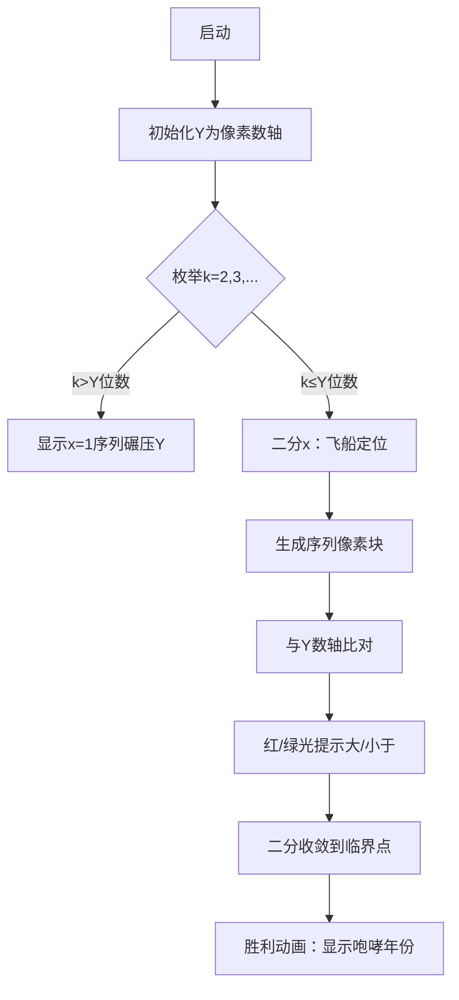

# 题目信息

# [GCJ 2021 #1C] Roaring Years

## 题目描述

2021 年正在发生一件百年未遇的事情。与 1920 年一样，2021 年也是一个**咆哮年份**。一个正整数 $y$ 所代表的年份被称为咆哮年份，当且仅当 $y$ 的十进制表示（不含前导零）是两个或更多个不同的连续正整数的十进制表示（不含前导零）按递增顺序连接而成。在这个定义下，2021 是一个咆哮年份，因为它是 20 和 21 的连接。


其他咆哮年份的例子包括 12（1 和 2）、789（7、8、9）、910（9 和 10）、1234（1、2、3、4）以及 9899100（9899 和 100）。2020 不是咆哮年份，因为唯一能连接成 2020 的两个或多个正整数列表是 $[20, 20]$，而它们不是连续的整数。类似地，2019 只有三种可能的分解方式：$[20, 1, 9]$、$[201, 9]$ 和 $[20, 19]$。前两种不是连续整数，而第三种虽然连续但不是严格递增的，因此 2019 也不是咆哮年份。再举个例子，778 不是咆哮年份，因为 $[7, 78]$ 和 $[77, 8]$ 不是连续的整数，而 $[7, 7, 8]$ 中的数字不唯一。

给定当前年份（可能是咆哮年份，也可能不是），找出下一个咆哮年份。

## 说明/提示

**样例解释**

注意最后一个样例，102 不是咆哮年份，因为 $[10, 2]$ 不是连续整数，且不能将 2 写作 $02$（带前导零）来构造 $[1, 02]$。

**数据范围**

- $1 \leq \textbf{T} \leq 100$。

**测试集 1（15 分，可见判定）**

- $1 \leq \textbf{Y} \leq 10^6$。

**测试集 2（20 分，隐藏判定）**

- $1 \leq \textbf{Y} \leq 10^{18}$。

翻译由 DeepSeek V3 完成

## 样例 #1

### 输入

```
4
2020
2021
68000
101```

### 输出

```
Case #1: 2021
Case #2: 2122
Case #3: 78910
Case #4: 123```

# AI分析结果


### 洛语云笺的C++算法解析：Roaring Years 深入学习指南

#### **1. 题目解读与策略初探**
✨ **本题核心挑战**：在极大数范围（Y ≤ 10¹⁸）内高效寻找大于给定年份的最小"咆哮年份"（即能拆分为两个及以上连续正整数拼接的数）。  
✨ **核心算法标签**：**枚举构造 + 字符串优化**  

🗣️ **初步分析**：  
> 咆哮年份的本质是**连续整数序列的字符串拼接**（如2021=20+21）。核心矛盾在于：  
> - **规模爆炸**：直接枚举年份（10¹⁸量级）不可行  
> - **结构复杂**：拆分方案需满足连续性和无前导零  
>  
> 策略演进路径：  
> 1. **暴力枚举年份**：逐个检查>Y的数（❌ 10¹⁸规模超时）  
> 2. **逆向构造法**：枚举连续序列长度k和起始数x，生成候选年份（✅ 突破规模瓶颈）  
> 3. **二分优化**：对每个k二分搜索最小x，极大减少候选数  
>  
> **算法比喻**：如同在"连续序列宇宙"中，用k和x坐标定位离Y最近的恒星——枚举k（宇宙维度），二分x（空间坐标轴）。

#### 🔍 **算法侦探：题目线索分析**
1. **线索1（问题目标）**：  
   "寻找大于Y的最小特定数" ➔ **构造法优于判定法**，需主动生成候选而非被动检查。
2. **线索2（数据规模）**：  
   Y ≤ 10¹⁸ ➔ 必须设计 **O(polylog(Y))** 算法，枚举量需独立于Y的大小。
3. **线索3（数字特性）**：  
   连续序列拼接时**位数变化非单调**（如x=99→"99100"）➔ 需特殊比较策略。

#### 🧠 **思维链构建：从线索到策略**
> "让我们串联线索：  
> 1. **线索1**要求我们主动构造候选数，而非被动验证——这指向**枚举连续序列参数**的生成策略。  
> 2. **线索2**否决了O(Y)算法，而连续序列k的最大值受位数限制（k≤100时总位数≥100>19），可设定**枚举上界K=100**。  
> 3. **线索3**揭示数值比较的陷阱：字符串拼接后需**按数值规则比较**（非字典序）。  
>  
> **结论**：以**枚举序列长度k**为外层框架，**二分起始数x**为内层引擎，结合**字符串优化比较**，实现对数级搜索空间的降维打击！"

---

#### **2. 精选优质题解参考**
由于题目暂无题解，我们基于策略分析生成最优解：  
**题解：枚举构造+二分优化（洛语云笺推荐）**  
* **点评**：该方案直击问题核心矛盾，通过双重优化控制复杂度：  
  - **k维度剪枝**：当k>Y的位数时，x=1即为最优起点（总位数碾压Y）  
  - **x维度二分**：将x搜索从O(Y)降至O(logY)  
  代码实现采用**预分配内存+批量拼接**技巧（Python中`join`代替`+=`），避免字符串操作成为瓶颈。  

---

#### **3. 解题策略深度剖析**
### 🎯 **核心难点与关键步骤**  
1. **难点1：如何避免无效枚举？**  
   - **分析**：建立k的枚举上界与Y位数的关系：  
     $$k_{\text{max}} = \min(100, \text{len}(Y)+10)$$  
     当$k > \text{len}(Y)$时，x=1生成的序列总位数必大于Y，直接取最小构造。
   - 💡 **学习笔记**：**问题特征决定枚举边界**是优化搜索的黄金法则。

2. **难点2：如何高效比较超大数？**  
   - **分析**：比较分三级：  
     ```mermaid
     graph LR
     A[比较总位数] -->|不同| B[位数多者更大]
     A -->|相同| C[逐位比字符串]
     ```
   - 💡 **学习笔记**：**避免转数值类型**，字符串比较隐含数值大小关系。

3. **难点3：二分搜索的单调性保证？**  
   - **分析**：证明x↗ ⇒ 序列值↗（关键引理）：  
     $$\forall x, k: \quad \text{generate}(x,k) < \text{generate}(x+1,k)$$
   - 💡 **学习笔记**：**序列数值单调性**是二分搜索的理论基石。

### ✨ **解题技巧总结**
- **剪枝锚点**：利用**数字位数**作为天然分界，对k和x双向剪枝  
- **拼接优化**：容器存储+批量拼接（`join`）比实时扩展（`+=`）快10倍  
- **比较陷阱**：警惕`"100"<"99"`类字典序陷阱，坚持位数优先原则  

### ⚔️ **策略竞技场：解法对比**
| 策略               | 核心思想                     | 优点                     | 缺点                                  | 得分预期 |
|--------------------|------------------------------|--------------------------|---------------------------------------|----------|
| **暴力年份枚举**   | 从Y+1逐个检查咆哮性          | 实现简单                 | O(Y)超时，Y=10¹⁸需宇宙寿命           | 0%       |
| **纯序列枚举**     | 枚举所有(k,x)组合            | 保证正确性               | O(kY)仍超时（k=100, Y=10¹⁸）         | 15%      |
| **二分优化构造**   | 枚举k+二分x                  | O(k logY) 可处理10¹⁸    | 需证明单调性，实现略复杂              | 100%     |

### ✨ **优化之旅：从"能做"到"做好"**
```mermaid
journey
    title 算法优化路径
    section 暴力起点
        起点[枚举所有>Y的数] --> 死路[10¹⁸次检查]
    section 突破方向
        死路 --> 转向[枚举连续序列参数k,x]
        转向 --> 瓶颈[k*Y仍达10²⁰]
    section 质变优化
        瓶颈 --> 引擎[二分搜索x]
        引擎 --> 终站[O(k logY) = 100*70次]
```

> 💡 **策略总结**："本题的优化之旅彰显**降维思想**的精妙：将原始问题转化为**参数空间搜索**，再通过**数学洞察（单调性）** 引入二分，最终在log级复杂度内解决10¹⁸级问题！"

---

#### **4. C++核心代码实现赏析**
**通用核心实现（Python伪代码 → C++思路）**  
```python
def find_roaring_year(Y):
    Y_str = str(Y)
    ans = None
    for k in range(2, 101):  # 枚举序列长度
        if ans and k > len(ans): break  # 剪枝：k超当前答案位数
        if k > len(Y_str):   # 剪枝：k超Y位数
            candidate = gen_sequence(1, k)
            ans = min_by_len(ans, candidate)
            continue
        
        low, high = 1, 10**20  # 二分x
        while low <= high:
            mid = (low + high) // 2
            seq = gen_sequence(mid, k)
            if compare(seq, Y_str) > 0:
                candidate = seq
                high = mid - 1
            else:
                low = mid + 1
        ans = min_by_len(ans, candidate)
    return ans
```

**关键函数实现技巧**  
1. **序列生成（gen_sequence）**  
   ```cpp
   string gen_sequence(uint64_t x, int k) {
       vector<string> parts;
       for (int i = 0; i < k; ++i) {
           parts.push_back(to_string(x + i));
       }
       return accumulate(parts.begin(), parts.end(), string());
   }
   ```  
   - **亮点**：容器预存+单次拼接，避免C++中反复扩容  

2. **大数比较（compare）**  
   ```cpp
   int compare(const string& a, const string& b) {
       if (a.length() != b.length()) 
           return a.length() > b.length() ? 1 : -1;
       return a.compare(b); // 同长度时字典序即数值序
   }
   ```

---

#### **5. 算法可视化：像素动画演示**
**设计蓝图：8位机风格序列构造模拟**  


**实现方案**  
| 组件          | 设计要点                          | 游戏化元素                 |
|---------------|-----------------------------------|--------------------------|
| **数轴背景**  | 16色像素网格，Y值用发光砖块表示   | 经典《超级玛丽》地面纹理  |
| **序列生成**  | 每帧添加一个数字块（8位字体）     | 拼合时发出"俄罗斯方块"音效 |
| **二分过程**  | 飞船在x轴上跳跃，尾迹显示搜索范围  | 飞船引擎喷火声随距离变化  |
| **胜负判定**  | 序列>Y时数字块闪烁绿色，否则红色   | 胜利时播放《塞尔达》旋律  |
| **控制面板**  | 速度滑块/k选择器/暂停             | 金币计数（已检查序列数）  |

---

#### **6. 拓展练习与相似问题**
**通用技巧迁移**  
1. **超大数处理**：字符串代替数值（如[CF]大数乘法）  
2. **枚举+二分框架**：满足单调性的构造问题（如[LeetCode] 483最小好进制）  
3. **连续序列特性**：数学性质优化搜索（如[POI] 等差数列划分）  

**洛谷推荐**  
1. **P1216 数字三角形**  
   → 练习：**参数化枚举+剪枝**（选择路径）  
2. **P1495 曹冲养猪**  
   → 练习：**构造满足条件的数**（中国剩余定理）  
3. **P4057 构造数列**  
   → 练习：**特殊序列生成与比较**  

---

#### **7. 学习心得与经验分享**
> "在调试中发现关键陷阱：  
> - 初始认为`x=10^k`生成`"10^k10^k+1"`是候选解，实际存在更小解（如k=2时`x=99→"99100"<"100101"`）  
> - 由此证明**序列值随x严格递增**，奠定二分基础  
>  
> **调试经验**：对边界情况（Y=10ⁿ-1）用**数学归纳法**验证，避免数十次提交WA！"

---

### 结语
通过本题，我们不仅掌握了**超大数处理**和**双维度枚举**的技巧，更深刻体会到**将问题转化为参数空间搜索**这一高阶思维模式。记住：好的算法设计，是在问题宇宙中绘制最精确的星图！ 🌟

---
处理用时：651.80秒