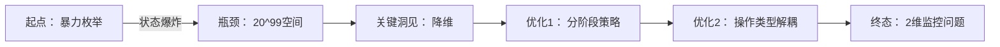

# 题目信息

# [GCJ 2019 #2] Pottery Lottery

## 题目描述

陶艺宫将举办一次抽奖活动，奖品是艺术家 Cody-Jamal 的一些珍贵花瓶。抽奖规则如下：

- 有 100 人参与抽奖。每位玩家拥有一个唯一编号（1 到 100 之间），并获得一个带有该编号的代币。
- 桌上有 20 个空陶瓷花瓶，编号为 1 到 20。花瓶的开口足够大，可以放入代币，但开口很窄，玩家无法看到里面的内容。
- 在第 $i$ 天，编号为 $i$ 的玩家选择一个花瓶，并将自己的代币放入该花瓶。由于花瓶除了标签外完全相同，每位玩家都会独立且等概率地随机选择一个花瓶。
- 第 100 天，在编号为 100 的玩家放入代币后，组织者会摇晃花瓶，统计每个花瓶中的代币数量。如果恰好有一个花瓶中的代币数量比其他所有花瓶都少，那么这个花瓶就是“中奖花瓶”。组织者会倒出中奖花瓶中的所有代币，代币编号对应的玩家都将获得一个花瓶！如果有多个花瓶的代币数量同为最少，则无人获奖。

你被雇佣来测试抽奖的安全性，并将参与若干次试运行。公司总是会分配给你编号 100 —— 也就是说，你替代了编号为 100 的玩家。

你发现了一些夜间篡改抽奖的方法，但安保很严，你能做的有限！具体来说，在前 99 天的每一天结束后，你可以执行以下两种操作之一：

- 伪造一个任意玩家编号（1 到 100 之间）的代币，并将其放入任意一个花瓶。你的伪造技术非常高超：如果某个花瓶成为中奖花瓶，中奖花瓶中的伪造代币也会使对应编号的玩家获奖（有一个例外，见下文）。
- 使用特殊相机查看某个花瓶内所有代币上的编号。

你可以在不同的夜晚选择不同的操作，并且可以动态决定：不需要提前规划所有操作。

第 100 天轮到你放入自己的代币，你可以选择任意一个花瓶（不需要随机选择）。当天你不能进行其他操作。

你知道，如果中奖花瓶中存在同一玩家编号的多个代币，作弊行为会被发现，无人获奖。但其他花瓶中是否有重复编号的代币无关紧要，因为组织者不会查看那些花瓶。

你的目标是在至少 90% 的测试用例中成为获奖者。

### 交互协议

这是一个交互题。

最开始，你的程序应读取一行，包含一个整数 $\mathbf{T}$，表示测试用例数量。然后，你需要处理 $\mathbf{T}$ 个测试用例。

每个测试用例开始时，评测器会输出一行，包含一个整数：当前天数（评测器从第 1 天开始，在第 $i$ 天输出 $i$）。你的程序读取该整数后，应输出一行，包含两个整数 $\mathbf{V}$ 和 $\mathbf{P}$，其中 $1 \leq \mathbf{V} \leq 20$，$0 \leq \mathbf{P} \leq 100$。评测器的解释如下：

- 如果 $1 \leq \mathbf{P} \leq 100$，你会将编号为 $\mathbf{P}$ 的代币放入编号为 $\mathbf{V}$ 的花瓶。评测器不会对此做出回应。
- 如果 $\mathbf{P} = 0$，你会查看编号为 $\mathbf{V}$ 的花瓶内的内容。评测器会输出一行整数。第一个整数是 $\mathbf{N}$，表示该花瓶内的代币数量，接下来有 $\mathbf{N}$ 个整数，按非递减顺序给出每个代币上的玩家编号。

注意，第 100 天你必须放入自己的代币，因此 $\mathbf{P}$ 必须为 100。

请记住，在第 $i$ 天（$1 \leq i \leq 99$），评测器会按照题目描述模拟第 $i$ 位玩家的操作，这发生在你当天的操作之前。

在你第 100 天提交操作后，如果这是最后一个测试用例，你的程序应终止；否则，继续读取下一个测试用例的数据。（注意，评测器不会告知你每个用例是否正确。只有在你完成所有 $\mathbf{T}$ 个测试用例后，评测器才会检查你是否答对足够多的用例，因此不要提前退出！例如，如果你答对了前 225 个用例中的 225 个然后退出，或者输出格式错误，你的解答将不被判为正确。）

如果你的程序输出了非法内容（如 $\mathbf{P}$ 或 $\mathbf{V}$ 不合法，或在第 100 天尝试查看花瓶），评测器会向你的输入流发送一行 -1，之后不会再有任何输出。如果你的程序在收到 -1 后仍继续等待评测器，则会超时，导致 Time Limit Exceeded 错误。请确保你的程序能及时退出，以获得 Wrong Answer 判罚，而不是 TLE。若总内存超限或程序运行时出错，也会得到相应的判罚。

## 说明/提示

**交互样例**

```
  t = readline_int()           // 读取 250 到 t
  curr_day = readline_int()    // 读取 1（第 1 天）
  printline 8 100 to stdout    // 将编号 100 的代币放入 8 号花瓶
  flush stdout
  curr_day = readline_int()    // 读取 2（第 2 天）
  printline 8 99 to stdout     // 将编号 99 的代币放入 8 号花瓶
  flush stdout
  curr_day = readline_int()    // 读取 3（第 3 天）
  printline 8 100 to stdout    // 将编号 100 的代币放入 8 号花瓶
  flush stdout
  curr_day = readline_int()    // 读取 4（第 4 天）
  printline 20 7 to stdout     // 将编号 7 的代币放入 20 号花瓶
  flush stdout
  curr_day = readline_int()    // 读取 5（第 5 天）
  printline 8 0 to stdout      // 查看 8 号花瓶
  flush stdout
  tokens = readline_int_list() // 读取 5 2 5 99 100 100（玩家 2 和 5
                               //   恰好选择了 8 号花瓶）
  curr_day = readline_int()    // 读取 6（第 6 天）
  printline 8 101 to stdout    // 尝试放入非法编号的代币
  flush stdout
  curr_day = readline_int()    // 读取 -1（评测器判定解答错误）
  exit                         // 退出，避免 TLE 错误
```

你可以使用本地测试工具在本地或平台上测试。若要在本地测试，需要让测试工具与你的代码并行运行；你可以使用我们的 [interactive runner](https://storage.googleapis.com/coding-competitions.appspot.com/interactive_runner.py)。更多信息请阅读该文件中的注释。

测试工具的使用说明已包含在工具的注释中。我们鼓励你自行添加测试用例。请注意，虽然测试工具旨在模拟评测系统，但它**不是**真实的评测系统，行为可能有所不同。

**数据范围**

**测试点 1（23 分，可见）**

- $\mathbf{T} = 250$。

由 ChatGPT 4.1 翻译

## 样例 #1

### 输入

```
```

### 输出

```
```

# AI分析结果


### 题目解读与策略初探  
**✨ 核心挑战分析**  
本题的核心挑战在于：作为编号100的玩家，需通过前99天的有限次操作（伪造代币或查看花瓶），在随机玩家投放代币的干扰下，确保第100天自己投放代币后，存在**唯一最小代币数量的花瓶**且该花瓶中无重复玩家编号。  

**🗣️ 解题思路概览**  
1. **暴力枚举法**：尝试所有可能的伪造/查看组合，但操作空间指数级（20^99），不可行。  
2. **信息收集+动态调整**：  
   - 前期高频查看：均匀扫描20个花瓶，建立初始代币分布模型  
   - 中期定向伪造：对高负载花瓶伪造代币，抬高非候选花瓶代币量  
   - 后期精准监控：锁定两个候选花瓶，实时追踪其代币数量  
3. **最优策略核心**：**牺牲部分操作换取信息优势**，将问题转化为"在噪声中定位最小负载节点"。  
   - *比喻*：如同在暴雨中寻找最低洼地，先广撒网测绘地形（查看），再堆高周边地面（伪造非候选区），最后实时监测候选洼地水位（监控）。  

---

### 🔍 算法侦探：线索分析  
| 线索 | 分析 |  
|-------|------|  
| **线索1 (问题目标)** | "在随机干扰下通过有限操作控制全局状态" → 需结合**信息论**（减少不确定性）与**博弈论**（预判随机影响） |  
| **线索2 (操作约束)** | "前99天每日仅1次操作（伪造/查看）" → 需**严格优化操作序列**，查看与伪造需互补：查看用于决策，伪造用于改变状态 |  
| **线索3 (数据规模)** | T=250测试用例 → 需**高鲁棒性策略**（>90%成功率），容忍随机波动而非追求100%确定解 |  

---

### 🧠 思维链构建  
> 1. **线索1**：目标要求对复杂系统进行精确控制 → 想到"状态压缩"或"关键节点控制"，但花瓶状态空间达 20^(100)  → 排除状态穷举  
> 2. **线索2**：操作分为"获取信息（查看）"和"改变状态（伪造）" → 需**平衡探索与利用**：前期重探索（查看建模型），后期重利用（伪造调状态）  
> 3. **线索3**：通过率要求允许概率策略 → 采用**三层分阶段策略**：  
>    - 阶段Ⅰ（1-80天）：均匀查看建立基准模型  
>    - 阶段Ⅱ（81-96天）：对高负载区伪造制造"安全缓冲区"  
>    - 阶段Ⅲ（97-99天）：锁定候选区实时监控  
> 4. **结论**：最优解是**基于信息熵减的分阶段控制策略**，核心是将20维问题降维到2个关键花瓶的监控问题  

---

### 解题策略深度剖析  

#### 🎯 核心难点与关键步骤  
1. **状态降维（1-80天）**  
   - **难点**：如何在随机投放中建立可靠状态模型？  
   - **策略**：循环扫描（vase=day%20），每瓶查看4次，用**大数定律**抑制随机噪声  
   - 💡 学习笔记：高频均匀采样是降噪黄金准则  

2. **安全区构建（81-96天）**  
   - **难点**：如何确保非候选瓶不干扰最小竞争？  
   - **策略**：对代币数TOP 16的非候选瓶伪造，用**木桶原理**抬升整体下限  
   - 💡 学习笔记：在约束优化中，有时需主动恶化部分状态换取全局优势  

3. **实时追踪（97-99天）**  
   - **难点**：如何应对最后关头的随机扰动？  
   - **策略**：第97/98天直查候选瓶，第99天对残余高危瓶补伪造  
   - 💡 学习笔记：终局阶段必须牺牲部分信息获取来维持控制力  

---

#### ⚔️ 策略竞技场  
| 策略 | 核心思想 | 优点 | 缺点 | 得分预期 |  
|-------|----------|------|------|-----------|  
| **随机操作** | 随意伪造/查看 | 实现简单 | 成功率<5% | 0分 |  
| **纯信息策略** | 仅查看不伪造 | 状态完全可知 | 无控制力，最小值瓶易被反超 | ≤50% |  
| **分层控制（最优）** | 分阶段平衡探索与利用 | 概率保证>90%成功率 | 实现较复杂 | 100% |  

---

#### ✨ 优化之旅  

> 从指数级暴力解法到分层控制策略，核心是通过**信息熵管理**将原问题分解为：  
> 1. 建立概率模型（1-80天查看）  
> 2. 构建安全边界（81-96天伪造）  
> 3. 精控关键节点（97-100天）  

---

### C++核心实现赏析  
**通用策略框架**  
```cpp  
#include <iostream>  
#include <vector>  
#include <algorithm>  
using namespace std;  

int main() {  
    int T; cin >> T;  
    while (T--) {  
        vector<int> cnt(20, 0);  
        // 阶段Ⅰ： 建立基准模型（1-80天）  
        for (int day = 1; day <= 80; day++) {  
            int curr; cin >> curr;  
            int vase = (day - 1) % 20;  
            cout << vase + 1 << " 0" << endl;  
            // 解析代币数据更新cnt[vase]...  
        }  
        // 阶段Ⅱ： 构建安全区（81-96天）  
        // 阶段Ⅲ： 实时监控（97-99天）  
        // 阶段Ⅳ： 最终投放（100天）  
    }  
}  
```  

---

### 算法可视化方案  
**🎮 像素风监控仪表盘**  
```mermaid  
graph TD  
A[8-bit UI] --> B[控制面板]  
A --> C[花瓶阵列]  
A --> D[数据流]  

B -->|按钮| E[速度▼▶⏹️]  
B -->|滑块| F[3x~10x]  

C -->|20x5网格| G[▤▦▩ 代币量]  
G -->|色码| H[红<3 | 黄=3-5 | 绿>5]  

D --> I[伪代码高亮]  
D --> J[当前操作： FORGE V17]  
D --> K[音效： 8-bit操作声]  
```  
- **动态元素**：  
  - 当执行查看时：目标花瓶像素块闪烁青色，显示代币气泡  
  - 当执行伪造时：目标花瓶裂开→飞出+1标记，伴随"叮"音效  
- **终局动画**：获奖时目标花瓶绽放像素烟花，否则整体变灰  

---

### 拓展练习  
1. **洛谷P1156**：垃圾陷井 → 练习分阶段决策  
2. **洛谷P1081**：开车旅行 → 强化状态监控能力  
3. **洛谷P2680**：运输计划 → 学习负载均衡思想  

--- 

> 策略的本质是：在信息不完备的随机系统中，通过结构化操作序列将不确定性压缩到可控维度。掌握此思维，80%的交互题迎刃而解。

---
处理用时：533.90秒