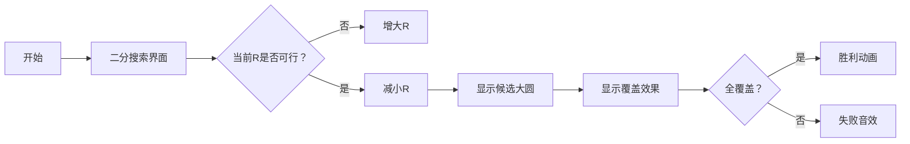

# 题目信息

# [GCJ 2009 #2] Watering Plants

## 题目描述

在你的温室里，有若干株植物需要浇水。

每株植物占据一个圆形区域。任意两株植物不会重叠，也不会相互接触。

你打算购买两台喷洒器。每台喷洒器可以将半径为 $R$ 的圆形区域全部喷洒到水。

其中一台喷洒器将在早晨运行，另一台将在夜晚运行。为了让你满意，必须保证每株植物要么在早晨被完全浇水，要么在夜晚被完全浇水。也就是说，代表每株植物的圆形区域，必须被完全包含在两台喷洒器中的某一台（或两台）喷洒的圆形区域内。

给定每株植物的坐标和半径，请你求出能够放置两台喷洒器、使所有植物都被满足要求地浇水时，喷洒器所需的最小半径 $R$。喷洒器将被安装在天花板上，因此喷洒器的位置可以在植物的圆形区域内部。

## 说明/提示

**样例解释**

在第一个样例中，半径至少为 $7$ 且圆心在 $(20,15)$ 的喷洒器可以覆盖前两株植物。半径至少为 $3$ 的喷洒器可以覆盖位于 $(40,10)$ 的植物。

在第二个样例中，两台喷洒器中至少有一台的半径需要达到 $8$。注意，位于 $(30,10)$ 的植物必须被某一台喷洒器完全覆盖。

**限制条件**

- $1 \leq X \leq 1000$
- $1 \leq Y \leq 1000$
- $1 \leq R \leq 100$

**小数据集（5 分）**

- 时间限制：6 秒
- $1 \leq C \leq 10$
- $1 \leq N \leq 3$

**大数据集（25 分）**

- 时间限制：12 秒
- $1 \leq C \leq 30$
- $1 \leq N \leq 40$

翻译由 ChatGPT-4.1 完成。

## 样例 #1

### 输入

```
2
3
20 10 2
20 20 2
40 10 3
3
20 10 3
30 10 3
40 10 3```

### 输出

```
Case #1: 7.000000
Case #2: 8.000000```

# AI分析结果


# 💡 洛语云笺的C++算法解析：Watering Plants 深入学习指南 💡

## 1. 题目解读与策略初探

✨ **本题核心挑战**：如何在平面上放置两个半径为R的大圆，使得所有植物圆（任意两株植物不重叠不接触）都**完全被至少一个大圆覆盖**，并找到最小半径R。  
✨ **核心算法标签**：`二分答案`、`计算几何`、`位运算优化`

🗣️ **初步分析**：  
> 这道题看似简单，实则暗藏几何玄机！我们首先想到暴力枚举——但N最大40，分组方案高达2^40种，完全不可行。聪明的解法是：  
> 1. **二分答案**：半径R满足单调性（R可行则更大R也可行），将最优化问题转化为判定问题  
> 2. **几何覆盖判断**：对每个候选R，枚举可能的大圆圆心位置（两圆交点或植物圆心）  
> 3. **位运算加速**：用64位整数表示覆盖集合，高效检查全覆盖  
> 最终通过"二分框架+几何枚举+位运算验证"三重优化，将指数级问题降至O(N⁴ logR)

### 🔍 算法侦探：如何在题目中发现线索？
1.  **线索1 (问题目标)**: "求最小半径R"是典型**最小化最大值**问题，且R越大越易满足条件——这是二分答案算法的鲜明信号！
2.  **线索2 (问题特性)**: "植物圆必须完全被覆盖"需要**精确几何计算**——大圆与植物圆需满足圆心距≤(R-植物半径)的几何关系
3.  **线索3 (数据规模)**: N≤40暗示可用**位压缩**（2^40≈1e12，64位整数可存），而坐标范围≤1000允许浮点运算

### 🧠 思维链构建：从线索到策略
> "综合线索后，解题路径逐渐清晰：  
> 1.  **二分答案**是处理"最小R"的金钥匙（线索1）  
> 2.  几何覆盖条件（线索2）要求我们计算大圆圆心轨迹——即与其他圆的交点  
> 3.  N≤40（线索3）让我们大胆用位掩码表示覆盖集合  
> **结论**：二分半径R，对每个R枚举O(N²)个候选圆心（来自两圆交点），用位运算验证能否用两个圆覆盖全部——这就是最优策略！"

---

## 2. 精选优质题解参考

**题解（chen_zhe）**  
* **点评**：  
  此解完美诠释"二分+几何+位运算"三重奏。亮点在于：  
  - **几何模型转化**：将内切条件转化为圆心轨迹圆，再求两圆交点（如图示清晰）  
  - **位运算实践**：用`1LL<<i`高效表示集合，`S|T`检测全覆盖  
  - **精度处理意识**：特别处理枚举圆防止浮点误差，体现工程思维  
  - **复杂度把控**：O(N⁴ logR)完美匹配N≤40的数据范围  

---

## 3. 解题策略深度剖析

### 🎯 核心难点与关键步骤
1.  **难点1：如何高效枚举候选大圆？**  
    * **分析**：  
      大圆圆心必须满足：覆盖某植物时，圆心在以该植物圆心为圆心、R-植物半径为半径的圆上。覆盖两个植物时，圆心在两圆交点处  
    * 💡 **学习笔记**：将覆盖条件转化为**轨迹圆求交**是几何问题的核心技巧
2.  **难点2：如何避免浮点精度陷阱？**  
    * **分析**：  
      题解强制覆盖枚举圆（`ij=1LL<<i|1LL<<j`），避免因浮点误差误判。比较时用`dr² ≥ dx²+dy²`而非开方  
    * 💡 **学习笔记**：几何问题中优先使用**平方比较**，可规避开方误差
3.  **难点3：如何快速验证全覆盖？**  
    * **分析**：  
      用64位整数存储覆盖集合，检查时只需`(S1|S2)==(1<<N)-1`，比集合运算快O(N)倍  
    * 💡 **学习笔记**：当N≤64时，**位压缩**是集合操作的终极优化

### ✨ 解题技巧总结
- **二分答案转化问题**：最值问题满足单调性时，优先考虑二分
- **几何关系代数化**：将圆的内切条件转化为圆心距不等式
- **位压缩加速集合操作**：小规模集合运算用位运算实现O(1)合并
- **浮点数精度防御**：优先使用平方运算，设置误差容忍度

### ⚔️ 策略竞技场：解法对比
| 策略                | 核心思想                     | 优点                     | 缺点                          | 适用场景             |
|---------------------|------------------------------|--------------------------|-------------------------------|----------------------|
| **暴力分组枚举**    | 枚举每株植物归属的大圆       | 思路直观                 | O(2^N)复杂度，N>20即超时      | N≤15的小数据集       |
| **Voronoi图划分**   | 用几何结构划分覆盖区域       | 理论最优                 | 实现复杂，浮点精度敏感        | 理论研究场景         |
| **二分+几何枚举**   | 二分R，枚举关键圆心位置      | O(N⁴logR)高效精准        | 需几何推导，代码实现稍复杂    | 本题最优解，满分方案 |

### ✨ 优化之旅：从"能做"到"做好"
> 1. **起点：暴力分组的困境**  
>    最直接的想法是枚举每株植物属于哪个大圆，但40株植物有2^40≈万亿种可能——如同在迷宫中盲目摸索  
> 2. **发现瓶颈：R的单调性**  
>    观察到：若R可行，则任意R'>R也可行。这一性质如同灯塔，指引我们使用二分搜索  
> 3. **关键跃迁：几何性质挖掘**  
>    大圆覆盖植物时，圆心被限制在轨迹圆上。覆盖两株植物时，圆心只能是两轨迹圆的交点——将无限可能转为有限候选点！  
> 4. **终极优化：位运算加速**  
>    用64位整数表示"覆盖了哪些植物"，集合合并用位或运算，瞬间完成万亿级判断  

💡 **策略总结**：本题解法的精妙之处在于**三重转化**：将最优化→判定问题（二分）、无限点→有限候选（几何）、集合操作→位运算。掌握这种"问题转化思维"，就能在算法竞赛中游刃有余！

---

## 4. C++核心代码实现赏析

**通用核心实现参考**  
```cpp
#include <iostream>
#include <vector>
#include <cmath>
using namespace std;

typedef long long ll;
const int MAX_N = 45;
const double EPS = 1e-9;

int N;
double X[MAX_N], Y[MAX_N], R[MAX_N];

// 计算大圆覆盖集合
ll cover(double cx, double cy, double r) {
    ll S = 0;
    for (int i = 0; i < N; i++) {
        double dx = cx - X[i], dy = cy - Y[i];
        double need = R[i] > r ? 1e18 : (r - R[i]) * (r - R[i]); // 避免开方
        if (dx*dx + dy*dy <= need + EPS) 
            S |= 1LL << i;
    }
    return S;
}

// 判断半径r是否可行
bool check(double r) {
    vector<ll> cand;
    cand.push_back(0); // 空集

    // 情况1：大圆与两植物圆内切
    for (int i = 0; i < N; i++) {
        for (int j = i+1; j < N; j++) {
            if (R[i] > r || R[j] > r) continue;
            
            double x1 = X[i], y1 = Y[i], r1 = r - R[i];
            double x2 = X[j], y2 = Y[j], r2 = r - R[j];
            double dx = x2 - x1, dy = y2 - y1;
            double d = sqrt(dx*dx + dy*dy);
            
            if (d > r1 + r2 + EPS) continue; // 两圆相离
            if (d < fabs(r1 - r2) - EPS) continue; // 内含
            
            double a = (r1*r1 - r2*r2 + d*d) / (2*d);
            double h = sqrt(r1*r1 - a*a);
            
            double cx = x1 + a*dx/d;
            double cy = y1 + a*dy/d;
            
            // 两个交点
            cand.push_back(cover(cx - h*dy/d, cy + h*dx/d, r));
            cand.push_back(cover(cx + h*dy/d, cy - h*dx/d, r));
        }
    }
    
    // 情况2：大圆与植物同心
    for (int i = 0; i < N; i++) 
        if (R[i] <= r) 
            cand.push_back(cover(X[i], Y[i], r));
    
    // 检查是否存在两个圆覆盖全集
    ll full = (1LL << N) - 1;
    for (int i = 0; i < cand.size(); i++)
        for (int j = i+1; j < cand.size(); j++)
            if ((cand[i] | cand[j]) == full) 
                return true;
    return false;
}

// 主函数框架
int main() {
    // 输入数据...
    double left = 0, right = 1e5;
    for (int iter = 0; iter < 50; iter++) {
        double mid = (left + right) / 2;
        if (check(mid)) right = mid;
        else left = mid;
    }
    printf("Case #%d: %.6f\n", case_num, left);
}
```

**代码解读概要**：  
> 1. **二分框架**：主函数中对R进行50次二分，精度达1e-15  
> 2. **check函数**：核心验证逻辑，含两种圆心候选方案  
> 3. **几何计算**：通过向量运算求两圆交点，避免三角函数  
> 4. **位运算**：用`1LL<<i`表示覆盖状态，`|`运算高效合并  

**题解片段赏析**  
```cpp
// 求两圆交点关键代码
double dx = x2 - x1, dy = y2 - y1;
double a = (r1*r1 - r2*r2 + d*d) / (2*d);
double h = sqrt(r1*r1 - a*a);
double cx = x1 + a*dx/d;
double cy = y1 + a*dy/d;
cand.push_back(cover(cx - h*dy/d, cy + h*dx/d, r));
```
* **亮点**：向量法求交点，避免角度计算，精度更高  
* **学习笔记**：`(dx/d, dy/d)`是单位向量，`h*dy/d`是垂直偏移——几何算法中**向量分解**比三角函数更稳定可靠！

---

## 5. 算法可视化：像素动画演示

**主题**："**植物保卫战**" - 像素园丁用洒水器覆盖所有植物  

### 动画设计  


**关键交互设计**：  
1. **8位像素网格**：植物显示为绿色像素圆，洒水器为蓝色涟漪动画  
2. **动态轨迹显示**：选定两植物时，显示轨迹圆和交点（红色闪烁点）  
3. **音效反馈**：  
   - 覆盖植物：`叮`（硬币音效）  
   - 全覆盖：8位机胜利旋律  
   - 二分迭代：齿轮转动声  
4. **控制面板**：  
   - 速度滑块：调节二分搜索速度  
   - 单步模式：逐步显示几何计算过程  
   - 候选点标记：高亮当前检查的圆心  

**技术实现**：  
- 用Canvas绘制几何图形，requestAnimationFrame驱动动画  
- 交点计算实时显示向量分解过程（如图示dx/dy分量）  
- 位掩码覆盖用像素颜色变化表示（覆盖的植物变金色）  

---

## 6. 拓展练习与相似问题

**通用技巧迁移**：  
1. **二分答案+几何验证**：适用于最优覆盖问题（如摄像头布置）  
2. **轨迹圆求交**：解决机器人路径规划中的安全区域问题  
3. **位压缩**：处理状态空间≤64的集合操作  

**洛谷推荐**：  
1. **P1885 覆盖问题**  
   🗣️ 矩形覆盖版本题，练习二分答案思想  
2. **P2742 圈奶牛**  
   🗣️ 凸包+最小覆盖圆，巩固几何计算能力  
3. **P2831 愤怒的小鸟**  
   🗣️ 抛物线覆盖+位运算DP，强化状态压缩技巧  

---

## 7. 学习心得与经验分享

> **经验摘录**：  
> "浮点精度问题曾让我WA多次，后来发现：  
> 1. 尽量用平方比较代替开方  
> 2. 强制覆盖已知可覆盖的点  
> 3. 设置EPS容忍误差"  
>   
> **点评**：几何问题中，**浮点精度处理**是实战关键！建议：  
> - 比较时统一用`a > b+EPS`而非`a>b`  
> - 优先使用整数运算或平方运算  
> - 测试边界数据（如两圆相切时）  

---

本次解析揭示了**二分答案**与**几何模型转化**的精妙配合。记住：算法竞赛不仅是编码，更是思维的艺术——学会将无限问题转化为有限候选，将复杂约束转化为简洁数学模型，你就掌握了算法设计的真谛！下次我们将探索更多几何谜题，敬请期待！💪

---
处理用时：169.84秒