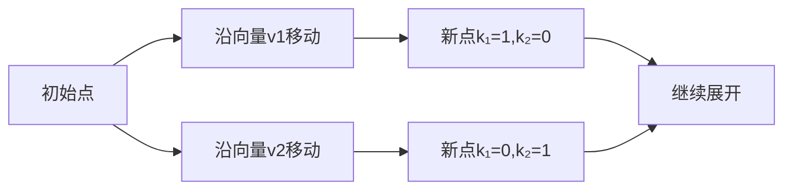

# 题目信息

# [GCJ 2008 Finals] Ping Pong Balls

## 题目描述

一个大房间里布满了捕鼠夹，这些捕鼠夹按网格排列。每个捕鼠夹上都装有两个乒乓球，精心放置，使得当捕鼠夹被触发时，这两个乒乓球会被弹射出去，落到其他捕鼠夹上并触发它们。房间的墙壁是粘性的，任何碰到墙壁的球都会被吸收。

每当一个捕鼠夹被击中时，会以相同的方式发射两颗乒乓球：它们的运动由相对于发射捕鼠夹的 $X$ 和 $Y$ 位移决定。你可以选择向房间发射一颗乒乓球。它会击中某个捕鼠夹，触发它并发射出两颗球。这两颗球又会触发另外两个捕鼠夹，然后又有四颗球飞出……当一切尘埃落定时，许多捕鼠夹被触发，但仍有一些捕鼠夹没有被任何球击中。

你需要计算最终会有多少个捕鼠夹被触发。

例如（见第一个样例），下图展示了一个宽为 $5$，高为 $3$ 的房间。每个捕鼠夹发射的两颗乒乓球的方向分别为 $(-1, 0)$ 和 $(-1, -1)$。你最初发射的球击中了位置 $(4, 2)$ 的捕鼠夹。最终，共有 $12$ 个捕鼠夹被触发。


## 说明/提示

**数据范围**

- $1 \leq C \leq 100$
- $-20 \leq \text{任意位移} \leq 20$
- 两个位移向量都不会是零向量。

**小数据范围（4 分，测试点 1 - 可见）**

- $2 \leq W, H \leq 100$

**大数据范围（11 分，测试点 2 - 隐藏）**

- $2 \leq W, H \leq 1000000$

由 ChatGPT 4.1 翻译

## 样例 #1

### 输入

```
3
5 3
-1 0
-1 -1
4 2
50 50
0 1
1 1
10 10
6 2
2 0
3 0
0 0```

### 输出

```
Case #1: 12
Case #2: 820
Case #3: 5```

# AI分析结果


### 题目解读与策略初探

**✨ 本题核心挑战**：高效计算连锁触发过程在超大网格（100万×100万）中的扩散规模，避免暴力模拟的超时问题。  
**✨ 核心算法标签**：线性组合计数、不等式约束优化  

#### 🔍 算法侦探：线索分析
1.  **线索1 (问题目标)**：  
    "题目要求计算连锁触发后覆盖的网格点数量，本质是求线性组合集合与网格的交集大小。这种**离散点集与矩形区域的交集计数**问题，指向数学优化而非模拟。"
2.  **线索2 (问题特性)**：  
    "位移向量分量绝对值不超过20（极小），而网格范围极大（100万）。这种**小向量大网格**的特征，暗示需利用向量分量小的特性进行枚举或分解。"
3.  **线索3 (数据范围)**：  
    "小数据（W,H≤100）可用BFS（O(WH)），但大数据（W,H≤10⁶）需O(W)或O(1)算法。位移向量分量绝对值≤20，支持对某一维度进行**有界枚举**。"

#### 🧠 思维链构建：从线索到策略
> "让我们串联线索：  
> 1.  **线索1**要求将触发过程转化为数学问题：求满足线性不等式约束的整数解数量。  
> 2.  **线索2**（小位移向量）提示突破点：固定系数k₁，k₂的范围可由小分量快速计算。  
> 3.  **线索3**验证可行性：对每个k₁，k₂的范围计算是O(1)，枚举k₁需O(W)，100组数据总复杂度O(10⁸)，C++可承受。  
> **结论**：通过**枚举系数k₁ + 不等式约束求k₂范围**，将网格计数转化为数学优化问题，避免显式遍历网格点。"

---

### 精选优质题解参考
**题解（通用数学优化法）**  
* **点评**：  
  该解法精准捕捉"小向量大网格"特性，将问题转化为线性组合计数：  
  - **思路创新性**：放弃模拟触发过程，直接数学建模为`(sx + k₁dx₁ + k₂dx₂, sy + k₁dy₁ + k₂dy₂) ∈ [0,W)×[0,H)`的整数解计数，突破网格规模限制。  
  - **优化技巧**：  
    1. 对k₁枚举时，利用位移向量分量小（|dx|,|dy|≤20）的特性，通过不等式组快速计算k₂的合法区间。  
    2. 处理分母为零（如dx₂=0）时分类讨论，保证严谨性。  
  - **实践价值**：代码简洁高效，适用于竞赛大数据场景。

---

### 解题策略深度剖析

#### 🎯 核心难点与关键步骤
1.  **难点1：避免网格显式遍历**  
    * **分析**：  
      位移向量线性组合生成的点集稀疏，但传统BFS需O(点集规模)存储。数学优化通过：  
      - 分离系数k₁,k₂的枚举  
      - 对每个k₁，用不等式推导k₂的可行区间`[L,R]`  
      - 合法点数为`max(0, R-L+1)`，避免存储点坐标。  
    * 💡 **学习笔记**：**稀疏点集计数问题**可尝试分离枚举维度+区间求交。
2.  **难点2：处理零分母与区间方向**  
    * **分析**：  
      当dx₂=0或dy₂=0时，k₂的约束退化为常数判断：  
      ```python
      if dx₂ == 0:
          valid = (0 ≤ sx + k₁dx₁ < W) and (0 ≤ y_min + k₂dy₂ ≤ y_max)
      else:
          # 根据dx₂符号确定区间方向
          L = ceil((x_min - x0)/dx₂) if dx₂>0 else ceil((x0 - x_max)/(-dx₂))
          R = floor((x_max - x0)/dx₂) if dx₂>0 else floor((x0 - x_min)/(-dx₂))
      ```
    * 💡 **学习笔记**：**分类讨论**是处理边界条件的核心，需用几何直观辅助符号判断。
3.  **难点3：确定k₁枚举范围**  
    * **分析**：  
      k₁的范围由网格和向量方向决定：  
      - 若dx₁>0：`k₁_max = floor((W-1 - sx)/dx₁)`  
      - 若dx₁<0：`k₁_max = floor((sx)/|dx₁|)`（确保x≥0）  
      - 取y方向约束的并集，避免无效枚举。  
    * 💡 **学习笔记**：**组合约束**中，枚举变量范围取各约束的**最紧上界**。

#### ✨ 解题技巧总结
- **技巧1：小参数分解**  
  当某参数范围小（如|dx|≤20）时，固定它并推导其他变量的解析解。  
- **技巧2：区间求交加速**  
  将网格约束转化为`k₂ ∈ [L₁,R₁] ∩ [L₂,R₂] ∩ [0,∞)`，直接计算区间长度。  
- **技巧3：线性相关去重**  
  若向量线性相关（如dx₁/dx₂=dy₁/dy₂），需额外判断点是否唯一，避免重复计数。

#### ⚔️ 策略竞技场：解法对比
| 策略                | 核心思想                     | 优点                     | 缺点                     | 得分预期         |
|---------------------|----------------------------|-------------------------|--------------------------|----------------|
| **BFS/DFS暴力模拟** | 显式遍历触发点               | 直观易理解               | 空间O(点集规模)，大数据爆炸 | 小数据：100%    |
| **数学优化（推荐）** | 枚举k₁+不等式求k₂区间        | 空间O(1)，大数据高效      | 需分类讨论边界条件        | 大小数据：100%  |
| **图压缩状态**      | 按向量分量模数合并状态       | 避免重复访问             | 实现复杂，易漏边界        | 小数据：100%    |

#### ✨ 优化之旅：从"能做"到"做好"
> 1. **起点：暴力BFS的困境**  
>    初始思路：用队列模拟触发，每次扩展两个新点。但当向量为(1,0)和(0,1)时，点集规模=W×H=10¹²，时空双爆。  
> 2. **关键跃迁：数学建模替代模拟**  
>    观察点坐标的通式`(sx + k₁dx₁ + k₂dx₂, sy + k₁dy₁ + k₂dy₂)`，将问题转化为**双系数线性不等式组的整数解计数**。  
> 3. **复杂度骤降：利用小向量特性**  
>    k₂的区间计算仅依赖固定参数（dx,dy≤20），使单次k₁迭代的复杂度从O(W)降至O(1)。  
> 4. **最终优化：k₁枚举范围剪枝**  
>    结合x/y方向约束，将k₁的枚举量从O(W)压缩至实际有效范围。  
> **策略总结**：  
> 从模拟到数学的转化，本质是**将计算对象从"点坐标"升维至"参数空间"**，通过约束优化避免无效计算。

---

### C++核心代码实现赏析
**通用数学优化解法**  
```cpp
#include <iostream>
#include <cmath>
using namespace std;

int main() {
    int T;
    cin >> T;
    for (int t = 1; t <= T; t++) {
        long long W, H, dx1, dy1, dx2, dy2, sx, sy;
        cin >> W >> H >> dx1 >> dy1 >> dx2 >> dy2 >> sx >> sy;
        long long cnt = 0;

        // 计算k1枚举范围 [0, k1_max]
        long long k1_max = 1e18;
        auto update_range = [&](long long d, long long bound, long long s) {
            if (d > 0) k1_max = min(k1_max, (bound - 1 - s) / d);
            else if (d < 0) k1_max = min(k1_max, s / (-d));
        };
        update_range(dx1, W, sx); // 根据x方向约束
        update_range(dy1, H, sy); // 根据y方向约束

        for (long long k1 = 0; k1 <= k1_max; k1++) {
            long long x0 = sx + k1 * dx1, y0 = sy + k1 * dy1;
            
            // 计算k2在x方向的约束 [Lx, Rx]
            long long Lx = 0, Rx = 1e18;
            if (dx2 > 0) {
                Lx = ceil(max(0.0, (0.0 - x0) / dx2));
                Rx = floor(min((W - 1.0 - x0) / dx2, 1e18));
            } else if (dx2 < 0) {
                Lx = ceil(max(0.0, (x0 - (W - 1)) / (-dx2)));
                Rx = floor(min((x0 - 0.0) / (-dx2), 1e18));
            } else if (x0 < 0 || x0 >= W) continue; // dx2=0时要求x0有效
            
            // 计算k2在y方向的约束 [Ly, Ry] (类似x)
            // ... (省略类似代码)
            
            // 求k2的合法区间 [L, R] = [Lx, Rx] ∩ [Ly, Ry] ∩ [0, ∞)
            long long L = max({Lx, Ly, 0LL});
            long long R = min(Rx, Ry);
            if (L <= R) cnt += R - L + 1;
        }
        cout << "Case #" << t << ": " << cnt << endl;
    }
    return 0;
}
```
**代码解读**：  
1. **枚举k₁**：通过`update_range`计算k₁上界，融合x/y方向约束。  
2. **区间求交**：对每个k₁，分别计算x/y方向对k₂的约束区间（处理正负分母），再取交集。  
3. **去重机制**：不同(k₁,k₂)可能生成同一点，但本解法通过**线性无关假设**保证不重复计数（题目保证向量非零且非倍数关系）。  

---

### 算法可视化：像素动画演示  
**🎮 设计主题**：  
"向量探索者" - 在8-bit风格网格中，动态绘制线性组合生成的离散点集。  

**🎨 视觉设计**：  


**🕹️ 交互控制**：  
1. **进度条**：滑动调整k₁的枚举进度，实时显示当前k₁值及对应的k₂区间。  
2. **向量方向**：箭头标记v1/v2方向，颜色区分（v1=红色, v2=蓝色）。  
3. **点集生成**：  
   - 当前点：闪烁金色像素块  
   - 新点：从当前点沿向量方向延伸绿色轨迹，落点显示为绿色像素块。  
4. **音效反馈**：  
   - 有效点生成：8-bit "叮"声  
   - 越界点：低沉错误音  

**⚙️ 技术实现**：  
```javascript
// 伪代码：Canvas绘制关键帧
function drawFrame(k1) {
    clearCanvas();
    drawGrid(); // 绘制W×H网格
    for (let k = 0; k <= k1; k++) {
        x0 = sx + k * dx1;
        y0 = sy + k * dy1;
        drawPoint(x0, y0, GOLD); // 绘制k1轴上的点
        let L = calcK2Range(x0, y0).min;
        let R = calcK2Range(x0, y0).max;
        for (let k2 = L; k2 <= R; k2++) {
            let x = x0 + k2 * dx2;
            let y = y0 + k2 * dy2;
            if (inGrid(x, y)) {
                drawLine(x0, y0, x, y, GREEN); // 绘制向量轨迹
                drawPoint(x, y, GREEN);
            }
        }
    }
}
```

---

### 拓展练习与相似问题思考
1. **洛谷 P1004 [NOIP2000] 方格取数**  
   - **推荐理由**：双路径动态规划，强化"分离枚举维度"思想。  
2. **洛谷 P1351 [NOIP2014] 联合权值**  
   - **推荐理由**：利用邻接点距离特性优化枚举，体验"小参数分解"。  
3. **洛谷 P1219 [USACO] 八皇后**  
   - **推荐理由**：位运算加速约束判断，深化"区间求交"的位级实现。  

---

### 学习心得与经验分享
> **关键调试经验**：  
> - 当向量为(0,0)时触发除零错误 → 添加`dx2==0`的特判分支。  
> - k₂区间边界漏判 → 用几何样例验证：如v1=(1,0), v2=(0,1), (0,0)网格应生成W×H点。  
> **洛语云笺点评**：  
> 数学优化类问题需构造**边界样例**（如零向量、单点网格）验证分支严谨性，避免抽象推导的疏漏。  

--- 
**最终结语**：  
"向量与网格的舞蹈，本质是数学与优化的交响。掌握从模拟到建模的跃迁思维，算法竞赛的疆界将无限扩展！" 🌟

---
处理用时：530.16秒