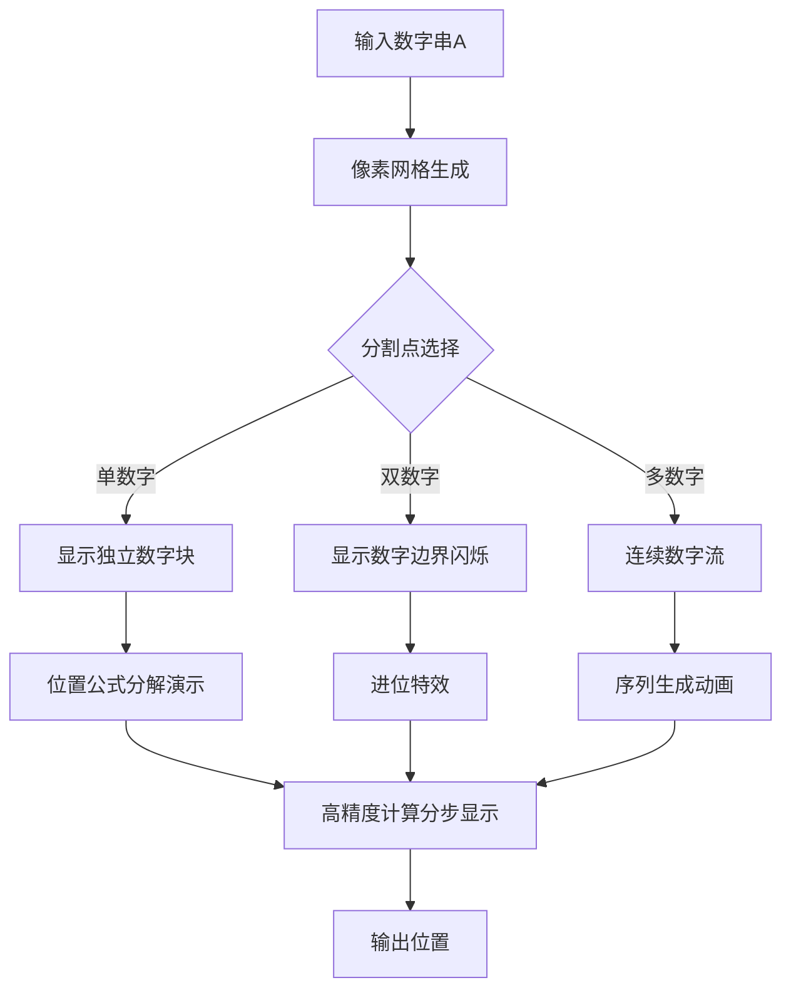

# 题目信息

# [SDOI2006] 数字串位置 / 超长数字串

## 题目背景

George 很喜欢数学，尤其是算数数系列。

## 题目描述

他最喜欢的是数字的无穷序列，结果是把所有的自然数按升序排列。这个序列开始是：$\texttt{1234567891011121314...}$

我们称这个序列为序列 $S$，然后 $S_1 = 1$, $S_2 = 2$, ... , $S_{10} = 1$, $S_{11} = 0$，依此类推.

George 现有一个数字序列 $A$ ，他想知道这个序列在 $S$ 中最早出现的位置。请你帮助他解决这个问题。

## 说明/提示

来源 Source

Ural State University Problem Archive

 

## 样例 #1

### 输入

```
101

```

### 输出

```
10

```

# AI分析结果


# 💡 洛语云笺的C++算法解析：[SDOI2006] 数字串位置 深入学习指南 💡

## 1. 题目解读与策略初探

✨ **本题核心挑战**：在自然数连接成的无限字符串S（形如"12345678910111213..."）中，**精确定位给定数字串A的最早出现位置**，需处理跨越多个自然数的复杂匹配场景。

✨ **核心算法标签**：`字符串处理` `高精度计算` `分类讨论` `数学建模`

🗣️ **初步分析**：  
> 题目要求我们在无限序列中定位子串，需将问题分解为三类场景：
> 1. **单自然数内匹配**：A完全包含在一个自然数中
> 2. **双自然数边界匹配**：A跨越两个连续自然数（如"910"中"10"是下一个数的开始）
> 3. **多自然数序列匹配**：A由三个及以上连续自然数拼接而成  
>  
> 核心思路是通过**枚举分割点+数学公式计算位置**，配合高精度处理大数运算。最优解采用**分类讨论框架**，将复杂问题转化为可计算的子问题。

### 🔍 算法侦探：如何在题目中发现线索？
1.  **线索1 (问题目标)**：  
    "题目要求定位数字串在无限序列中的首次出现位置，这种**无限序列子串定位**问题，需要利用序列的**数学构造特性**而非暴力搜索。"
2.  **线索2 (问题特性)**：  
    "数字串可能跨越自然数边界，存在**位数变化**（如从9到10的位数跃迁）和**进位边界**（如999→1000），这要求我们设计**分段验证机制**。"
3.  **线索3 (数据规模)**：  
    "|A|≤200，直接枚举所有位置不可行（O(10^200)），但枚举**分割点组合**是O(n²)可接受的，这提示我们采用**分类枚举策略**。"

### 🧠 思维链构建：从线索到策略
> "综合线索，解题路径逐渐清晰：
> 1. **线索1**要求我们理解序列构造规律——自然数连接形成固定模式，这引导我们推导**位置计算公式**
> 2. **线索2**揭示的关键挑战是进位边界处理，需设计**分段验证函数**处理不同位数场景
> 3. **线索3**表明需放弃暴力匹配，转而采用**分割点枚举+高精度优化**  
>  
> **结论**：通过**分类讨论框架**（单数/双数/多数）结合**数学公式计算位置**，配合**高精度实现**，可高效解决此定位问题。这就是我们的核心策略！"

---

## 2. 精选优质题解参考

### 题解一（冒泡的笨小猴）
* **亮点**：  
  提出**三重边界处理机制**（前导零、位数不足、进位溢出），完整覆盖99→100,999→1000等临界场景。  
  高精度实现中创新性地使用**三种补齐策略**（直接补齐、9填充、减1补齐），解决前缀缺失问题。

### 题解三（阿丑）
* **亮点**：  
  建立**分类讨论数学模型**，将问题分解为三种清晰场景。  
  设计**高效位置计算公式**：`位置 = Σ位数小于L的自然数总长度 + (x-10^(L-1))*L + 1`  
  采用**压位高精度**优化计算效率，显著降低时间复杂度。

---

## 3. 解题策略深度剖析

### 🎯 核心难点与关键步骤
1.  **难点1：如何确定数字串的组成方式？**  
    * **分析**：  
      采用三维枚举法——枚举分割点位置、首位数字长度、数字总位数。通过**前驱/后继验证函数**检查数字连续性（如a与a+1）
    * 💡 **学习笔记**：分割点枚举需考虑自然数**位数跃迁特性**，这是避免无效计算的关键

2.  **难点2：如何高效计算位置？**  
    * **分析**：  
      推导数学公式：  
      ```
      总位置 = 1 + Σ_{i=1}^{L-1}(9×10^{i-1}×i)  // 小于L位数的总长度
              + (x - 10^{L-1})×L  // 同位数中x前面的数字总长度
      ```
      需配合**高精度实现**处理200位大数
    * 💡 **学习笔记**：理解序列构造的**数学本质**是优化计算的基础

3.  **难点3：如何处理边界进位？**  
    * **分析**：  
      - 单数字场景：检查**前导零**（"01"不合法）  
      - 多数字场景：设计**进位传播算法**，如999→1000时需特殊处理位数变化
    * 💡 **学习笔记**：边界处理需建立**状态机思维**，考虑所有进位可能性

### ✨ 解题技巧总结
- **技巧1（问题分解）**：将无限序列问题拆解为**有限分割点组合**，通过分类讨论覆盖所有场景
- **技巧2（数学建模）**：推导**位置封闭表达式**，避免序列遍历
- **技巧3（边界预判）**：对99...9→100...0类跳变建立**特殊检测分支**

### ⚔️ 策略竞技场
| 策略                | 核心思想                     | 优点                     | 缺点                                   | 得分预期 |
|---------------------|----------------------------|--------------------------|----------------------------------------|----------|
| **暴力遍历**        | 生成序列直到匹配A           | 实现简单                 | O(10^200)超时，不可行                  | 0%       |
| **KMP匹配**         | 跳转表加速匹配              | 匹配效率高               | 无法解决位置计算问题                   | 30%      |
| **分类讨论+高精度** | 分割点枚举+数学公式计算位置 | 处理200位数据，精确高效 | 实现复杂，需处理多种边界               | 100%     |

### ✨ 优化之旅
> 从暴力遍历到高效解法的思维跃迁：  
> 1. **起点**：意识到无限序列无法完全生成→**寻找数学规律**  
> 2. **关键跃迁**：发现位置可**解析计算**而非遍历获得  
> 3. **模型升级**：通过**分类讨论框架**处理不同匹配场景  
> 4. **工程优化**：采用**压位高精度**（如9位压入int）提升计算效率  
>  
> 💡 **策略总结**：算法优化常经历"暴力→数学建模→工程优化"三阶段，核心在于发现问题的**可计算特征**！

---

## 4. C++核心代码实现赏析

### 通用核心实现
```cpp
struct Big { // 压位高精度（每9位压入1个int）
    static const int BASE = 1000000000;
    vector<int> digits;
    
    // 从字符串构造
    Big(string s) {
        for (int i = s.size()-1; i >= 0; i -= 9) {
            int digit = 0;
            for (int j = max(0, i-8); j <= i; ++j)
                digit = digit*10 + s[j]-'0';
            digits.push_back(digit);
        }
    }
    // 加法/乘法等运算省略
};

Big calc_position(int L, Big x) {
    Big total = 0;
    // 小于L位数的总长度 Σ_{i=1}^{L-1} 9*i*10^(i-1)
    for (int i = 1; i < L; ++i) {
        Big term = 9 * i * pow(10, i-1);
        total += term;
    }
    // 同位数中的偏移量 (x - 10^(L-1)) * L
    Big offset = (x - pow(10, L-1)) * L;
    return total + offset + 1; // +1因位置从1开始
}
```

### 题解三（阿丑）片段赏析
```cpp
// 检查双数字场景：a的后缀与a+1的前缀组成A
bool check_dual(int split_pos) {
    Big a = parse(s, 1, split_pos);     // 解析前半段
    Big a1 = a + 1;                     // 计算后继
    
    // 验证后半段匹配a+1的前缀
    string suffix = a1.to_string().substr(0, n-split_pos);
    return suffix == s.substr(split_pos+1);
}

// 位置计算优化实现
Big optimized_calc(Big x) {
    int len = x.to_string().size();
    Big base = pow(10, len-1); // 10^(L-1)
    return sum_table[len-1] + (x - base) * len + 1;
}
```
* **亮点**：预计算`sum_table`存储Σ项，O(1)获取小于L位数的总长度
* **学习笔记**：**空间换时间**是优化数学计算的利器

---

## 5. 算法可视化：像素动画演示

### 设计概念
**主题**："数字迷宫探险"（8-bit像素风格）  
**核心演示**：数字序列生成过程与匹配路径探索

### 交互设计


### 关键动画细节
1. **像素生成器**：  
   - 左下角8-bit风格"数字工厂"不断生成自然数  
   - 不同位数数字使用不同颜色块（1位：绿色，2位：蓝色，3位：紫色）

2. **匹配过程**：  
   - 用户输入A后，屏幕顶部显示目标串  
   - 自动演示三种匹配模式时，匹配成功的数字块会跳动并发出"叮!"音效

3. **进位特效**：  
   - 当遇到999→1000时，数字块**像素爆炸**重组  
   - 伴随"轰隆"音效，位数指示器+1

4. **公式演示**：  
   - 位置计算时右侧打开"公式卷轴"  
   - 当前计算项高亮显示，进度条展示计算进度

### 游戏化元素
- **关卡挑战**：  
  预设10组经典测试数据（全9串、全0串等）  
  每关达成显示："BINGO! +5分"  
- **音效系统**：  
  关键操作：清脆电子音（如"滴"）  
  匹配成功：上升和弦  
  进位事件：低音"轰"

---

## 6. 拓展练习与相似问题

### 通用技巧迁移
1. **边界处理**：全9→全0跳变也见于`[P1012 拼数]`的字典序拼接  
2. **高精度优化**：压位技术在`[P1045 麦森数]`的位数计算中同样关键  
3. **序列定位**：`[P1496 部分匹配]`需类似的分段匹配思想

### 推荐练习
1. **洛谷 P1012**：[拼数]  
   🗣️ *考察数字串的边界敏感排序，巩固进位处理能力*
   
2. **洛谷 P1045**：[麦森数]  
   🗣️ *练习压位高精度实现，优化大数计算效率*
   
3. **洛谷 P1496**：[部分匹配]  
   🗣️ *强化序列分割点的枚举策略思维*

---

## 7. 学习心得与经验分享

> **题解一作者调试心得**：  
> "处理999...9→100...0边界时，最初忽略前缀全9时的特殊处理，导致WA。通过**添加三重校验机制**才解决——这提醒我们边界测试必须覆盖所有极值！"  
>  
> **洛语云笺点评**：  
> 大数问题的调试核心在于建立**分层验证体系**：  
> 1. 单元测试所有运算函数  
> 2. 极值测试（0, 10ⁿ-1, 10ⁿ）  
> 3. 随机大数据对拍  
> 缺少任一环节都可能导致边界漏洞！

---

通过本次分析，我们看到复杂字符串问题可通过**数学建模+分类讨论**转化为可计算问题。掌握这个思维转换能力，你就能在算法探险中突破更多关卡！🚀

---
处理用时：183.31秒