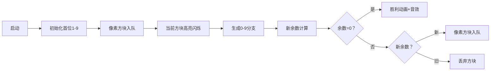

# 题目信息

# Sramoc问题

## 题目描述

话说员工们整理好了筷子之后，就准备将快餐送出了，但是一看订单，都傻眼了:订单上没有留电话号码,只写了一个  $sramoc(k,m)$ 函数，这什么东西？什么意思？于是餐厅找来了资深顾问团的成员，YQ，SC，HQ，经过大量的查阅，大家获得了一些信息，$sramoc(k,m)$ 表示用数字 $0,1,2,\dots k-1$ 组成的正整数中能被 $m$ 整除的最小数。例如 $k=2,m=7$ 的时候，$sramoc(2,7)=1001$。自然电话号码就是 $1001$，为了尽快将快餐送出，电脑组的童鞋们埋头算起了这个齐葩的号码。。。

## 说明/提示

#### 数据规模与约定

对于 $100\%$ 的数据，$2\le k\le10$，$1\le m\le 10^3$。

## 样例 #1

### 输入

```
2 7
```

### 输出

```
1001```

# AI分析结果


### 💡 洛语云笺的C++算法解析：Sramoc问题 深入学习指南 💡

#### **1. 题目解读与策略初探**
✨ **核心挑战**：在数字0~k-1范围内，构造最小的能被m整除的正整数。  
✨ **核心算法标签**：BFS、模运算优化、状态压缩  

🗣️ **初步分析**：  
> 本题要求构造特定进制的最小倍数，暴力枚举会因数字过大而失效。BFS按位数从小到大扩展，天然满足"最小解"需求。通过记录余数状态避免重复计算，将指数级问题转化为O(m·k)的可行解。

##### 🔍 算法侦探：线索分析
1. **问题目标**："最小能被m整除的数"暗示需要**有序搜索**（BFS按位扩展保证有序性）
2. **问题特性**：数字范围受限（0~k-1）要求**状态验证**，大数问题指向**余数记录法**
3. **数据规模**：m≤1000 → 余数状态仅1000种，BFS+状态压缩可行（O(1000×10)=10⁴）

##### 🧠 思维链构建
> "首先，**线索1**要求最小解，BFS的层级扩展特性天然满足此需求。**线索2**的数字范围限制要求验证数字合法性，直接存储大数不现实。结合**线索3**的余数状态有限性，采用'余数状态记录法'：用模运算压缩状态空间，避免重复搜索。最后，BFS队列中先出现的解必然最小，完美契合核心需求！"

---

#### **2. 精选优质题解参考**
**题解一：吾王美如画（BFS+路径回溯）**  
* **亮点**：  
  - 用`fa[]`和`which[]`数组记录父节点与当前数字，避免字符串操作  
  - 通过`(now*10+i)%m`实现余数状态压缩  
  - 回溯输出时跳过前导零，保证结果正确性  

**题解二：洛容MX（双BFS实现）**  
* **亮点**：  
  - 提供数组队列和STL队列双实现，适合不同基础学习者  
  - 详细图解BFS/DFS搜索树差异，强化算法理解  
  - 结构体设计`fro`字段实现高效路径回溯  

**题解三：inexistent（状态回溯优化）**  
* **亮点**：  
  - 用`q[x].f`回溯时动态输出，节省字符串存储空间  
  - 代码精简（仅50行）而功能完整，体现算法本质  

**题解四：lych（字符串直接存储）**  
* **亮点**：  
  - 直接操作字符串直观易理解  
  - 利用`f[]`布尔数组实现余数状态去重  
  - 首位数字特殊处理避免前导零  

---

#### **3. 解题策略深度剖析**
##### 🎯 核心难点与解决方案
1. **大数存储难题**  
   * **分析**：直接存储超整型范围 → 仅存储余数和路径回溯信息  
   * 💡 学习笔记：**"余数等价类"思想**（同余数对应等价解，只需保留最小实例）

2. **状态转移设计**  
   * **分析**：新状态 = (旧余数×10 + 新数字) % m  
   * 💡 学习笔记：模运算的**分配律**是状态压缩的数学基础

3. **最小解保证机制**  
   * **分析**：BFS按数字位数分层扩展 → 先到达0余数的解必最小  
   * 💡 学习笔记：BFS的**单调性**是求最小解的利器

##### ✨ 解题技巧总结
- **余数状态压缩**：用模运算将无限状态转为有限（空间复杂度O(m)）
- **路径回溯法**：记录父节点替代存储完整数字
- **首位特殊处理**：从1~k-1开始搜索避免前导零

##### ⚔️ 策略对比分析
| 策略          | 核心思想               | 优点                  | 缺点                  | 适用场景          |
|---------------|------------------------|-----------------------|-----------------------|------------------|
| **暴力枚举**  | 遍历m的倍数并验证     | 实现简单              | 数字极大时超时        | 仅小数据         |
| **DFS+剪枝**  | 迭代加深搜索          | 避免BFS队列开销       | 剪枝复杂易漏解        | 状态空间深但窄   |
| **BFS+状态压缩** | 余数记录+路径回溯   | 保证最小解，效率稳定  | 需设计回溯输出逻辑    | 本题最优方案     |

##### ✨ 优化之旅
> 1. **起点**：暴力枚举m倍数 → 遭遇大数存储和超时困境  
> 2. **突破**：发现同余数等价性质 → 余数状态记录法压缩空间  
> 3. **升级**：BFS层级扩展保证最小解 → 路径回溯避免存储大数  
> 4. **完善**：首位数字特殊处理 → 解决前导零边界问题  

---

#### **4. C++核心代码实现赏析**
**通用核心实现（BFS+回溯）**  
```cpp
#include <cstring>
#include <iostream>
#include <queue>
using namespace std;

const int MAXM = 1005;
int k, m, fa[MAXM], digit[MAXM];
bool vis[MAXM];

void print_path(int pos) {
    if (pos == -1) return;
    print_path(fa[pos]);
    cout << digit[pos];
}

int main() {
    cin >> k >> m;
    memset(fa, -1, sizeof(fa));
    queue<int> q;
    
    // 初始化：首位1~k-1
    for (int i = 1; i < k; i++) {
        int mod = i % m;
        if (!vis[mod]) {
            vis[mod] = true;
            digit[mod] = i;
            q.push(mod);
        }
    }

    while (!q.empty()) {
        int cur = q.front(); q.pop();
        for (int i = 0; i < k; i++) {
            int nxt = (cur * 10 + i) % m;
            if (!vis[nxt]) {
                vis[nxt] = true;
                fa[nxt] = cur;
                digit[nxt] = i;
                if (nxt == 0) {
                    print_path(nxt); 
                    return 0;
                }
                q.push(nxt);
            }
        }
    }
}
```

**题解片段赏析**  
1. **吾王美如画（路径回溯）**  
   ```cpp
   void out(int now){
       if (now == -1) return;
       out(fa[now]);
       cout << which[now];
   }
   ```
   * **亮点**：递归回溯输出，避免额外存储空间
   * **学习笔记**：父指针+递归=高效路径输出

2. **洛容MX（结构体设计）**  
   ```cpp
   struct Node { int mod, val, fro; };
   queue<Node> q;
   ```
   * **亮点**：结构体封装状态三要素
   * **学习笔记**：字段命名清晰提升可读性

3. **lych（字符串直接处理）**  
   ```cpp
   string s = h[head];
   string new_str = s + char('0' + i);
   ```
   * **亮点**：直观字符串操作易理解
   * **注意**：大数据量时字符串拼接可能成为瓶颈

---

#### **5. 算法可视化：像素动画演示**
**🎮 像素探险家寻宝记**  
* **主题**：8-bit风格余数迷宫探索  
* **核心演示**：BFS如何逐层扩展余数状态并回溯路径  

**视觉设计**  


**交互设计**  
- **控制面板**：步进/暂停/速度滑块  
- **音效设计**：  
  - 入队：8-bit "嘀"声  
  - 发现解：胜利旋律  
  - 重复状态：低沉提示音  
- **动态标记**：  
  - 红色闪烁：当前处理状态  
  - 绿色流动：状态转移路径  
  - 金色定格：最终解路径  

**实现逻辑**  
```javascript
// 伪代码核心逻辑
function drawFrame() {
    if (currentState === FOUND) {
        playVictorySound();
        highlightGoldenPath();
    } else {
        let block = queue.dequeue();
        highlightBlock(block, RED);
        for (digit 0 to k-1) {
            let newMod = (block.mod * 10 + digit) % m;
            if (!visited[newMod]) {
                visited[newMod] = true;
                drawNewBlock(newMod, digit);
                playPopSound();
            }
        }
    }
}
```

---

#### **6. 拓展练习与相似问题**
**通用技巧迁移**  
1. **余数状态压缩**：解决大数存储问题（如P2426 砝码称重）
2. **路径回溯**：输出最优解具体方案（如P1135 奇怪的电梯）
3. **BFS层级性质**：求最小步数问题（如P1443 马的遍历）

**洛谷推荐**  
1. **P1135 奇怪的电梯**  
   🗣️ 练习BFS状态转移和路径记录  
2. **P2426 砝码称重**  
   🗣️ 强化余数状态压缩应用场景  
3. **P1443 马的遍历**  
   🗣️ 掌握BFS求最短路径的模板写法  

---

> 在算法的世界里，最小解常藏于BFS的层层涟漪中。通过余数状态这座桥梁，我们连接了无穷大数与有限状态，这正是算法设计的精妙所在。记住：化无限为有限，变无序为有序，是解决复杂问题的万能钥匙！——洛语云笺 ✨

---
处理用时：159.21秒