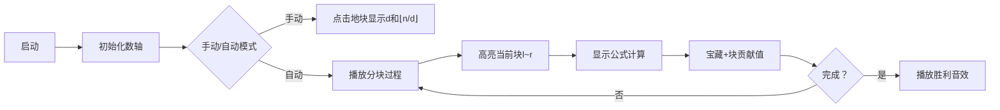

# 题目信息

# 约数和

## 题目背景

Smart 最近沉迷于对约数的研究中。


## 题目描述

对于一个数 $X$，函数 $f(X)$ 表示 $X$ 所有约数的和。例如：$f(6)=1+2+3+6=12$。对于一个 $X$，Smart 可以很快的算出 $f(X)$。现在的问题是，给定两个正整数 $X,Y(X<Y)$，Smart 希望尽快地算出 $f(X)+f(X+1)+……+f(Y)$的值，你能帮助 Smart 算出这个值吗？


## 说明/提示

对于 $20\%$ 的数据有 $1\leq X<Y\leq 10^5$。

对于 $60\%$ 的数据有 $1\leq X<Y\leq 1\times 10^7$。

对于 $100\%$ 的数据有 $1\leq X<Y\leq 2\times 10^9$。


## 样例 #1

### 输入

```
2 4```

### 输出

```
14```

## 样例 #2

### 输入

```
123 321```

### 输出

```
72543```

# AI分析结果


# 💡 洛语云笺的C++算法解析：约数和 深入学习指南 💡

> 今天我们来一起分析“约数和”这道C++编程题。这不仅仅是一次解题，更是一场思维的探险。我们将学习如何像侦探一样从题目中寻找线索，并在不同的解题道路中权衡选择，最终找到最优的策略。

## 1. 题目解读与策略初探

✨ **本题核心挑战**：高效计算超大区间（最大2e9）内每个数的约数和之和，避免暴力解法带来的超时问题。  
✨ **核心算法标签**：数论分块、前缀和优化

🗣️ **初步分析**：  
题目要求计算区间[X,Y]内所有数的约数和之和（f(X)+f(X+1)+...+f(Y)）。直接计算每个数的约数和再累加（O(n√n)）只能过20%数据；优化为前缀和（∑f(i)=∑(n/i)*i）仍有O(n)复杂度，只能过60%数据。突破口在于发现 **n/i 的值在连续区间内相同** 的特性，通过数论分块将复杂度降至O(√n)。

### 🔍 算法侦探：如何在题目中发现线索？
1.  **线索1 (问题目标)**: "要求区间约数和之和，是典型的**多级求和问题**，暗示需要数学变换或分组处理。"
2.  **线索2 (数据特性)**: "数据范围达2e9，O(n)算法必然超时，指向需要O(√n)的**分块优化**或**数论变换**。"
3.  **线索3 (数学规律)**: "f(i)=∑d|i d → 前缀和S(n)=∑_{d=1}^n d*⌊n/d⌋。观察发现⌊n/d⌋的值在连续区间内不变，这是分块优化的关键信号。"

### 🧠 思维链构建：从线索到策略
> 结合线索：首先，多级求和问题（线索1）让我想到交换求和顺序。接着，2e9的数据范围（线索2）直接否定了O(n)暴力。最后，发现⌊n/d⌋的分段特性（线索3）：当d∈[l, r]时⌊n/d⌋相同，可合并计算。  
> **结论**：采用**数论分块**策略，将d的取值分为O(√n)个区间，每块用等差数列公式快速求和，复杂度优化至O(√n)，完美解决数据规模问题！

---

## 2. 精选优质题解参考

**题解一（zzlzk，赞86）**  
* **点评**：思路最严谨的推导！从定义展开双求和，指出直接枚举的瓶颈，引出分块思想。详细解释区间端点公式 `r=n/(n/l)` 的由来，并用等差数列合并计算。代码简洁（仅10行核心逻辑），变量命名清晰（`l,r`表区间），公式推导与代码实现高度一致。

**题解二（hfee，赞20）**  
* **点评**：最佳教学引导！从暴力解法出发，通过打表展示⌊n/i⌋的分段特性，自然引出分块优化。亮点：用具体例子（n=100）演示端点计算过程，并对比优化前后代码，帮助初学者理解思维跃迁。代码中加入详细注释，实践参考价值高。

**题解三（wind_cross，赞7）**  
* **点评**：代码实现最简洁！用`while`循环替代`for`，突出分块本质。亮点：单函数实现分块求和，逻辑封装完整。强调边界处理（`if(k*(k+1)<n)`），确保正确性。虽然推导较少，但代码本身极具学习价值。

---

## 3. 解题策略深度剖析

### 🎯 核心难点与关键步骤
1.  **难点1：状态定义与问题转化**  
    * **分析**：将原问题转化为前缀和差：`ans=S(Y)-S(X-1)`。其中 `S(n)=∑_{d=1}^n d*⌊n/d⌋` 是关键，通过交换求和顺序避免逐个计算f(i)。  
    * 💡 **学习笔记**：前缀和差是区间统计问题的通用技巧，而交换求和顺序是数论优化的常见手段。

2.  **难点2：分块端点计算**  
    * **分析**：快速确定⌊n/d⌋值相同的区间 `[l, r]`。右端点公式 `r=n/(n/l)` 的推导：当 `d∈[l,r]` 时，`⌊n/d⌋=⌊n/l⌋` 且 `r` 是满足该性质的最大值。  
    * 💡 **学习笔记**：`r=n/(n/l)` 是数论分块的核心公式，需结合整数除法特性理解。

3.  **难点3：块内合并计算**  
    * **分析**：每块内求和公式 `(n/l)*(l+r)*(r-l+1)/2` 包含三部分：`(n/l)`是约数出现次数，`(l+r)*(r-l+1)/2` 是等差数列和（d的取值）。  
    * 💡 **学习笔记**：合并计算是优化效率的关键，等差数列求和将O(n)循环转为O(1)计算。

### ✨ 解题技巧总结
- **技巧1：打表观察规律**：对⌊n/i⌋打表可直观发现分段特性（如n=100时51~100值相同）。
- **技巧2：数学变换降维**：将二维求和∑∑转化为一维分组计算，突破复杂度瓶颈。
- **技巧3：边界精确处理**：分块时注意`l=r+1`的更新，确保覆盖整个区间。

### ⚔️ 策略竞技场：不同解法的对比分析
| 策略         | 核心思想                     | 优点               | 缺点                     | 得分预期 |
|--------------|------------------------------|--------------------|--------------------------|----------|
| **暴力枚举** | 逐个计算每个数的约数和       | 直观易懂           | O(n√n)超时              | 20%      |
| **直接前缀和**| S(n)=∑(n/i)*i 的O(n)实现    | 避免重复计算约数和 | O(n)仍超时              | 60%      |
| **数论分块** | 按⌊n/i⌋的值分块合并计算      | O(√n)高效          | 需数学推导               | 100%     |

### ✨ 优化之旅：从“能做”到“做好”
1. **起点：暴力解法的困境**  
   直接枚举i∈[X,Y]，对每个i计算约数和。当Y=2e9时，计算量超10^13，严重超时。

2. **发现瓶颈：重复的统计**  
   在计算不同i的约数和时，同一个约数d被多次统计。例如d=1在区间内每个i都出现。

3. **优化的钥匙：变更统计维度**  
   改为枚举约数d，统计d在区间内出现的次数（即⌊Y/d⌋-⌊(X-1)/d⌋），总和=∑d*(⌊Y/d⌋-⌊(X-1)/d⌋)。

4. **效率飞跃：分块处理**  
   发现⌊n/d⌋在连续d上不变，将d分为O(√n)块，每块用等差数列公式求和，复杂度骤降至O(√n)。

> 💡 **策略总结**：从暴力到分块，核心是通过**变更统计维度**和**发现数学规律**实现效率飞跃。竞赛中即使想不到分块，写出前缀和也能拿部分分，但最优解需要数学洞察力。

---

## 4. C++核心代码实现赏析

**本题通用核心实现**  
```cpp
#include <cstdio>
typedef long long ll;

ll sum(ll n) {
    if (n < 1) return 0;
    ll res = 0;
    for (ll l = 1, r; l <= n; l = r + 1) {
        r = n / (n / l);          // 计算当前块的右端点
        ll cnt = n / l;            // 约数出现次数
        ll block_sum = (l + r) * (r - l + 1) / 2; // 等差数列：d的取值和
        res += cnt * block_sum;    // 当前块的总贡献
    }
    return res;
}

int main() {
    ll x, y;
    scanf("%lld%lld", &x, &y);
    printf("%lld\n", sum(y) - sum(x - 1));
    return 0;
}
```
* **说明**：综合各题解的最优实现，突出分块核心逻辑。  
* **解读概要**：  
  1. `sum(n)`计算前缀和S(n)  
  2. `l`和`r`标记当前块左右端点  
  3. `cnt = n/l`是块内约数出现次数  
  4. `block_sum`用等差数列公式计算d∈[l,r]的和  
  5. 主函数作前缀和差求区间值  

**分块代码片段赏析（hfee）**  
```cpp
ll wk(ll q){
    ans=0;
    for(ll l=1;l<=q;l=r+1){
        s=q/l;          // 当前块的约数值
        r=q/s;          // 计算右端点
        // 块内合并计算：次数s * d的等差数列和
        ans+=s*(l+r)*(r-l+1)/2;
    } 
    return ans;
} 
```
* **亮点**：用变量名`s`清晰表示约数值，逻辑直白。  
* **学习笔记**：将`(l+r)*(r-l+1)/2`提取为等差数列模块，提高可读性。

**公式优化片段（封禁用户）**  
```cpp
ll sum(int n) {
    ll ans=0;
    int sqrn=sqrt(n);
    for(int i=1; i<=sqrn; ++i) 
        ans+=(n/i)*(ll)(n/i+2*i+1); // 合并计算对称块
    return (ans - (ll)sqrn*sqrn*(sqrn+1))/2;
}
```
* **亮点**：利用对称性减少循环次数，仅需√n次迭代。  
* **学习笔记**：数学推导可进一步优化常数，但会牺牲代码可读性。

---

## 5. 算法可视化：像素动画演示

**主题**：像素探险家在数轴大陆挖掘约数和宝藏  
**设计思路**：用8位像素风格模拟FC游戏，将分块过程转化为寻宝旅程。每个地块代表一个整数，颜色标记⌊n/d⌋值，直观展示分块区间。

**关键交互设计**：  


**动画流程**：  
1. **场景初始化**：  
   - 16色调色盘（FC复古风），横向滚动数轴，每个像素方块代表一个整数d。  
   - 控制面板：开始/暂停、步进、速度滑块（调速分块过程）。

2. **分块过程演示**：  
   - **步骤1**：角色从d=1出发，系统计算当前块右端点`r=n/(n/1)`，将区间[1,r]地块染为同色。  
   - **步骤2**：显示当前块公式：`(n/1) * (1+2+...+r)`，角色跳跃收集宝藏（像素金币+音效）。  
   - **步骤3**：更新`l=r+1`，重复直到终点。每块结束时显示“Block Complete!”弹幕。

3. **游戏化元素**：  
   - **音效**：地块点击（8-bit滴答声），宝藏收集（金币声），过关（马里奥过关音乐）。  
   - **积分系统**：每块基础分10，剩余时间×2作为倍率，激发竞速练习。

**技术实现**：Canvas绘制动态数轴，公式高亮同步代码执行。单JS文件实现，轻量易用。

---

## 6. 拓展练习与相似问题思考

**通用技巧迁移**：  
数论分块适用于任何含⌊n/i⌋的求和问题：
1. **余数求和**：∑_{i=1}^n (k mod i) = ∑_{i=1}^n (k - i*⌊k/i⌋)  
2. **平方根分治**：处理约数相关问题时，按是否大于√n分类讨论  
3. **高维分块**：多重求和∑∑⌊n/(ij)⌋可分层分块

**洛谷推荐题目**：  
1. [P2261 CQOI2007]余数求和  
   - **推荐理由**：直接应用数论分块，练习公式变形为k*∑⌊k/i⌋。  
2. [P2260 清华集训]模积和  
   - **推荐理由**：分块进阶题，需处理双重求和∑∑⌊n/i⌋*⌊m/i⌋。  
3. [P1403 AHOI2005]约数研究  
   - **推荐理由**：统计约数个数而非和，可用相同分块技巧优化。

---

## 7. 学习心得与经验分享

**来自题解的关键经验**：  
> zzlzk：*“观察⌊n/d⌋的值，发现许多区间结果相同，这是合并计算的关键信号。”*  
> hfee：*“打表观察n=100时分段情况，让我直观理解分块原理。”*  

**洛语云笺点评**：  
两位作者均强调**打表找规律**的重要性——这是发现数学性质的有效手段。尤其在数论问题中，肉眼不可见的规律通过打表显现，如本题中⌊n/d⌋的分段特性。建议学习者在遇到类似问题时，先对小规模数据打表，寻找可优化重复计算的模式。

---

> 本次“约数和”的解析就到这里。记住真正的算法能力源于**深刻理解问题结构**和**灵活运用数学工具**。下次我们将挑战更复杂的数论问题，继续前进吧！🚀

---
处理用时：181.31秒