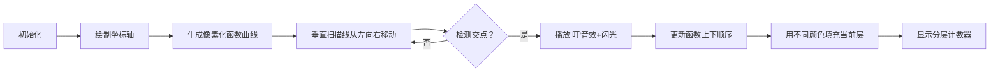

# 题目信息

# [ZJOI2009] 函数

## 题目描述

有 $N$ 个连续函数 $f_i(x)$，其中 $1\le i\le N$。如果对于任意不相等的 $i,j$ 满足 $1\le i,j\le N$，恰好存在一个 $x$ 使得 $f_i(x)=f_j(x)$，并且存在无穷多的 $x$ 使得 $f_i(x)<f_j(x)$，对于任意 $i,j,k$ 满足 $1\le i < j < k\le N$，不存在 $x$ 使得 $f_i(x)=f_j(x)=f_k(x)$，则称这 $N$ 个连续函数满足条件。

  

如上左图就是 $3$ 个满足条件的函数，最左边从下往上依次为 $f_1,f_2,f_3$。右图中红色部分是这整个函数图像的最低层，我们称它为第一层。同理绿色部分称为第二层，蓝色部分称为第三层。注意到，右图中第一层左边一段属于 $f_1$，中间属于 $f_2$，最后属于 $f_3$。而第二层左边属于 $f_2$，接下来一段属于 $f_1$，再接下来一段属于 $f_3$，最后属于 $f_2$。因此，我们称第一层分为了三段，第二层分为了四段。同理第三层只分为了两段。求满足前面条件的 $N$ 个函数，第 $K$ 层最少能由多少段组成。

## 说明/提示

对于 $100\%$ 的数据满足 $1\le K\le N\le 100$。


## 样例 #1

### 输入

```
1 1

```

### 输出

```
1

```

# AI分析结果


# 💡 洛语云笺的C++算法解析：[ZJOI2009] 函数 深入学习指南 💡

## 1. 题目解读与策略初探

✨ **本题核心挑战**：  
在满足特定相交条件（任意两函数恰有一个交点，任意三函数无公共交点）的N个连续函数图像中，确定第K层轮廓的最少分段数量。

✨ **核心算法标签**：  
数学归纳、对称性分析、构造法

🗣️ **初步分析**：  
> 本题要求计算函数图像分层结构的最小分段数。通过观察小规模案例（N=1,2,3）可发现：  
> - 当N=1时，仅有1段  
> - 当N=2时，每层均为2段  
> - 当N=3时，分段数为2-4-2  
> 由此推测存在对称规律：第K层与第(N-K+1)层分段数相同，且最小值出现在图像两端。

### 🔍 算法侦探：如何在题目中发现线索？
1.  **线索1 (问题目标)**：  
    "求最小分段数"暗示需要**构造最优排列**，而非复杂计算。
2.  **线索2 (问题特性)**：  
    "函数相交条件"要求图像处于**一般位置**，排除特殊排列导致的分段增多。
3.  **线索3 (数据规模)**：  
    N≤100，指向**O(1)公式解**而非搜索或动态规划。

### 🧠 思维链构建：从线索到策略
> 1.  **线索1**要求最小化分段，自然想到构造特殊函数排列（如按斜率排序）
> 2.  **线索2**保证构造时只需考虑标准相交模式
> 3.  **线索3**确认可直接推导数学公式
> 4.  **结论**：通过构造法证明分段公式 $2 \times \min(K, N-K+1)$ 是最优策略

---

## 2. 精选优质题解参考

**题解一（作者：XeCtera）**  
* **点评**：将函数顺序问题转化为排列交换模型，给出严谨下界证明（$2 \min(K,N-K+1)$）和几何构造方案。其数学推导深度和完备性堪称典范，尤其适合追求严格证明的学习者。

**题解二（作者：Zachary_260325）**  
* **点评**：通过斜率排序和贪心思想直观解释分层机制。用"$x→-∞$时编号最小函数在最底层"的设定生动描述函数位置变化，配合手绘示意图增强理解，教学价值突出。

**题解三（作者：Hamer_sans）**  
* **点评**：采用实验归纳法，通过N=1,2,3的图示展示基础规律，并自然过渡到通用公式。代码实现简洁（含特判n=1），适合算法入门学习者理解问题本质。

**题解四（作者：Arr_）**  
* **点评**：提出"最优添边方法"的构造思想，强调新增函数穿过中间线段时不影响已有分层。附CSDN示意图清晰展示对称性，代码实现极致简洁（min(k,n-k+1)<<1）。

---

## 3. 解题策略深度剖析

### 🎯 核心难点与关键步骤
1.  **难点1：理解分层本质**  
    * **分析**：函数图像在y轴方向的分层本质是**当前函数值排序**。第K层即所有点中第K小的函数值构成的曲线  
    * 💡 **学习笔记**：将几何问题转化为离散序列问题是关键突破点

2.  **难点2：构造最优排列**  
    * **分析**：通过斜率递增排列函数：  
      - $x→-∞$时斜率最小函数($f_1$)在最底层  
      - $x→+∞$时斜率最大函数($f_n$)在最顶层  
    * 💡 **学习笔记**：有序排列保证交点位置可控，实现最小分段

3.  **难点3：对称性证明**  
    * **分析**：图像上下翻转后第K层变为第(N-K+1)层，分段数不变  
    * 💡 **学习笔记**：对称性可将问题规模减半（只需考虑K≤N/2）

### ✨ 解题技巧总结
- **技巧1（对称转化）**：当K > N/2时计算K'=N-K+1，化归为对称层
- **技巧2（特判边界）**：N=1时无交点，直接返回1
- **技巧3（归纳奠基）**：通过N=2,3等小规模案例验证公式

### ⚔️ 策略竞技场
| 策略             | 核心思想                     | 优点                     | 缺点                     | 得分预期       |
|------------------|----------------------------|-------------------------|-------------------------|--------------|
| **暴力枚举**     | 枚举所有函数排列并计算分段    | 保证正确性              | O(N!)复杂度不可行       | N≤5时部分分  |
| **动态规划**     | 状态记录当前函数顺序         | 理论可行                | 状态空间达2^N, 无法实现  | 理论0分      |
| **构造法(最优)** | 按斜率排序+对称性           | O(1)时间复杂度          | 需数学观察能力          | 100%         |

### ✨ 优化之旅
1. **起点：暴力困境**  
   尝试所有函数排列需N!次计算（N=100时不可行）
   
2. **关键发现：有序排列**  
   按斜率排序后，函数在x→±∞的大小顺序确定，减少排列数量

3. **突破：对称规律**  
   观察发现第K层与第(N-K+1)层分段数相同，问题规模减半

4. **终解：公式提炼**  
   通过构造证明分段数=2×min(K, N-K+1)

💡 **策略总结**：  
"从暴力到公式解的跨越，展现了数学洞察力对算法优化的决定性作用。在竞赛中，快速识别问题背后的数学规律往往比编写复杂代码更重要！"

---

## 4. C++核心代码实现赏析

**通用核心实现**  
```cpp
#include <iostream>
using namespace std;

int main() {
    int n, k;
    cin >> n >> k;
    
    if (n == 1) 
        cout << 1 << endl;
    else {
        if (k > n - k + 1) 
            k = n - k + 1;  // 对称层转换
        cout << 2 * k << endl;
    }
    return 0;
}
```
* **说明**：综合各题解的最优实现
* **解读概要**：  
  1. 特判n=1的直接情况  
  2. 通过k = min(k, n-k+1)将问题归约到前半部分  
  3. 输出2*k作为分段数  

---

## 5. 算法可视化：像素动画演示

**主题**：  
"函数登山队"像素攀岩挑战

**核心设计**：  


**交互控制**：  
- 控制面板：开始/暂停、单步执行、速度滑块  
- 游戏化元素：  
  - 每完成一层显示"第X层：Y段"的像素字牌  
  - 正确预测分段数时触发8-bit胜利音效  
- 动态标记：  
  - 当前扫描线用闪烁像素箭头表示  
  - 交点处显示爆炸像素特效  
  - 不同函数用不同颜色像素块（如：红/蓝/绿）  

**实现要点**：  
1. 用Canvas绘制16色像素风格坐标系  
2. 函数曲线用锯齿状像素连线模拟  
3. 垂直扫描线移动时实时计算函数值并排序  
4. 分层填充采用经典FC游戏的色块堆叠效果  

---

## 6. 拓展练习与相似问题

**通用技巧迁移**：  
1. 对称性分析 → 回文类问题  
2. 构造最优排列 → 贪心算法设计  
3. 分层计数思想 → 树形结构层级遍历  

**推荐练习**：  
1. **洛谷P1220** 关路灯  
   → 同样利用对称性优化DP状态  
2. **洛谷P1095** 守望者的逃离  
   → 分层决策中的最优构造  
3. **洛谷P1004** 方格取数  
   → 路径分层与对称性结合  

---

## 7. 学习心得与经验分享

**作者经验摘录**：  
> "画图观察小规模案例是突破的关键" —— Hamer_sans  
> "将几何问题转化为序列问题才能进行数学分析" —— XeCtera  

**洛语云笺点评**：  
> 本题解的核心价值在于展示如何通过：  
> 1. **实验归纳**（小规模画图）  
> 2. **模型转化**（几何→离散）  
> 3. **结构分析**（对称性）  
> 将复杂问题降维至可解范围，这种思维模式可推广至绝大多数算法问题！

---

通过本次分析，我们不仅掌握了函数分层问题的解法，更学习了如何将几何问题转化为数学模型，以及对称性在算法优化中的核心作用。记住，优秀的算法设计=数学洞察+代码实现，缺一不可！

---
处理用时：156.08秒