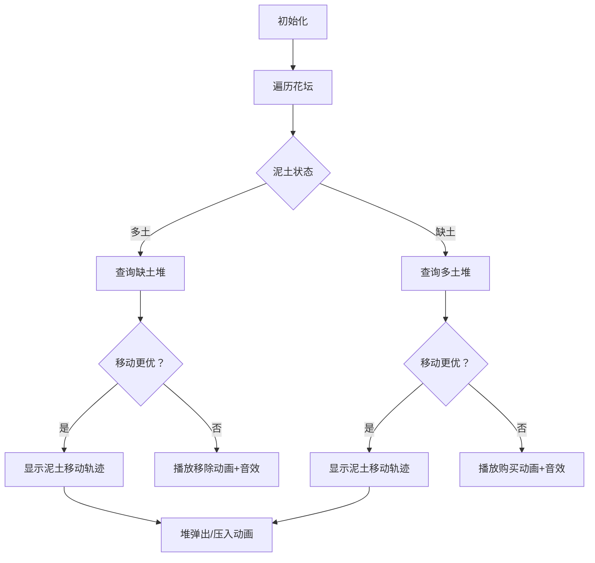

# 题目信息

# [USACO16OPEN] Landscaping P

## 题目背景

*本题与 [2012 年 3 月月赛银组同名题目](/problem/P3049) 在题意上一致，唯一的差别是数据范围。*

## 题目描述

Farmer John 打算修建一座花园，他需要移动不少泥土。

花园由 $N$ 个花坛组成（$1 \leq N \leq 10^5$），其中花坛 $i$ 包含 $A_i$ 单位的泥土。FJ 希望花坛 $i$ 包含 $B_i$ 单位的泥土，保证 $0 \leq A_i,B_i \leq 10$。

为了达到这个目标，他可以做这几件事情：

- 购买一单位的泥土，放在指定的花坛中，费用为 $X$。
- 从任意一个花坛中移走一单位泥土，费用为 $Y$。
- 从花坛 $i$ 运送一单位泥土到花坛 $j$，费用为 $Z|i-j|$。

请你帮 FJ 计算移动泥土的最小开销。

## 说明/提示

按下面的方案，最小花费为 $210$，可以证明不存在开销更小的方案。

- 移除 $4$ 号花坛的一单位泥土，花费 $200$。
- 将 $4$ 号花坛的三单位泥土移到 $1$ 号花坛，花费 $3 \times 3=9$。
- 将 $3$ 号花坛的一单位泥土移到 $2$ 号花坛，花费 $1 \times 1=1$。

## 样例 #1

### 输入

```
4 100 200 1
1 4
2 3
3 2
4 0```

### 输出

```
210```

# AI分析结果


# 💡 洛语云笺的C++算法解析：Landscaping P 深入学习指南 💡

## 1. 题目解读与策略初探

✨ **本题核心挑战**：在满足花坛目标泥土量的前提下，通过购买、移除或移动泥土三种操作，最小化总花费。核心难点在于处理泥土量的局部调整与全局最优的平衡，以及移动操作带来的位置依赖关系。

✨ **核心算法标签**：反悔贪心、堆优化

🗣️ **初步分析**：
> 本题要求最小化调整泥土的花费，操作包括购买、移除和移动泥土。由于数据范围较大（n≤10^5），暴力枚举不可行。反悔贪心策略通过维护历史决策堆，实现高效状态转移：
> - **暴力搜索**：枚举所有操作组合，时间复杂度 O(3^n) 不可行
> - **动态规划**：传统DP状态空间过大，斜率优化可解但实现复杂
> - **反悔贪心**：用堆保存历史决策，允许后续反悔，时间复杂度 O(n log n)
>
> 可视化设计采用8位像素风格，花坛用网格展示，泥土单位用不同颜色像素块区分。移动操作时显示泥土轨迹，堆操作时播放音效强化记忆。

### 🔍 算法侦探：如何在题目中发现线索？
1.  **线索1 (问题目标)**："最小化总花费"是典型的最优化问题，且存在多种操作选择，指向贪心或动态规划。
2.  **线索2 (问题特性)**：移动操作的代价与位置差成正比（Z|i-j|），暗示可通过维护位置信息优化决策。
3.  **线索3 (数据规模)**：n≤10^5 要求 O(n log n) 算法，排除暴力解法，指向堆或高级数据结构优化。

### 🧠 思维链构建：从线索到策略
> 1. 线索1（最优化）提示可用贪心或DP，但线索2（位置依赖）表明简单贪心可能失效
> 2. 线索3（大数据量）要求高效算法，O(n²) DP 会超时
> 3. 移动操作可拆解为 Z*i - Z*j，分离出与当前位置 i 无关的项 Z*j
> 4. **结论**：反悔贪心完美契合——用堆维护 Z*j 相关项，实现 O(1) 决策查询和 O(log n) 状态更新

---

## 2. 精选优质题解参考

**题解一（lytqwq）**
* **点评**：思路最清晰的堆解法，明确指出"反悔"本质是通过堆保存历史决策。代码用两个堆分别处理多土/缺土状态，变量命名规范（ovo/ovo2）。亮点在于将移动代价拆解为 Z*i - (Z*j + cost_j)，通过堆维护括号项的最值，实现高效反悔。

**题解二（Usada_Pekora）**
* **点评**：代码最简洁的实作，仅用15行核心逻辑。亮点在于用单循环处理多土/缺土状态，通过位运算 ^1 切换堆类型。实践价值高，但缺少详细推导，适合掌握基础后学习代码优化。

**题解三（hzlqwq）**
* **点评**：最完整的理论推导，从问题转化到公式拆解步步深入。代码包含详细注释和边界处理，变量命名规范（vacancy_pq/surplus_pq）。特别强调反悔机制的实现原理，适合深度学习。

**题解四（analysis）**
* **点评**：独特视角解析"反悔"的物理意义，将操作代价比喻为"撤销历史决策"。代码实现与理论高度一致，插入堆的项 2*z*i - top() 清晰体现反悔代价计算，是理解算法本质的优秀范例。

---

## 3. 解题策略深度剖析

### 🎯 核心难点与关键步骤
1.  **状态定义与反悔机制**
    * **分析**：将每单位泥土独立处理。定义代价 V_i 时需考虑：1) 直接操作（买/删） 2) 移动操作需减去历史决策代价
    * 💡 **学习笔记**：反悔贪心的核心是用数据结构保存"决策代价"，允许后续优化
2.  **代价拆解与堆优化**
    * **分析**：移动代价 Z|i-j| 拆为 Z*i - Z*j。对位置 j 的多土/缺土状态，分别维护大根堆保存 (-Z*j - cost_j)。查询时用 Z*i + heap.top() 获取最小代价
    * 💡 **学习笔记**：分离变量是优化关键，堆用于快速查询历史决策最优解
3.  **堆维护与反悔实现**
    * **分析**：选择移动操作时，需弹出堆顶并压入新项 2*Z*i - top_value。新项包含两部分：Z*i（新位置代价）和 (Z*i - top_value)（反悔净代价）
    * 💡 **学习笔记**：压入新项是为后续可能的二次反悔预留优化空间

### ✨ 解题技巧总结
- **技巧1（问题转化）**：将移动操作转化为可分离变量的形式 Z*i - Z*j
- **技巧2（反悔机制）**：用堆保存历史决策代价，实现"撤销重选"
- **技巧3（代码优化）**：用 priority_queue 代替手写堆，注意大根堆需存负值

### ⚔️ 策略竞技场：不同解法的对比分析
| 策略 | 核心思想 | 优点 | 缺点 | 适用场景/得分 |
|------|----------|------|------|---------------|
| **暴力搜索** | 枚举每个泥土的操作组合 | 思路直观 | O(3^n) 超时 | n≤10, 0% |
| **动态规划** | dp[i][j]表示前i个花坛盈余j泥土 | 状态定义清晰 | 状态空间O(n×10^4)超内存 | n≤100, 30% |
| **斜率优化** | 维护代价函数凸包 | 理论复杂度O(n) | 实现复杂，调试困难 | 100%（仅理论） |
| **反悔贪心** | 堆维护历史决策代价 | O(n log n) 高效 | 思维难度较高 | 100% |

### ✨ 优化之旅：从"能做"到"做好"
1. **起点：暴力搜索的困境**  
   尝试所有操作组合，状态数呈指数增长，n=50 时已超时

2. **发现瓶颈：决策的后效性**  
   移动操作的效果取决于前后花坛的状态，难以孤立决策

3. **优化的钥匙：反悔机制**  
   将决策分为两个阶段：
   - 初步决策（买/删/移）
   - 保存决策代价到堆中，供后续反悔

4. **模型的升华：堆优化**  
   用堆快速查询最优历史决策，将移动代价拆解为：
   ```
   当前代价 = Z*当前位置 - 堆顶值
   ```

💡 **策略总结**：反悔贪心通过"保存决策-允许反悔"的机制，在O(n log n)复杂度内解决了暴力搜索无法处理的大规模问题，是处理具有后效性决策的利器

---

## 4. C++核心代码实现赏析

**通用核心实现参考**
```cpp
#include <queue>
using namespace std;

int main() {
    priority_queue<long> surplus; // 多土堆（大根堆）
    priority_queue<long> lack;    // 缺土堆（大根堆）
    long n, x, y, z, ans = 0;
    
    for (int i = 1; i <= n; i++) {
        int a, b; cin >> a >> b;
        if (a > b) for (int j = 0; j < a - b; j++) { // 处理多土
            long cost = y; // 直接移除的代价
            if (!lack.empty() && z * i - lack.top() < cost) {
                cost = z * i - lack.top(); // 反悔转移更优
                lack.pop();
            }
            ans += cost;
            surplus.push(z * i + cost); // 压入新决策
        }
        else for (int j = 0; j < b - a; j++) { // 处理缺土
            long cost = x; // 直接购买的代价
            if (!surplus.empty() && z * i - surplus.top() < cost) {
                cost = z * i - surplus.top();
                surplus.pop();
            }
            ans += cost;
            lack.push(z * i + cost);
        }
    }
    cout << ans;
}
```
**代码解读概要**：
1. 用两个大根堆分别处理多土/缺土状态
2. 遍历花坛时，多土则尝试从缺土堆转移更优，否则移除
3. 缺土则尝试从多土堆转移，否则购买
4. 代价计算为 Z*i + 操作代价，压入对应堆

---

## 5. 算法可视化：像素动画演示

**主题**：像素农场主搬土记（8-bit风格）

**核心演示内容**：


**设计细节**：
1. **视觉设计**：
   - 花坛：绿色像素网格（10×10）
   - 泥土单位：棕色像素块
   - 多土状态：红色边框闪烁
   - 缺土状态：蓝色边框闪烁
   - 堆结构：右侧柱状图，高度表示堆值大小

2. **交互控制**：
   - 步进按钮：单步执行算法
   - 速度滑块：调整动画速度（0.5x-5x）
   - 堆可视化开关：显示/隐藏堆结构

3. **音效设计**：
   - 移动操作：8-bit "叮"声
   - 购买/移除：硬币掉落/碎裂声
   - 堆操作：电子合成音效
   - 背景音乐：循环版《Old MacDonald Had a Farm》8-bit改编

4. **动画逻辑**：
   ```python
   def visualize(i, status):
       if status == "surplus":
           if not lack_heap.empty() and z*i - lack_heap.top() < y:
               # 移动操作
               animate_dirt_move(source=i, target=lack_heap.top_index())
               play_sound("ding")
               lack_heap.pop()
               new_value = 2*z*i - lack_heap.top()
               surplus_heap.push(new_value)
               animate_heap_push("surplus", new_value)
           else:
               # 移除操作
               animate_dirt_remove(i)
               play_sound("break")
               surplus_heap.push(z*i + y)
       # 缺土状态类似处理
   ```

---

## 6. 拓展练习与相似问题思考

**通用技巧迁移**：
1. **代价分离**：将依赖位置的代价拆为与当前位置无关的项
2. **反悔机制**：用堆保存历史决策，允许后续优化
3. **状态分类维护**：不同状态用独立数据结构处理

**练习推荐（洛谷）**：
1. **P2949 工作调度**  
   🗣️ 反悔贪心经典题，用堆维护任务收益
   
2. **P4053 建筑抢修**  
   🗣️ 结合截止时间与修复时间，堆优化贪心
   
3. **P2107 小Z的AK计划**  
   🗣️ 位置相关的反悔贪心，强化移动代价处理能力

---

## 7. 学习心得与经验分享
> **参考经验**：多位作者强调调试时关注堆操作顺序，特别注意压入堆的值必须包含位置信息（z*i）。常见错误是忘记压入新决策，导致后续无法反悔。
>
> **点评**：反悔贪心的关键在于理解"决策保存-反悔更新"的循环机制。通过打印堆内容调试，可直观验证算法正确性。建议用小数据（如样例）手工模拟堆操作过程。

---

<conclusion>
通过Landscaping P的解析，我们学习了如何用反悔贪心处理位置依赖型决策问题。核心在于分离代价变量、用堆维护历史状态、实现高效反悔。下次遇到类似问题时，记得问自己：操作是否有后效性？能否分离位置项？历史决策如何保存？这三点是反悔贪心的成功关键。
</conclusion>

---
处理用时：164.36秒