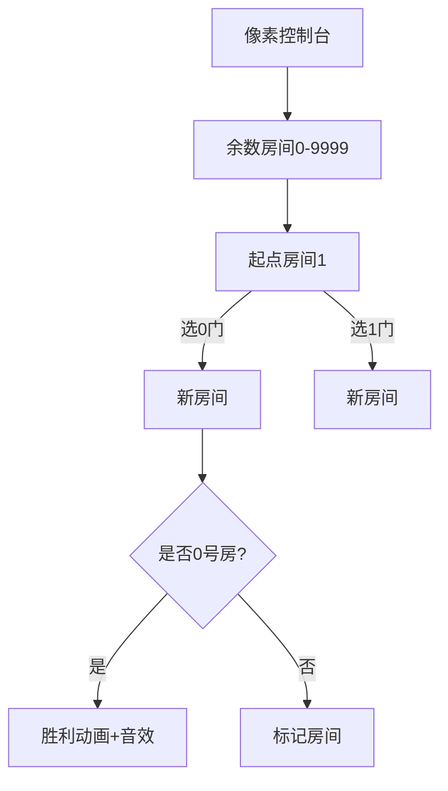

# 题目信息

# A*B Problem

## 题目描述

给出一个数 $A$ ，你需要给出一个最小的数 $B$ ，使得 $A\times B$ 的结果只含有 $0$ 和 $1$ 。

## 说明/提示

样例说明：$6\times 185=1110$。

对于 $30\%$ 的数据，$0<A<20$。

对于 $50\%$ 的数据，$0<A<100$。

对于 $70\%$ 的数据，$0<A<1000$。

对于 $100\%$ 的数据，$0<A<10^4$。


## 样例 #1

### 输入

```
6```

### 输出

```
185 1110
```

# AI分析结果


# 💡 洛语云笺的C++算法解析：A*B Problem 深入学习指南 💡

> "这道题的核心挑战在于**处理超大整数运算**，同时**高效寻找满足特殊条件的解**。我们将一起探索如何将复杂问题转化为状态搜索，并运用同余定理实现智能剪枝！"

## 1. 题目解读与策略初探

✨ **核心挑战**：在A最大10^4的情况下，直接枚举B会面临**指数级爆炸的搜索空间**（01串长度可达36位），且需要处理**高精度运算**  
✨ **核心算法标签**：`BFS` `状态压缩` `同余定理` `高精度计算`

🗣️ **初步分析**：  
> 本题要求找到最小的B，使A×B的结果C是只含0/1的数字串。直接暴力枚举B不可行，我们需要更智能的策略：  
> 1. **暴力搜索**：枚举所有01串，检查是否整除A → 指数级复杂度，不可行  
> 2. **迭代加深搜索**：按长度分层搜索 → 优化后仍可能超时  
> 3. **BFS+同余剪枝**：将01串看作状态图，用余数记录状态 → **最优策略**  
>   
> **算法核心比喻**：想象我们在一个"余数迷宫"中探险，每个房间编号0~A-1代表当前余数，目标是到达0号房间。每次选择0或1的门票进入新房间，同余剪枝就是迷宫中的"快捷通道标记"！

### 🔍 算法侦探：如何在题目中发现线索？
1.  **线索1 (问题目标)**：要求输出"最小B"和"01串C"，暗示需要**状态记录**和**路径回溯**
2.  **线索2 (问题特性)**：结果C必须是01串，暗示可用**字符串逐位构造**代替大数运算
3.  **线索3 (数据规模)**：A<10^4，余数状态仅10^4种，指向**状态压缩可行性**

### 🧠 思维链构建：从线索到策略
> "综合线索：  
> 1. 目标要求最小解 → BFS天然保证找到的第一解即最小  
> 2. 01串构造过程产生重复余数 → 同余状态可合并  
> 3. 余数空间有限 → 可用数组记录状态  
> **结论**：BFS配合同余剪枝是完美策略，将指数问题降为O(A)复杂度！"

---

## 2. 精选优质题解参考

**题解一（唐一文）**  
* **点评**：清晰展示从DFS→BFS→同余剪枝的优化路径，调试过程极具教学价值。代码采用字符串记录路径，高精度除法实现规范，变量命名合理（如`v[mod]`标记余数状态）。特别亮点：通过手动模拟样例解释同余剪枝原理，帮助读者理解核心思想。

**题解二（chenxuanting）**  
* **点评**：代码简洁高效，BFS框架干净利落。亮点在于高精度除法处理前导零的技巧（`use1`标志位），以及错误修正过程的详细记录，真实还原调试思维，对实战极具参考价值。

**题解三（Pecco）**  
* **点评**：创新性使用DP+`int128`避免高精度运算，展示数学思维转换。虽然依赖特殊数据类型，但unordered_map管理状态、按位更新余数的思路仍具启发性。适合帮助学习者理解状态转移的本质。

---

## 3. 解题策略深度剖析

### 🎯 核心难点与关键步骤
1.  **状态空间压缩**  
    * **分析**：直接处理大数C会溢出。解决方案：用模运算性质：(a×10+b) mod A = ((a mod A)×10 + b) mod A  
    * 💡 **学习笔记**："同余定理是处理大数问题的金钥匙"
2.  **BFS路径记录**  
    * **分析**：队列需存储当前01串和对应余数。优化：字符串存储路径，避免高精度运算  
    * 💡 **学习笔记**："字符串路径记录是隐式高精度"
3.  **余数状态去重**  
    * **分析**：设bool数组`v[]`标记余数状态，若新状态余数已访问则跳过  
    * 💡 **学习笔记**："相同余数后续路径完全一致，只需保留首次出现"

### ✨ 解题技巧总结
- **技巧1（同余剪枝）**：将无限状态空间压缩至有限余数范围  
- **技巧2（字符串隐式高精）**：用字符串表示大数，需要时再转换  
- **技巧3（除法前导零处理）**：输出商时动态跳过前导零  

### ⚔️ 策略竞技场
| 策略 | 核心思想 | 优点 | 缺点 | 适用场景 |
|------|----------|------|------|----------|
| **暴力枚举** | 生成所有01串检查 | 实现简单 | O(2^M)超时 | A<20 (30%分) |
| **迭代加深** | 按长度分层DFS | 避免无限深搜 | 剪枝不彻底易超时 | A<100 (50%分) |
| **BFS+同余剪枝** | 余数状态记录 | O(A)复杂度 | 需处理字符串路径 | 最优解 (100%分) |

### ✨ 优化之旅：从"能做"到"做好"


> "关键跃迁：发现余数状态可合并！当两个不同01串模A同余时，它们后续扩展路径完全等效。只需保留最先出现的（保证最小性），状态空间从指数级压缩至O(A)。"

---

## 4. C++核心代码实现赏析

**通用核心实现**  
```cpp
bool v[10005]; // 余数标记
queue<pair<string, int>> q; // <当前01串, 余数>

q.push({"1", 1 % A});
v[1 % A] = true;

while (!q.empty()) {
    auto [s, r] = q.front(); q.pop();
    for (int d : {0, 1}) {
        int new_r = (r * 10 + d) % A;
        string new_s = s + char('0'+d);
        
        if (new_r == 0) {
            // 高精度除法输出B
            // 返回new_s
        }
        if (!v[new_r]) {
            v[new_r] = true;
            q.push({new_s, new_r});
        }
    }
}
```

**题解一亮点：高精度除法**  
```cpp
int carry = 0;
for (char c : ans) {
    carry = carry * 10 + (c - '0');
    int digit = carry / A;
    if (digit || !output_started) { // 前导零处理
        cout << digit;
        output_started = true;
    }
    carry %= A;
}
```

**题解三亮点：int128应用**  
```cpp
using int128 = __int128;
unordered_map<int, int128> dp; // 余数→最小01串

void print(int128 x) {
    if (x > 9) print(x / 10);
    putchar('0' + (x % 10));
}
```

---

## 5. 算法可视化：像素动画演示

**主题**：8-bit风格"余数迷宫探险"  
**核心设计**：  


**交互要素**：  
1. **像素网格**：每个房间用8×8像素方块表示，编号显示顶部  
2. **动态路径**：探险家移动时拖尾显示01路径  
3. **音效设计**：  
   - 移动："哔"声  
   - 重复房间："嗡"警告音  
   - 到达0号房：胜利旋律  
4. **控制面板**：步进/暂停/速度滑块  

**动画帧示例**：  
```
[房间17]  ➤ 当前路径: 1101
          ↓
[门0] → 房间(17*10+0)%A
[门1] → 房间(17*10+1)%A
```

---

## 6. 拓展练习与相似问题

**同余技巧迁移场景**：  
1. 循环节检测（如P1984 火炬）  
2. 大数取模问题（如P2426 砝码）  
3. 状态压缩搜索（如P4799 世界冰球）  

**推荐练习**：  
1. **洛谷P2921** - 农场派对  
   → 巩固同余状态记录技巧  
2. **洛谷P3400** - 奶牛排队  
   → 练习BFS路径记录与输出  
3. **洛谷P2737** - 麦香牛块  
   → 深化同余定理应用  

---

## 7. 学习心得与经验

**来自题解的调试经验**：  
> "我在余数更新时忘记取模：(r*10+1)%A 误写为 r*10+1，导致溢出。这提醒我们：**边界条件测试**（如A=9999）至关重要！"

**洛语云笺总结**：  
> 三个核心调试技巧：  
> 1. 打印关键余数变化轨迹  
> 2. 小数据手工验算（如A=3）  
> 3. 边界测试（A=9999）  

--- 

> "掌握同余剪枝，就掌握了处理大数问题的瑞士军刀。记住：好的算法不是暴力计算的蛮力，而是发现规律后的优雅跨越！下次探险再见！✧٩(◕‿◕)و✧"

---
处理用时：204.57秒