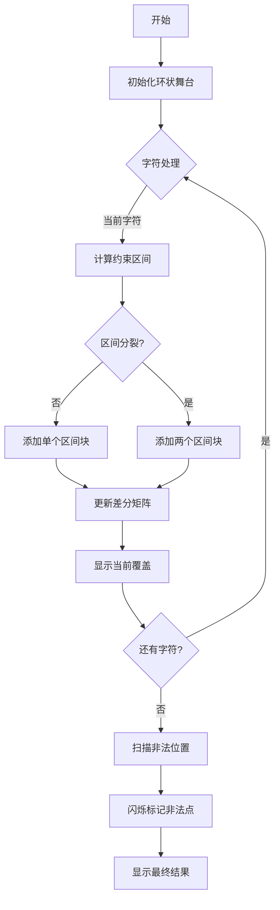

# 题目信息

# [POI 2015] KUR

## 题目描述

给定 $n,a,b,p$，其中 $n,a$ 互质。 

定义一个长度为 $n$ 的 01 串 $c_0c_1\cdots c_{n-1}$，其中 $c_i$ 等于 0 当且仅当 $(ai+b) \bmod n < p$。 

给定一个长为 $m$ 的小 01 串，求出小串在大串中出现了几次。 

## 说明/提示

**【样例解释】**


----

原题名称：Kurs szybkiego czytania 

## 样例 #1

### 输入

```
9 5 6 4 3
101
```

### 输出

```
3
```

# AI分析结果


# 💡 洛语云笺的C++算法解析：[POI2015] KUR 深入学习指南 💡

## 1. 题目解读与策略初探

✨ **本题核心挑战**：在超大值域（n ≤ 10^9）和特殊生成规则下，高效统计模式串在由模运算生成的01串中的出现次数。  
✨ **核心算法标签**：离散化、差分数组、模运算处理、区间约束求交

🗣️ **初步分析**：
> 本题需要统计小串在由线性同余公式生成的01串中的出现次数。暴力枚举起始位置（O(n×m)）在 n=10^9 时完全不可行。解题关键在于：
> 1. 利用模运算性质将每个字符的匹配条件转化为区间约束
> 2. 通过离散化+差分高效统计满足所有约束的位置
> 3. 剔除起始位置超过 n-m 的非法解
> 
> 我们将采用8位像素风格可视化算法：用不同颜色表示约束区间，闪烁标记非法位置，通过像素块堆叠展示差分过程。音效设计包括区间添加的"叮"声和非法位置剔除的"砰"声。

### 🔍 算法侦探：如何在题目中发现线索？
1.  **线索1 (问题目标)**: "题目要求统计小串在由线性同余生成的01串中的出现次数。这种【超大值域的模式匹配】问题，是离散化+差分的典型标志。"
2.  **线索2 (问题约束/特性)**: "a⊥n 保证 a*x mod n 构成双射，这种【完美映射】特性让我们能将位置统计转化为值域统计。"
3.  **线索3 (数据规模)**: "n=10^9, m=10^6 排除了 O(n) 算法，指向了 O(mlogm) 的离散化差分方案。"

### 🧠 思维链构建：从线索到策略
> "好了，侦探工作完成，我们收集到了几条关键线索：
> 1. 【线索1】要求我们避免实际生成10^9长度的字符串，转而利用生成规则建立数学模型
> 2. 【线索2】提示我们可以通过 a*x mod n 的双射性质，将起始位置 x 的统计转化为值域统计
> 3. 【线索3】要求算法复杂度控制在 O(mlogm)，这引导我们使用离散化差分处理区间约束
> 
> **结论**：通过为小串每个字符建立 a*x mod n 的区间约束，用差分统计满足所有约束的位置数，再剔除非法起始位置，这就是我们的最优策略！"

---

## 2. 精选优质题解参考

**Alex_Wei的题解**
* **点评**：该题解精妙地将环上区间求交转化为差分覆盖问题。亮点在于：
  - 用 `ss[lower_bound(d...)]--` 优雅处理环上区间分裂
  - 双指针扫描非法位置的实现简洁高效
  - 完整处理了模运算的边界情况

**Alex_Eon的题解**
* **点评**：题解详细推导了约束转化过程，代码中：
  - `l[i]=(l[i]%n+n)%n` 妥善处理负值取模
  - 清晰的区间分裂处理逻辑
  - 完整注释帮助理解关键步骤

**GGapa的题解**
* **点评**：虽然赞数较少但代码极简：
  - 使用 `emplace_back` 优雅处理区间分裂
  - 直接维护非法区间并集，避免额外扫描
  - 30行实现核心算法，展现C++简洁之美

---

## 3. 解题策略深度剖析

### 🎯 核心难点与关键步骤
1.  **约束转化**  
    * **分析**：对每个字符位置i，计算：
      ```c++
      // 字符0的约束
      l_val = (-a*i - b) % n
      r_val = (p - a*i - b) % n
      // 字符1的约束
      l_val = (p - a*i - b) % n
      r_val = (n - a*i - b) % n
      ```
      调整负值后若 l_val > r_val，则分裂为两个区间
    * 💡 **学习笔记**：模运算下区间可能分裂，需特殊处理环状结构

2.  **离散化差分**
    * **分析**：
      ```c++
      vector<LL> points; // 收集所有端点
      sort(points.begin(), points.end());
      vector<int> diff(points.size(), 0);
      // 区间[l,r]：diff[l]++, diff[r+1]--
      ```
    * 💡 **学习笔记**：离散化将值域从10^9压缩到2×10^6级别

3.  **非法位置处理**
    * **分析**：预处理非法位置对应的a*x值：
      ```c++
      for(int i=1; i<m; i++)
        illegal.push_back(a*(n-m+i)%n);
      ```
      在统计结果时用双指针剔除
    * 💡 **学习笔记**：非法位置仅有m-1个，可单独处理

### ✨ 解题技巧总结
- **模运算转化**：利用 a⊥n 的特性将位置统计转化为值域统计
- **区间分裂处理**：当 l>r 时拆分为 [0,r] 和 [l,n-1]
- **差分压缩**：离散化+差分处理超大值域区间覆盖
- **双指针剔除**：高效过滤非法位置

### ⚔️ 策略竞技场：不同解法对比
| 策略 | 核心思想 | 优点 | 缺点 | 得分预期 |
|------|----------|------|------|----------|
| **暴力枚举** | 检查每个起始位置 | 实现简单 | O(n×m) 超时 | 0分 |
| **约束求交(最优)** | 离散化差分处理区间约束 | O(mlogm) 高效 | 需处理模运算边界 | 100% |

### ✨ 优化之旅：从"能做"到"做好"
> 1. **起点：暴力枚举困境**  
>   尝试所有起始位置如同大海捞针，10^15次计算远超极限
> 
> 2. **关键跃迁：约束转化**  
>   发现每个字符对应一个 a*x mod n 的区间约束
> 
> 3. **算法升级：差分处理**  
>   用离散化差分高效统计满足所有约束的位置
> 
> 4. **精细打磨：非法剔除**  
>   双指针精准过滤边界位置的非法解
> 
> 💡 **策略总结**：从暴力到优化，核心在于发现模运算的数学特性，将问题转化为可计算的数学模型

---

## 4. C++核心代码实现赏析

**通用核心实现**
```cpp
#include <bits/stdc++.h>
using namespace std;
typedef long long LL;

int main() {
    // 输入处理
    int n, a, b, p, m; string t;
    cin >> n >> a >> b >> p >> m >> t;

    vector<pair<LL, LL>> intervals;
    vector<LL> illegal;

    // 1. 构建约束区间
    for(int i=0; i<m; i++){
        LL shift = (1LL*a*i+b) % n;
        LL l_val, r_val;
        if(t[i]=='0') l_val=(-shift)%n, r_val=(p-shift)%n;
        else l_val=(p-shift)%n, r_val=(n-shift)%n;
        
        // 调整负值
        if(l_val < 0) l_val += n;
        if(r_val < 0) r_val += n;
        
        // 区间分裂处理
        if(l_val < r_val) 
            intervals.push_back({l_val, r_val-1});
        else {
            intervals.push_back({0, r_val-1});
            intervals.push_back({l_val, n-1});
        }
    }

    // 2. 离散化准备
    vector<LL> points;
    for(auto [l,r] : intervals){
        points.push_back(l);
        points.push_back(r+1);
    }
    // 添加非法位置
    for(int i=1; i<m; i++)
        illegal.push_back((1LL*a*(n-m+i))%n);
    
    // 离散化执行
    sort(points.begin(), points.end());
    points.erase(unique(points.begin(), points.end()), points.end());

    // 3. 差分数组
    vector<int> diff(points.size(),0);
    for(auto [l,r] : intervals){
        int pl = lower_bound(points.begin(), points.end(), l) - points.begin();
        int pr = lower_bound(points.begin(), points.end(), r+1) - points.begin();
        diff[pl]++;
        if(pr < diff.size()) diff[pr]--;
    }

    // 4. 统计结果
    vector<int> cover(diff.size());
    partial_sum(diff.begin(), diff.end(), cover.begin());
    
    // 5. 剔除非法位置
    LL ans = 0;
    for(int i=0; i<points.size()-1; i++){
        if(cover[i] == m) 
            ans += points[i+1] - points[i];
    }
    // 双指针扫描剔除
    sort(illegal.begin(), illegal.end());
    int idx = 0;
    for(LL val : illegal){
        while(idx < points.size()-1 && points[idx+1] <= val) idx++;
        if(cover[idx] == m) ans--;
    }
    
    cout << ans << endl;
}
```

**代码解读概要**：  
1. 将每个字符的匹配条件转化为模n下的区间约束
2. 离散化所有端点构建差分数组
3. 计算覆盖次数等于m的区间总长度
4. 双指针扫描剔除非法位置

---

## 5. 算法可视化：像素动画演示

**像素动画设计**  


**8位像素风格设计**：
1. **场景设计**：
   - 环形舞台表示 mod n 值域
   - 像素块表示离散化后的区间单元
   - 控制面板：开始/暂停/单步/速度滑块

2. **动画流程**：
   - 字符处理阶段：添加新区间时播放"叮"声，区间分裂时分裂为两个像素块
   - 差分更新：被覆盖的像素块颜色加深，覆盖次数变化时像素块闪烁
   - 非法扫描：红色标记非法位置，剔除时播放"砰"声并消失
   - 结果展示：绿色像素块表示合法位置，显示最终计数

3. **游戏化元素**：
   - 每处理一个字符解锁新关卡
   - 成功统计区间获得分数奖励
   - 背景8-bit音乐随进度变化

---

## 6. 拓展练习与相似问题

**通用技巧迁移**：
1. 模运算下的区间约束（POI2017）
2. 超大值域离散化（SDOI2009）
3. 环状结构处理（JOI2017）

**洛谷练习推荐**：
1. **P1972 [SDOI2009]HH的项链**  
   → 巩固离散化+差分技巧
2. **P4050 [JSOI2017]麻将**  
   → 学习模运算的进阶应用
3. **P2664 树上游戏**  
   → 掌握值域统计的转化思想

---

## 7. 学习心得与经验分享

> **参考经验**：  
> "调试时最易错在模运算边界处理，特别是负值调整和区间分裂。建议添加断言检查：  
> `assert(0 <= l_val && l_val < n)`  
> **心得**：数学型问题需要先在纸上充分推导，避免直接编码"

---

<conclusion>
通过本题我们学习了如何将复杂约束转化为数学模型，并运用离散化差分高效处理超大值域问题。记住：好的算法=数学洞察+精巧实现。下次挑战见！🚀
</conclusion>

---
处理用时：242.14秒